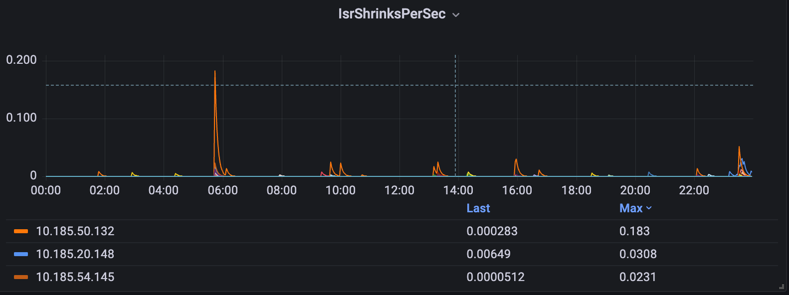
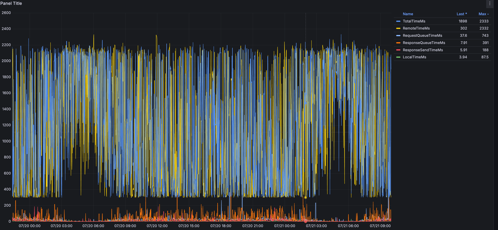
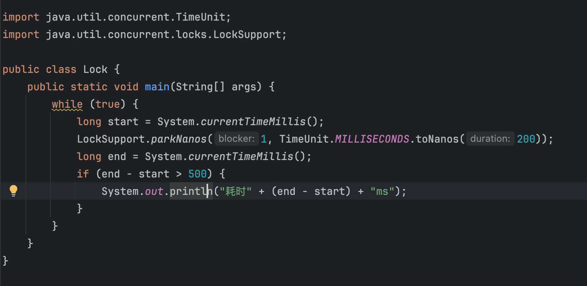
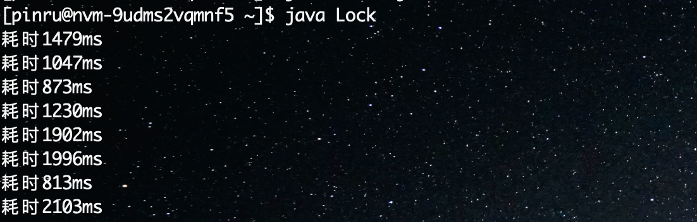
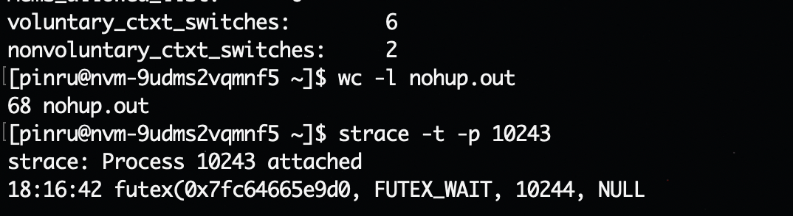

C12集群频繁ISR shrinking

# 排查过程
从grafana发现C12集群频繁发生ISR Shrinking，如下：

排查监控中的各项指标，没有明显的异常，根据C13集群的经验，收集flush等磁盘相关指标，排查是否是磁盘问题：
flush指标极低，其他磁盘相关指标也正常，排除磁盘问题

  

分析FollowFetch的整个流程：

1.  follower会创建ReplicaFetcherThread来专门向leader拉取最新数据，循环执行doWork方法
2.  ReplicaFetcherThread通过`buildFetch`方法构建拉取请求，然后通过fetch方法同步发送请求并拉回数据  
    1.  期间leader 收到FetchFollower请求， 更新最近一次fetch的时间（如果时间超过阈值，就出发ISR Shrinking）
3.  调用`processPartitionData`方法处理拉取到的数据，验证并更新本地副本的日志偏移量（LEO）

  

找到最频繁发生Shrinking的几台节点，使用Arthas查看ReplicaFetcherThread 中doWork方法耗时情况（很难抓到Shrinking情况，但是可以看看是否有异常）：
排查各项指标，没有明显的异常，找到最频繁发生Shrinking的几台节点，使用Arthas查看FollowerFerch耗时情况

由于平均耗时很短，只有100ms左右，所以过滤了cost>1000的情况，看看最长耗时可能是多少，

可以从中看到最长的一次fetch花了2131ms，虽然比replica.lag.time.max.ms=5000 值要低，但是相比平均值高了很多，

继续查主要耗时在哪个阶段，doWork方法主要执行了两个内容：

1.  buildFetchRequest
    
2.  processFetchRequest
    

buildFetchRequest方法耗时很短，主要是processFetchRequest耗时较长：

processFetchRequest主要干两件事：

1.  向leader发送fetch请求
2.  数据写入本地log

  

看看fetch请求的耗时情况：
可以看出来主要耗时都在fetch请求上，那基本就是leader的问题了，需要看看leader处理fetch请求耗时如何

使用jmx exportor 获取leader处理FetchFollower请求的相关指标

可以看出主要耗时是在remoteTime上，这个指标在FetchFollower中指的是延迟等待的时间（fetch数据不够minBytes时等待的时间），

C12集群的配置是：  
replica.fetch.min.bytes=10240  
replica.fetch.max.bytes=1048576  
replica.fetch.wait.max.ms=300

  
所以理论上remoteTime应该是300左右，不应该有这么大，查看相关部分的源码，并排除其他可能后，怀疑是时间轮的问题，继续上arthas查看

果然时间轮advance的耗时有异常，advanceColck源码中写死了是200ms时间轮向前滚动一次，但是这里耗时明显超过200ms

  
使用trace 查看advanceClock耗时都在哪：

定位到是jdk方法耗时最久，DelayQueue.poll方法耗时超过2000ms，这里poll的timeout参数来自advanceColck中的200ms，明显超出预期，继续使用trace看看是哪里耗时最久：

这时候arthas就没有办法继续查了，看jdk源码awaitNanos方法主要调用的是LockSupport.parkNanos方法，只能写demo代码验证下：

理论上这段代码不应该打印出任何信息，但是在服务器上跑的结果是：

从这里就可以看出机器或者jdk是有问题的，问题不在kafka，既然然后排查jdk的gc,内存等指标，无异常，只能怀疑是操作系统或者硬件问题
然后查这个demo的系统调用和线程调度情况：

可以看到没有系统调用，线程调度只有8次，但是demo程序打印了68次，和系统调用及线程调度无关，

暂时排除操作系统的问题，只能怀疑是硬件问题，

考虑到是虚拟机，联系nvm同事帮忙排查，最终确认是内核的bug

[https://patchwork.kernel.org/project/linux-block/patch/20230609234249.1412858-1-ming.lei@redhat.com/](https://patchwork.kernel.org/project/linux-block/patch/20230609234249.1412858-1-ming.lei@redhat.com/)

  

nvm同事给出的结论是：

之前内核出现过一个cgroups泄露的bug，这个bug会导致在读取cgroups数据的时候，需要关闭很长时间的中断，会影响整个系统的延迟和响应

# 问题总结

核心逻辑：ISR Shrinking的触发条件是Follower与Leader的“心跳”超时。这个“心跳”就是定期的Fetch请求。

详细因果链分析：

1.  宿主机内核Bug发生：
    
    -   内核中的cgroups泄露Bug被触发。
    -   当需要读取cgroups信息时，内核会关闭CPU中断，进入一个长时间的同步等待状态。
2.  Leader节点时间轮线程被“冻结”：
    
    -   由于宿主机内核关闭了中断，虚拟机内kafka线程无法被正常调度，会被“冻结”在原地，直到内核完成cgroups操作并重新开启中断。
    -   这个“冻结”时间可能从几百毫秒到几秒钟不等。
3.  Follower的ReplicaFetcherThread也有可能因为同样的bug造成“冻结”
    
4.  当Leader或Follower被冻结时，整个FollowerFetch链路耗费时间就可能会超过replica.lag.time.max.ms=5000
    
5.  Leader节点就可能因为很久没有更新Follow上次fetch的时间戳而触发ISR Shrinking
    
      
    

# 问题修复

07/28 周一配合nvm同事停机升级一台机器，升级后观察相关指标都恢复正常，持续观测几天也再未出现ISR Shrinking的情况。

nvm给出有相同问题的机器列表，kafka涉及174台机器，和nvm同事沟通后续修复计划：
<!--stackedit_data:
eyJoaXN0b3J5IjpbMTU4MTAyMjQ4NSwtMTUyNzkyODUzMSwtNj
QxNzA0MjcxLDExODE4NjQyODQsLTk1MjU0OTM2NywtMTQ2NzU3
OTM4Miw3OTE4MzMzNiwtNDYwNjc5MDEsLTEwMjgyNjY4OTQsMj
ExMjU4MTI4NCwtMTU2OTI5MTQxOF19
-->
