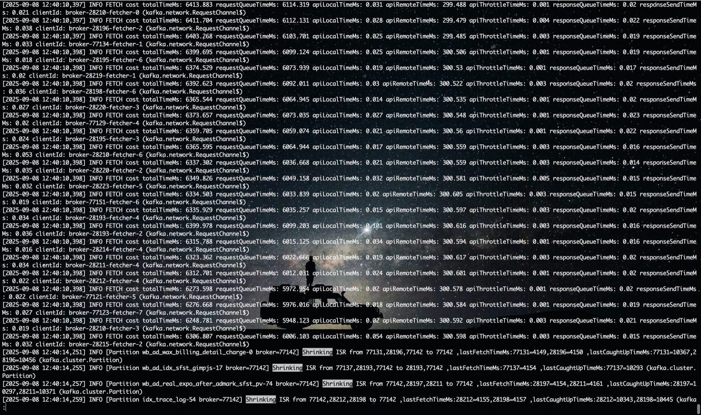
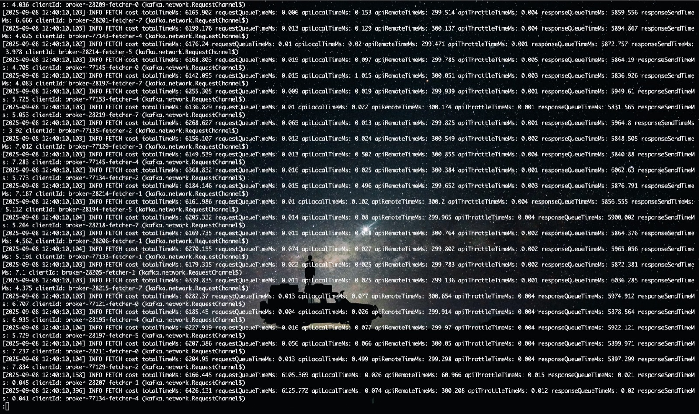
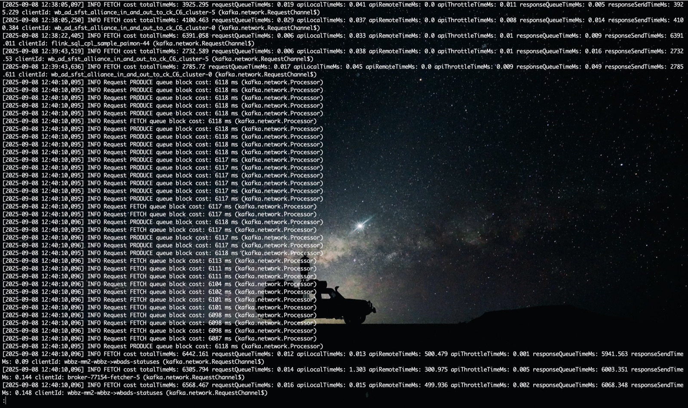
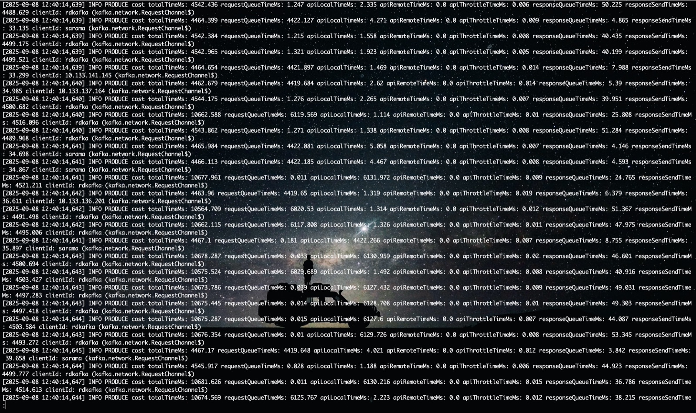
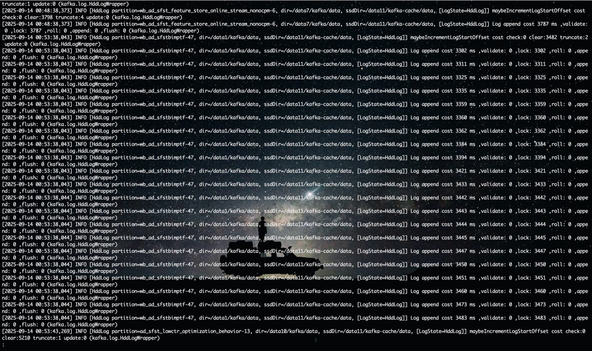
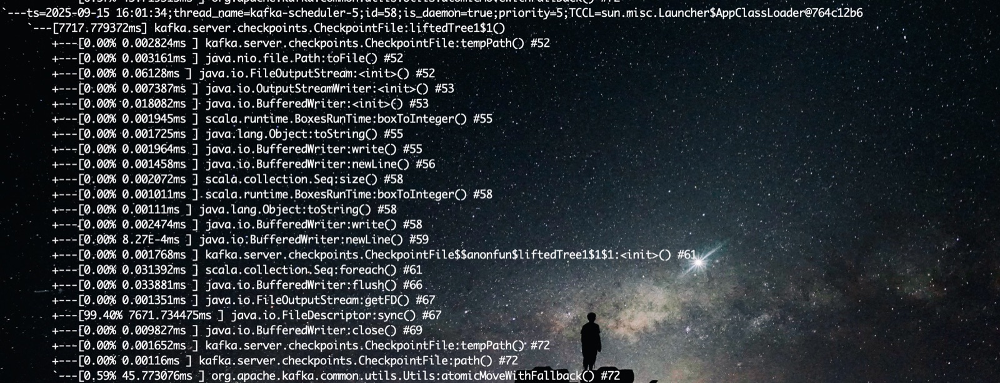

# Kafka ads 集群Shrinking问题排查

## 排查过程

发现ads集群Shrinking频率相对也比较频繁，排除了已知的故障原因之后，增加处理FollowerFetchRequest的耗时日志，看看耗时主要是卡在什么地方

从上图可以看到FollowerFetchRequest大部分耗时都在requestQueue上，在往上看还可以找到耗时再responseQueue的日志

这个现象和common很类似，是processor线程阻塞的标志，但是日志也增加了对Processor.poll 长耗时的日志，ads集群此时没有相关日志打印，和common集群不一样，并不是冷读导致的，而且ads集群已经对listener做了拆分，冷读不会影响FollowerFetchRequest的Processor线程

怀疑是requestQueue满了导致Processor放不进去而阻塞，增加日志后观察

（截图时已加日志，和上面的Shrinking是同一次）

可以看到确实是阻塞在了RequestQueue上，证明此时IO线程繁忙，处理Request不及时，应该是IO线程大范围阻塞了，增加日志看看到底是什么原因阻塞的

（截图时已加日志，和上面的Shrinking是同一次）

过滤apiLocalTime大于0的，发现都是PRODUCE请求，PRODUCE请求主要执行是append方法，对append方法耗时增加日志

发现Shrinking时append方法阻塞在了获得lock锁上，有线程持有Log的锁长时间没有释放

观看日志，发现每次append阻塞前，这个分区都触发了deleteSegment，怀疑是deleteSegment耗时长，导致长期持有锁没有释放

增加日志后发现是maybeIncrementLogStartOffset方法耗时比较长，并且耗时基本都在leaderEpochCache.clearAndFlushEarliest 方法上

使用arthas排查clearAndFlushEarliest方法耗时大于1s的情况，看看主要耗时在哪：

最终抓到了是deleteSegment时会触发leader-epoch-checkpoint文件刷盘，阻塞在了sync上，结合当时sar监控日志，发现这个partition当时的盘io 100%，磁盘正在写入数据

至此原因已基本确定

  

## 问题定位

至此Shrinking原因已经比较清楚了：

1. deleteSegment时会触发leaderEpoch刷盘  
2. leader-epoch-checkpoint sync时间长，因为正好触发了dirty page 落盘  
3. 导致deleteSegment长时间持有锁，此时io线程的PRODUCE等Request一直等待获取锁  
4. 进而io线程大量阻塞，RequestChannel无法消费，满了后会阻塞Process线程  
5. 最终导致服务端ReplicaFetch请求处理不及时，发生ISR Shrinking

  

还有几个疑问点：

1.既然是dirty page刷盘导致leader-epoch-checkpoint耗时长，为什么C13等非ssd-cache集群没有发现这个问题？

ssd-cache集群拷贝到机械盘到数据是完整的segment（1.5GB），并且速度很快，拷贝过程中比较少发生dirty page回写，因为基本上触发dirty page回写的时候都是大文件回写，这些dirty page都是同一个inode下面的，他们的逻辑块地址是连续的，会触发内核的LBA合并，变成一个顺序带，调度器把它当成一整条大 IO 带，优先保证顺序带宽而非延迟（又叫电梯合并）。这导致会优先执行这个segment的回写io，leader-epoch-checkpoint的sync需要等待。

没有ssd-cache的集群，比如C13，由于数据是缓慢写入的，同一个indoe的dirty page不易形成很大的顺序带，leader-epoch-checkpoint需要等待的时间就比较短，就没有这个问题。

  

2.为什么deleteSegment时leader-epoch-checkpoint要刷盘？

leader-epoch-checkpoint记录的是每次leader切换，新leader的起始offset，当segment过期时，需要把最小的leader-epoch记录更新，如果删除后新的startOffset大于最小的epochOffset，需要删除这个epoch记录，否则需要更新为startOffset。flush时会强制sync。

  

## 解决方案

最开始想到的解决方案是在deleteSegment获得锁之前先把所有segment flush，强制刷盘，但是实际效果不佳，因为只能flush本分区的所有segment，flush所有分区的segment代价太大，而且append方法也会尝试去刷leader-epoch-checkpoint文件，还是会阻塞append方法。

之后想到的思路是 leader-epoch-checkpoint 刷盘操作异步化，不占用log的锁，上线后发现效果也不好，因为append判断是否需要更新leader-epoch-checkpoint的逻辑也在epoch锁里，单纯异步执行没有改善，还是会阻塞append方法。

最后查看新版本的源码，发现这里已经有过优化，解决了这个问题：

[https://github.com/apache/kafka/pull/14242](https://github.com/apache/kafka/pull/14242)  
[https://issues.apache.org/jira/browse/KAFKA-15046](https://issues.apache.org/jira/browse/KAFKA-15046)

解决思路是：

1.  首先也要异步执行leader-epoch-checkpoint 刷盘操作
2.  append判断是否需要更新leader-epoch-checkpoint时不要加锁（类似乐观锁，假设一致，不一致了才需要加锁）
3.  flush操作使用拆分出来使用读锁，不独占锁时间

按照这个思路在我们的版本里实现了一版，上线两台机器观察效果。

gitlab：[https://git.staff.sina.com.cn/dgm_group/kafka-1.1.1/-/commit/dfb7868cc629c2fd74ed7582d3796f91f456810c](https://git.staff.sina.com.cn/dgm_group/kafka-1.1.1/-/commit/dfb7868cc629c2fd74ed7582d3796f91f456810c)

> Written with [StackEdit中文版](https://stackedit.cn/).
<!--stackedit_data:
eyJoaXN0b3J5IjpbLTE5OTAxNzUzODUsMTgzNjE5MjQ5NV19
-->
