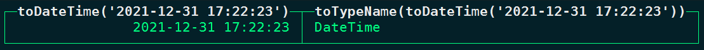
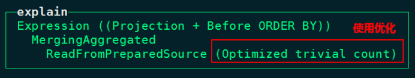
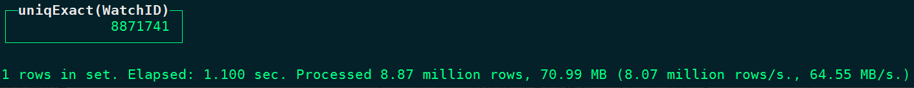
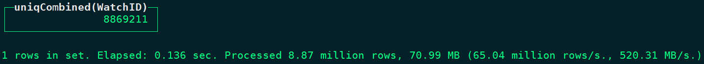
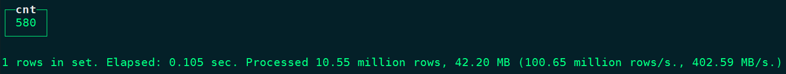
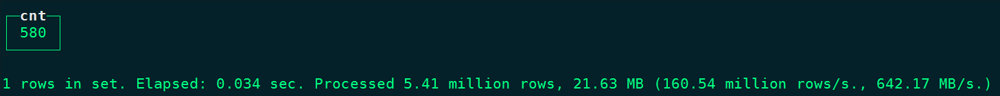
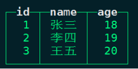
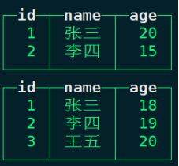
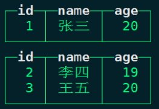
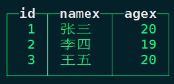

### 一、表优化

#### 1、日期字段避免使用String存储

在Hive中对于日期数据我们经常使用String类型存储，但是在[ClickHouse](https://cloud.tencent.com/product/tchousec?from_column=20065&from=20065)中建表时针对日期类型[数据存储](https://cloud.tencent.com/product/cdcs?from_column=20065&from=20065)建议使用日期类型存储，不使用String类型存储，因为在使用到日期时日期类型可以直接处理，String类型的日期数据还需要使用函数进行处理，执行效率低。例如：

```javascript
select toDateTime('2021-12-31 17:22:23'),toTypeName(toDateTime('2021-12-31 17:22:23'))
```



#### 2、Nullable值处理

在ClickHouse表中数据存储时，对于一些列尽量不使用Nullable类型存储，因为此类型需要单独创建额外的文件来存储NULL的标记并且Nullable类型列无法被索引，会拖累性能，在数据存储时如果有空值时，我们可以选择在业务中没有意义的值来替代NULL值。

#### 3、分区和索引

ClickHouse中一般选择按天分区，可以指定tuple()指定多个列为组合分区。如果不按天分区，每个分区数据量控制在800~1000万为宜。

建表时通过order by 指定索引列，可以指定tuple(),指定多个列为索引列，指定索引列时最好满足高基列在前、查询频率大的列在前的原则。基数过大的列不适合作为索引列，因为如果某列基数特别大，这种情况有索引和没索引效果一样。

#### 4、建表指定TTL

如果表不是必须保存全量历史数据，建议指定TTL，以免去手动清除过期数据的麻烦。

### 二、写入查询优化

#### 1、避免小批量数据写入

尽量避免单条和小批量插入、删除操作，会产生大量小分区文件，给后台Merge带来压力。

#### 2、count优化

在ClickHouse中向查询数据总条数时，使用count() 代替count(列)查询，因为使用count()查询会自动寻找数据目录中的“count.txt”文件读取数据总条目，性能极高。如果使用count(列)相当于扫描全表读取总数据量。

```javascript
node1 :) explain plan select count() from person_info;
```



```javascript
node1 :) explain plan select count(name) from person_info;
```

#### 3、避免使用select \* 

数据量太大时应避免使用select \* 查询，这种查询会将表中所有字段都查询出来，IO消耗大，查询字段越少消耗的IO资源就越少，性能就会越高。

#### 4、避免构建虚拟列

如果非必要尽量避免在查询时构建虚拟列，虚拟列非常消耗资源，造成性能浪费，可以考虑在前端进行处理或者在表中构建实际的列进行额外存储。

```javascript
#避免使用虚拟列 ，以下count1/count2就是虚拟列
select id,name,count1,count2,count1/count2 as new_col from tbl;
```

#### 5、使用uniqCombined代替count(distinct)

使用uniqCombined替代distinct性能可提升10倍以上，uniqCombined 底层采用类似HyperLogLog算法实现，如能接收2%左右的数据误差，可直接使用这种去重方式提升查询性能。

```javascript
node1 :) select count(distinct WatchID) from datasets.hits_v1;
```



```javascript
node1 :) select uniqCombined(WatchID) from datasets.hits_v1;
```



#### 6 、使用物化视图

对于一些确定的数据模型，可以将统计指标通过物化视图的方式进行构建，这样可避免数据查询时重复计算的过程，同样在后期也可以构建Projection投影来替代物化视图。

#### 7、Join关联相关

当多表关联查询时，查询的数据仅来源于一张表时，可考虑用IN代替JOIN，速度会更快。

```javascript
node1 :) select count(distinct a.CounterID) as cnt  from hits_v1 as a  join visits_v1  as b on a.CounterID = b.CounterID
```



```javascript
node1 :) select count(distinct CounterID) as cnt from hits_v1 where CounterID in (select  CounterID from visits_v1);
```



此外，多表关联时，将小表放在右侧，因为右表自动会被加载到内存中与左表进行关联。

#### 8、分布式表使用global

对分布式表使用join 或者 in时，ClickHouse会将当前SQL分发到各个ClickHouse节点上执行，例如有如下SQL:

```javascript
select a.id,a.name,b.score from a join b on a.id = b.id
```

如果以上a表和b表都是分布式表，ClickHouse集群有3个节点，那么上面SQL会分发到ClickHouse所有节点执行，b表会在每个节点上收集其他节点对应b表数据并放在内存，这样的话，每个ClickHouse节点都会从对应的3台节点上将b表数据进行汇集。

如果使用global关键字，执行如下SQL：

```javascript
select a.id,a.name,b.score from a global join b on a.id = b.id
```

这样执行SQL的话，相当于在当前写SQL节点会将查询得到b表所有数据，然后统一分发到其他ClickHouse各个节点上，然后每个节点在执行与a表关联。这样使用global就减少了集群之间查询次数。假设b表有N个分片分布在N个ClickHouse节点上，不使用global时，每个节点获取b表全量数据需要执行N的平方次查询，使用global时只需要执行N次查询即可。

所以在使用分布式表进行join或者in时，可以优先考虑使用global，使用用法如下：

```javascript
select a.id,a.name,b.score from a global join b on a.id = b.id
select a.id,a.name from a global  where a.id global in (select id from b)
```

#### 9、避免使用final

ClickHouse中我们可以使用ReplacintMergeTree来对数据进行去重，这个引擎可以在数据主键相同时根据指定的字段保留一条数据，ReplacingMergeTree只是在一定程度上解决了数据重复问题，由于自动分区合并机制在后台定时执行，所以并不能完全保障数据不重复。我们需要在查询时在最后执行final关键字，final执行会导致后台数据合并，查询时如果有final效率将会极低，我们应当避免使用final查询，那么不使用final我们可以通过自己写SQL方式查询出想要的数据，举例如下：

```javascript
#创建replacingMergeTree 表t_replacing_mt
create table t_replacing_mt(
id UInt8,
name String,
age UInt8
) engine = ReplacingMergeTree(age)
order by id;

#向表中插入以下数据
insert into t_replacing_mt values (1,'张三',18),(2,'李四',19),(3,'王五',20);
```



```javascript
#继续向表中插入如下数据
insert into t_replacing_mt values (1,'张三',20),(2,'李四',15);
```

!

```javascript
#通过final查询最终结果
node1 :) select * from t_replacing_mt final;
```



下面我们不使用final，通过自己写SQL方式现在查询最终合并数据，操作如下：

```javascript
#重新删除表t_replacing_mt，重建、并加载如下数据
drop table t_replacing_mt;

create table t_replacing_mt(
id UInt8,
name String,
age UInt8
) engine = ReplacingMergeTree(age)
order by id;

insert into t_replacing_mt values (1,'张三',18),(2,'李四',19),(3,'王五',20);

#继续向表中插入如下数据
insert into t_replacing_mt values (1,'张三',20),(2,'李四',15);

#自己写SQL方式实现查询去重后的数据，这样避免使用final查询，效率提高
SELECT
    id,
    argMax(name, age) AS namex,
    max(age) AS agex
FROM t_replacing_mt
GROUP BY id
```



**注意：argMax(arg,val)函数意思是找到val最大值对应的arg值，如果val有多个相同最大值，则遇到的第一条对应的arg值输出。**

我们还可以针对ReplacingMergeTree表加上一个时间字段，通过自己写SQL方式实现数据更新来避免使用CollapsingMergeTree引擎进行数据更新。当有数据更新时，我们插入这条更新的数据，时间对应的是最新时间，查询时找到最大时间对应的数据即可，不必再创建CollapsingMergeTree引擎使用final语句进行更新数据，具体操作类似以上SQL操作。
<!--stackedit_data:
eyJoaXN0b3J5IjpbLTE3MDYyODk5NDVdfQ==
-->
