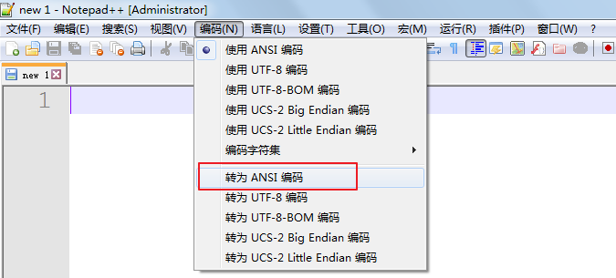
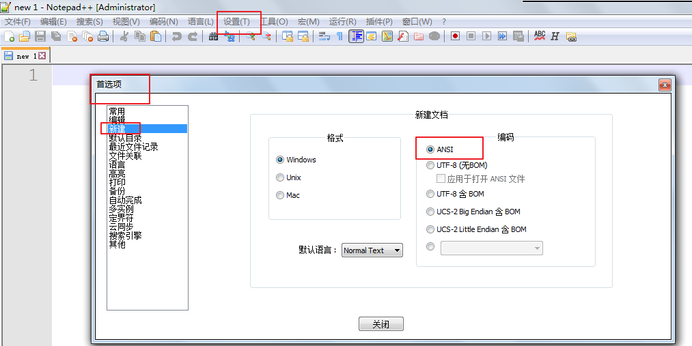
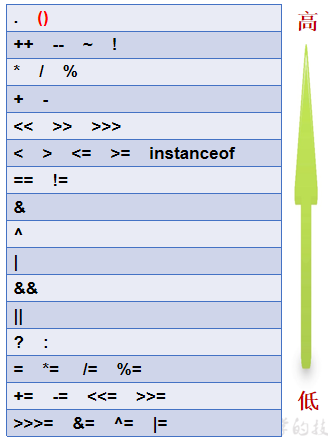
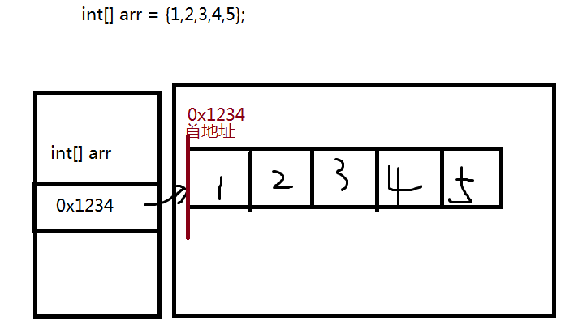
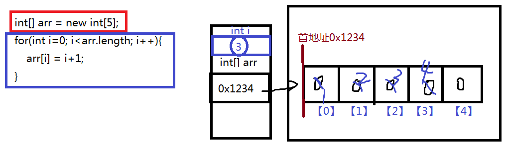

# 第一章 Java概述

## 1.1 Java历史

Java诞生于SUN（Stanford University Network），09年SUN被Oracle（甲骨文）收购。

Java之父是詹姆斯.高斯林(James Gosling)。

1996年发布JDK1.0版。

目前最新的版本是Java13。我们学习的Java8。

## 1.2 Java语言最主要的特点

* 特点一：面向对象

两个基本概念：类、对象

三大特性：封装、继承、多态

* 特点二：健壮性

吸收了C/C++语言的优点，但去掉了其影响程序健壮性的部分（如指针、内存的申请与释放等），提供了一个相对安全的内存管理和访问机制，GC垃圾回收机制

* 特点三：跨平台性

跨平台性：通过Java语言编写的应用程序在不同的系统平台上都可以运行。“Write once , Run Anywhere”一次编写，处处运行。

原理：只要在需要运行 java 应用程序的操作系统上，先安装一个Java虚拟机 (JVM Java Virtual Machine) 即可。由JVM来负责Java程序在该系统中的运行。因为有了JVM，同一个Java 程序在三个不同的操作系统中都可以执行。这样就实现了Java 程序的跨平台性。


## 1.3 Java环境搭建

### 1.3.1 JDK、JRE、JVM

Java开发人员需要安装JDK。

JDK（Java Development kits）：Java开发工具包。

JRE（Java Runtime Environment）：Java运行环境。

JVM（Java Virtual Machine）：Java虚拟机。

JDK = JRE + 开发工具

JRE = JVM + 核心类库


### 1.3.2  Java环境搭建

1、安装JDK


2、配置JDK的开发工具目录到path环境变量中

​	例如：D:\ProgramFiles\Java\jdk1.8.0_51\bin;

​	注意：这个安装目录以你自己的安装目录为准


（1）为什么配置path？

​	希望在命令行使用javac.exe等工具时，任意目录下都可以找到这个工具所在的目录。

（2）如何配置环境变量？

​	方式一：【计算机】右键【属性】，选择【高级系统设置】，选择【高级】，选择【环境变量】，选择【系统环境变量】，编辑path，在【**path原有值**】的前面加入D:\ProgramFiles\Java\jdk1.8.0_51\bin;

​	方式二：

​	JAVA_HOME=D:\ProgramFiles\Java\jdk1.8.0_51

​	path=%JAVA_HOME%\bin;

## 1.4 第一个Java应用程序

```java
class HelloWorld{
    public static void main(String[] args){
        System.out.print("Hello Java!");
    }
}
```

### 1.4.1 Java程序的开发步骤

三步：

1、编辑

源文件必须保存为.java文件

2、编译

把.java的源文件编译为一个或多个的.class。

编译工具：javac.exe

```cmd
javac 源文件名.java
```

3、运行

执行字节码文件，只能直接运行包含main方法的字节码文件。

运行工具：java.exe

```cmd
java 字节码文件名
或
java 类名
```

> java 字节码文件名后面不要加.class和.java

### 1.4.2 Java程序的结构与格式

```java
类{
	方法{
        语句
	}
}
```

```java
class 类名{
    public static void main(String[] args){
        语句;
    }
}
```

### 1.4.3 Java程序的入口

```java
public static void main(String[] args){
}
```

### 1.4.4 Java注释

1、单行注释

```java
//注释内容
```

2、多行注释

```java
/*
注释内容
*/
```

> 多行注释不能嵌套

3、文旦注释

```java
/**
	注释内容
 */
javadoc -d 文件夹名 【-version -author】 源文件名.java
```

## 1.5 编写Java程序时应该注意的问题

1、字符编码问题

当cmd命令行窗口的字符编码与.java源文件的字符编码不一致，如何解决？

```
修改源文件的编码，保持和命令行一致
```





2、大小写问题

（1）源文件名：不区分

（2）字节码文件名与类名：区分

（3）代码中：区分


3、源文件名与类名一致问题？

（1）源文件名是否必须与类名一致？public呢？

如果这个类不是public，可以与源文件名不一致，但是如果是public的，要求必须一致

（2）一个源文件中是否可以有多个类？public呢？

一个源文件中可以有多个类，但是public的类只能有一个

（3）main必须在public的类中吗？

不一定，但是建议main写在public类中。


# 第二章 Java的基础语法

## 2.1 标识符

1、标识符的命名规则

（1）只能用26个英文字母大小写，数字0-9，下划线，美元符号

（2）数字不能开头

（3）不能使用Java的关键字和保留字，特殊值（53个）

（4）严格区分大小写

（5）不能包含空格


2、标识符的命名规范

（1）见名知意

（2）类名、接口名等：每一个单词首字母大写，形式：XxxYyyZzz

（3）方法名、变量名等：从第二个单词开始，首字母大写，形式：xxxYyyZzz

（4）包名：所有单词都小写，每个单词之间使用.分割，形式：xxx.yyy.zzz

（5）常量名：所有单词都大写，每个单词之间使用_分割，形式：XXX_YYY_ZZZ


## 2.2 变量

### 2.2.1 变量的概念

变量的作用：用来存储数据，代表内存的一块存储区域

### 2.2.2 变量的三要素

1、数据类型

2、变量名

3、变量值

### 2.2.3 变量的使用应该注意什么？

1、先声明后使用

2、必须赋值

3、有作用域

4、同一个作用域中不能重名

### 2.2.4 变量的声明和赋值、使用的语法格式？

1、变量的声明的语法格式：

```java
数据类型  变量名;
例如：
int age;
String name;
double weight;
char gender;
boolean isMarry;
```

2、变量的赋值的语法格式：

```java
变量名 = 值;
例如：
age = 18;
name = "柴林燕";
weight = 44.4;
gender = '女';
isMarry = true;
```

3、变量的使用的语法格式：

```java
通过变量名直接引用

例如：
(1)输出变量的值
System.out.print(name);
System.out.print("姓名：" + name);
System.out.print("name = " + name);

(2)计算
age = age + 1;
```

## 2.3 数据类型

### 2.3.1 Java数据类型的分类

1、基本数据类型

​	8种：整型系列（byte,short,int,long）、浮点型(float,double)、单字符型（char）、布尔型（boolean）

2、引用数据类型

​	类、接口、数组、枚举.....

### 2.3.2 Java的基本数据类型

1、整型系列

（1）byte：字节类型

占内存：1个字节

存储范围：-128~127

（2）short：短整型类型

占内存：2个字节

存储范围：-32768~32767

（3）int：整型

占内存：4个字节

存储范围：-2的31次~2的31次-1

（4）long：整型

占内存：8个字节

存储范围：-2的63次~2的63次-1

> 注意：如果某个数字想要表示为long类型，需要在后面加L或l（小写L）


2、浮点型系列（小数）

（1）float：单精度浮点型

占内存：4个字节

精度：科学计数法的小数点后6~7位

> 注意：如果某个小数要表示float类型，数字后面加F或f

（2）double：双精度浮点型

占内存：8个字节

精度：科学计数法的小数点后15~16位


3、单字符类型

char：字符类型

占内存：2个字节

Java中使用的字符集：Unicode

字符的三种表示方式：

（1）'单个字符'：单引号中写单个字符

（2）'转义字符'

```java
\t：Tab键
\n：换行
\b：删除键
\r：回车
\\：\
\'：'
\"："
```

（3）'\uUnicode编码值的16进制形式'

```java
'尚' -> '\u5c1a'
```


boolean：只能存储true和false

> 底层存储是用0表示false，1表示true，但是代码中boolean类型的变量不能赋值为0和1

### 2.3.3 进制（了解）

1、进制的分类：

（1）十进制

​	数字组成：0-9

​	进位规则：逢十进一

（2）二进制

​	数字组成：0-1

​	进位规则：逢二进一

（3）八进制

​	数字组成：0-7

​	进位规则：逢八进一

（4）十六进制

​	数字组成：0-9，a~f（或A~F）

​	进位规则：逢十六进一

2、请分别用四种类型的进制来表示10，并输出它的结果：（了解）

（1）十进制：正常表示

System.out.println(10);

（2）二进制：0b或0B开头

System.out.println(0B10);

（3）八进制：0开头

System.out.println(010);

（4）十六进制：0x或0X开头

System.out.println(0X10);


3、为什么byte是-128~127？（理解）

1个字节：8位

0000 0001  ~  0111 111 ==> 1~127

1000 0001 ~ 1111 1111 ==> -127 ~ -1

0000 0000 ==>0

1000 0000 ==> -128（特殊规定）

> *解释：*计算机数据的存储（了解）
>
> *计算机数据的存储使用二进制补码形式存储，并且最高位是符号位，1是负数，0是正数。*
>
> *规定：正数的补码与反码、原码一样，称为三码合一；*
>
> ​	    *负数的补码与反码、原码不一样：*
>
> ​	   *负数的原码：把十进制转为二进制，然后最高位设置为1*
>
> ​	   *负数的反码：在原码的基础上，最高位不变，其余位取反（0变1,1变0）*
>
> ​	   *负数的补码：反码+1*
>
> *例如：byte类型（1个字节，8位）*
>
> *25 ==> 原码  0001 1001 ==> 反码  0001 1001 -->补码  0001 1001*
>
> *-25 ==>原码  1001 1001 ==> 反码1110 0110 ==>补码 1110 0111*


4、学生疑惑解答？

（1）为什么float（4个字节）比long（8个字节）的存储范围大？

（2）为什么double（8个字节）比float（4个字节）精度范围大？

（3）为什么float和double是不精确的？

因为float、double底层也是二进制，先把小数转为二进制，然后把二进制表示为科学记数法，然后只保存：

（1）符号位（2）指数位（float是8位，double是11位）（3）尾数位（float是23位，double是52位）

> *详见《float型和double型数据的存储方式.docx》*

### 2.3.4 基本数据类型的转换

   基本数据类型之间的转换(boolean不参与)
 1. 自动转换(从小往大转)
    		byte->short->int->long->float->double
        	char-> int

    ```java
    byte b=10;
    int i=b;//自动转化
    ```

 2.  强制转换(从大往小转)    是存在风险的
        	语法：较小类型 变量名=(较小类型)较大的值;   

    ```java
    int i=10;
    //byte b=i;//默认会报错
    byte b=(byte)i;
    ```

 3. String与基本数据类型的转换 后面会有知识点
    强转是办不到的

## 2.4 运算符

1、按照操作数个数的分类：

（1）一元（单目）运算符：操作数只有一个

例如：正号（+），负号（-），自增（++），自减（--），逻辑非（！），按位取反（~）

（2）二元（双目）运算符：操作数有两个

例如：加（+），减（-），乘（*），除（/），模（%）

​          大于（>），小于（<），大于等于（>=），小于等于（<=），等于（==），不等于（!=）

​	赋值（=，+=，-=，*=，/=，%=，>>=，<<=。。。）

​	 逻辑与（&），逻辑或（|），逻辑异或（^），短路与（&&），短路或（||）

​	左移（<<），右移（>>），无符号右移（>>>），按位与（&），按位或（|），按位异或（^）

（3）三元（三目）运算符：操作数三个

例如： ？ ：


2、Java基本数据类型的运算符：

（1）算术运算符

（2）赋值运算符

（3）比较运算符

（4）逻辑运算符

（5）三元运算符

（6）位运算符（难）

### 2.4.1 算术运算符

加法：+

减法：-

乘法：*

除法：/

> *注意：整数与整数相除，只保留整数部分*

取模：%   取余

> 注意：取模结果的正负号只看被模数

正号：+

负号：-

自增：++

自减：--

> **原则：自增与自减**
>
> **++/--在前的，就先自增/自减，后取值**
>
> **++/--在后的，就先取值，后自增/自减**


### 2.4.2 赋值运算符

基本赋值运算符：=

扩展赋值运算符：+=，-=，*=，/=，%=...

> 注意：所有的赋值运算符的=左边一定是一个变量
>
> 扩展赋值运算符=右边的计算结果的类型如果比左边的大的话会强制类型转换，所以结果可能有风险。

```java
short s1 = 1;
short s2 = 2;
s1 += s2; //等价于  s1 = (short)(s1 + s2);
```


### 2.4.3 比较运算符

大于：>

小于：<

大于等于：>=

小于等于：<=

等于：==

> 注意区别于，赋值运算符=

不等于：!=

> 注意：比较表达式的运算结果一定只有true/false
>
> 比较表达式可以作为（1）条件（2）逻辑运算符的操作数


### 2.4.4 逻辑运算符

> 逻辑运算符的操作数必须是布尔值

逻辑与：&
	运算规则：只有左右两边都为true，结果才为true。
	例如：true & true 结果为true
		   false & true 结果为false
		    true & false 结果为false
		    false & false 结果为false
逻辑或：|
	运算规则：只要左右两边有一个为true，结果就为true。
	例如：true | true 结果为true
		   false | true 结果为true
		   true | false 结果为true
		    false | false 结果为false	
逻辑异或：^
	运算规则：只有左右两边不同，结果才为true。
	例如：true ^ true 结果为false
		    false ^ true 结果为true
		    true ^ false 结果为true
		    false ^ false 结果为false			

逻辑非：!
	运算规则：布尔值取反
	例如：!true 为false
		    !false 为true

短路与：&&
	运算规则：只有左右两边都为true，结果才为true。
	例如：true & true 结果为true
		    true & false 结果为false
		    false & ?  结果就为false
	它和逻辑与不同的是当&&左边为false时，右边就不看了。
	
短路或：||	
	运算规则：只要左右两边有一个为true，结果就为true。
	例如：true | ? 结果为treu
		   false | true 结果为true
		    false | false 结果为false	
	它和逻辑或不同的是当||左边为true时，右边就不看了。

### 2.4.5 三元运算符

 ? : 

语法格式：

```java
条件表达式? 结果表达式1 : 结果表达式2
```

运算规则：

当条件表达式为true，整个表达式的结果就取结果表达式1的值，否则就取结果表达式2的值

代码示例：

```
（1）boolean类型
boolean isMarry = true;
System.out.println(isMarry?"已婚":"未婚");

（2）求最值
int a = 1;
int b = 2;
System.out.println("最大值：" + (a>b?a:b));

```


### 2.4.6 位运算符

左移：<<

​	简单来说，左移几位，乘以2的几次方

​	实际来看，二进制（补码）左移几位，左边的被移走了，右边补0

右移：>>

​	简单来说，左移几位，除以2的几次方，如果除不尽会向下取整。

​	实际来看，二进制（补码）右移几位，右边的被移走了，左边补0或1，和最高位一样（最高位是0就补0，最高位是1就补1）

无符号右移：>>>

​	实际来看，二进制（补码）右移几位，右边的被移走了，左边补0

按位与：&

​	对应的位，1&1才为1，其他都为0

按位或：|

​	对应的位，0|0才为0，其他都为1

按位异或：^

​	对应的位，不一样采为1,1^0为1,0^1为1，其他都是0

按位取反：~

​	~1为0，~0为1

> 如何区分&,|,^是逻辑运算符还是位运算符？
>
> 看操作数，操作数是整数就是位运算符，boolean值就是逻辑运算符


### 2.4.7 运算符优先级



提示说明：

（1）表达式不要太复杂

（2）先算的使用()

# 第三章 流程控制语句结构

流程控制语句结构分为：

1、顺序结构

2、分支结构

3、循环结构

## 3.1 顺序结构

执行过程：从上到下顺序执行

### 3.1.1 输出语句

1、System.out.print(输出内容); #输出内容后不换行

2、System.out.println(输出内容);  #输出内容后换行

```java
#输出常量
System.out.print(1);
System.out.print('尚');
System.out.print(44.4);
System.out.print(true);
System.out.print("尚硅谷");

#输出变量
int a = 1;
char c = '尚';
double d = 44.4;
boolean b = true;
String school = "尚硅谷";
System.out.print(a);
System.out.print(c);
System.out.print(d);
System.out.print(b);
System.out.print(school);

#输出拼接结果
System.out.print("a = " + a);
System.out.print("c = " + c);
System.out.print("d = " + d);
System.out.print("b = " + b);
System.out.print("school = " + school);
```

### 3.1.2 输入语句

键盘输入代码的三个步骤：

1、准备Scanner类型的变量

2、提示输入xx

3、接收输入内容

示例代码：

```java
java.util.Scanner input = new java.util.Scanner(System.in);
System.out.print("请输入xx:");

int num = input.nextInt();
double d = input.nextDouble();
boolean b = input.nextBoolean();
String str = input.next();
char c = input.next().charAt(0);
```

```
input.next();//遇到空格等空白符认为输入结束
input.nextLine();//遇到换行认为输入结束
```


## 3.2 分支结构

分支结构：根据条件选择性的执行某些代码

分为：

1、条件判断：if...else系列

2、选择结构：switch...case系列

### 3.2.1 条件判断

#### 1、单分支结构

语法格式：

```java
if(条件表达式){
    语句块1;
}
```

执行过程：

当条件表达式为true，执行语句块1，否则就不执行语句块1;

> 注意：
>
> (1)if(条件表达式)的条件表达式的结果类型必须是boolean类型
>
> (2)当{}中的语句块只有一句语句时，{}可以省略，但是我们不建议省略

示例代码：

```java
int a = 3;
if(a%2==0){
    System.out.println("偶数");
}
```

```java
int year = 2019;
if(year%4==0 && year%100!=0 || year%400==0){
    System.out.println("闰年");
}
```


#### 2、双分支结构

语法格式：

```java
if(条件表达式){
    语句块1；
}else{
    语句块2；
}
```

执行过程：

当条件表达式为true时，执行语句块1，否则执行语句块2;

> 注意：
>
> (1)if(条件表达式)的条件表达式的结果类型必须是boolean类型
>
> (2)当{}中的语句块只有一句语句时，{}可以省略，但是我们不建议省略
>
> (3)else不能单独使用，必须有if配对


示例代码：

```java
int a = 3;
if(a%2==0){
    System.out.println("偶数");
}else{
    System.out.println("奇数");
}
```

```java
int year = 2019;
if(year%4==0 && year%100!=0 || year%400==0){
    System.out.println("闰年");
}else{
    System.out.println("平年");
}
```


#### 3、多分支结构

语法格式：

```java
if(条件表达式1){
    语句块1；
}else if(条件表达式2){
    语句块2;
}else if(条件表达式3){
    语句块3;
}....
【
else{
	语句块n+1；
}
】    
```

执行过程：

（1）先判断条件表达式1，如果成立，就执行语句块1，就结束。

（2）如果条件表达式1不成立，看条件表达式2，如果条件表达式2成立，就执行语句块2，就结束。

（3）以此类推，上面的条件成立，下面就不看了，如果不成立，看下面的条件。最终只有一个分支被执行。

（4）如果所有的条件都不成立，如果存在最后的else，那么就执行最后的else部分语句块.

> 注意：
>
> (1)if(条件表达式)的条件表达式的结果类型必须是boolean类型
>
> (2)当{}中的语句块只有一句语句时，{}可以省略，但是我们不建议省略
>
> (3)当多个条件表达式的条件范围如果有重叠部分，我们称为包含，多个条件的顺序有要求，小的在上，大的在下面。
>
> 当多个条件表达式的条件范围如果没有重叠部分，我们称为互斥，多个条件的顺序随意。


示例代码：

```java
int a = 3;
if(a > 0){
    System.out.println("正数");
}else if(a<0){
    System.out.println("负数");
}else{
    System.out.println("零");
}
```


#### 4、嵌套

执行过程：

​	当嵌套在if中，就当外面的if条件成立时，再看里面的条件判断。

​	当嵌套在else中，就当外面的if条件不成立，即else满足，再看里面的条件判断。


### 3.2.2 选择结构

语法格式：

```java
switch(表达式){
    case 常量值1:
        语句块1；
        【break;】
    case 常量值2:
        语句块2；
        【break;】
    case 常量值3:
        语句块3；
        【break;】
     。。。。
    【
     default:
        语句块n+1;
       【break;】
            】
}
```

执行过程：

入口：

（1）当switch(表达式)与case后面的常量值匹配，就从这个case进入

（2）当switch(表达式)与所有case后面的常量值都不匹配，如果存在default，就从default进入。

出口：

（1）自然出口：switch的结束}

（2）中断出口：遇到break;

从入口进入后，一直往下执行，如果没有遇到出口，就会“贯穿”其他的分支，一直往下，直到遇到出口才会结束。


> 注意：
>
> （1）switch(表达式)的表达式类型有要求，只能是4种基本数据类型（byte,short,int,char），两种引用数据类型（JDK1.5之后枚举，JDK1.7之后String）
>
> （2）case后面必须是常量或常量表达式
>
> （3）case后面的常量值不能重复


示例代码：

```java
int week = 4;
switch(week){
    case 1:
        System.out.println("Monday");
        break;
    case 2:
        System.out.println("Tuesday");
        break;
   case 3:
        System.out.println("Wednesday");
        break;
   case 4:
        System.out.println("Thursday");
        break;
        
   case 5:
        System.out.println("Friday");
        break;
   case 6:
        System.out.println("Saturnday");
        break;
  case 7:
        System.out.println("Sunday");
        break;
  default：
      	System.out.println("输入有误");
}
```

```java
int month = 4;
switch(month){
    case 3:
    case 4:
    case 5:
    	System.out.prntln("春季");
    	break;
    case 6:
    case 7:
    case 8:
    	System.out.prntln("夏季");
    	break;
    case 9:
    case 10:
    case 11:
    	System.out.prntln("秋季");
    	break;
    case 1:
    case 2:
    case 12:
    	System.out.prntln("冬季");
    	break;
}
```


## 3.3 循环结构

循环结构：

​	“重复”执行某些代码

循环结构的分类：

1、for循环

2、while循环

3、do...while循环

### 3.3.1 for循环

语法格式：

```java
for(;;){
    循环体语句块;
}
for(循环变量的初始化①; 循环条件②; 迭代表达式③){
    循环体语句块④;
}
```

执行过程：

（1）先执行循环变量的初始化①

（2）判断循环条件②

（3）如果循环条件成立，执行循环体④，然后执行迭代表达式③，回到（2）

​         如果循环条件不成立，直接结束for

> 注意：
>
> (1)for(;;)两个;不能多也不能少
>
> (2)循环条件必须是boolean类型
>
> (3)for循环结构有可能一次都不执行循环体


示例代码：

```java
for(int i=1; i<=5; i++){
    System.out.println(i);
}
```


### 3.3.2 while循环

语法格式：

```java
while(循环条件){
    循环体语句块
}

while(true){
    。。。。
    if(条件){
        break;
    }
}

```

执行过程：

（1）先判断循环条件

（2）如果循环条件成立，执行一次循环体语句，回到（1）

​          如果循环条件不成立，结束while循环


> 注意：
>
> （1）循环条件必须是boolean类型
>
> （2）while循环也可能一次都不执行循环体


示例代码：

```java
int i= 1;
while(i<=5){
    System.out.println(i);
    i++;
}
```

```java
int count = 0;
double paper = 0.1;//毫米
while(paper < 8848.44 * 1000){
    paper *= 2;
    count++;
}
```


### 3.3.3 do...while循环

语法格式：

```java
do{
    循环体语句块;
}while(循环条件);
```

执行过程：

(1)先执行一次循环体

(2)判断循环条件

(3)如果循环条件成立，执行一次循环体语句，回到（2）

​          如果循环条件不成立，结束do_while循环

> 注意：
>
> (1)循环条件必须是boolean类型
>
> (2)while(循环条件);后面的;不能省略
>
> (3)do...while的循环体至少执行一次


示例代码：

```java
java.util.Scanner input = new java.util.Scanner(System.in);
int zheng = 0;
int fu = 0;
int num;
do{
    System.out.print("请输入整数：");
    num = input.nextInt();
    if(num>0){
        zheng++；
    }else if(num<0){
        fu++;
    }
}while(num!=0);
```

### 3.3.4 三种循环的选择

首先，三种循环完全可以互相替换，它们的作用一样，都是重复执行某些代码。

不同的场景下，选择合适的循环结构，会让代码的阅读性更好，看起来更舒服。

for循环一般用于从哪里循环到哪里，次数比较明显的场景，while循环一般用于条件比较明确的场景，do..while适用于至少执行一次的场景。

### 3.3.5 跳转语句

1、break：

用于switch或循环结构。

如果在switch中表示结束当前switch。

如果在循环结构中，表示结束当层循环。


2、continue 

只能用于循环结构，表示跳过本次循环的剩下的循环体语句，提前进入下一次循环。

# 第四章 数组

## 4.1 数组的相关概念和名词（了解）

1、数组(array)：

​	一组具有相同数据类型的数据的按照一定顺序排列的集合。

​       把有限的几个相同类型的变量使用一个名称来进行统一管理。

2、数组名：

​	（1）这个数组名，代表的是一组数

​	（2）这个数组名中存储的整个数组的“首地址”

​	（3）打印数组名时，显示的是处理过的结果：数组对象的类型@hashCode值

3、下标(index)：

​	我们使用编号、索引、下标来区别/表示一组数当中某一个。

​	范围：[0,数组长度-1]     

​	例如：for(int i = 0;  i<arr.length; i++){}

4、元素(element)：

​	这一组中的的每一个数据都是元素。

​	如何表示数组元素？  数组名[下标]

5、数组的长度(length)

​	数组中元素的总个数。

​	如何获取数组长度？  数组名.length

> 注意：名词是为了沟通的方便，概念不用一字不落背下来

## 4.2 数组的相关语法

### 4.2.1 数组的声明

语法格式：

```java
 元素的数据类型[] 数组名; //推荐
 元素的数据类型 数组名[];//也对，但是不推荐
```

示例：

```java
//要存储一组整数
int[] arr;

//要存储一组单字符
char[] arr;

//要存储一组字符串
String[] arr;
```

### 4.2.2 数组的初始化

初始化的目的：（1）确定数组的长度（2）为元素赋值

两种初始化方式：

1、动态初始化

语法格式：

```java
//指定数组长度
数组名 = new 元素的数据类型[长度];

//为元素赋值
数组名[下标] = 值; //右边的值可能是一个常量值，可能是另一个变量，可能是一个表达式，也可能是调用方法的结果
```

> 问：如果只指定数组长度，没有为元素手动赋值，那么元素有值吗？
>
> 有默认值

数组元素的默认值：

（1）基本数据类型：

byte,short,int,long：0

float,double：0.0

boolean：false

char：\u0000

（2）引用数据类型：null


2、静态初始化

语法格式：

```java
数组名 = new 元素的数据类型[]{元素值1，元素值2,。。。。};

//更简洁  ,要求声明与静态初始化是一句完成时，才可以这样简化
元素的数据类型[] 数组名 = {元素值1，元素值2,。。。。};

```

适用场合：

​	当元素的值是已知的，相对较少的

示例代码：

```java
String[] weeks = {"monday","tuesday","wednesday","thursday","friday","saturday","sunday"};

int[] daysOfMonths = {31,28,31,30,31,30,31,31,30,31,30,31};

char[] letters = {'a','b','c','d','e','f','g','h','i','j','k','l','m','n','o','p','q','r','s','t','u','v','w','x','y','z'};
```


### 4.2.3 数组的遍历

for循环遍历数组：

```java
for(int i=0; i <数组名.length; i++){
    //或赋值
    //或显示
    //或其他操作
}

```


### 4.2.4 数组的内存分析

元素是基本数据类型的一维数组内存分析：

```
int[] arr = {1,2,3,4,5};
```



```java
int[] arr = new int[5];
for(int i=0; i<arr.length; i++){
    arr[i] = i+1;
}
```




## 4.3 数组的相关算法

### 4.3.1 数组找最值

1、数组中找最值

思路：

（1）先假设第一个元素最大或最小

（2）用max或min与后面的元素一一比较

示例代码：

```java
int[] arr = {4,5,6,1,9};
//找最大值
int max = arr[0];
for(int i=1; i<arr.length; i++){//这里i从1开始，用max与后面arr[1]~arr[4]的元素进行比较
    if(arr[i] > max){
        max = arr[i];
    }
}
```

2、数组中找最值及其下标

情况一：找最值及其第一次出现的下标

思路：

（1）先假设第一个元素最大或最小

（2）用max或min与后面的元素一一比较

示例代码：

```java
int[] arr = {4,5,6,1,9};
//找最大值
int max = arr[0];
int index = 0;
for(int i=1; i<arr.length; i++){//这里i从1开始，用max与后面arr[1]~arr[4]的元素进行比较
    if(arr[i] > max){
        max = arr[i];
        index = i;
    }
}
```

情况二：找最值及其所有最值的下标

思路：

（1）先假设第一个元素最大或最小

（2）用arr[index]与后面的元素进行比较

示例代码：

```java
int[] arr = {4,5,6,1,9};
//找最大值
int index = 0;
for(int i=1; i<arr.length; i++){//这里i从1开始，用max与后面arr[1]~arr[4]的元素进行比较
    if(arr[i] > arr[index]){
        index = i;
    }
}
```

### 4.3.2 数组统计：求总和、均值、统计偶数个数等

思路：遍历数组，挨个的累加，判断每一个元素

示例代码：

```java
int[] arr = {4,5,6,1,9};
//求总和、均值
int sum = 0;
for(int i=0; i<arr.length; i++){
    sum += arr[i];
}
System.out.println("均值：" + (double)sum/arr.length);
```

示例代码2：

```java
int[] arr = {4,5,6,1,9};
//求总乘积
long result = 1;
for(int i=0; i<arr.length; i++){
    result *= arr[i];
}
```

示例代码3：

```java
int[] arr = {4,5,6,1,9};
//统计偶数个数
int even = 0;
int odd = 0;
for(int i=0; i<arr.length; i++){
    if(arr[i]%2==0){
        even++;
    }else{
        odd++;
    }
}
```

### 4.3.3 复制

应用场景：

1、扩容

2、备份

3、截取

示例代码：扩容

```java
int[] arr = {1,2,3,4,5,6,7,8,9};

//如果要把arr数组扩容，增加1个位置
//(1)先创建一个新数组，它的长度 = 旧数组的长度+1
int[] newArr = new int[arr.length+1];

//(2)复制元素
//注意：i<arr.length   因位arr比newArr短，避免下标越界
for(int i=0; i<arr.length; i++){
    newArr[i] = arr[i];
}
//(3)把新元素添加到newArr的最后
newArr[newArr.length-1] = 新值;

//(4)如果下面继续使用arr，可以让arr指向新数组
arr = newArr;

//(4)遍历显示
for(int i=0; i<arr.length; i++){
    System.out.println(arr[i]);
}
```

示例代码：备份

```java
int[] arr = {1,2,3,4,5,6,7,8,9};

//使用newArr对arr进行备份
int[] newArr = new int[arr.length];
for(int i=0; i<arr.length; i++){
    newArr[i] = arr[i];
}
```

### 4.3.4 反转

方法有两种：

1、借助一个新数组

2、首尾对应位置交换

第一种方式示例代码：

```
int[] arr = {1,2,3,4,5,6,7,8,9};

//(1)先创建一个新数组
int[] newArr = new int[arr.length];

//(2)复制元素
for(int i=0; i<arr.length; i++){
    newArr[i] = arr[arr.length-1-i];
}

//(3)舍弃旧的，让arr指向新数组
arr = newArr;

//(4)遍历显示
for(int i=0; i<arr.length; i++){
    System.out.println(arr[i]);
}
```

第二种方式示例代码：

```java
int[] arr = {1,2,3,4,5,6,7,8,9};

//(1)计算要交换的次数：  次数 = arr.length/2
//(2)首尾对应位置交换
/*
for(int i=0,j=arr.length-1; i<j; i++,j--){
    int temp = arr[i];
    arr[i] = arr[j];
    arr[j] = temp;
}*/
for(int i=0; i<arr.length/2; i++){
    int temp = arr[i];
    arr[i] = arr[arr.length-1-i];
	arr[arr.length-1-i] = temp;
}

//（3）遍历显示
for(int i=0; i<arr.length; i++){
    System.out.println(arr[i]);
}
```

### 4.3.5 查找

查找分为两种：

1、顺序查找：挨个看

​	对数组没要求

2、二分查找：对折对折再对折

​	对数组有要求，元素必须有大小顺序的

顺序查找示例代码：

```java
int[] arr = {4,5,6,1,9};
int value = 1;
int index = -1;

for(int i=0; i<arr.length; i++){
    if(arr[i] == value){//如果是基本数据类型，可以使用==比较，如果是引用数据类型，改成equals比较
        index = i;
        break;
    }
}
if(index==-1){
    System.out.println("没找到");
}else{
    System.out.println("下标是：" + index);
}

```

二分查找示例代码：

```java
/*
2、编写代码，使用二分查找法在数组中查找 int value = 2;是否存在，如果存在显示下标，不存在显示不存在。
已知数组：int[] arr = {1,2,3,4,5,6,7,8,9,10};
*/
class Exam2{
	public static void main(String[] args){
		int[] arr = {1,2,3,4,5,6,7,8,9};
		int value = 2;
        int index = -1;
		
		int left = 0;
        int right = arr.length-1;
        int mide = (left + right)/2;
        
        while(left<=right){
            if(arr[mid] == value){//如果是基本数据类型，可以使用==比较，如果是引用数据类型，改成equals比较
                index = i;
                break;
            }else if(value > arr[mid]){
                //往右边查找，修改left
                left = mid + 1;
            }else{
                //往左边查找，修改right
                right = mid - 1;
            }
            mid = (left + right)/2;
        }
	}
    if(index==-1){
    	System.out.println("没找到");
    }else{
        System.out.println("下标是：" + index);
    }
}
```


### 4.3.6 排序

数组的排序算法有千万种，我们只讲了两种：

1、冒泡排序

2、简单的直接排序

示例代码：从小到大，从左到右

```java
int[] arr = {5,4,6,3,1};
		
//冒泡排序，是要经过很多轮，外循环控制轮数 = 元素的个数 - 1
//每一轮是经过多次，每一次是相邻元素的比较
for(int i=1; i<arr.length; i++){
    //从左到右，每一轮的起点arr[0]
    /*
    当i=1,j=0,1,2,3		j<arr.length-i
    当i=2,j=0,1,2
    ...
    */
    for(int j=0; j<arr.length-i; j++){
        //相邻元素比较    arr[j]与arr[j+1]   arr[j-1]（当j=0，越界）与arr[j]
        //从小到大  ==> 前面的元素 > 后面的元素，交换
        if(arr[j] > arr[j+1]){
            int temp = arr[j];
            arr[j] = arr[j+1];
            arr[j+1] = temp;
        }
    }
}


```

示例代码：从大到小，从右到左

```java
char[] arr = {'h','e','l','l','o','j','a','v','a'};
//冒泡排序，是要经过很多轮，外循环控制轮数 = 元素的个数 - 1
//每一轮是经过多次，每一次是相邻元素的比较
//i=1,2,3,4,5,6,7,8
for(int i=1; i<arr.length; i++){
    //从右到左 ==>每一轮的起点   arr[arr.lenght-1]
    //当i=1,j=8,7,6,5,4,3,2,1	j>=i
    //当i=2,j=8,7,6,5,4,3,2
    //..
    for(int j=arr.length-1; j>=i; j--){
        //相邻元素比较，arr[j]与arr[j+1]（当j=arr.length-1时，j+1越界）   arr[j-1]与arr[j]
        //从大到小==》前面的元素<后面的元素，交换
        if(arr[j-1] < arr[j]){
            int temp = arr[j-1];
            arr[j-1] = arr[j];
            arr[j] = temp;
        }
    }
}		
```

示例代码：简单的直接选择排序

```java
int[] arr = {3,2,6,1,8};

//简单的直接选择排序，经过很多轮，轮数 = 元素的个数-1
//每一轮：（1）先找出本轮未排序元素中的最小值（最大值）及其下标（2）看这个最小值（最大值）是否在它应该在的位置，如果不是就交换
for(int i=1; i<arr.length; i++){
    //（1）先找出本轮未排序元素中的最小值（最大值）及其下标
    /*
    当i=1,未排序元素的范围[0,arr.length-1],第一个元素arr[0],arr[i-1]
    当i=2,未排序元素的范围[1,arr.length-1],第一个元素arr[1],arr[i-1]
    ...
    */
    int min = arr[i-1];
    int index = i-1;
    //用min和后面的元素比较，arr[i-1]后面的元素
    for(int j=i; j<arr.length-1; j++){
        if(arr[j] < min){
            min = arr[j];
            index = j;
        }
    }
    
    //（2）看这个最小值（最大值）是否在它应该在的位置，如果不是就交换
    //当i=1,最小值，应该在arr[0]，应该在arr[i-1]
    //当i=2,最小值，应该在arr[1]
    //...
    if(index != i-1){
        //交换现在最小值的位置arr[index]与它应该在的位置arr[i-1]
        int temp = arr[index];
        arr[index] = arr[i-1];
        arr[i-1] = temp;
    }
}

//显示结果
for(int i=0; i<arr.length; i++){
	System.out.print(arr[i]);
}
```

## 4.4 二维数组

二维数组的标记：\[\]\[\]

### 4.4.1 相关的表示方式

（1）二维数组的长度/行数： 即表示二维数组有几行

​	二维数组名.length

（2）二维数组的其中一行：

​	二维数组名[行下标]

​	行下标的范围：[0, 二维数组名.length-1]

（3）每一行的列数：

​	二维数组名[行下标].length

（4）每一个元素

​	二维数组名\[行下标\]\[列下标\]

> 理解：
>
> （1）把二维数组的一行看成一个整体，那么二维数组就是一个一维数组
>
> （2）二维数组的一行本身又是一个一维数组

### 4.4.2 二维数组的声明和初始化

1、二维数组的声明

```
 元素的数据类型[][] 二维数组名称; //推荐

 元素的数据类型 二维数组名称[][];//不推荐
```

2、二维数组的初始化

（1）静态初始化

适用于行数，列数，元素的值都是已知的

```java
 元素的数据类型[][] 二维数组名称;
 二维数组名称 = new 元素的数据类型[][]{  {第一行的元素列表},{第二行的元素列表}。。。};
 
 //当声明和静态初始化在一句完成时，可以省略右边的new 元素的数据类型[][]
 元素的数据类型[][] 二维数组名称 = {  {第一行的元素列表},{第二行的元素列表}。。。};
```

例如：

```
int[][] arr = {  {1},{2,2},{3,3,3},{4,4,4,4}  };
```

（2）动态初始化（不规则：每一行的列数可能不一样）

```
//（1）先确定总行数
二维数组名称 = new 元素的数据类型[总行数][];

//（2）再确定“每一行”的列数
二维数组名称【行下标】 = new 元素的数据类型[该行的总列数];

//(3)再为元素赋值
二维数组名称【行下标】【列下标】 = 值;
```

（3）动态初始化（规则：每一行的列数是相同的）

```java
//（1）确定行数和列数
二维数组名称 = new 元素的数据类型[总行数][每一行的列数];

//（2）再为元素赋值
二维数组名称【行下标】【列下标】 = 值;
```

3、二维数组名

（1）存储的：是二维数组的首地址

（2）显示的结果：[[元素类型@hashCode值

4、每一行：二维数组名[行下标]

（1）存储：每一行的首地址

（2）显示的结果：[元素类型@hashCode值

> 当只确定行数时，还未分配列数时，二维数组名[行下标]显示的是null，如果此时对行中的元素进行操作会报NullPointerException

# 第五章 面向对象基础

## 5.1 类与对象

1、类：一类具有相同特性的事物的抽象描述。是创建对象的模板，设计图。

​      对象：类的实例，事物的具体的个体。

2、如何声明类？

```java
【修饰符】 class 类名{
    类的成员列表
}
```

3、如何创建对象？

```java
//匿名对象
new 类名()

//有名对象
类名 对象名 = new 类名();
```

## 5.2 类的成员之一：属性

1、如何声明属性？

```
//没有显式初始化，有默认值
【修饰符】 数据类型 属性名;

//显式初始化，手动赋值
【修饰符】 数据类型 属性名 = 值; 
```

> 说明：属性的类型可以是Java的任意类型，包括基本数据类型、引用数据类型（类、接口、数组等）

```java
class Boy{
    String name;
    int age;
    Girl girlFriend;
}
class Girl{
    String name;
    int age;
    Boy boyFriend;
}
```


总结：Java的数据类型

（1）基本数据类型（8种）

byte,short,int,long,float,double,char,boolean

（2）引用数据类型

①类：

​	例如：String、Student、Circle、System、Scanner、Math...

②接口：后面讲

③数组：

​	例如：int[]，String[]，char[]，int\[\]\[\]

```java
int[] arr = new int[5];
这里把int[]看成数组类型，是一种引用数据类型，右边赋值的是一个数组的对象

元素的数据类型：int
数组的数据类型：int[]
```


2、如何为属性赋值？

（1）在声明属性时显式赋值

```
【修饰符】 数据类型 属性名 = 值; 
```

```java
class Student{
    String name;
    char gender = '男';
}
```

（2）创建对象之后赋值

```
//创建对象
类名 对象名 = new 类名();

//为对象的属性赋值
对象名.属性名 = 值;
```

```java
class Student{
    String name;
    char gender = '男';
}
class TestStudet{
    public static void main(String[] args){
        Student stu = new Student();
        stu.name = "张三";
        stu.gender = '女';
    }
}

```

3、如何访问属性的值？

（1）在本类的方法中访问

```
直接访问
```


示例代码：

```
class Circle{
    double radius;
    double area(){
        return 3.14 * radius * radius;
    }
}
```

（2）在其他类的方法中访问

```
对象名.属性
```

代码示例：

```java
class Circle{
    double radius;
}
class TestCircle{
    public static void main(String[] args){
        //例如：打印属性值
        Cirlce yuan = new Circle();
		System.out.println(yuan.radius);


        //例如：比较两个对象的属性
        Cirlce c1 = new Circle();
        c1.radius = 1.2;

        Cirlce c2 = new Circle();
        c2.radius = 1.2;
        
        System.out.println(c1.radius == c2.radius);        
    }
}
```

4、属性的特点

（1）属性是有默认值

（2）每一个对象的属性值是独立的

5、对象属性的内存图


## 5.4 类的成员之二：方法

### 5.4.1 方法的概念

方法（method），又称为函数（function），是代表一个独立的可复用的功能，体现事务的行为特征，功能特征。

目的/好处：复用性

### 5.4.2 方法的语法

1、方法的声明格式：

```java
【修饰符】 返回值类型  方法名(【形参列表】){
    方法体
}
```

说明：

（1）【修饰符】：待讲

（2）返回值类型：可以是Java的任意数据类型，包括基本数据类型和引用数据类型。

​	当该方法没有返回值时，使用void表示。

- 如果方法的返回值类型是void，那么在{方法体}中可以不需要return语句。
- 如果方法的返回值类型不是void，那么在{方法体}中必须有return 返回值;的语句，否则编译不通过。

（3）方法名：

- 尽量能够代表方法的功能，即见名知意
- 从第二个单词开始首字母大写

（4）【形参列表】：表示在完成当前方法的功能时，需要“调用者”给我额外的数据。

- 形参列表的格式： (数据类型 形参名, 数据类型 形参名 。。。。)
- 要求方法的“调用者”在调用方法时，【实参列表】的个数、类型、顺序必须与【形参列表】一一对应。

（5）方法体：实现方法的功能，最好一个方法就完成一个独立的功能。


2、方法的调用格式：

```java
//本类同级别方法调用
直接使用
```

```java
class Circle{
    double radius;
    
    double area(){
        return 3.14 * radius * raidus;
    }
    
    String getInfo(){
        return "半径：" + radius + "，面积：" + area();
    }
}

```

```java
//在其他类的方法中调用
对象名.方法名（【实参列表】）
```

```java
class Circle{
    double radius;
    
    double area(){
        return 3.14 * radius * raidus;
    }
}
class TestCircle{
    public static void main(String[] args){
        Circle c = new Circle();
        System.out.println("半径：" + c.raidus + "，面积：" + c.area());
    }
}
```

（1）是否传参

- 看方法是否有【形参列表】，【实参的列表】的个数、类型、顺序与【形参列表】一一对应；
- 无论是否有参数，调用时的()不要省略

（2）是否接收返回值

- 看方法是否有返回值，如果是void，表示没有返回值，不能接收；
- 如果不是void，就可以接收，而且接收返回值的变量的类型必须能够兼容这个返回值的类型。

3、方法的声明与调用的代码示例

（1）无参无返回值方法

```java
//本类
class Demo{
    void test1(){
        //....
    }
    
    void test2(){
        test1();//直接使用
    }
}
```

```java
//其他类
class Demo1 {
    void test1(){
        //....
    }
}
class Demo2{
    void test2(){
        Demo1 d = new Demo1();
        d.test1();
    }
}
```


（2）无参有返回值方法

```java
//本类
class Circle{
    double radius;
    
    double area(){
        return 3.14 * radius * raidus;
    }
    /*
    String getInfo(){
        return "半径：" + radius + "，面积：" + area();//直接把area()方法的返回值拼接起来。
    }*/
    String getInfo(){
        double a = area();//用a变量接收了返回值
        return "半径：" + radius + "，面积：" + a;
    }
}
```

```java
//其他类
class Circle{
    double radius;
    
    double area(){
        return 3.14 * radius * raidus;
    }
}
class TestCircle{
    public static void main(String[] args){
        Circle c = new Circle();
        System.out.println("半径：" + c.raidus + "，面积：" + c.area());
        
        double a = c.area();//用变量a接收返回值
        System.out.println("半径：" + c.raidus + "，面积：" +  a);
    }
}
```


（3）有参无返回值方法

```java
//本类
class Demo{
    void test1(String str){
        //....
    }
    
    void test2(){
        test1("hello");
    }
}
```

```java
//其他类
class Demo1{
    void test1(String str){
        //....
    }   
    
}
class Demo2{
    void test2(){
        Demo1 d = new Demo1();
        d.test1("hello");
    }
}
```


（4）有参有返回值方法

```java
//本类
class Demo{
    int max(int a, int b){
        return a>b?a:b;
    }
    
    void test(){
        int m = max(3,4);
        System.out.println("最大值：" +m);
    }
}
```

```java
//其他类
class Demo1{
    int max(int a, int b){
        return a>b?a:b;
    }
}
class Demo2{
    void test2(){
        Demo1 d = new Demo1();
        int m = d.max(4,5);
        System.out.println("最大值：" +m);
    }
}
```


4、方法声明与调用的原则

（1）方法必须先声明后调用

> 如果调用方法时，如果方法名写错或调用一个不存在的方法，编译会报错

（2）方法声明的位置必须在类中方法外

正确示例：

```java
类{
    方法1(){
        
    }
    方法2(){
        
    }
}

```

错误示例：

```java
类{
    方法1(){
        方法2(){  //错误
        
   		}
    }
}
```

（3）方法的调用的位置有要求

正确示例：

```java
类{
    方法1(){
        调用方法
    }
}
```

错误示例：

```java
类{
    方法1(){
        
    }
    
    调用方法  //错误位置  
}
```

（4）方法的调用格式要与方法的声明格式对应

①是否要加“对象.”

②是否要接收返回值

③是否要传参

### 5.4.3 方法的调用机制

**方法不调用不执行，调用一次执行一次**，每次调用会在栈中有一个**入栈**动作，即给当前方法开辟一块**独立的**内存区域，用于存储当前方法的局部变量的值，当方法执行结束后，会释放该内存，称为**出栈**，如果方法有返回值，就会把结果**返回调用处**，如果没有返回值，就直接结束，**回到调用处继续执行下一条指令**。

### 5.4.4 可变参数

JDK1.5之后引入。

1、语法格式：

```java
【修饰符】 返回值类型 方法名(数据类型... 可变参数){
    
}
【修饰符】 返回值类型 方法名(【其他非可变参数列表,】 数据类型... 可变参数){
    
}
```

> 一个方法最多只能有一个可变参数
>
> 可变参数必须是最后一个

2、可变参数的使用

（1）在声明它的方法中，我们可以当作数组使用

（2）在调用它的时候，

A：非可变参数部分，实参列表与形参列表个数、类型、顺序一一对应

B：可变参数部分，可以传入0~n个实参或可以传入一个对应类型的数组

3、声明为可变参数与声明为数组的区别？

（1）声明为可变参数，更灵活，你可以传0~n个实参，也可以传入数组，

​          声明为数组类型，那么调用时只能传入数组对象。

（2）如果同一个类中，出现了两个方法名称相同，形参列表其他非可变参数部分相同，可变参数部分，一个方法是数组，一个方法是可变参数，那么编译器会认为它们不是重载。

```
int sum(int[] arr){
    ....
}
int sum(int... arr){
    ...
}
```

（3）如果同一个类中，出现了两个方法名称相同，都包含可变参数部分，可能会导致调用时报引用不明确

```
int sum(int a, int... arr){
    //...
}
int sum(int... arr){
    //...
}
```


### 5.4.5 方法重载

方法重载：在同一个类中，出现了方法名相同，形参列表不同的两个或多个方法，称为重载。和返回值类型无关。


### 5.4.6 命令行参数（了解）

给main方法传的参数是命令行参数。

```
java 类名 参数值1 参数值2 。。。
```


### 5.4.7 方法的参数传递机制

方法的参数传递机制：值传递

1、形参是基本数据类型，实参“复制”给形参的是“数据值”，形参的修改和实参无关。

2、形参是引用数据类型，实参“复制”给形参的是“地址值”，如果通过形参修改对象的属性、元素值，那么就相当于实参对象在修改。

> 注意：
>
> 如果在方法中，形参指向了“新对象”，那么就和实参无关了。
>
> 引用数据类型有特殊的类型，例如：String、包装类等，形参的修改也和实参无关，因为这些类型修改都会产生新对象。

### 5.4.8 递归

递归：一个方法直接或间接调用自己，就是递归。

注意：

（1）递归方法中，一定有结束条件。否则就会出现无限递归，导致栈内存溢出

（2）递归方法调用的层次不宜太深，否则也会导致栈内存溢出。

## 5.5 对象数组 

对象数组：数组的元素是引用数据类型，即数组中存储的是对象。

注意：

（1）创建数组不代表创建元素对象，元素对象要单独创建

```java
Student[] arr = new Student[5];//创建数组对象，指定了数组的长度为5

for(int i=0; i<arr.length; i++){
    arr[i] = new Student();//创建元素对象
}
```

（2）数组的每一个元素是对象，那么可以通过元素取调用对象的属性和方法

```java
Student[] arr = new Student[5];//创建数组对象，指定了数组的长度为5

for(int i=0; i<arr.length; i++){
    arr[i] = new Student();//创建元素对象
}

java.util.Scanner input = new java.util.Scanner(System.in);
for(int i=0; i<arr.length; i++){
	//arr[i].属性
    arr[i].name = input.next();
    arr[i].score = input.nextInt();
}

for(int i=0; i<arr.length; i++){
	//arr[i].方法
	System.out.println(arr[i].getInfo());
}

```


写代码时，问自己，问题：

（1）对象new了没有

（2）某个变量或元素是不是对象，能不能.

（3）这个对象可以.出什么来，即它有哪些属性，哪些方法，即对象的类型是什么。

# 第六章 面向对象基础（中）

## 6.1 封装

1、面向对象的基本特征：（1）封装（2）继承（3）多态

2、狭义的封装，属性的私有化，提供公共的get/set方法。

```java
public class Circle{
    private double radius;
    public void setRadius(double radius){
        this.radius = radius;
    }
    public double getRadius(){
        return radius;
    }
}
```

广义的封装：属性的、方法、类的封装、组件的封装、系统的封装。


3、权限修饰符：

​			     本类		本包		其他包的子类		其他包的非子类

private		可以		

缺省		     可以		可以

protected	   可以		可以			可以

public		可以		可以			可以			可以		（只要是同一个项目）


外部类只能使用public或缺省的。

对于类的成员：成员变量（属性）、成员方法、构造器、成员内部类，可以使用4种权限修饰符。


## 6.2 构造器

1、作用

（1）和new一起使用创建对象，每new一次就是一个新的对象

（2）在构造器中可以为属性赋初始值。

2、特点

（1）构造器的名称必须与类名相同

（2）虽然也称为构造方法，但是它不同于方法，没有返回值类型。

（3）可以重载

（4）每一个类都有构造器，如果你没有声明任何构造器，那么编译器就会自动生成一个无参构造，而这个构造器的修饰符会与类的修饰符一样。如果你手动声明了构造器，那么编译器就不会自动给添加无参构造器。

```java
public class Circle{
    private double radius;
    public Circle(){
        
    }
    public Circle(double radius){
        this.radius = radius;
    }
    public void setRadius(double radius){
        this.radius = radius;
    }
    public double getRadius(){
        return radius;
    }
}
```


## 6.3 this关键字

1、this的意思：当前对象

2、位置

（1）出现在构造器中，表示正在new的对象，即表new的是谁就是谁

（2）出现在成员方法中，表示调用当前方法的对象，即谁调用就是谁

3、用法

（1）this.成员变量

当成员变量与局部变量同名时，那么需要在成员变量的前面加“this.”用于区别。

（2）this.成员方法

完全可以省略。

（3）this()或this(实参列表)

当需要调用本类的其他构造器时，这种用法必须在构造器的首行。

this()：表示调用本类的无参构造。

this(实参列表)：表示调用本类的有参构造。


## 6.4 包

1、包的作用

（1）避免类的重名

（2）控制某些类或成员的可见性范围

（3）分类管理众多的类

2、如何声明包？

```java
package 包名;
```

> 必须在.java源文件的首行。
>
> 包名：所有单词都小写，每个单词之间使用.分割
>
> 包名：习惯使用公司域名的倒置 + 模块名
>
> ​	com：商业，org：非营利性组织，edu：教育 ，gov：政府。。。

3、如何使用其他包的类？

（1）使用全名称

```java
java.util.Scanner input = new java.util.Scanner(System.in);
```

（2）使用import语句进行导包，然后在代码中使用简名称

```java
import 包.类名;
import 包.*;
```

> 当使用两个不同包，但是类名相同时，那么只能一个使用全名称一个使用简名称，或者是两个都是全名称。

4、如果一个类或成员想要在其他包中使用，那么它的权限修饰符必须>缺省的。

5、如何在命令行编译和运行带包的类（了解）

```
javac -d . 源文件.java
java 包.类名
```


## 6.5 eclipse的使用


## 6.6 关键字static

1、static是修饰符，意思是表示静态的

2、static可以修饰：

（1）成员变量

（2）成员方法

（3）代码块

（4）成员内部类

3、static修饰成员变量，我们称为类变量或静态变量

特点：

（1）构造器不需要为静态变量初始化

（2）get/set也是静态的

（3）当局部变量与静态变量同名时，我们使用“类名.”进行区别

（4）静态变量是属于类的，是所有对象共享的，存储在方法区。

4、static修饰成员方法，称为类方法或静态方法

特点：

（1）在其他类中，调用时使用“类名."进行调用，也可以使用”对象名."进行调用，但是建议使用“类名."

（2）在本类中，静态方法不允许直接取访问本类的非静态的成员（成员变量、成员方法、成员内部类）

（3）在静态方法中不允许使用this、super关键字

（4）静态方法不允许重写

## 6.7 继承

1、继承的好处：（1）代码的复用（2）代码的扩展

2、什么情况用继承？

（1）从上而下：当我们新定义一个类型时，发现已经存在某个父类，父类中所有的特征（属性、方法）在是新定义的这个类的特征，我们可以选择继承现有的类，实现代码的复用。这里，要注意它们是is-a的关系。

（2）从小而上：当我们声明了多个类，这些类有共同的特征，那我们可以抽取出一个公共的父类，可以简化代码，同时又可以使用公共的父类来统一管理众多的子类的对象。

3、继承的语法

```java
【修饰符】 class 子类 extends 父类{
    
}
```

子类：subclass，又称为派生类

父类：superclass，又称为基类、超类

4、继承的特点

（1）父类的所有的属性和方法都会继承的子类中

A：从可访问性角度来说：父类私有的在子类中不可见，无法直接使用，好像没有继承一样；

B：从事物的特征来说：父类私有的也会继承到子类中，在子类对象时，仍然要分配对应的的内存。

（2）父类的构造器”不会“继承到子类中

（3）在子类的构造器中一定要调用父类的构造器。

如果你没有写super()或super(实参列表)这样语句，默认就是调用了父类的无参构造。

如果你写了super()或super(实参列表)这样的语句，super()对应父类的无参构造，super(实参列表)对应父类的有参构造。

如果父类没有无参构造，那么必须在子类的构造器中要手动使用super(实参列表)明确调用父类的哪个有参构造。

（4）Java中只支持单继承

（5）Java中支持多层继承，即父类还可以有父类。

（6）一个父类可以同时有多个子类，子类还可以有子类

（7）子类可以扩展父类没有的特征（属性、方法）

（8）子类还可以“重写”父类的方法


5、方法的重写（Override）

当子类继承了父类的方法，如果这个方法的实现不适用于子类时，我们子类就可以选择重写。

要求：

（1）方法名称：必须相同

（2）形参列表：必须相同

（3）返回值类型：

​	基本数据类型和void：必须相同

​	引用数据类型：<=

（4）权限修饰符：>=

​	被重写的方法不能是private的，跨包不能是缺省的

（5）其他修饰符：

​	不能是static和final


What is different between Overload and Override？

Overload：方法的重载，同一类中出现了方法名称相同、形参列表不同的两个或多个方法。和返回值类型无关。

Override：方法的重写，如上。


## 6.8 super关键字

super：父类的，从父类中开始查找的。

要通过super进行访问的（属性、方法、构造器）都不能是私有的，跨包还不能是缺省的。

（1）super.成员变量

当子类具有与父类同名的成员变量时，可以通过super.成员变量进行区分，表示访问父类的成员变量。

（2）super.成员方法

当子类“重写”了父类的某个方法，在子类中又想要调用父类被重写的方法时，就可以使用super.成员方法。

（3）super()或super(实参列表)

在子类构造器的首行。

super()：表示调用父类的无参构造。

super(实参列表)：表示调用父类的有参构造。


小结：this.和super.：

如果用的是this.，那么从子类先开始找，如果没有，再会往上追溯，从父类中查找。即this.访问的成员，可能是本类声明的，也可以是本类从父类继承的。

如果用的是super.，那么从直接父类开始找，如果直接父类没有，再往上追溯，从间接父类找。即super.访问的成员，一定是父类的，可定不是子类自己的。

如果既没有写this.，又没有写super.，如果访问的是变量，那么看是否有局部变量，如果有局部变量，先考虑局部变量；如果访问的是方法，那么从这代码的当前类开始找。如果子类有重写的方法，要执行重写的。


## 6.9 final关键字

final：表示最终的

（1）final修饰类：表示这个类不能有子类，即不能被继承

​	包括内部类和外部类

（2）final修饰方法：表示这个方法不能被子类重写，可以被子类继承

​	包括静态方法和非静态方法

（3）final修饰变量：表示这个变量的值不能被修改，即常量，建议常量名大写。

​	包括成员变量和局部变量


## 6.10 类初始化

1、类初始化过程就是执行一个<clinit>()的方法

2、一个类只有一个<clinit>()方法

3、这个方法的代码由两部分代码组装而成：

（1）静态变量的显式赋值

（2）静态代码块

它俩是按从上到下的顺序组装。

4、这个方法的执行特点：

（1）当首次使用这个类时，需要加载和初始化这个类，就会执行<clinit>()方法

（2）这个方法只会执行一次

（3）如果子类初始化时，发现父类没有初始化，先初始化父类。

（4）如果main方法所在的类，先完成类的初始化，再运行main方法

（5）类初始化要先于实例初始化。


## 6.11 实例初始化

1、实例初始化的过程就是执行对应的<init>(【。。。】)的方法

2、一个类可能有多个，至少有一个

它的个数由声明的构造器的个数决定。即一个构造器编译后对应一个实例初始化方法。

3、如何组装得到实例初始化方法？

（1）非静态变量（实例变量）的显式赋值

（2）非静态代码块

（3）构造器

其中：

> （1）和（2）按顺序组装，（3）在最后。
>
> 构造器中的super()或super(实参列表)会组装到实例初始化的首行。并且super()实际上是对应父类的<init>()无参的实例初始化方法。super(实参列表)实际上是对应父类的<init>(...)有参的实例初始化方法。

4、实例初始化方法执行的特点：

（1）当你每次new某个类的对象时，就是执行对应的实例初始化方法

（2）创建子类对象时，父类对应的实例初始化方法要先执行


总结：类初始化和实例初始化一起时

（1）父类的类初始化（一次）

（2）子类的类初始化（一次）

（3）父类的实例初始化（看你new几个对象）

（4）子类的实例初始化（看你new几个对象）

> 当我们在实例初始化过程中，涉及到调用某个方法来协助完成初始化时，要注意这个方法是否有“**重写**”的情况。

# 第七章 面向对象基础（下）

## 7.1 根父类：java.lang.Object

1、根父类

（1）Object类型是所有引用数据类型的超类，包括数组类型

​	如果一个类没有显式的声明它的父类，那么它的父类就是Object。

（2）Object类中的方法，会继承到所有类型的对象中，包括数组对象。

​	即所有对象都可以调用Object类中声明的方法

（3）Object类型变量或数组可以接收和存储所有类型的对象。

2、它的常用方法们

（1）public String toString（）：返回对象的详细信息，建议子类重写。

​	如果不重写，返回的是“类型名@hashCode值"。

> 当我们一个对象被打印或与字符串拼接时，就自动会调用这个对象的toString()


（2）public Class getClass()：获取这个对象的“运行时”类型


（3）public void finalize()：当对象被GC回收之前，由垃圾回收器调用。一般资源对象才会重写这个方法，用于彻底释放资源。可能在finalize方法使得对象“复活”，但是复活后的对象，下次就不会再调用finalize方法。


（4）public int hashCode()：返回对象的hash码。

理想状态下：不同的对象的hash码的唯一。

现实状态下：不同的对象可能拥有相同的hashCode值。例如："Aa" 和 "BB"


如果重写hashCode方法，那么要遵循几个原则：

A：如果参与hashCode值计算的属性值没有变，那么这个对象的hashCode值就不变。

B：相同对象（即调用equals返回true的两个对象）的hashCode值一定是一样

C：不同对象（即调用equals返回false的两个对象）的hashCode值可以相同也可以不同


（5）public boolean equlas(Object obj)：用于判断两个对象是否相等

​	如果子类没有重写equals方法，那么和==是一样，比较的是对象的内存地址。

​	我们可以选择重写，重写要遵循几个原则：

​	A：一定和hashCode()一起重写，并且选择的属性一定是一样的

​	B：遵循几个特性：

​	自反性、传递性、对称性、一致性、非空对象与空对象比较一定是false

## 7.2 多态

1、多态的形式：

```java
父类的类型  变量 = 子类的对象;

//变形形式1
父类的类型的元素 = 子类的对象;

//变形形式2
父类的类型的形参 被赋予 子类的对象
```

2、多态的前提

（1）继承

（2）多态引用

（3）重写

3、多态的表现

（1）编译时按照父类编译，运行时按照子类处理。

（2）只能调用父类拥有的方法，不能调用子类特有的扩展的方法

（3）如果调用父类拥有的方法时，执行的时候是执行子类“重写”的方法。

4、多态的应用

（1）多态的数组

```java
父类类型[] arr = new 父类类型[长度];

arr[i] = 子类的对象;
```

数组的元素类型是父类的，实际存储的是子类的对象；

（2）多态的参数

```java
【修饰符】 返回值类型 方法名(父类的类型 形参名)
```

形参是父类的类型，调用方法时传入的实参是子类的对象


5、面向对象的3个基本特征：

（1）封装：安全、方便

（2）继承：代码的复用和扩展

（3）多态：使得功能更灵活，可以使用父类类型的变量可以统一管理它的子类对象们


6、关于面试题的陷阱：

（1）属性

（2）静态方法

没有多态性，只看编译时类型。


## 7.3 向上转型与向下转型

向上转型与向下转型是适用于“父子类”之间。

1、向上转型：当把子类的对象赋值给父类的变量时，编译期间会发生自动类型提升。

2、向下转型：当把父类的变量的值重新赋值给一个子类的变量时，需要强制类型转换。

​	向下转型有风险：可能会发生ClassCastException类型转换异常。

​	向下转型要成功：当这个父类的变量中存储的实际的对象类型 <= 强制转换的子类类型。

```java
class Person{
    //...
}
class Woman extends {
    //..
}
class ChineseWoman extends Woman{
    //..
}

Person p1 = new Person();
Person p2 = new Woman();
Person p3 = new ChineseWoman();

Woman w1 = (Woman)p1;//错误
Woman w2 = (Woman)p2;//可以
Woman w3 = (Woman)p3;//可以
```


3、关键字：instanceof

它用于判断xx是否是谁的实例对象。

```java
变量/对象  instanceof 类型
```

上面的表达式运算结果是true/false.

```java
class Person{
    //...
}
class Woman extends {
    //..
}
class ChineseWoman extends Woman{
    //..
}

Person p1 = new Person();
Person p2 = new Woman();
Person p3 = new ChineseWoman();

System.out.println(p1 instanceof Woman);//false
System.out.println(p2 instanceof Woman);//true
System.out.println(p3 instanceof Woman);//true
```

## 7.4 native关键字

native是修饰符，修饰方法的，表示这个方法的方法体是由C语言实现的即在Java代码中（.java文件中）看不到它的源代码的实现。

但是native方法对于调用者，和普通的Java代码一样（1）正常调用（2）子类也可以重写

## 7.5 抽象类

1、什么情况下使用抽象方法、抽象类？

当我们某父类需要表现它的子类们具有某些行为特征（方法），但是在父类中又无法给出具体的实现时，那么这样的方法就可以声明为抽象方法，Java中规定包含抽象方法的类必须是一个抽象类。

2、抽象方法的语法格式

```java
【权限修饰符】 abstract 返回值类型  方法名(【形参列表】);
```

> 抽象方法没有方法体
>
> 抽象方法不能是私有的（private）、静态的(static)、终结的（final）、本地的（native）
>
> 抽象方法的修饰符只能是public或protected，本包下也可以缺省。


3、抽象类的语法格式

```java
【权限修饰符】 abstract class 类名 【extends 父类】{
    
}
```

> 抽象类可以有父类，它的父类可以是抽象的也可以是非抽象的。


4、抽象类的特点

（1）不能被实例化

（2）包含抽象方法的类必须是抽象类，但是反过来抽象类可以没有抽象方法。

（3）子类如果继承了抽象类，必须重写抽象父类的所有抽象方法，否则子类也得是抽象类。

（4）抽象类有也必须有构造器，是给子类调用的（因为子类继承父类时，需要为从父类继承的属性进行初始化）。

（5）抽象类的变量可以与子类的对象构成多态引用，通过抽象类的变量调用抽象方法时，执行的是子类“重写”的方法。


5、面试题：抽象类与普通的非抽象类的区别？

最主要的：抽象类不能实例化，可以包含抽象方法。

## 7.6 接口

1、接口：代表一组行为标准

2、如何声明接口？

```java
【修饰符】 interface 接口名{
    
}
【修饰符】 interface 接口名 extends 父接口们{
    
}
```

3、接口的成员

JDK1.8之前：

（1）公共的静态的常量：public static final 这三个修饰符可以全部或部分省略

（2）公共的抽象方法：public abstract 这两个修饰符也可以全部或部分省略

JDK1.8之后：

（3）公共的默认方法：public default，其中default是不能省略

（4）共的静态方法：public static，其中static是不能省略

JDK1.9之后：

（5）私有的方法

4、如何实现接口？

```java
【修饰符】 class 实现类 implements 父接口们{
    
}
【修饰符】 class 类名 extends 父类 implements 父接口们{
    
}

```

> Java类与类之间只支持单继承，但是类与接口之间支持多实现。
>
> 如果继承和实现一起，必须先写继承后写实现

5、接口可以继承接口

```java
【修饰符】 interface 接口名 extends 父接口们{
    
}
```

6、接口不能直接实例化，只能实现类的对象

7、默认方法可能会出现冲突？

（1）当一个实现类同时实现多个接口，多个接口中出现了“方法签名”相同的默认方法时，那么需要处理？

A：保留其中一个的实现

​	接口名.super.方法

B：完全重写

（2）当一个实现类继承父类，又实现接口，父类中的某个方法与接口中的默认方法签名相同，我们可以选择处理？

A：默认编译器保留的是父类的

B：我可以手动选择父接口的

​	接口名.super.方法

C：选择重写

8、面试题陷阱

（1）当父类与父接口中的成员变量重名时，我们要在子类中访问的话，需要进行区别？

父类的：super.进行访问

接口的：接口名.进行访问

（2）接口中的成员变量一定是常量，值是不能修改的

## 7.7 内部类

### 7.7.1 匿名内部类

1、匿名内部类：没有名字，只有唯一的对象，在声明类的同时就创建好了这个对象。

2、语法格式：

```java
new 父类(){
    成员列表
}

new 父类(实参列表){
    成员列表
}

new 父接口(){
    
}
```

3、使用匿名内部类的形式一般是三种

（1）多态引用：通过父类或父接口的变量对匿名内部类的对象进行多态引用

多态引用，只能重写父类或父接口的方法，才能调用到，否则自己扩展的方法是无法调用的。

```java
interface A{
    void a();
}

A obj = new A(){
    public void a(){
        //.....
    }  
};

obj.a();
```

```
class Father{
    public void method(){
        //...
    }
}

Father f = new Father(){
  public void method(){
      //....
  }  
};

f.method();
```

（2）匿名内部类的匿名对象直接调用方法

```java
new Object(){
    public void test(){
        //...
    }
}.test();

//这个test方法不是父类Object类中的，只能这么调用
```

（3）匿名内部类的匿名对象作为方法调用的“实参”

```java
class Student{
    private int id;
    private String name;
    private int score;
    //...
}

Student[] arr = new Student[3];
arr[0] = new Student(1,"张三",89);
arr[1] = new Student(2,"李四",80);
arr[2] = new Student(3,"王五",86);

//按照成绩从高到低
Arrays.sort(arr, new Comparator(){
    public int compare(Object o1, Object o2){
        Student s1 = (Student)o1;
        Student s2 = (Student)o2;
        return s2.getScore() - s1.getScore();
    }
});
```

### 7.7.2 静态内部类

1、语法格式

```java
【修饰符】 class 外部类 【extends 外部类的父类】【implements 外部类的父接口们】 {
    【其他修饰符】 static class 静态内部类名 【extends 内部类的父类】【implements 内部类的父接口们】{
        
    }
}
```

```
public class Outer{
	
    public static class Inner{
       
    }    
   
}
```


2、特点

（1）静态内部类也是类，

A：也有自己的字节码文件：外部类名$静态内部类名.class

B：它可以继承自己的父类，实现自己的父接口们

C：它可以有自己的各种成员：属性、方法、构造器、代码块、内部类

（2）静态内部类可以使用外部类的成员，但是只能使用外部类的静态成员，包括外部类的私有的成员

（3）在外部类中使用静态内部类没有限制，只要遵循

A：使用静态内部类的静态成员，就用类名.

B：使用静态内部类的非静态成员，使用“对象."

C：外部类也能使用静态内部类的私有成员

（4）在外部类的外面如何使用静态内部类

A：使用静态内部类的静态成员，就用外部类类名.静态内部类名.

B：使用静态内部类的非静态成员，先要创建静态内部类的对象

```java
//创建静态内部类的对象
外部类名.静态内部类名  对象名 = new 外部类名.静态内部类名(【实参列表】);
```

（5）静态内部类都可以有什么修饰符

A：4种权限修饰符

B：static一定有

C：final

D：abstract


### 7.7.3  成员内部类

1、语法格式

```java
【修饰符】 class 外部类 【extends 外部类的父类】【implements 外部类的父接口们】 {
    【其他修饰符】 class 非静态内部类名 【extends 内部类的父类】【implements 内部类的父接口们】{
        
    }
}
```

```
public class Outer{
	
    public class Inner{
       
    }    
   
}
```


2、特点

（1）非静态内部类也是类，

A：也有自己的字节码文件：外部类名$非静态内部类名.class

B：它可以继承自己的父类，实现自己的父接口们

C：它可以有自己的各种成员：属性、方法、构造器、代码块、内部类

> 注意：不能有静态成员

（2）非静态内部类可以使用外部类的成员，包括外部类的私有的成员

（3）在外部类的非静态成员中可以使用非静态内部类，而静态成员中不能使用非静态内部类

A：使用非静态内部类的非静态成员，使用“对象."

B：外部类也能使用非静态内部类的私有成员

（4）在外部类的外面如何使用非静态内部类

使用非静态内部类的非静态成员，先要创建非静态内部类的对象

```java
//先创建外部类的对象
外部类名 out = new  外部类名(【实参列表】);

//创建非静态内部类的对象
外部类名.非静态内部类名  对象名 = out.new 非静态内部类名(【实参列表】);
```

（5）非静态内部类都可以有什么修饰符

A：4种权限修饰符

C：final

D：abstract


### 7.7.4 局部内部类

1、语法格式

```java
【修饰符】 class 外部类 【extends 外部类的父类】【implements 外部类的父接口们】 {
    【修饰符】 返回值类型 方法名(【形参列表】){
        【其他修饰符】 class 局部内部类名 【extends 内部类的父类】【implements 内部类的父接口们】{

        }
    }
}
```

```
public class Outer{
	public void method(){
        class Inner{
       
    	}  
    }      
   
}
```


2、特点

（1）局部内部类也是类，

A：也有自己的字节码文件：外部类名$编号局部内部类名.class

B：它可以继承自己的父类，实现自己的父接口们

C：它可以有自己的各种成员：属性、方法、构造器、代码块、内部类

> 注意：不能有静态成员

（2）局部内部类可以使用外部类的成员

> 至于是否可以使用外部类的非静态的成员，要看局部内部类所在的方法是否是静态的，如果是静态的就不能用，其他的可以。

（3）在外部类中使用局部内部类，要看作用域

（4）在外部类的外面不能直接使用局部内部类，但是我们可以得到局部内部类的对象

如何在外部类的外面获取局部内部类的对象？

```java
interface MyInter{
    
}
public class Outer{
	public Object method(){
        class Inner{
       
    	}  
        return new Inner();
    }     
    public MyInter test(){
        class Inner implements MyInter{
            
        }
        return new Inner();
    }
}

Outer out = new Outer();
Object in = out.method();
MyInter in2 = out.test();

```

（5）局部内部类都可以有什么修饰符

C：final

D：abstract

（6）在局部内部类中可以使用外部类的局部变量，但是这个局部变量必须加final

> 因为局部内部类的对象可以被返回到外部类的外面进行使用，如果不是final的，这个局部变量在方法结束后就消失了，那么再通过局部内部类的对象使用这个变量就有问题了。

# 第八章 枚举、注解

## 8.1 枚举(JDK1.5之后)

1、枚举是一种类，是一种特殊的类，它的对象是固定的有限的几个。

> 虽然没有说枚举类的对象的属性不能修改，但是一般情况下，我们枚举类的对象的属性都不建议修改

2、如何声明枚举类

```java
【修饰符】 enum 枚举类型{
    常量对象列表
}
【修饰符】 enum 枚举类型{
    常量对象列表;
    其他成员
}
```

3、枚举类的特点

（1）构造器一定是私有的

（2）常量对象列表必须在首行

（3）枚举类的父类是java.lang.Enum类，不能是其他类

（4）它的toString()方法在父类中已经重写了，默认返回的常量对象名称，不建议重写了，但是你需要的话，需要手动重写toString


4、 枚举类型的一下常用方法：

（1）int compareTo(Object obj)：因为父类Enum类实现了java.lang.Comparable接口，这个方法按照常量对象的顺序比较大小

（2）String name()：返回常量对象名称

（3）int oridinal()：返回常量对象的序号

（4）枚举类型[] values()：返回所有的常量对象

（5）枚举类型 valueOf(String name)：根据常量对象名称获取某个常量对象

5、switch(表达式)的类型在JDK1.5之后增加了对枚举的支持。

## 8.2 注解（JDK1.5之后）

1、注解

注释：首先是一种代码级别的注释，因为注解需要另一端代码去读取它，才有意义

​           说他是注释，是因为它本身只是对代码进行说明的作用，并不会修改被注解的代码的功能。

2、样子：@注解名

3、系统的三个最最基本的注解

（1）@Override：表示方法是重写的方法

编译器检查到某个方法上面标记了@Override，就会对方法进行格式检查，看是否符合重写的要求。

（2）@SupressWarings：表示抑制xx警告

（3）@Deprecated：表示xx已过时

编译器检测到你使用了已经标记了@Deprecated的类或方法等时，会弹出警告，不建议使用，因为往往这样的方法要么很麻烦，要么有问题。

4、文档注释

（1）@author 作者

（2）@version 版本

（3）@since 起始版本

（4）@see 参考的类等

（5）@param 参数名 数据类型  参数的解释

（6）@return 返回值类型  说明

（7）@throws 异常的类型 说明

其中（5）（6）（7）用在方法上面，而且要注意，@param有几个形参写几个，没有就不写。@return返回值类型是void就不写，不是void需要写，@throws如果有抛出异常类型就写，没有就不写。

如果代码中添加了文档注释，可以使用javadoc.exe工具生成API。

文档注释：

```java
/**
文档注释
*/
```


5、JUnit的几个注解

别忘了引入JUnit的库

（1）@Test：表示某个方法是可以单独测试的方法

（2）@Before/@After：表示这个方法在每一个@Test方法之前/后都要运行

（3）@BeforeClass/@AfterClass：表示这个方法要在所有的测试方法之前/后运行，只运行一次

使用JUnit的类必须是公共的

标记@Test、@Before、@After的方法要求：public void 无参

标记@BeforeClass、@AfterClass的方法要求：public static void 无参

6、自定义注解

（1）语法格式

```java
@元注解
【修饰符】 @interface 注解名{
    
}


@元注解
【修饰符】 @interface 注解名{
    配置参数
}
```

> 配置参数的类型有要求：8种基本数据类型、String、Class、枚举、注解及其它们的数组。

（2）元注解

A：@Target：说明注解的使用位置

位置有ElementType枚举类型的10个常量对象来指定

B：@Retention：说明注解的生命周期

生命周期由RetentionPolicy的3个常量对象来指定：SOURCE、CLASS、RUNTIME

> 只有RUNTIME阶段的才能被反射读取到

C：@Inherited：说明这个注解是否可以被子类继承

D：@Documented：说明这个注解信息是否可以被javadoc读取到API中


（3）使用自定义注解有什么要求

A：使用自定义注解时，要先看它的@Target，看能用在什么位置

B：使用自定义注解时，要看是否有配置参数需要赋值

```java
@注解名(参数名 = 参数值)
```

> 当注解的配置参数只有一个需要赋值，并且参数名是value，那么可以省略value=

# 第九章 异常

## 9.1概念

​	程序在运行过程中出现的不正常情况称之为异常

##  9.2 异常的体系结构：

 	Throwable
 			Error(错误):严重错误Error，无法通过处理的错误，只能事先避免，好比绝症
 				StackOverflowError
 			Exception(异常):表示异常，其它因编程错误或偶然的外在因素导致的一般性问题，程序员可以通过代码的方式纠正，使程序继续运行
 				运行时异常：(编译器不检查，运行时发现就抛出异常)
 					RuntimeException
 						NullPointerException
 						ArrayIndexOutOfBoundsException
 						ClassCastException
 						ArithmeticException
 						...
 				编译时异常：（编译器检查异常）
 					InterruptedException
 					FileNotFoundException
 					...

##  9.3 常见的异常：

```java
	//NullPointerException
	public void test1(){
		String[] strs=new String[5];
		System.out.println(strs[0].length());
	}
	//ArrayIndexOutOfBoundsException
	public void test2(){
		String[] strs=new String[5];
		System.out.println(strs[5].length());
	}
	//ClassCastException
	public void test3(){
		Object obj=new String();
		Scanner input=(Scanner)obj;	
	}
	//ArithmeticException
	public void test4(){
		int i=10/0;
	}
	//StackOverflowError
		public void test5(){
			System.out.println("aaaaaaaa");
			test5();
		}
	//InterruptedException
	public void test6(){
		try {
			Thread.sleep(200);
		} catch (InterruptedException e) {
			e.printStackTrace();
		}
	}
	//FileNotFoundException
	public void test7(){
		try {
			InputStream in=new FileInputStream("d:/test.java");
		} catch (FileNotFoundException e) {
			e.printStackTrace();
		}
	}
```


## 9.4 异常处理(不能够解决你代码的错误)

​       目的：让程序不会因为出现了异常而中止

###  	9.4.1 try-catch-finally   捕获(积极的处理方式)

 		a. try-catch
 			语法：try{
 					监控区(有可能出现异常的代码)
 				}catch(捕获异常的类型 对象名){
 					异常的处理方式
 				}
 			执行原理：进入到try中，从上往下运行，如果中间有代码出现了异常，则会进行异常对象的抛出(出现异常的代码行后面，知道try结束前面的代码不执行)
 				   立刻交给catch进行捕获，(捕获条件：抛出的异常类型和catch中指定的异常类型相同或兼容)
 				 如果捕获不成功，异常处理失败！程序中止
 				如果捕获成功，会执行catch中的代码
 				如果try中代码不出现异常catch不工作
 		   try-catch如何去处理多种异常
 				try-catch嵌套：(不常用)
 					try中嵌套一个完整的try-catch
 					在捕获异常时，是从里到外按照顺捕获
 				try-catch多重：
 					一个try跟随多个catch:从上往下依次捕获
 					要求：从上往下的异常类型必须是从小-大或者平级
 		b. try-catch-finally
 			语法：try{}catch(){}finally{}
 			finally：最终执行的代码块
 				无论发生什么事情都会执行的(发生异常、不发生异常、遇到break、遇到continue、遇到return)
 				只有一种情况不执行finally,就是系统退出  System.exit(0);
 				作用：资源的关闭和无论如何都要执行的代码
 				面试：final、finalize、finally

​		 c. try-finally
 			try{}finally{}  纯粹是为了添加一个finally块

​		 d. try(对象的声明：在try-catch执行完后，内部的对象全部自动关闭){}catch(){}

###  	9.4.2  throws  抛出(消极的处理方式)

 	① throws 向上抛出(调用我这个方法的位置)
 	     语法：在方法签名位置(形参列表括号的后面)   throws 异常的类型

​	② 特点
​		 a. 向上抛出方式，如果方法中某行代码出现异常，抛出后，异常代码行后的代码不执行
 		b.向上抛出是将异常抛给调用我这个方法的位置
 		c.向上抛出可以抛出多种异常类型，throws 异常类型1,异常类型2...
 		d.向上抛出也支持直接抛出一个父类异常类型
 		e.将受检异常抛给调用者之后，调用者必须都处理才可以

## 9.5 自定义异常

​	  ①. 新建一个普通类

  	②. 继承一个异常类
  	
  	 ③. 写一个构造器，将异常信息传给父类

```java
public class AgeException extends RuntimeException{
	//将异常的提示信息交给父类去处理
	public AgeException(String msg){
		super(msg);
	}
	public AgeException(){
	}
}
```

# 第十章 常用类

## 10.1 包装类

### 10.1.1包装类

Java提供了两个类型系统，基本类型与引用类型，使用基本类型在于效率，然而当要使用只针对对象设计的API或新特性（例如泛型），那么基本数据类型的数据就需要用包装类来包装。

| 序号 | 基本数据类型 | 包装类（java.lang包） |
| ---- | ------------ | --------------------- |
| 1    | byte         | Byte                  |
| 2    | short        | Short                 |
| 3    | int          | **Integer**           |
| 4    | long         | Long                  |
| 5    | float        | Float                 |
| 6    | double       | Double                |
| 7    | char         | **Character**         |
| 8    | boolean      | Boolean               |
| 9    | void         | Void                  |

### 10.1.2  装箱与拆箱

 装箱：把基本数据类型转为包装类对象。

> 转为包装类的对象，是为了使用专门为对象设计的API和特性

拆箱：把包装类对象拆为基本数据类型。

> 转为基本数据类型，一般是因为需要运算，Java中的大多数运算符是为基本数据类型设计的。比较、算术等

基本数值---->包装对象

```java
Integer i1 = new Integer(4);//使用构造函数函数
Integer i2 = Integer.valueOf(4);//使用包装类中的valueOf方法
```

包装对象---->基本数值

```java
Integer i1 = new Integer(4);
int num1 = i1.intValue();
```

JDK1.5之后，可以自动装箱与拆箱。

> 注意：只能与自己对应的类型之间才能实现自动装箱与拆箱。

```java
Integer i = 4;//自动装箱。相当于Integer i = Integer.valueOf(4);
i = i + 5;//等号右边：将i对象转成基本数值(自动拆箱) i.intValue() + 5;
//加法运算完成后，再次装箱，把基本数值转成对象。
```

```java
Integer i = 1;
Double d = 1;//错误的，1是int类型
```

总结：对象（引用数据类型）能用的运算符有哪些？

（1）instanceof

（2）=：赋值运算符

（3）==和!=：用于比较地址，但是要求左右两边对象的类型一致或者是有父子类继承关系。

（4）对于字符串这一种特殊的对象，支持“+”，表示拼接。

### 10.1.3 包装类的一些API

1、基本数据类型和字符串之间的转换

（1）把基本数据类型转为字符串

```java
int a = 10;
//String str = a;//错误的
//方式一：
String str = a + "";
//方式二：
String str = String.valueOf(a);
```

（2）把字符串转为基本数据类型

String转换成对应的基本类型 ，除了Character类之外，其他所有包装类都具有parseXxx静态方法可以将字符串参数转换为对应的基本类型：

- `public static byte parseByte(String s)`：将字符串参数转换为对应的byte基本类型。
- `public static short parseShort(String s)`：将字符串参数转换为对应的short基本类型。
- `public static int parseInt(String s)`：将字符串参数转换为对应的int基本类型。
- `public static long parseLong(String s)`：将字符串参数转换为对应的long基本类型。
- `public static float parseFloat(String s)`：将字符串参数转换为对应的float基本类型。
- `public static double parseDouble(String s)`：将字符串参数转换为对应的double基本类型。
- `public static boolean parseBoolean(String s)`：将字符串参数转换为对应的boolean基本类型。

```java
int a = Integer.parseInt("整数的字符串");
double a = Double.parseDouble("小数的字符串");
boolean b = Boolean.parseBoolean("true或false");
```

注意:如果字符串参数的内容无法正确转换为对应的基本类型，则会抛出`java.lang.NumberFormatException`异常。

2、数据类型的最大最小值

```java
Integer.MAX_VALUE和Integer.MIN_VALUE
Long.MAX_VALUE和Long.MIN_VALUE
Double.MAX_VALUE和Double.MIN_VALUE
```

3、转大小写

```java
Character.toUpperCase('x');
Character.toLowerCase('X');

```

4、转进制

```java
Integer.toBinaryString(int i) 
Integer.toHexString(int i)
Integer.toOctalString(int i)
```

### 10.1.4 包装类对象的缓存问题

| 包装类    | 缓存对象    |
| --------- | ----------- |
| Byte      | -128~127    |
| Short     | -128~127    |
| Integer   | -128~127    |
| Long      | -128~127    |
| Float     | 没有        |
| Double    | 没有        |
| Character | 0~127       |
| Boolean   | true和false |

```java
Integer i = 1;
Integer j = 1;
System.out.println(i == j);//true

Integer i = 128;
Integer j = 128;
System.out.println(i == j);//false

Integer i = new Integer(1);//新new的在堆中
Integer j = 1;//这个用的是缓冲的常量对象，在方法区
System.out.println(i == j);//false

Integer i = new Integer(1);//新new的在堆中
Integer j = new Integer(1);//另一个新new的在堆中
System.out.println(i == j);//false

Integer i = new Integer(1);
int j = 1;
System.out.println(i == j);//true，凡是和基本数据类型比较，都会先拆箱，按照基本数据类型的规则比较

```

```java
	@Test
	public void test3(){
		Double d1 = 1.0;
		Double d2 = 1.0;
		System.out.println(d1==d2);//false 比较地址，没有缓存对象，每一个都是新new的
	}
```

## 10.2 常用工具类

1、java.util.Arrays：数组工具类

（1）int[] copyOf(int[] original , int newLength)：复制一个新数组，长度为newLength

（2）void sort(int[] arr)：自然排序

（3）void sort(Object[] arr,Comparator comparator):定制排序

（4）String toString(int[] arr)：把数组的元素拼接为一个字符串返回

2、java.lang.System类

（1）long currentTimeMillis()：距离1970年1月1日凌晨的毫秒值

（2）void exit(int status)：表示结束当前Java应用程序。

（3）void gc()：表示通知垃圾回收器过来回收垃圾。一般程序员很少去调用它，也不建议我们频繁调用它。因为①调用这个gc()方法不能保证垃圾回收器立刻过来回收。②我们GC工作时，往往会需要停下其他的线程的工作来完成gc的回收。如果我们频繁调用它，会导致程序总是暂停。

3、java.lang.Math类

（1）double ceil(x)：往上取整

（2）double floor(x)：往下取整

（3）long round(x)：四舍五入取整

（4）double sqrt(x)：求平方根

（5）double pow(x,y)：求x的y的次方

（6）double random()：返回[0,1)随机值

（7）数据类型 abs(x)：求绝对值

（8）PI

## 10.3 BigInteger和BigDecimal

### 10.3.1 BigInteger

不可变的任意精度的整数。

- BigInteger(String val) 
- BigInteger add(BigInteger val)  
- BigInteger subtract(BigInteger val)
- BigInteger multiply(BigInteger val) 
- BigInteger divide(BigInteger val) 
- BigInteger remainder(BigInteger val)
- ....

```java
	@Test
	public void test2(){
		BigInteger a=new BigInteger("10");
		BigInteger b=new BigInteger("3");
		System.out.println(a);
//		System.out.println("加"+(a+b));//直接采用+存在语法错误
		System.out.println(a.add(b));
		System.out.println(a.subtract(b));
		System.out.println(a.multiply(b));
		System.out.println(a.divide(b));
		System.out.println(a.remainder(b));
		BigInteger[] ds = a.divideAndRemainder(b);//商数和余数一起返回，通过数组的方式
		System.out.println(ds[0]);
		System.out.println(ds[1]);
	}
```

### 10.3.2 BigDecimal

不可变的、任意精度的有符号十进制数。

- BigDecimal(String val) 
- BigDecimal add(BigDecimal val) 
- BigDecimal subtract(BigDecimal val)
- BigDecimal multiply(BigDecimal val) 
- BigDecimal divide(BigDecimal val) 
- BigDecimal divide(BigDecimal divisor, int roundingMode) 
- BigDecimal divide(BigDecimal divisor, int scale, RoundingMode roundingMode) 
- BigDecimal remainder(BigDecimal val) 
- ....

```java
		double a=1;
		System.out.println(a-0.9);//精度会有缺失
		BigDecimal b=new BigDecimal("10.5");
		BigDecimal c=new BigDecimal("3");
		System.out.println(b);
//		System.out.println(b+c);//不能直接相加
		System.out.println(b.add(c));
		System.out.println(b.subtract(c));
		System.out.println(b.multiply(c));
		//如果除不尽，默认是抛异常    
//		System.out.println(b.divide(c));
		//设置保留策略(RoundingMode)   3.33333333..
		System.out.println(b.divide(c, RoundingMode.UP));
		//设置保留位数 
		System.out.println(b.divide(c, 20, RoundingMode.DOWN));
		
		System.out.println(b.divide(c, 20, BigDecimal.ROUND_CEILING));
		
		System.out.println(b.remainder(c));
```

## 10.4  java.util.Random

用于产生随机数

```java
	@Test
	public void test4(){
		//随机产生一个四位整数    Math.random();  //0.00034
		System.out.println((int)(Math.random()*9000)+1000);
		Random ran=new Random();
		System.out.println(ran.nextInt());
		System.out.println(ran.nextInt(100));
	}
```

## 10.5 String类

### 10.5.1 特点

- java.lang.String   构建字符串对象      "aa"  "12"  "中文"     字符串常量
- 字符串是常量；它们的值在创建之后不能更改   private final char value[];
- String类提供了很多非常好用的方法  
- 字符串可以使用+进行连接   
- 字符串String类型本身是final声明的，意味着我们不能继承String
- 字符串的对象也是不可变对象，意味着一旦进行修改，就会产生新对象
- String对象内部是用字符数组进行保存的  
- 字符串常量存储在常量池  -->  常量池在内存的那个区域呢？  方法区--> 堆内存 --> 元空间(电脑的内存) 

### 10.5.2 String类对象的创建方式   

a. String str=""; 

b. String类的构造器   String类的对象    常量池中的字符串常量   String str=new String("");

​	(1) new String();//创建一各空串对象  this.value="".value

​	(2) new String("html5");//创建一个指定字符串内容对象  this.value="html5".value

​		==不能判断new的String对象

​	(3) new String(char[] c);//将char数组中全部字符构架字符串对象

​	(4) new String(char[] c,int offset,int count);将char数组中部分字符构架字符串对象

​		offset  起始索引值位置   

​		count   字符个数  

​	(5) new String(byte[] b);将byte数组中的数据构建成字符串对象  (ASCII)  默认采用平台字符集

​	(6) new String(byte[] b,int offset,int length);将byte数组中部分字符构架字符串对象

​		offset  起始索引值位置

​		length   字节个数

​	(7) new String(byte[] b,Charset charset); 指定字符集进行处理

c. 静态方法

​	valueOf();     基本数据类型--->String

d. ""+对象|基本数据类型

### 10.5.3字符串对象的个数

- String str1="java";//常量池中一个对象

- String str2=new String("python");//堆内存中有一个String类的对象，在常量池中有一个"python"对象


### 10.5.4 字符串拼接内存存储位置

- 常量+常量   结果在常量池
- 变量+变量  结果在堆内存
- 变量+常量  结果在堆内存
- 如果调用intern方法，结果就会在常量池中

```java
@Test
	public void test5(){
//		String str1="java";//常量池中一个对象
//		String str2=new String("python");//堆内存中有一个String类的对象，在常量池中有一个"python"对象
		String str1="java";
		String str2="bigdata";
		String str3="java"+"bigdata";//一个对象   
		String str5="javabigdata";//常量池
		
		String str4=(str1+"bigdata").intern();//常量池
		
		System.out.println(str3);
		System.out.println(str5);
		System.out.println(str3==str4);
	}

```

### 10.5.5 字符串常用方法

系列1 基础方法

（1）boolean isEmpty()：字符串是否为空
（2）int length()：返回字符串的长度
（3）String concat(xx)：拼接，等价于+ 结果都在堆内存
（4）boolean equals(Object obj)：比较字符串是否相等，区分大小写
（5）boolean equalsIgnoreCase(Object obj)：比较字符串是否相等，忽略大小写
（6）int compareTo(String other)：比较字符串大小，区分大小写，按照Unicode编码值比较大小
（7）int compareToIgnoreCase(String other)：比较字符串大小，不区分大小写
（8）String toLowerCase()：将字符串中大写字母转为小写 
（9）String toUpperCase()：将字符串中小写字母转为大写 
（10）String trim()：去掉字符串前后空白符  

系列2  查找
  （1）contains()   判断字符串中是否包含另一个字符串
  （2）indexOf(String str)  查找str在指定字符串第一次出现的索引位置，找不到返回-1
  （3）lastIndexOf(String str)查找str在指定字符串最后一次出现的索引位置，找不到返回-1

系列3  字符串截取
  （1）substring(int startIndex)  从指定下标截取到字符串末尾  (包含指定下标位置的字符)
  （2）substring(int startIndex,int endIndex) 种开始索引值截取至结束索引值 (左闭右开)

系列4   和字符相关
  （1）char charAt(int index)  获得字符串索引位置的字符
  （2）toCharArray()  将字符串转为char数组

系列5   编码与解码
  		String -->  byte[]
  （1）getBytes()  将字符串转为byte数组   默认采用平台的字符集 
  （2）getBytes(String charsetname)    将字符串转为byte数组  设置的字符集
  		byte[] -->  String
  （3）new String(byte[] b,String charset);

系列6 开头和结尾
   （1）startsWith(String str)  判断是否以指定字符串开头
   （2） endsWith(String str)  判断是否以指定字符串结尾

系列7 正则匹配  ：  验证数据的格式是否正确 
   （1） matches(String 正则表达式); 验证字符串是否符合整合表达式的要求   (java这一端比较少用正则)

​	注册、登录，填写个人信息    手机号、邮箱地址、用户名、密码    -->  正则(javaScript) 

​	常用正则表达式 

​		1.验证用户名和密码，第一个字必须为字母，一共6~16位字母数字下划线组成：（"^[a-zA-	Z]\w{5,15}$"）

​		2.验证电话号码：（"^(\d{3,4}-)\d{7,8}$"）正确格式：xxx/xxxx-xxxxxxx/xxxxxxxx

​		3.验证手机号码：("^1[3|4|5|7|8][0-9]{9}$")

​		4.验证身份证号（15位）：("\d{14}[[0-9],0-9xX]")，（18位）：("\d{17}(\d|X|x)")

​		5.验证Email地址：("^\w+([-+.]\w+)*@\w+([-.]\w+)*\.\w+([-.]\w+)*$")

​		6.只能输入由数字和26个英文字母组成的字符串：("^[A-Za-z0-9]+$")

​		7.整数或者小数：("^[0-9]+([.][0-9]+){0,1}$")

系列8：替换
 	（1）replace(char oldChar, char newChar); 用新字符替换字符串中所有的旧字符
  	（2）replaceAll(String regex/String oldString, String newString)  用新字符串替换字符串中所		有的旧字符串
  	（3）replaceFirst(String regex/String oldString, String newString);用新字符串替换字符串中		第一个的旧字符串

系列9：拆分
  	（1）split(String regex/String str);对指定字符串进行拆分，支持正则表达式

## 10.6 StringBuffer和 StringBuilder类

### 10.6.1  StringBuffer

 	一个线程安全的，字符的可变序列
 	每一个字符串缓冲区都有一个容量
 		构造器：
 				StringBuffer buffer=new StringBuffer();//默认创建一个容量为16的对象
 				StringBuffer buffer=new StringBuffer(int);//创建一个指定容量的对象
 				StringBuffer buffer=new StringBuffer(String);//常见一个指定内容的对象，容量是16+字符串				  的长度

​		操作方法：

 			增
 				append(Object obj); 在原字符序列末尾追加内容
 				insert(int offset, Object obj);//在指定索引位置插入新数据(原数据会进行后移)
 			删除
 				deleteCharAt(int idnex)移除指定索引位置的字符
 				delete(int start,int end) 移除开始索引位置到结束索引位置的字符（左闭右开）
 			修改
 				setCharAt(int index, char c);修改指定索引位置的字符
 			查询
 				capacity()  返回目前容量
 				length()   返回实际字符个数
 				支持一部分String类的方法
 				toString();  内容转为String对象

```java
	@Test
	public void test1(){
		//1. 创建了一个可变字符序列的对象StringBuffer
		StringBuffer buffer=new StringBuffer(5);
		//初始长度和初始容量
		System.out.println("长度："+buffer.length());//长度   实际数据的字符长度
		System.out.println("容量："+buffer.capacity());//容量   空间有多少个
		//追加各种数据类型数据
		buffer.append(12);
		buffer.append("abc");
		
		System.out.println(buffer);//12abc12.5true
		buffer.insert(1, "mysql");//插入数据
		
		System.out.println(buffer);//1mysql2abc12.5true
		//删除内容
//		buffer.deleteCharAt(1);
		buffer.delete(1, 5);
		System.out.println(buffer);
		
		buffer.setCharAt(0, 'z');
		System.out.println(buffer);
//		buffer.append("javajavaaabc");
		
		System.out.println("长度："+buffer.length());//长度   实际数据的字符长度
		System.out.println("容量："+buffer.capacity());//容量   空间有多少个
		
		String string = buffer.toString();
		System.out.println(string);
	}
```

### 10.6.2 StringBuilder

​	一个可变的字符序列
 	无法保证同步   线程是不安全的

StringBuffer和StringBuilder的对比

| 名称          | 版本   | 线程是都安全 | 效率 |
| ------------- | ------ | ------------ | ---- |
| StringBuffer  | JDK1.0 | 安全的       | 较低 |
| StringBuilder | JDK1.5 | 不安全的     | 较高 |
|               |        |              |      |

## 10.7 日期类

### 10.7.1 第一代日期：Date、SimpleDateFormat

​	（1）java.util.Date     JDK1.0  
 		构造器：
 			new Date()  获取当前系统时间 
 			new Date(long times) 根据毫秒数转化为Date类型对象
 		方法：
 			date.getTime() 获得1970-1-1凌晨距离date日期的毫秒数
 	（2）SimpleDateFormat   
 		功能：Date和String之间的相互转化
 		构造器：
 			SimpleDateFormat();//默认有一个格式 "19-8-30 上午11:45"
 			SimpleDateFormat sdf=new SimpleDateFormat("yyyy年MM月dd日 HH:mm:ss E");//指定格式
 				y-年   M-月 d-日   H-24小时制  h-12小时制 m-分钟 s-秒 S-毫秒  E-星期几

​		转换方法：

 			Date-->String
 				String format(Date)
 			String-->Date
 				Date parse(String)   受检异常 ：日期的格式有可能和设置的格式不匹配

```java
public static void main(String[] args) {
		Date date=new Date();
		System.out.println(date);
		System.out.println(date.getTime());//获得1970-1-1凌晨距离date日期的毫秒数
		System.out.println(System.currentTimeMillis());//1567136201243
		/*long l=1567136201243L;
		Date date=new Date(l);
		System.out.println(date);*/
		//日期转化的类
		SimpleDateFormat sdf=new SimpleDateFormat();//默认有一个格式 "19-8-30 上午11:45"
		SimpleDateFormat sdf=new SimpleDateFormat("yyyy/MM/dd HH:mm:ss");//指定格式
		String format = sdf.format(date);
		System.out.println(format);
    	//在浏览器填过时间     车票    文本框 
		//填时间一直都是用户去选择，而不是让用户去手动输入
   		 String time="2019/1/1 12:34:67";
		try {
			Date parse = sdf.parse(time);
			System.out.println(parse);
		} catch (ParseException e) {
			e.printStackTrace();
		}
	}
```

### 10.7.2 第二代日期类 Calendar

​	Calendar 日历类     抽象类     JDK1.1   
  	（1）对象的获得方式：Calendar.getInstance();
  		
  	（2）分别获得年月日时分秒
  		get(Calendar.YEAR); 
  		getTime()   将Calendar类型的日期转化为Date类型
  	（3）自己设置时间
  		set(int year,int month.....)
  		set(int field,int value);设置指定的元素值

```java
public static void main(String[] args) {
		Calendar time=Calendar.getInstance();//获取对象
		System.out.println(time);
		//设置时间
		time.set(2018, 5, 23, 14, 45, 34);
		time.set(Calendar.MONTH, time.get(Calendar.MONTH)-2);
		
		//获得单独的年月日时分秒
		int year = time.get(Calendar.YEAR);
		int month = time.get(Calendar.MONTH)+1;
		int day = time.get(Calendar.DATE);
		day=time.get(Calendar.DAY_OF_MONTH);
		
		int hour=time.get(Calendar.HOUR);//12小时制的  小时
		hour=time.get(Calendar.HOUR_OF_DAY);//24小时制   
		
		int minute=time.get(Calendar.MINUTE);
		int second = time.get(Calendar.SECOND);
		
		int i = time.get(Calendar.DAY_OF_WEEK);
		/*int i = time.get(Calendar.DAY_OF_MONTH);
		System.out.println(i);
		System.out.println(time.DAY_OF_MONTH);*/
		
		System.out.println(year+"年"+month+"月"+day+"日"+hour+":"+minute+":"+second+" "+i);
		
		Date time2 = time.getTime();//将Calender--->Date类型
		System.out.println(time2);
	}
```

### 10.7.3 第三代日期 LocalDateTime...

​	（1） LocalDateTime、LocalDate、LocalTime

  	对象的获取方式：

​		  now();//当前系统时间
  		of(int year,int month....);//自己设置时间
  	分别获得年月日时分秒
  	      System.out.println("年："+ldt.getYear());
​		System.out.println("月："+ldt.getMonthValue());
​		System.out.println("日："+ldt.getDayOfMonth());
​		System.out.println("时："+ldt.getHour());
​		System.out.println("分："+ldt.getMinute());
​		System.out.println("秒："+ldt.getSecond());
​	 设置时间  (返回新的时间，不会对原时间改变)
​		plusXXX(long);  为元素进行增加数据
​		minusXXX(long);  为元素进行减少数据

```java
public static void main(String[] args) {
		
		/*LocalDateTime ldt=LocalDateTime.now();//当前系统时间
		System.out.println(ldt);*/
    	//设置时间
		LocalDateTime ldt=LocalDateTime.of(2018, 5, 23, 15, 45, 56);
    	//增加和减少
		LocalDateTime plusYears = ldt.plusYears(2);
		LocalDateTime minusYears = ldt.minusYears(3);
		System.out.println(minusYears);//2015   2017
		System.out.println(plusYears);
		System.out.println(ldt);
		
//		LocalDate ldt=LocalDate.now();
//		System.out.println(ldt);
		
//		LocalTime ldt=LocalTime.now();
//		System.out.println(ldt);
		//分别获得年月日时分秒
		System.out.println("年："+ldt.getYear());
		System.out.println("月："+ldt.getMonthValue());
		System.out.println("日："+ldt.getDayOfMonth());
		System.out.println("时："+ldt.getHour());
		System.out.println("分："+ldt.getMinute());
		System.out.println("秒："+ldt.getSecond());
	}
```

（2）DateTimeFormatter 对日期进行格式化 
		 DateTimeFormatter dtf=DateTimeFormatter.ofPattern("格式");
	 	//LocalDateTime   --->   String
			String format = dtf.format(ldt);
		//String  --->   LocalDateTime
			LocalDateTime parse = LocalDateTime.parse(date, dtf);
 			System.out.println(parse);
			LocalDate parse = LocalDate.parse(date, dtf);//受检异常？没有了 
			System.out.println(parse);

```java
	public static void main(String[] args) {
		//对日期进行格式化    
		//xxxx年xx月xx日
		DateTimeFormatter dtf=DateTimeFormatter.ofPattern("yyyy-MM-dd");
		//LocalDateTime   --->   String
		String format = dtf.format(ldt);
		System.out.println(format);
		String date="2019-01-01";
		//String   --->   LocalDateTime
		//String   --->   LocalDate
//		LocalDateTime parse = LocalDateTime.parse(date, dtf);
//		System.out.println(parse);
		LocalDate parse = LocalDate.parse(date, dtf);//受检异常？没有了
		System.out.println(parse);
	}
```

# 第十一章 多线程

## 11.1 多线程相关概念

- 并行**（parallel）：指两个或多个事件在**同一时刻**发生（同时发生）。指在同一时刻，有多条指令在多个处理器上同时执行。 

- **并发**（concurrency）：指两个或多个事件在**同一个时间段内**发生。指在同一个时刻只能有一条指令执行，但多个进程的指令被快速轮换执行，使得在宏观上具有多个进程同时执行的效果。

- **程序**：为了完成某个任务和功能，选择一种编程语言编写的一组指令的集合。

- **软件**：**1个或多个**应用程序+相关的素材和资源文件等构成一个软件系统。

- **进程**：是指一个内存中运行的应用程序，每个进程都有一个独立的内存空间，进程也是程序的一次执行过程，是系统运行程序的基本单位；系统运行一个程序即是一个进程从创建、运行到消亡的过程。

- **线程**：线程是进程中的一个执行单元，负责当前进程中程序的执行，一个进程中至少有一个线程。一个进程中是可以有多个线程的，这个应用程序也可以称之为多线程程序。 

  简而言之：一个软件中至少有一个应用程序，应用程序的一次运行就是一个进程，一个进程中至少有一个线程。

## 11.2 线程的创建方式和启动方式

（1）**继承Thread类**
 		a. 创建一个类
 		b. 继承一个类Thread
		 c. 重写Thread类中的run方法(run方法中写入需要运行的代码)

```java
			class Thread1 extends Thread{
				public void run() {//run方法中的内容就是线程运行的内容
					for (int i = 0; i < 100; i++) {
						System.out.println("---"+i);
					}
				}
			}
```

 	     **启动线程**
 		a. 创建一个线程的对象
 			Thread1 t1=new Thread1();
 		b. 调用线程对象的start方法   启动线程
 			t1.start();//线程的启动   (不能够调用run方法，属于方法调用)   启动起来之后依然是运行run方法

（2）**实现Runnable接口**
 		a. 创建一个类
 		b. 实现一个接口Runnable
 		c. 实现接口中的抽象方法run方法

```java
			class Thread2 implements Runnable{
				public void run() {
					for (int i = 0; i < 100; i++) {
						System.out.println("~~~"+i);
					}
				}
			}
```

 	    **启动线程**
 		a. 创建一个线程的对象
 			Thread2 t=new Thread2();
 		b. 采用Thread类进行处理
 			Thread t2=new Thread(t);
 		c. 调用线程对象的start方法   启动线程
 			t2.start();//运行的依然是t中的run方法

## 11.3 Thread类

（1）构造器
 		new Thread();
 		new Thread(String name);设置当前线程的名字
 		new Thread(Runnable t);处理第二种创建方式的线程
 		new Thread(Runnable t,String name);处理第二种创建方式的线程,并设置名字
 （2）方法
 		getName(); 获得当前线程的名字
 		run();设置线程运行的程序
 		start();启动当前线程
 		static currentThread();获得当前线程的对象的引用
 		isAlive()  判断当前线程是否还活着
 		static sleep(long millis)  睡眠指定时间
 		getPriority()  获得线程的优先级
 		setPriority(int i);设置优先级  级别[1-10]

```java
public static void main(String[] args) {
		/*Thread t=new Thread();
		Thread1 t1=new Thread1("小红");//会为每个线程分配一个名字
		System.out.println(t1.getName());//获取t1的线程名字
		t1.start();
		
		Thread1 t2=new Thread1("小花");
		System.out.println(t2.getName());
		t2.start();*/
		
		Thread main = Thread.currentThread();//获取当前线程对象
		System.out.println(main);
		main.setPriority(2);//设置当前线程优先级
		System.out.println("main方法的优先级："+main.getPriority());//获取线程优先级
		
		Thread2 t=new Thread2();
		
		Thread t2=new Thread(t,"小明");//子线程的优先级默认和主线程的一致
		t2.setPriority(1);
		System.out.println(t2.getName());
		t2.start();
		System.out.println("t2的优先级："+t2.getPriority());
		
		Thread t3=new Thread(t);
		t3.setPriority(Thread.MAX_PRIORITY);
		System.out.println(t3.getName());
		t3.start();
		try {
			Thread.sleep(1000);//睡眠1000毫秒
		} catch (InterruptedException e) {
			e.printStackTrace();
		}
		System.out.println(t2.isAlive());
		
	}
```

 		static yield()  获得执行权之后，会暂停一下，让调度从新分配，让比当前线程优先级相同或更高的线程获得执行权(不是绝对的)
 		t1.join();//线程的插队   t1过来插队，插到当前线程前方了（当前线程会等待插队线程执行完毕才能继续执行）
 		t1.join(1500);//设置等待时间(当前线程会等待插队线程，等到设置的时间到时后，就继续执行)
 		stop();结束当前线程,已经被标记为过时了，所以我们会采用其他方式结束线程
 			在线程中设置一个变量值，如果想要结束，就改变变量的值，如果线程检测到变量的值有改变，结束当前run方法
 		setDaemon(true);设置线程为守护线程   一定要在启动之前设置
 			守护其他线程，当其他线程都结束的时候，无论自己有没有执行完毕，都会自动结束
 			垃圾回收机制就是jvm中经典的守护线程   

## 11.4 解决线程不安全的问题       

将访问敏感数据的代码上锁(在多线程的环境下，如果有线程进入到上锁的代码，它就有权利一直执行完毕)
（1）同步锁的语法
 	synchronized (锁对象) {需要上锁的代码}
 		注意：锁对象可以是任意对象  多个线程必须在同一个锁对象下（ 字符串、this、this.getClass）

```java
class Thread61 extends Thread{
	private static int count=10;
	@Override
	public void run() {
		while(true){//卖票的循环   票卖没了循环就结束
			synchronized (this.getClass()) {//锁对象可以是任意对象  多个线程必须在同一个锁对象下 字符串
				if(count<=0){
					System.out.println("已经卖没了");
					break;
				}else{
					try {
						Thread.sleep(500);
					} catch (InterruptedException e) {
						e.printStackTrace();
					}
					System.out.println(Thread.currentThread().getName()+"买了一张票，剩余票数："+(--count));
				}
			}
		}
	}
}
```

 （2）public synchronized boolean test()  在方法上上锁

```java
public synchronized boolean test(){
		if(count<=0){
			System.out.println("已经卖没了");
			return true;
		}else{
			try {
				Thread.sleep(500);
			} catch (InterruptedException e) {
				e.printStackTrace();
			}
			System.out.println(Thread.currentThread().getName()+"买了一张票，剩余票数："+(--count));
		}
		return false;
	}
```

 （3）Lock锁
 	//创建一个锁对象
		Lock lock=new ReentrantLock();
	//在需要上锁代码块的上方   锁住
		lock.lock();
	在代码块的下方  释放锁    无论如何锁都要释放    将释放锁的代码放在finally中
		lock.unlock();

```java
class Thread62 implements Runnable{
	private int count=10;
	//创建一个锁对象
	Lock lock=new ReentrantLock();//要求多个线程对lock必须是同一个
	@Override
	public void run() {
		while(true){//卖票的循环   票卖没了循环就结束
			//第三种上锁的方式   Lock
			lock.lock();//上锁的方法
			try {
				if(count<=0){
					System.out.println("已经卖没了");
					break;
				}else{
					try {
						Thread.sleep(500);
					} catch (InterruptedException e) {
						e.printStackTrace();
					}
					System.out.println(Thread.currentThread().getName()+"买了一张票，剩余票数："+(--count));
				}
			} finally{
				lock.unlock();//释放锁       无论如何锁都要释放    将释放锁的代码放在finally中
			}
		}
	}
```

（4）**死锁    <要避免>**
	 a. lock的释放锁没有执行
 	b. synchronized导致死锁     锁与锁之间的相互等待

```java
class Thread71 extends Thread{
	@Override
	public void run() {
		synchronized ("aaa") {
			for (int i = 0; i < 10; i++) {
				try {
					Thread.sleep(500);
				} catch (InterruptedException e) {
					e.printStackTrace();
				}
				System.out.println("+++"+i);
			}
			synchronized ("bbb") {
				System.out.println("aaaaaaa");
			}
		}
	}
}
class Thread72 extends Thread{
	@Override
	public void run() {
		synchronized ("bbb") {
			for (int i = 0; i < 10; i++) {
				try {
					Thread.sleep(500);
				} catch (InterruptedException e) {
					e.printStackTrace();
				}
				System.out.println("---"+i);
			}
			synchronized ("aaa") {
				System.out.println("bbbbbbbbbbbb");
			}
		}
	}
}


```

## 11.5 单例模式

   **设计模式：单例模式，工厂模式，代理模式，责任链模式...**

（1）单例模式    一个类对外只提供一个对象
 			将构造器私有化
 			提供静态的属性(本类的对象)
 			提供共有的静态方法
 		a. 饿汉式	

```java
		   class Test1{
				private static Test1 test1=new Test1();
				private Test1(){}
				public static Test1 getTest1(){
					return test1;
				}
			}
```

​			如果没有现成去获取当前对象，对象也创建出来了，浪费资源
 		b. 懒汉式		

```java
		   class Test2{
				private static Test2 test2;
				private Test2(){}
				public static Test2 getTest2(){
					if(test2==null)
						test2=new Test2();
					return test2;
				}
			}
```

​			第一次在调用方法时，初始化时间会偏长
​			存在线程安全问题

（2）解决了懒汉式的线程安全问题

```java
class Test2{
	private static Test2 test2;
	private Test2(){}
	public static Test2 getTest2(){
		if(test2==null){
			synchronized ("aaa") {
				if(test2==null)
					test2=new Test2();
			}
		}
		return test2;
	}
}

```

## 11.6 线程的通信

线程的通信

（1）Object类    中为线程提供的部分方法
需求：创建两个线程，一个线程循环打印随机数，另一个线程去监控键盘，如果键盘有输入，让循环打印的线程暂停
 		如果键盘再次有输入，则让循环打印继续
 	对象.wait() 必须放在互斥锁(wait方法不能让多个线程一起调用)
 		"aaa".wait();//当前线程在对象"aaa"下等待
 		"aaa".wait(long timeout) 设置当前线程在aaa下等待指定时间，时间到后自动唤醒
 	对象.notify()
 	"aaa".notify();//唤醒"aaa"对象下等待的一个线程     
	"aaa".notifyAll();//唤醒"aaa"对象下等待的所有线程

（2）wait和sleep有何区别
	如果调用wait方法，当前锁会进行自动释放
  	sleep不会释放锁

```java
class Thread91 extends Thread{
	private boolean flag=false;
	@Override
	public void run() {
		while(true){
			if(flag)
				synchronized ("aaa") {
					try {
//						"aaa".wait();//必须放在互斥锁(wait方法不能让多个线程一起调用)   当前线程在对象"aaa"下等待
						"aaa".wait(5000);//当前线程在"aaa"对象下等待5000毫秒
					} catch (InterruptedException e1) {
						e1.printStackTrace();
					}
				}
			try {
				Thread.sleep(500);
			} catch (InterruptedException e) {
				e.printStackTrace();
			}
			System.out.println(Math.random());
		}
		
	}
	public boolean isFlag() {
		return flag;
	}
	public void setFlag(boolean flag) {
		this.flag = flag;
	}
}
class Thread92 extends Thread{
	private Thread91 t1;
	
	public Thread92(Thread91 t1) {
		super();
		this.t1 = t1;
	}

	@Override
	public void run() {
		try {
			new BufferedReader(new InputStreamReader(System.in)).readLine();
			System.out.println("监控到键盘有输入了");
			t1.setFlag(true);
			new BufferedReader(new InputStreamReader(System.in)).readLine();
			System.out.println("监控到键盘又有输入了");
			t1.setFlag(false);
			synchronized ("aaa") {
//				"aaa".notify();//唤醒"aaa"对象下等待的一个线程     
				"aaa".notifyAll();//唤醒"aaa"对象下等待的所有线程
			}
		} catch (IOException e) {
			e.printStackTrace();
		}
	}
}
```

## 11.7 线程的生命周期

​	 （1）新生线程    创建线程对象
 	（2）就绪线程(可运行线程)  调用start方法
 	（3） 运行线程    得到cpu的执行权 
 	（4）阻塞线程
 			睡眠
 			等待
 			同步锁
 			插队
 			IO阻塞
 			暂停   被过时
 	（5） 死亡线程    
 			stop
 			代码执行完毕

# 第十二章 泛型

## 12.1 泛型的使用

（1）泛型   -->  应用在不确定的类型上面

（2）泛型是使用     
	a. 泛型在集合上的应用    
 		1.如果集合中不指定泛型类型，那么默认是Object
 		2.集合中的泛型是规定当前集合中存储的数据类型
 		3.右边的泛型要和左边的泛型保持一致(没有兼容这种事情)
 		4.jdk1.7之后右侧的泛型可以省略
 		5.集合中使用了泛型之后，操作集合时都会被指定为泛型类型(避免一些类型转换异常)
 		6.泛型不支持基本数据类型

 	b. 泛型在排序机制上的应用
 		Comparable<Person>
 		Comparator<Person>
 		主要是设置比较方法的形式参数类型

## 12.2 自定义泛型

### 12.2.1 自定义泛型类

自定义泛型类步骤
    a. 先创建一个类
 		class Animal<a,T>{

 		}
 	b. 在类名后加<任意字母,任意字母...>   泛型的个数没有要求
 	c. 泛型在类中都可以在哪些地方出现
 		属性的类型  private A birthday;
 		方法的参数  public void setBirthday(A birthday)
 		方法的返回值  public A getBirthday()
   d. 泛型不能够作为静态资源出现
       泛型也不能用于声明数组
   e. 自定义泛型类的使用
   	e.1   自己创建本类对象，直接指定泛型类型，直接使用
   		Animal<Date> a=new Animal<>();
   	e.2  作为父类，指定泛型类型
   		class Dog extends Animal<Date>{}
   		作为父类暂时不指定类型，需要子类去指定类型   子类的泛型个数和类型必须包含父类的个数和类型
   		class Dog<A> extends Animal<A>{}

```java
class Animal<A>{
//	static A a;不能为静态属性
//	A[] as=new A[5];不能创建泛型数组
	private A birthday;//Date  -->  LocalDate  -->  LocalDateTime  --> String 类型不确定
	public void setBirthday(A birthday) {
		this.birthday = birthday;
	}
	public A getBirthday() {
		return birthday;
	}
}
//创建子类时就知道父类的泛型类型
class Dog<A,C> extends Animal<A>{
	
}
```

### 12.2.2 自定义泛型接口

自定义泛型接口步骤
 	a. 创建一个接口
 	b. 在接口名后面加<任意字母...>
 	c. 特点
 		可以作为抽象方法和默认方法的参数和方法的返回值(静态方法不行)
 		泛型不可以应用在属性上(因为属性是静态资源)
 	d. 使用
 		实现类去实现该接口时，就指定泛型类型
 			class Impl implements Super<String,Integer>
 		实现类去实现该接口时，不指定泛型类型
 			class Impl<H,J> implements Super<H,J>

```java
interface Super<H,J>{
	String NAME="abc";//属性不可以使用泛型，因为默认是static的
	public J method(H h);
	public default H fun(J j){
		return null;
	}
//	public static J fun1(H h){//静态方法不可以
//		return null;
//	}
}
```

### 12.2.3 自定义泛型方法

自定义泛型方法步骤  
 	a. 创建一个方法  
 	b. 在方法的修饰符后面加<任意字母...>
 		//自定义泛型方法 (设置泛型只能在当前方法使用)
		public<G,H> H fun2(G g){
			return null;
		}
	c. 如何使用
		在调用方法时，传进去什么参数类型，泛型就是什么类型    
		接收返回值时，用什么类型接收，就是什么类型  

```java
//自定义泛型方法 (设置泛型只能在当前方法使用)
	public<G,H> H fun2(G g){
		return null;
	}
	public static void main(String[] args) {
		Animal<Date> a=new Animal<>();
		String i=a.fun2("abc");
	}
```

## 12.3 泛型的通配符

 （1）  <?>   可以匹配任意泛型类型  
 （2）  <? extends Animal>   设置泛型的上限  
 （3）  <? super Dog>    设置泛型的下限   

# 第十三章 集合框架

## 13.1 概念

**集合**：集合是java中提供的一种容器，可以用来存储多个数据。

**特点** :
 	a. 集合的长度是可变的
 	b. 集合中存储的必须是对象       10(Integer)  
 	c. 集合存储数据的类型灵活度，要比数组高

**分类**
 	单列集合   Collection              (存储单个数据)
 	双列集合   Map			(存储的键值对：key-value)


## 13.2 Collection集合的体系结构图


**Collection   容器常用方法**
 		新建容器：Collection coll=new ArrayList();
 	增
 		add(Object obj); 添加数据
 		addAll(Collection coll2);//将coll2中的所有数据添加到coll1中    批量添加
 	删
 		remove(Object obj) 移除指定对象
 		removeAll(Collection coll2);//将coll2中的数据从coll1中移除
 		clear()  清空
 	改
 		没有提供修改方法
 	查
 		coll.isEmpty();//是否为空
 		coll.size();//返回对象个数
 		coll.contains(Object obj);//判断是否包含指定对象
 		containsAll(Collection coll2)  是否包含coll2中所有对象
 	求交集
 		retainAll(coll2);//求两个集合的交集

## 13.3 Iterator

1. 在当前集合上添加一个迭代器

   Iterator iter = coll1.iterator();

2. 判断下一个位置是否有值

   ```
   iter.hasNext()
   ```

3. 取出下一个位置的值，并将指针移动一位

   ```
   iter.next()
   ```

4. 移除方法    移除iter指向的那个数据

   ```
   iter.remove(); 
   ```

## 13.4 Collection遍历方式

​	（1）第一种遍历方式 Iterator(迭代器)	

```
		while(iter.hasNext()){
			Object next = iter.next();
			System.out.println(next);
		}

```

​	（2）第二种遍历方式   foreach(增强for循环)     也能遍历数组

```
	语法：for(数据类型 对象名:容器){}
	案例：循环一次就从coll1中取一个对象赋值给obj,直到coll1中所有值取完为止
		for(Object obj:coll1){
			System.out.println("--"+obj);
		}
	注意：a.只要实现Iterable这个接口的数据，就可以作为foreach冒号后面的类型
		 b.foreach不一定只能操作实现Iterable这个接口的数据
```

### 13.4.1 Iterator迭代器的过程(源码分析)   

（1）Iterator iter = coll.iterator();

```
Iterator是一个接口     iterator()中 -->return new Itr();
 new Itr()   会初始化Itr的普通属性
 		int cursor;       // index of next element to return
   		int lastRet = -1; // index of last element returned; -1 if no such
   		int expectedModCount = modCount;//将当前集合的版本进行了  赋值
```

（2）在集合操作过程中，size:集合的对象个数    modCount:标记版本

（3）hasNext()

```java
public boolean hasNext() {
   	return cursor != size; //判断cursor是否已经达到size(cursor在next方法中会自增)
}
```

（4）next()
		

```java
public E next() {
     checkForComodification();//检查版本 --> 此方法才是我们在遍历集合时不能够对集合进行修改的原因
     int i = cursor;//将当前游标的值赋值给i
     if (i >= size)//判断当前i是否超出集合的对象个数
         throw new NoSuchElementException();
     Object[] elementData = ArrayList.this.elementData;//将集合中的数组进行备份
     if (i >= elementData.length)
         throw new ConcurrentModificationException();
     cursor = i + 1;//将游标的值进行加1
     return (E) elementData[lastRet = i];//返回对象
 }
```

  		PS:  检查版本    

```java
		//此方法才是我们在遍历集合时不能够对集合进行修改的原因
  		final void checkForComodification() {
            if (modCount != expectedModCount)
                throw new ConcurrentModificationException();
        }
```

（5）iter.remove();  这个为什么可以移除呢？   会对集合的版本进行更新操作

```java
public void remove() {
     if (lastRet < 0)
         throw new IllegalStateException();
     checkForComodification();
     try {
         ArrayList.this.remove(lastRet);//会执行删除操作  modCount值会改变
         cursor = lastRet;
         lastRet = -1;
         expectedModCount = modCount;//但是此处会将expectedModCount的值重新赋为新modCount的值
     } catch (IndexOutOfBoundsException ex) {
         throw new ConcurrentModificationException();
     }
 }    5个数据    集合对象.remove(数据)-->移除最后一个会报错吗？会报错     移除倒数第二个，不会报错
```

## 13.5 Collection和数组之间的转换

（1）数组--->集合
 	Arrays.asList(Object...obj)   可变参数

（2）集合--->数组
 	coll.toArray(); 

```java
	//集合-->数组
	@Test
	public void test2(){
		Collection coll=new ArrayList<>();
		coll.add("aaa");
		coll.add(12);
		Object[] array = coll.toArray();
		System.out.println(Arrays.toString(array));
	}
	//数组-->集合
	@Test
	public void test1(){
		String[] strs={"aa","bb","cc"};
		Integer[] arrs={2,3,4,5};
		Collection asList = Arrays.asList(arrs);
		System.out.println(asList);
	}
```

## 13.6 List接口

### 13.6.1 List接口的特点

 		A：允许重复
 		B：有顺序(添加顺序)    意味着存在下标的概念

### 13.6.2 List接口中有哪些常用的方法

 		增
 			add(Object obj);
 			addAll(Collection coll);
 			add(int index,Object obj);在集合的指定索引位置插入数据
 			addAll(int index,Collection coll);在集合的指定索引位置批量插入数据
 		删
 			remove(Object obj)
 			remove(int index) 移除指定索引位置的对象   如果删除的数据是int型，需要手动装箱
 			removeAll(Collection coll);
 			clear()
 		改
 			set(int index, Object obj) 修改指定索引位置的对象
 		查
 			isEmpty()
 			size()
 			contains(Object obj)
 			containsAll(Collection coll)
 			get(int index) 返回指定索引位置的对象
 			indexOf(Object obj) 返回集合中第一次出现指定对象的索引值
 			lastIndexOf(Object obj) 返回集合中最后次出现指定对象的索引值
 		交集
 			retainAll(Collecton coll)   去交集

### 13.6.3 List集合的遍历方式  

（1） Iterator	

```
	Iterator iter = list.iterator();
	while(iter.hasNext()){
		System.out.println("++"+iter.next());
	}
```

（2） foreach	

```
	for (Object object : list) {
		System.out.println("--"+object);
	}
```

（3） for循环

```
	for (int i = 0; i < list.size(); i++) {
		System.out.println(list.get(i));
	}
```

（4） ListIterator(了解)

### 13.6.4  List接口实现类之ArrayList

（1）底层分析：
 		a.  在创建ArrayList对象时，将数组的初始容量设置为0
 		b.  在进行第一次添加时，会将数组的容量设置为10，并且将数据添加到第一个位置上
 		c.  在进行后面的添加时，查看当前数组是否有空间，如果有空间就按照顺序去添加
 					如果没有空间，则自动进行扩容(扩容规则是原容量的1.5倍)   10->15->22...  
  （2） 源码追踪：   
   	a. 在创建ArrayList对象时，将数组的初始容量设置为0

```java
	public ArrayList() {//构造器代码
		this.elementData = DEFAULTCAPACITY_EMPTY_ELEMENTDATA;//{}
	}
```

 	 b. 添加数据		

```java
	    public boolean add(E e) {//添加方法
		        ensureCapacityInternal(size + 1);  // Increments modCount!!
		        elementData[size++] = e;
		        return true;
		}
	    private void ensureCapacityInternal(int minCapacity) {
	        ensureExplicitCapacity(calculateCapacity(elementData, minCapacity));
	    }
	    //第一次添加数据此方法返回值是10，否则直接返回minCapacity
	    private static int calculateCapacity(Object[] elementData, int minCapacity) {
	        if (elementData == DEFAULTCAPACITY_EMPTY_ELEMENTDATA) {
	            return Math.max(DEFAULT_CAPACITY, minCapacity);
	        }
	        return minCapacity;
	    }
	    
	 	private void ensureExplicitCapacity(int minCapacity) {
        	modCount++;
        	// overflow-conscious code
        	if (minCapacity - elementData.length > 0)//判断数组容量是否能够满足添加当前数据
           	 	grow(minCapacity);//扩容的方法
    	}
        private void grow(int minCapacity) {//扩容的代码
            // overflow-conscious code
            int oldCapacity = elementData.length;
            int newCapacity = oldCapacity + (oldCapacity >> 1);//原容量的1.5倍
            if (newCapacity - minCapacity < 0)
                newCapacity = minCapacity;
            if (newCapacity - MAX_ARRAY_SIZE > 0)
                newCapacity = hugeCapacity(minCapacity);
            // minCapacity is usually close to size, so this is a win:
            elementData = Arrays.copyOf(elementData, newCapacity);//将数组赋值扩容
        }
```

### 13.6.5 List接口实现类之LinkedList

（1）底层分析
 		底层采用的是双向链表  （Node） 
 （2）源码追踪
 		a. 在创建LinkedList对象时，只是加载了first和last普通的属性(赋值为null)
 		b. 添加操作

```java
	    public boolean add(E e) {
		        linkLast(e);
		        return true;
		}
	    void linkLast(E e) {
            final Node<E> l = last;//将目前的最后一个节点进行备份
            //将新数据封装成一个Node节点对象(而且将prev设置为之前的最后一个节点、将next设置为null)
            final Node<E> newNode = new Node<>(l, e, null);
            last = newNode;//直接将新节点对象赋给last
            if (l == null)//判断之前的最后一个节点是否是null(判断是否是第一次添加)
                first = newNode;//将新节点也赋值给了first
            else
                l.next = newNode;//将之前的最后一个节点对象的next设置为当前节点对象
            size++;
            modCount++;
        }
```

### 13.6.6 ArrayList和LinkedList区别与联系

| 名称       | 底层     | 效率(增删) | 效率(改查) |
| ---------- | -------- | ---------- | ---------- |
| ArrayList  | 数组     | 较低       | 较高       |
| LinkedList | 双向链表 | 较高       | 较低       |

### 13.6.7 List实现类之Vector

（1）底层分析  Vector也是数组结构
	  a. 在创建Vector对象时，初始化数组的容量为10
  	b. 在数组已满的情况下在添加，扩容规则是原容量的2倍

（2）面试题：ArrayList和Vector区别与联系
 				版本		底层		线程安全	效率
  	ArrayList	JDK1.2	    数组		不安全	    较高
  	Vector	    JDK1.0	    数组		安全		较低

## 13.7  Set集合

### 13.7.1 Set集合的特点 

​	特点：无序(添加顺序)且不可重复
 		HashSet: 有自己的排序机制hash值，不允许重复(怎么实现的) Object--->hashCode()    equals()
 		TreeSet: 有自己的排序机制：大小顺序  (数据类型必须相同)    compareTo()    compare() 

### 13.7.2 Set集合中的常用方法

​	没有独有的方法，全部来自于Collection

### 13.7.3 遍历方式和Collection也是一致的

### 13.7.4 Set集合实现类之HashSet

HashSet底层维护了一个HashMap,HashSet主要是采用HashMap的key值，value值默认是一个常量对象
 		底层结构，添加方式，扩容机制都属于HashMap

### 13.7.5 Set集合实现类之TreeSet

TreeSet底层维护了一个TreeMap,TreeSet主要采用的是TreeMap的key值，value值默认是一个常量对象
 		底层结构，添加方式，都属于TreeMap

### 13.7.6 Set集合实现类之LinkedHashSet

LinkedHashSet底层维护了一个LinkedHashMap,LinkedHashSet主要采用的是LinkedHashMap的key值，value值默认是一个常量对象
 		底层结构，添加方式，扩容机制都属于LinkedHashMap

## 13.8 Map集合

### 13.8.1 Map集合特点

（1） 双列集合采用key-value(键值对)形式添加数据

（2）Map集合的实现类   HashMap、TreeMap、LinkedHashMap、Hashtable、Properties(读取配置文件:IO流)
		 Map中的所有key值就相当于一个Set集合(满足Set集合的特点)
 		Map中所有value值就相当于一个Collection/List
 			(Map中的所有value值，是可以重复的，它的顺序由key值决定)

### 13.8.2 Map中的常见方法

​	增
 		put(Object key,Object value);//会检测key是是否已存在，如果不存在直接添加，如果存在则进行覆盖
 		putAll(Map map) 将Map集合中所有内容添加到新map集合中   批量添加
 	删
 		remove(Object key) 根据key值进行移除
 		remove(Object key, Object value);根据key+value值进行移除
 		clear();
 	改
 		replace(Object key, Object newValue);根据key值进行替换value值
 		replace(Object key, Object oldValue,Object newValue);根据key值+value值进行替换value值
 	查
 		map.isEmpty()  判断是否为空
 		map.size()  获得键值对个数
 		map.containsKey(2));  是否包含key值
​		map.containsValue("css");  是否包含value值
​		map.get(Object key); 根据key值获得value值

### 13.8.3 Map的遍历方式

（1）keySet() //返回map中所有的key值

```java
Set set = map.keySet();//返回map中所有的key值
	for (Object obj : set) {
		System.out.println("key---"+obj);
		System.out.println(map.get(obj));
	}
```

（2）values()  获得map中所有的value值

```java
Collection values = map.values();
	for (Object object : values) {
		System.out.println("%%%"+object);
	}
```

（3）entrySet();//返回map中所有的键值对(Map.Entry)

```java
Set entrySet = map.entrySet();//返回map中所有的键值对(Map.Entry)
	for (Object object : entrySet) {
		Map.Entry entry=(Map.Entry)object;//向下转型    强转
		System.out.println(entry.getKey());//单独获得key值
		System.out.println(entry.getValue());//单独获得value
	}
```

### 13.8.4 Map实现类之HashMap 

（1）HashMap特征
	基于哈希表的 Map接口的实现  
 	对HashMap实例有影响其性能的两个参数：初始容量和负载因子(哈希表中的存储桶的数目:table的长度)

（2）在创建HashMap对象时
	a.初始化工作

```java
	public HashMap() {
        this.loadFactor = DEFAULT_LOAD_FACTOR; // all other fields defaulted
    }
    //将负载因子设置为0.75
 	//table=null
   	//临界值=0
```

b.在第一次添加数据时，会将数组容量设置为16，并且计算出临界值为12---> ((int)16*0.75)

c.在超过hash表的临界值时，会先进行添加数据的操作，在进行扩容(扩容规则是原容量的2倍，新的临界值也是原来的2倍)
	if (++size > threshold)
        	resize();
d.扩容完成后，会将旧数组中的数据，转移到新数组中(会重新根据hash值和新数组长度进行计算新的索引位置)

e.在添加数据时，如果一个桶中的链表长度大于8，并且数组长度达到64，则将当前链表结构变为红黑树结构
              如果当前桶内已经是树结构了，则按照树结构的方式去添加数据

（3）在添加数据时

​	① 根据key值的hash值和目前数组的长度计算出一个索引位置(下标)
 	② 判断table中该位置是否有数据，
 				如果没有: 将当前数据封装成一个Node对象，存放在当前位置
 				如果有: 说明索引值出现重复
 					hash值不一样、hash值一样
 					判断hash值是否一致 
 						如果一致：继续通过equals判断key的内容是否一致
 					最终得到一个结论：这个两个key对象是否真的相同
 						真的相同：覆盖(只覆盖value值
 						不相同：判断该Node节点下一个是否有值
 							如果没有，直接添加
 							如果有，继续往下判断是否真的相同

```java
final Node<K,V>[] resize() {
  Node<K,V>[] oldTab = table;
  int oldCap = (oldTab == null) ? 0 : oldTab.length;
  int oldThr = threshold;
  int newCap, newThr = 0;
  if (oldCap > 0) {//只有第一次添加时，不进入if的，以后的每次扩容都会进入到if中
      if (oldCap >= MAXIMUM_CAPACITY) {//如果就容量大于最大值，则采用int范围的最大值作为临界值
          threshold = Integer.MAX_VALUE;
          return oldTab;
      }
      //对旧容量进行2倍操作，并赋值给新容量
      else if ((newCap = oldCap << 1) < MAXIMUM_CAPACITY &&
               oldCap >= DEFAULT_INITIAL_CAPACITY)
          //将临界值也更新为原来的2倍
          newThr = oldThr << 1; // double threshold
  }
  else if (oldThr > 0) // initial capacity was placed in threshold
      newCap = oldThr;
  else {               // zero initial threshold signifies using defaults
  	//如果是第一次添加数据，则初始的容量和初始的临界值都是通过常量进行赋值
      newCap = DEFAULT_INITIAL_CAPACITY;
      newThr = (int)(DEFAULT_LOAD_FACTOR * DEFAULT_INITIAL_CAPACITY);
  }
 		if (newThr == 0) {
      float ft = (float)newCap * loadFactor;
      newThr = (newCap < MAXIMUM_CAPACITY && ft < (float)MAXIMUM_CAPACITY ?
                (int)ft : Integer.MAX_VALUE);
  }
  threshold = newThr;//将新临界赋值给对象中的临界值属性
  @SuppressWarnings({"rawtypes","unchecked"})
      Node<K,V>[] newTab = (Node<K,V>[])new Node[newCap];//采用新容量创建hash表
  table = newTab;//将新创建的hash表赋值给table  (table就有容量了)
  if (oldTab != null) {
  	//主要是将旧数组中的数据，循环添加到新数组中,会重新分配空间
  	for (int j = 0; j < oldCap; ++j) {
  	
  	}
  }
```

### 13.8.5 Map实现类之TreeMap

（1）TreeMap    红黑树     
	TreeMap中的所有key值，就相当于TreeSet集合(a.不能重复b.具有大小排序机制c.数据必须是相同类型d.必须具备排序机制)

### 13.8.6 Map实现类之Hashtable

（1）Hashtable   也是基于hash表实现的

（2）HashMap和Hashtable对比 
				版本		线程安全		  效率         	允许存储null值和null键
 Hashtable    	 JDK1.0      	是			   较低		  不允许

 HashMap		JDK1.2            不是			较高		   允许

### 13.8.7 Map实现类之LinkedHashMap  

（1）LinkedHashMap   HashSet->HashMap   LinkedHashSet->LinkedHashMap
	特点：  map集合中的key变为有序的了  
 	在HashMap的基础上添加了一个链表结构 

### 13.8.8 Map实现类之Properties

 （1）构造器
 	Properties pro=new Properties();
 （2）读取配置文件的步骤  ★
 		a. pro加载配置文件
 			pro.load(InputStream in);
 			pro.load(Reader in);
 		b. 根据key值取value值
 			pro.getProperty(String key);根据key值取value值  如果没有key值返回null
 			pro.getProperty(String key,String defaultvalue);根据key值取value值  如果没有key值返回默认值

```java
		Properties pro=new Properties();
		try {
			//1. pro加载配置文件
			pro.load(new FileInputStream("src\\db.properties"));
			//2. 取值    根据key值取value值
			String username = pro.getProperty("url1","123");
			System.out.println(username);
		} catch (FileNotFoundException e) {
			e.printStackTrace();
		} catch (IOException e) {
			e.printStackTrace();
		}
```

 （3）设置键值对信息到配置文件
 		a. 设置键值对信息
 			pro.setProperty(String key, String value);
 		b. 应用到配置文件上
 			pro.store(OutputStream out, String commons);
 			pro.store(Writer out, String commons);

```java
		Properties pro=new Properties();
		//1. 设置键值对数据
		pro.setProperty("name", "john");
		pro.setProperty("age", "18");
		//2. 应用到配置文件上
		pro.store(new FileOutputStream("src\\person.properties"), "person");
```


### 13.9 Collections工具类

参考操作数组的工具类：Arrays。

Collections 是一个操作 Set、List 和 Map 等集合的工具类。Collections 中提供了一系列静态的方法对集合元素进行排序、查询和修改等操作，还提供了对集合对象设置不可变、对集合对象实现同步控制等方法：

- public static <T> boolean addAll(Collection<? super T> c,T... elements)将所有指定元素添加到指定 collection 中。
- public static <T> int binarySearch(List<? extends Comparable<? super T>> list,T key)在List集合中查找某个元素的下标，但是List的元素必须是T或T的子类对象，而且必须是可比较大小的，即支持自然排序的。而且集合也事先必须是有序的，否则结果不确定。
- public static <T> int binarySearch(List<? extends T> list,T key,Comparator<? super T> c)在List集合中查找某个元素的下标，但是List的元素必须是T或T的子类对象，而且集合也事先必须是按照c比较器规则进行排序过的，否则结果不确定。
- public static <T extends Object & Comparable<? super T>> T max(Collection<? extends T> coll)在coll集合中找出最大的元素，集合中的对象必须是T或T的子类对象，而且支持自然排序
- public static <T> T max(Collection<? extends T> coll,Comparator<? super T> comp)在coll集合中找出最大的元素，集合中的对象必须是T或T的子类对象，按照比较器comp找出最大者
- public static void reverse(List<?> list)反转指定列表List中元素的顺序。
- public static void shuffle(List<?> list) List 集合元素进行随机排序，类似洗牌
- public static <T extends Comparable<? super T>> void sort(List<T> list)根据元素的自然顺序对指定 List 集合元素按升序排序
- public static <T> void sort(List<T> list,Comparator<? super T> c)根据指定的 Comparator 产生的顺序对 List 集合元素进行排序
- public static void swap(List<?> list,int i,int j)将指定 list 集合中的 i 处元素和 j 处元素进行交换
- public static int frequency(Collection<?> c,Object o)返回指定集合中指定元素的出现次数
- public static <T> void copy(List<? super T> dest,List<? extends T> src)将src中的内容复制到dest中
- public static <T> boolean replaceAll(List<T> list，T oldVal，T newVal)：使用新值替换 List 对象的所有旧值
- Collections 类中提供了多个 synchronizedXxx() 方法，该方法可使将指定集合包装成线程同步的集合，从而可以解决多线程并发访问集合时的线程安全问题
- Collections类中提供了多个unmodifiableXxx()方法，该方法返回指定 Xxx的不可修改的视图。

# 第十四章 文件与IO流

## 14.1 File文件类

（1）File类   
	 理解：  File类是java.io包下代表与平台(操作系统)无关的文件和目录(文件夹)
 	功能： 对文件和目录的操作(新建、删除、改名、获得目录下的内容、文件的大小、文件的各种路径)   访问不到文件的内容

（2）构造器(对象如何生成) 
	 new File(String pathname); //根据文件或目录的路径去创建File类对象
 		a. 绝对路径(从盘符开始的路径)
 			File file=new File("D:\\demo\\test.txt");   
 		b. 相对路径(相对于当前项目的路径)
 			File file=new File("test.txt");   从当前项目下开始寻找test.txt
   	new File(File parentFile, String child);根据父级的目录对象+文件的字符串名称，构建的File类对象
   	new File(String parent, String child);根据父级的路径+文件的路径，构建的File类的对象

（3）有哪些方法
	A: 获取文件和目录基本信息的方法
 		file.getName();//返回文件或目录名
		file.length();//获得文件的内容长度(字节)
		file.lastModified();//获得最后一次修改的时间：毫秒数
		file.getPath();//返回路径字符串
		file.getAbsolutePath();//返回绝对路径
		file.getCanonicalPath();//返回规范路径
 	B: 判断信息
 		file.exists();//判断文件或路径是否存在
		file.isFile();//判断是否是文件 (必须存在)
		file.isDirectory();//判断是否是目录
		file.isAbsolute();//判断是否是用绝对路径创建的对象
		file.canRead();//是否可读
		file.canWrite();//是否可写
		file.isHidden();//是否隐藏
	C: 文件和目录的创建和删除
		file.createNewFile();//只能新建文件(要保证file对象的目录的路径是必须存在的)
		file.mkdir();//只能创建一级
		file.mkdirs();//创建多级目录
		file.delete();//删除文件或目录
			删除文件，直接删除
			删除目录，只能删除空目录

​	D: 获取父级信息
​		file.getParent();//返回当前对象的父级路径(String)
​		file.getParentFile();//获得当前当前对象的父级对象

## 14.2 IO流

（1）IO流       数据的传递  
	  I:  input   输入
 	O:  output  输出
 （2）IO流的分类
 	a. 方向上
 		程序    <--->   磁盘、网络、显示器、键盘...
 		我们站在程序这一端，程序-->磁盘、网络、显示器...   输出流
 					 磁盘、网络、键盘...-->程序               输入流
 	b. 处理数据的单位
 		字节流
 		字符流
 	c. IO流的角色
 		节点流(原始流)
 		处理流

（3）IO流体系
	字节输入流
 		InputStream
 		BufferedInputStream  字节缓冲输入流
 		ObjectInputStream    字节对象输入流
 	字节输出流
 		OutputStream
 		BufferedOutputStream  字节缓冲输出流
 		ObjectOutputStream    字节对象输出流
 	字符输入流(读)
 		Reader
 		BufferedReader  字符缓冲输入流
 	字符输出流(写)
 		Writer
 		BufferedWriter  字符缓冲输出流

​	Ps:  转换流、打印流、标准的输入输出流(System)

### 14.2.1 字节输入流InputStream

（1）字节输入流   InputStream  抽象类
		外界(磁盘、键盘、网络...)--->程序

（2）针对于磁盘上文件的子类   FileInputStream
	a. 构造器
 		new FileInputStream(File file);根据File类的对象去创建流对象
 		new FileInputStream(String pathname);根据文件的路径去创建流对象
 	b. 读的方法
 		read();//执行一次读取文件中的一个字节(字节的是通过int值去表示) 在读到文件末尾时，如果在读返回-1  

```java
		//第一种写法
		while(true){
			int i = input.read();
			if(i==-1)
				break;
			System.out.print((char)i);
		}
		//第二种写法
		int i;
		while((i=input.read())!=-1){
			System.out.println((char)i);
		}
```

​	read(byte[] b);将读取的数据存放在byte数组中，返回读取的字节数   ★
​					数组的长度大于等于文件的字节长度，一次就读完了
​					数组的长度小于文件的字节长度，需要进行循环读，直到没有数据时，在读返回-1

```java
		byte[] b=new byte[5];
		int count;
		while((count=input.read(b))!=-1){// 
			for (int j = 0; j < count; j++) {
				System.out.print((char)b[j]);
			}
		}
```

​	read(byte[] b, int off, int count);读取count个字节，从b数组的off索引位置开始存储

### 14.2.2 字节输出流OutputStream

（1）字节输出流    OutputStream
	程序--->外界(磁盘、网络、显示器...)

（2）FileOutputStream
	a. 构造器
 		new FileOutputStream(File file);通过File类对象去创建流对象
 		new FileOutputStream(String pathname);通过文件的路径去创建流对象
 		new FileOutputStream(File file,boolean append);通过File类对象去创建流对象,并设置是否追加
 		new FileOutputStream(String pathname,boolean append);通过文件的路径去创建流对象,并设置是否追加
 	b. 写的方法
 		write(int b);写入一个字节
 		write(byte[] b);将byte数组中的数据全部写入
 		write(byte[], int off, int len);将byte数组中的字节从off索引位置开始写入，写len个
 	c. 特点
 		文件可以不存在，在创建流对象时会新建文件
 		文件夹是必须存在

```java
public static void main(String[] args) {
//		File file=new File("d:\\demo1\\java1.txt");
		OutputStream out=null;
		try {
			//1. 流对象的创建
//			out=new FileOutputStream(file);
//			out=new FileOutputStream(file,true);
			out=new FileOutputStream("d:\\demo\\java2.txt");
//			out=new FileOutputStream("d:\\demo\\java.txt");
			//2. 写入操作
			/*out.write(112);//写一个字节
			out.write(113);
			out.write(100);*/
//			byte[] b={98,97,100,112,65,67};
//			out.write(b);//将数组中全部字节写入
//			out.write(b,0,4);//将数组中字节从0开始写入4个
		} catch (FileNotFoundException e) {
			e.printStackTrace();
		} catch (IOException e) {
			e.printStackTrace();
		}finally{
			try {
				//3. 关闭资源
				out.close();
			} catch (IOException e) {
				e.printStackTrace();
			}
		}
	}
```

### 14.2.3 字符输入流Reader

（1）Reader   抽象类

（2）FileReader
	a. 构造器
 		new FileReader(File file);
 		new FileReader(String pathname);

 	b. 读取方法
 		read();一次读一个字符(int值去表示)  读到没有依然是返回-1
 		read(char[] c);将读取的内容存放在char数组中，返回读取的字符数
 		read(char[] c, int off, int len);读取len个字符，从c数组的off索引位置开始存

```java
public static void main(String[] args) {
		File file=new File("d:\\demo\\java.txt");
		try {
			//1. 流对象创建
			Reader in=new FileReader(file);
			//2. 读取的操作
			/*第一种读取方式
			int c=in.read();//一次读一个字符(int值去表示)
			System.out.println((char)c);
			int c;
			while((c=in.read())!=-1){
				System.out.print((char)c);
			}*/
			/*第二种读取方式
			char[] c=new char[5];
			int i = in.read(c);
			System.out.println("字符数"+i);
			for (char d : c) {
				System.out.print((char)d);
			}*/
			/*char[] c=new char[5];
			int len;
			while((len=in.read(c))!=-1){
				for (char d : c) {
					System.out.print((char)d);
				}
			}*/
            //第三种读取方式
			char[] c=new char[5];
			int read = in.read(c, 1, 4);//
			for (char d : c) {
				System.out.print((char)d);
			}
			//3. 关闭资源
			in.close();
		} catch (Exception e) {
			e.printStackTrace();
		}
	}
```

### 14.2.4 字符输出流Writer

（1）Writer   抽象类

（2）子类   FileWriter
	a. 构造器
 		new FileWriter(File file);//通过File对象去创建流对象
 		new FileWriter(String pathname);通过文件的路径去创建流对象
 		new FileWriter(File file,boolean append);//通过File对象去创建流对象,设置是否为追加模式
 		new FileWriter(String pathname,boolean append);通过文件的路径去创建流对象,设置是否为追加模式
	 b. 写入的方法
 		write(int c)每次写入一个字符
 		write(char[] c);将数组中的全部内容写入
 		write(char[] c,int off,int len)将char数组中的数据从off索引位置开始写入，写入len个
 		write(String str)将字符串内容全部写入
 		write(Stirng str,int off,int len)将字符串从off索引位置开始写，写len个字符
	 c. 刷新的方法
 		flush()   将之前写入的数据应用到文件中，流对象时可以正常使用
 		close()   包含刷新的功能，但是一旦调用，流对象就不能够使用

```java
public static void main(String[] args) {
		File file=new File("d:\\demo\\python.txt");
		Writer out=null;
		try {
			//1. 流对象创建
			out=new FileWriter(file,true);
			//2. 进行写入的操作
			/*out.write(97);
			out.write(98);
			out.write(100);*/
			
			/*char[] c={'a','1','国'};
			out.write(c,0,2);*/
			
//			out.write("大家好");
			out.write("你也好",1,2);
			//3. 调用完写入方法后   要记得刷新
//			out.flush();//  写入10000个字符
			//4. 关闭资源
		} catch (Exception e) {
			e.printStackTrace();
		}finally{
			try {
				out.close();//关闭资源中是包括刷新的  
			} catch (IOException e) {
				// TODO Auto-generated catch block
				e.printStackTrace();
			}
		}
	}
```

### 14.2.5 缓冲流

（1）缓冲流    又称为高效流   常见流对象时会默认有一个缓冲区，在读写时，减少IO次数，从而达到提高效率的目的
	a. 字节输入缓冲流
 		BufferedInputStream
 			a.1  构造器
 				new BufferedInputStream(InputStream in);
 			a.2 方法
 				和InputStream中的方法使用方式完全一致
 	b. 字节输出缓冲流  
 		BufferedOutputStream  
 			b.1 构造器
 				new BufferedOutputStream(OutputStream out)
 			b.2 方法
 				和OutputStream中的方法使用方式完全一致
 	c. 字符输入缓冲流
 		BufferedReader
 			c.1 构造器
 				new BufferedReader(Reader r)
 			c.2 方法
 				具备Reader里面的所有读取方法
 				多了一个   readLine()  读一行    读到末尾返回null
 	d. 字符输出缓冲流
 		BufferedWriter
 			d.1构造器
 				new BufferedWriter(Writer w)
 			d.2方法
 				具备Writer里面的所有写入方法
 				多了一个   newLine()  新的一行   换行

**效率对比**

```java
	@Test
	public void test4() throws Exception{
		//采用缓冲流进行文件的复制
		//1. 流对象的创建
		long start=System.currentTimeMillis();
		BufferedInputStream in=new BufferedInputStream(
				new FileInputStream("d:\\demo\\test.avi"));
		BufferedOutputStream out=new BufferedOutputStream(
				new FileOutputStream("f:\\test2.avi"));
		
		//2. 进行读写操作
		int b;
		while((b=in.read())!=-1){
			out.write(b);
		}
		in.close();
		out.close();
		long end=System.currentTimeMillis();
		System.out.println("花费时间："+(end-start));//花费时间：805
	}
	
	@Test
	public void test3() throws Exception{
		//采用节点流进行文件的复制
		//1. 流对象的创建
		long start=System.currentTimeMillis();
		InputStream in=new FileInputStream("d:\\demo\\test.avi");
		OutputStream out=new FileOutputStream("e:\\test1.avi");
		
		//2. 读写操作
		int b;
		while((b=in.read())!=-1){
			out.write(b);
		}
		
		in.close();
		out.close();
		long end=System.currentTimeMillis();
		System.out.println("花费时间："+(end-start));//花费时间：118141
	}
```

### 14.2.6 对象流

​	**特点：对象流是对字节流的处理**
​	a. ObjectOutputStream    java中的对象  写入到一个文件中   
 		构造器
 			new ObjectOutputStream(OutputStream out)
 		方法
 			包括OutputStream所有方法
 			多了一个系列
 				writeXXX(XXX xx)
 				writeObject(Object obj);//将java中的一个对象写入到文件中(进行持久化)
 			写入的数据要求具备序列化
 				步骤： 
​				1.在数据所属的类型上实现一个接口Serializable,并不需要实现抽象方法
 				2.设置版本兼容   添加常量serialVersionUID

```java
					class Person implements Serializable{
	 					private static final long serialVersionUID = 1L;
	 				}
```

 	b. ObjectInputStream
 		构造器
 			new ObjectInputStream(InputStream in)
 		方法
 			包括InputStream的所有方法
 			多了一个系列
 				readXXX()
 				readObject()读取一个对象   支持向下转型
 			注意：  读取数据的顺序一定要和写入时的顺序保持一致(写入时是按照字节数去写入，读出时也要按照原来的字节数去读)

```java
	@Test
	public void test2(){//通过对象流从文件中读取对象信息
		try {
			ObjectInputStream in=new ObjectInputStream(
					new FileInputStream("d:\\demo\\person.txt"));
            //要注意读取的顺序一定要按照写入的顺序
			int readInt = in.readInt();
			System.out.println(readInt);
			double readDouble = in.readDouble();
			System.out.println(readDouble);
			Person readObject = (Person)in.readObject();
			System.out.println(readObject);
			in.close();
			
		} catch (FileNotFoundException e) {
			e.printStackTrace();
		} catch (Exception e) {
			e.printStackTrace();
		}
	}
	@Test
	public void test1(){//  4   8   300
		try {
			ObjectOutputStream out=new ObjectOutputStream(
					new FileOutputStream("d:\\demo\\person.txt"));
			out.writeInt(100);
			out.writeDouble(12.5);
			//要求对象流写到文件的数据必须要进行序列化   
			//在数据所属的类型上实现一个接口Serializable,并不需要实现抽象方法      
			out.writeObject(new Person("王五", 18));
			
			out.close();
		} catch (FileNotFoundException e) {
			e.printStackTrace();
		} catch (IOException e) {
			e.printStackTrace();
		}
	}
```

### 14.2.7 转换流    

​	**转换流的是将字节流转为字符流**

​	 a.   字节输入流  --->  字符输入流
  		new InputStreamReader(InputStream in)采取平台默认的字符集转化为字符流
  		new InputStreamReader(InputStream in,String charsetName)设置指定的字符集转化为字符流

```java
	@Test
	public void test1(){
		try {
			InputStream in=new FileInputStream("d:\\demo\\mysql.txt");
			//将in转为字符流
			Reader input=new InputStreamReader(in,"GBK");
			int c;
			while((c=input.read())!=-1){
				System.out.print((char)c);
			}
			in.close();
		} catch (Exception e) {
			e.printStackTrace();
		}
	}
```

  	b.   字节输出流  --->  字符输出流
  	  	new OutputStreamWriter(OutputStream out);采取平台默认的字符集转化为字符流
  		 new OutputStreamWriter(OutputStream out,String charsetName);设置指定的字符集转化为字符流

```java
	@Test
	public void test2(){
		try {
			OutputStream out=new FileOutputStream("d:\\demo\\oracle1.txt");
			Writer w=new OutputStreamWriter(out,"gbk");
			w.write(97);
			w.write("你好hello");
			w.close();
		} catch (Exception e) {
			e.printStackTrace();
		}
	}
```

### 14.2.8 打印流

​       **对象流是对字节流的处理      打印流是对输出流的处理**
​	a. 对OutputStream的处理流     
 		PrintStream
 			构造器
 				new PrintStream(OutputStream out)
 				new PrintStream(File file)
 				new PrintStream(String filename)
 				new PrintStream(OutputStream out,boolean autoFlush)设置自动刷新
 			方法
 				具备OutputStream中所有的方法
 				多了一个系列
 					print(XXX xx)
 					printf(XXX xx)
 					println(XXX xx)

```java
	@Test
	public void test3(){
		try {
			OutputStream o=new FileOutputStream("d:\\demo\\sql.txt");
//			PrintStream out=new PrintStream(o);
//			PrintStream out=new PrintStream(new File("d:\\demo\\sql1.txt"));
//			PrintStream out=new PrintStream("d:\\demo\\sql2.txt");
			PrintStream out=new PrintStream(o,true);
			out.print(5);
			out.println(true);
			out.println(5.5);
			out.print("abcdddddddddd");
			out.close();
		} catch (Exception e) {
			e.printStackTrace();
		}
	}
```

 	b. 对Writer处理
 		PrintWriter
 			构造器
 				new PrintWriter(Writer out)
 				new PrintWriter(OutputStream out)
 				new PrintWriter(File file)
 				new PrintWriter(String filename)
 				new PrintWriter(Writer out,boolean autoFlush)
 				new PrintWriter(OutputStream out,boolean autoFlush)
 			方法
 				具备Writer中所有的方法
 				多了一个系列
 					print(XXX xx)
 					printf(XXX xx)
 					println(XXX xx)
 			注意：自动刷新只在println、printf、format中具备

```java
	@Test
	public void test4(){
		try {
			
			Writer w=new FileWriter("d:\\demo\\sql11.txt");
			PrintWriter out=new PrintWriter(w,true);
			out.print('a');
			out.print(false);
			out.print("年会");
			out.println(100);
			out.flush();
		} catch (Exception e) {
			e.printStackTrace();
		}
	}
```


### 14.2.9 标准的输入输出流

​	 System.in  默认指向的设备就是键盘
 	System.out 默认指向的设备就是显示器(控制台)
 	System.err 

 	System.setOut()用于改变标准的输出流的指向
 	System.setIn();用于改变标准的输入流的指向

```java
@Test
	public void test6(){
		try {
			System.setIn(new FileInputStream("d:\\demo\\java.txt"));
			InputStream in = System.in;
			int i=in.read();
			System.out.println(i);
			System.out.println("读取内容后的代码");
		} catch (IOException e) {
			e.printStackTrace();
		}
		
	}
	@Test
	public void test5(){//标准的输出流   外界(磁盘、网络、硬件设备：显示器和键盘)--程序
		try {
			PrintStream o=new PrintStream("d:\\demo\\java.txt");
			System.setOut(o);//改变out的对象
			PrintStream out = System.out;
			out.print("ssss");
			out.print("ssss11212");
		} catch (FileNotFoundException e) {
			e.printStackTrace();
		}
	}
```

# 第十五章 网络编程

## 15.1 网络编程相关概念

  **网络**: 很多计算机用物理设备连接在一起就形成网络
   	局域网     一个局部创建的网络
   	城域网    一个城市创建的网络
   	广域网    全球     万维网
  **ip地址**: 是当前网络中一台计算机的唯一标识 
  **端口号**: 一台计算机中某个程序的唯一标识    0-65535     0-1024被系统占用
   	MySQL   3306
   	Tomcat  8080
   	HTTP    80
   	Oracle 	1521

**域名**：主要就是对ip地址的封装       好处：用户好记忆、服务器这台电脑的ip地址有可能会发生变化

## 15.2 网络通讯的条件

​     （1）通讯的目的地 (ip地址+端口号)  
​     （2）网络通讯协议    OSI(过于理想化，目前没有流行起来)   TCP/IP(目前正在用的协议)

## 15.3 传输层的TCP和UDP协议对比

| 名称               | 是否是面向连接 | 可靠性 | 数据量        |
| ------------------ | -------------- | ------ | ------------- |
| UDP 用户数据报协议 | 不是           | 不可靠 | 有限制，64k内 |
| TCP 传输控制协议   | 是             | 可靠   | 无限制        |

## 15.4 基于TCP完成网络通讯

### 15.4.1 服务器端

（1）创建服务器端对象  设置端口号
	ServerSocket server = new ServerSocket(6666);

（2）建立监听
	Socket socket = server.accept();等待客户端来连接我

### 15.4.2 客户端

（1）创建Socket对象，去连接服务器端
		socket = new Socket("192.168.23.82", 6666);//通过ip地址找主机
		socket = new Socket(InetAddress.getLocalHost(), 6666);//通过InetAddress找主机

### 15.4.3 将数据写到网络中

```java
OutputStream out = socket.getOutputStream();//从socket对象中获取输出流
String str = input1.next();//接收控制台输入的数据
byte[] bb = str.getBytes();//将字符串打散成byte数组
out.write(bb);//将数据写出去
out.flush();//刷新
```

### 15.4.4 从网络中读入数据

```java
InputStream input = socket.getInputStream();//从socket对象中获得输入流
byte[] b = new byte[1024];//准备数组准备接收数据
int len = input.read(b);//读取数据
System.out.println("client对你说：" + new String(b, 0, len));
```

## 15.5 InetAddress类

**方法**
  getLocalHost();//获取本机的InetAddress对象
  getByName(String hostname);

  getHostName()  获得主机名
  getHostAddress()  获得主机的ip地址

```java
public static void main(String[] args) {
		try {
			InetAddress id=InetAddress.getLocalHost();//获取本机的InetAddress对象
			System.out.println(id.getHostName());//获取主机名
			System.out.println(id.getHostAddress());//获取ip地址
			InetAddress byName = InetAddress.getByName("DESKTOP-M68HQE3");//根据主机名获取InetAddress对象
			System.out.println(byName.getHostAddress());
		} catch (UnknownHostException e) {
			e.printStackTrace();
		}
	}

```

## 15.6 基于UDP协议的网络通信

### 15.6.1 特点

​	**不是面向连接**    

​	**主要组成部分： 发送端、接收端和数据报包**

### 15.6.2 发送端、接收端

 	DatagramSocket ds=new DatagramSocket();//纯发送端    只能往外去发送内容
 	DatagramSocket ds=new DatagramSocket(int port);//发送端和接收端  既可以发送消息，也可以接受消息

### 15.6.3 数据报包

 	此数据报包主要用于发送数据(因为内部封装了发送的数据和目的地)
 		new DatagramPacket(byte[] b, int length, InetAddress address, int port);
 	此数据报包主要用于接受数据(将需要接受的数据存储在byte数组中)
 		new DatagramPacket(byte[] b, int length);

```java
	@Test
	public void test1(){
		try {
			//发送端
			DatagramSocket ds=new DatagramSocket(9876);//发送端和接收端
			//知道目的地     发送的数据
			//创建一个数据报包(主要放的就是目的地、发送的数据)
			byte[] b="hello".getBytes();
			DatagramPacket dp=new DatagramPacket(b, 5, InetAddress.getLocalHost(), 6789);
			ds.send(dp);
			
			byte[] b1=new byte[1024];
			DatagramPacket dp1=new DatagramPacket(b1, 6);
			ds.receive(dp1);
			System.out.println("回复的消息是："+new String(b1,0,6));
			
		} catch (Exception e) {
			e.printStackTrace();
		}
	}
	
	@Test
	public void test2(){
		try {
			//1. 创建接收端的对象   既可以作为接收端也可以作为发送端
			DatagramSocket ds=new DatagramSocket(6789);
			//2. 接收数据
			//a. 准备一个数据报包   
			byte[] b=new byte[1024];
			DatagramPacket dp=new DatagramPacket(b, 5);
			//b. 真正将数据接收过来存储到数据报包中
			ds.receive(dp);
			System.out.println("另一端说了："+new String(b,0,5));
			//想返回一个消息   
			//a. 需要准备一个要发送的数据报包
			byte[] b1="你好".getBytes();
			DatagramPacket dp1=new DatagramPacket(b1, 6, InetAddress.getLocalHost(), 9876);
			ds.send(dp1);
		} catch (Exception e) {
			e.printStackTrace();
		}
	}
```

# 第十六章  反射机制

## 16.1 概念

反射机制    理解:框架中会应用到反射机制   

（1）反射机制的理解  
 	  **正常方式**：创建类  ---> 对象 ---> 访问其属性，调用其方法 
 	  **反射机制**：类名、对象、全类名(字符串)  --->  得到类的全部信息(属性、方法、构造器、父类、父接口...) ---> 创建对象使用其所有资源

（2）Class类      由很多个普通类在往上抽象出来的一个类      Class类的一个对象，就是一个普通类的所有信息
 		类加载(jvm中的ClassLoader),类第一次使用时加载(实例化对象，实例化其子类对象，使用其静态资源，反射机制使用该类...)
 		类的信息加载到方法区(是存的一个Class类的对象) 

## 16.2 先获得普通类在方法区存储的Class对象

 		a. 通过类名
 			类名.class
 			Class c=Person.class;//c指向的就是Person这个普通类
 		b. 通过对象
 			对象.getClass();
 			Class c1=per.getClass();//c1指向的就是Person这个普通类
 		c. 通过字符串形式的全类名
 			Class.forName("全类名");
 			Class c2=Class.forName("com.atguigu.bean.Person");
 		d. 通过类加载器对象(ClassLoader的对象)去获得
 			ClassLoader的对象.loadClass("全类名")
 		e. 基本数据类型和void
 			类型名.class
 				Class cc=void.class;

## 16.3 反射机制取出类的所有结构信息

（1）**属性**

​	java.lang.Class
​		  getField(String name);根据属性名去获取属性对象(就是f)   只能获得public修饰的(包括继承下来的)
  	        getDeclaredField(String name);根据属性名去获取属性对象(就是f)  只能获取本类中所有属性
  		getFields();//返回所有public类型的属性对象(包括继承下来的)
  		getDeclaredFields();  返回本类中所有的属性对象

​        java.lang.reflect.Field   主要封装的就是属性的信息
  		getModifiers();//获取当前属性的修饰符(采用int值去表示)，采用Modifier中的toString方法  将int值转为字符串，String string = Modifier.toString(i);
 		getType();//返回当前属性的数据类型
 		getName();获得属性名

```java
	@Test
	public void test1() throws Exception{
		//1. 获得Person类在方法区中的Class对象
		Class c=Class.forName("com.atguigu.bean.Person");
		//2. 获取Person类中的属性
//		Field f=c.getField("price");//根据属性名去获取属性对象(就是f)  主要封装的就是属性的信息
//		Field f=c.getDeclaredField("price");
//		Field[] fields = c.getFields();//返回所有public类型的属性对象(包括继承下来的)
		Field[] declaredFields = c.getDeclaredFields();
		for (int i = 0; i < declaredFields.length; i++) {
			System.out.println(declaredFields[i]);
		}
		
		/*System.out.println(f);
		
		int i = f.getModifiers();//获取当前属性的修饰符(采用int值去表示)
		String string = Modifier.toString(i);//采用Modifier中的toString方法  将int值转为字符串
		System.out.println(i);
		System.out.println("属性修饰符："+string);
		Class type = f.getType();//返回当前属性的数据类型
		System.out.println(type);
		
		String name = f.getName();
		System.out.println(name);*/
		
	}
```

（2）**方法**

​	java.lang.Class
  		getMethod(String name, Class...type);//根据方法名和形参列表去获得方法对象,public修饰的，继承下来的也可以
  		getDeclaredMethod(String name, Class...type);根据方法名和形参列表获得本类中所有的方法对象
  		getMethods();获得所有public修饰的方法对象，包括继承下来的
  		getDeclaredMethods();获取本类中所有的方法对象

​	java.lang.reflect.Method
​		 getModifiers()获得方法的修饰符(通过int行表示)需要采用Modifier.toString(int)转化为String
  		getReturnType() 获得返回值类型  Class的对象
  		getName()获得方法名
  		getParameterTypes();获得所有的形参类型

```java
public static void main(String[] args) throws Exception {
		//1. 获得Person类在方法区中的Class对象
		Class c=Class.forName("com.atguigu.bean.Person");
		//2. 获得Person类中的方法
//		Method m=c.getMethod("setPhone", String.class);//根据方法名和形参列表去获得方法对象
//		Method m=c.getDeclaredMethod("eat", String.class);
//		Method[] methods = c.getMethods();
		Method[] methods = c.getDeclaredMethods();
		for (Method method : methods) {
			System.out.print(method.getName()+"的方法的修饰符："+method.getModifiers()+" ");
			System.out.println(Modifier.toString(method.getModifiers()));
			
			System.out.println("返回值类型："+method.getReturnType());
			
			Class<?>[] parameterTypes = method.getParameterTypes();
			System.out.println("参数列表有：");
			for (Class<?> class1 : parameterTypes) {
				System.out.print(class1+",");
			}
			System.out.println();
			
		}
//		System.out.println(m);
		
	}
```

（3）**构造器、父类、父接口**

​	java.lang.Class
 		getConstructor(Class...type);根据参数列表获得本类中public修饰的   (获取不到父类的信息)
 		getDeclaredConstructor(Class...type);根据参数列表获得本类中任意修饰符的构造器
 		getConstructors();获取本类中所有public修饰的构造器对象
 		getDeclaredConstructors()获取本类中所有构造器对象
 		getSuperclass(); 获得父类的Class对象
 		getInterfaces(); 获得所有接口的Class对象     接口是没有构造器的(获取不到)
 		

​	java.lang.reflect.Constructor
 		getModifiers()获得方法的修饰符(通过int行表示)需要采用Modifier.toString(int)转化为String
  		getName()获得方法名
  		getParameterTypes();获得所有的形参类型

```java
public static void main(String[] args) throws Exception {
		//1. 获得Person类在方法区中的Class对象
		Class c=Class.forName("com.atguigu.bean.Person");
//		Constructor con=c.getConstructor(double.class);//获得本类中public修饰的   (获取不到父类的信息)
//		Constructor con=c.getDeclaredConstructor(String.class,int.class);
		Constructor[] constructors = c.getConstructors();
		for (Constructor con : constructors) {
			System.out.println(con);
		}
//		System.out.println(con);
		
		
		Class superclass = c.getSuperclass();
//		System.out.println(superclass.getcon);
		Class[] interfaces = c.getInterfaces();
		for (Class class1 : interfaces) {
			System.out.println(class1.getField("a"));
			System.out.println(class1.getMethod("method"));
			System.out.println(class1.getConstructor());
		}
```

## 16.4 反射机制操作对象

### 16.4.1 创建对象

（1）java.lang.Class
  		newInstance();默认调用无参构造器去创建对象

（2）java.lang.reflect.Constructor
		newInstance(Object...parameter);//默认只能对访问修饰符范围内的
 		con.setAccessible(true);//如果是在访问修饰符范围外的地方，需要开通权限

### 16.4.2 访问对象属性的值 

 		a. 普通属性

​			Field f = c.getDeclaredField("name");//f就是name属性的对象

​			f.set(obj, "王五");//对obj对象的f属性赋值为王五

​			f.get(obj);//获取obj对象的f属性值

 			如果不是共有的，则需要开通权限
 			f.setAccessible(true);//权限压制
 		b. 静态属性
 			可以通过任意一个对象对其操作
 			如果没有对象，那么写对象的地方就写为null
 				f.set(null, "王五123");
 				f.get(null)

### 16.4.3调用方法

 		获得想要调用的方法对象
 			Method m = c.getDeclaredMethod("eat", String.class);
 		调用方法
 			m.invoke(obj, Object...value);//调用obj对象的m方法   
 		如果是非公有方法，需要权限压制
 			m.setAccessible(true);
 		如果是静态方法
 			添加对象的位置可以写为null
 			m.invoke(null, Object...value);
 		如何获取方法的返回值
 		直接接收invoke方法的返回值就ok
 			Object obj1=m.invoke(obj, "hhhhhhhhhh");

```java
public static void main(String[] args) throws Exception {
		//1. 获得Person类在方法区中的Class对象
		Class<?> c=Class.forName("com.atguigu.bean.Person");
		//2. 通过反射机制去创建对象  调用构造器
//		Object obj=c.newInstance();//提供方便
//		System.out.println(obj);
		
		//3. 如果想要调用有参构造器   则需要先获得该构造器对象
		Constructor con=c.getDeclaredConstructor(String.class,int.class);
		System.out.println(con);
		//在调用私有构造器之前，可以开通权限   
		con.setAccessible(true);//开通访问私有构造器的权限
		Object obj=con.newInstance("李四",21);
		//访问属性    需要访问哪个属性就将该属性对象获取过来
		Field f = c.getDeclaredField("name");//f就是name属性的对象
		f.setAccessible(true);//权限压制
		f.set(obj, "王五123");//对obj对象的f属性赋值为王五
		System.out.println(f.get(obj));//获取obj对象的f属性值
		System.out.println(obj);
		//1. 先获取想要调用的方法对象
		Method m = c.getDeclaredMethod("eat", String.class);
		m.setAccessible(true);
		Object obj1=m.invoke(obj, "hhhhhhhhhh");
		System.out.println(obj1);
	}
```

# 第十七章 java8新特性

## 17.1 Lambda表达式       

 	 函数式编程风格  (jdk为你提供函数式接口，没有提供实现类)  
 	Lambda表达式主要是对部分匿名内部类(只有一个抽象方法)的简化

  **条件：**

```
	1. 接口中只有一个抽象方法(必要条件)	
例如：Comparable、Comparator、Runnable...
```

2. Lambda表达式一般应用在接口中的抽象方法的代码体只有一行代码(建议条件)

  		语法：  ()->{}    ()是接口中唯一抽象方法的参数列表  {}是接口中唯一抽象方法的方法体
  	
  		特点：
  			a. 如果抽象方法中只有一行代码   大括号是可以省略
  				Thread t=new Thread(()->System.out.println("aaaaaaa"));
  			b. 如果抽象方法中只有一行代码并且这行代码是一个return语句
  				那么大括号和return都可以省略
  				Comparator<Person> com=(Person o1, Person o2)->o1.getAge()-o2.getAge();
  			c. 如果小括号中有参数
  				那么参数的类型可以省略
  				Comparator<Person> com=(o1,o2)->o1.getAge()-o2.getAge();
  			d. 如果小括号中有参数并且只有一个
  				类型可以省略的同时小括号也可以省略
  				Comparable<Person> com=o->10-o.getAge();
  				Ps: 如果没有参数  小括号是不可以去掉

## 17.2 函数式接口

   **要求**：接口中只有一个抽象方法
  **标识**：在定义接口上方具有注解  @FunctionalInterface

（1）消费型接口        有参无返回值的
		Consumer<T>  
 			T是抽象方法的参数类型
 			public void accept(String t)

```java
		Consumer<String> con=new Consumer<String>() {//匿名内部类
			@Override
			public void accept(String t) {
				System.out.println(t.length());
			}
		};
		Consumer<String> con=t->System.out.println(t.length());//Lambda表达式
		con.accept("atguigu");
```

 		BiConsumer<T, V>
 			T和V都是抽象方法的参数类型
 			public void accept(String t, Integer u)

```java
		BiConsumer<Employee, Integer> bc=new BiConsumer<String, Integer>() {
			@Override
			public void accept(String t, Integer u) {
				System.out.println(t.length()==u);
			}
		};
		
		BiConsumer<String, Integer> bc=(t,u)->System.out.println(t.length()==u);
		bc.accept("java", 4);
```

（2）供给型接口	       无参有返回值
		Supplier<T>
 			T是抽象方法的返回值
 			public Double get()

```java
		Supplier<Double> su=new Supplier<Double>() {
			@Override
			public Double get() {
				return Math.random();
			}
		};
		Supplier<Double> su=()->Math.random();
		Double double1 = su.get();
		System.out.println(double1);
```

（3）断定型接口	       有参也有返回值(boolean)
		Predicate<T>
 			T是抽象方法的参数，返回值默认是boolean
 			public boolean test(String t)

```java
		Predicate<String> pr=new Predicate<String>() {
			@Override
			public boolean test(String t) {
				return t.length()>6;
			}
		};
		Predicate<String> pr=t->t.length()>6;
		System.out.println(pr.test("aaajava"));
```

 		BiPredicate<T, K>
 			T和K是抽象方法的参数，返回值默认是boolean
 			public boolean test(String t, String u)

```java
		BiPredicate<String, String> bipr=new BiPredicate<String, String>() {
			@Override
			public boolean test(String t, String u) {
				return t.contains(u);
			}
		};
		System.out.println(bipr.test("javascript", "java1"));
```

（4）函数型接口	       有参有返回值
		Function<T, R>
 			T是抽象方法的参数
 			R是抽象方法的返回值
 			public String apply(String t)

```java
	Function<String, String> fun=new Function<String, String>() {
			@Override
			public String apply(String t) {
				return t.substring(2);
			}
		};
		Function<String, String> fun=t->t.substring(2);
		System.out.println(fun.apply("MySQl"));
```

 		BiFunction<T,K,R>
 			T和K是抽象方法的参数
 			R是抽象方法的返回值
 			public R apply(T t, K k)

```java
		BiFunction<String, String, Boolean>  bifun=(a1,a2)->a1.length()>a2.length();
		System.out.println(bifun.apply("aaa", "bbaa"));
```

## 17.3 方法引用、构造器引用、数组引用

（1）方法引用
 		条件：
 			接口中只有一个方法
 			接口中的抽象方法实现只有一行代码
 			这一行代码是方法调用 
 			抽象方法的参数列表要和调用方法的参数列表保持一致，或者调用方法的调用者是抽象方法的第一个参数，抽象方法的剩余参数和调用方法的参数保持一致
 		a. 对象.普通方法        对象::普通方法名称
 			Consumer<String> con2=System.out::println;

```java
	@Test
	public void test1(){
		Consumer<String> con=new Consumer<String>() {
			@Override
			public void accept(String t) {
				System.out.println(t);
			}
		};
		Consumer<String> con1=t->System.out.println(t);
		Consumer<String> con2=System.out::println;
	}
```

 		b. 类名.静态方法        类名::静态方法名
 			BiFunction<Double, Double, Integer> bifun1=Double::compare;

```java
	@Test
	public void test2(){
		BiFunction<Double, Double, Integer> bifun=(d1,d2)->Double.compare(d1, d2);//1.5-1.4
		BiFunction<Double, Double, Integer> bifun1=Double::compare;
	}
```

 		c. 类名::普通方法
 			BiFunction<String, String, Boolean> bifun1=String::contains;

```java
	@Test
	public void test3(){
		BiFunction<String, String, Boolean> bifun=(s1,s2)->s1.contains(s2);
		BiFunction<String, String, Boolean> bifun1=String::contains;
		System.out.println(bifun1.apply("java", "a1"));
	}
```

（2）构造器引用
 		条件：
 			接口中只有一个方法
 			接口中的抽象方法实现只有一行代码
 			这行代码必须是创建对象的代码
 			创建的对象类型必须和返回值类型一致
 			抽象方法的参数列表和构造器的参数列表保持一致
 		类名::new
 			Supplier<String> su=String::new;
 			Function<Integer, StringBuffer> fun=StringBuffer::new;

```java
	@Test
	public void test4(){
		/*Supplier<String> su1=()->new String();
		Supplier<String> su=String::new;
		System.out.println(su.get());*/
		Function<Integer, StringBuffer> fun1=t->new StringBuffer(t);
		Function<Integer, StringBuffer> fun=StringBuffer::new;
		System.out.println(fun.apply(11).capacity());
	}
```

（3）数组引用
 		条件：
 			接口中只有一个方法
 			接口中的抽象方法实现只有一行代码
 			这行代码必须是创建数组的代码
 			创建的数组类型必须和返回值类型一致
 			参数必须是数组的长度
 		数组类型[]::new
 		Function<Integer, String[]> fun=String[]::new;

```java
	@Test
	public void test5(){
		Function<Integer, String[]> fun1=n->new String[n];
		Function<Integer, String[]> fun=String[]::new;
		System.out.println(fun.apply(5).length);
	}
```

## 17.4 Stream API

### 17.4.1 概述

​	**用途**：处理集合或数组中的数据 (筛选、排序、映射、分页...)   

​	**优点**：让程序员写出高效率、干净、简洁的代码

​	**特点**：集合讲的是数据，负责存储数据，Stream流讲的是计算，负责处理数据！

### 17.4.2 Stream API的应用

（1）开始操作  获得Stream对象

​	a.通过集合去获得Stream对象     ★
 		stream();获得一个顺序流
 		parallelStream();//获得一个并行流

```java
Stream<String> stream = list.stream();//获得一个顺序流
Stream<String> stream = list.parallelStream();//获得一个并行流
```

​	b. 通过数组去获得   ★
 		Arrays工具类中新增方法    stream(T[] value)

```java
String[] strs={"aaa","bbb","ccc"};
Stream<String> stream = Arrays.stream(strs);
stream.forEach(System.out::println);
```

​	c. 通过若干个数据去获取   
 		Stream类中的静态方法  of(T...values)

```java
Stream<? extends Object> of = Stream.of(23,45,"aaa",23.5);
of.forEach(System.out::println);
```

​	d. 获得一个无限流
 		Stream类中的静态方法   generate(Supplier su);

```java
Stream<Double> stream = Stream.generate(Math::random);
stream.forEach(System.out::println);
```

 （2）中间操作  对数据进行处理   

​	 filter(Predicate p)   是筛选符合条件的数据
 	distinct()    通过对象的equals方法去重
 	limit(long maxSize)取前最大个数为maxSize个数据
 	skip(long n)扔掉前n个数据
 	peek(Consumer action)
 	sorted()  自然排序进行排序
 	sorted(Comparator) 根据定制排序进行排序
 	map(Function) 映射关系

```java
public static void main(String[] args) {
		List<String> list=new ArrayList<String>();
		list.add("java");
		list.add("MySQL");
		list.add("Python");
		list.add("H5");
		list.add("H53");
		list.add("H5");
		list.add("H55");
		list.add("H5");
		Stream<String> stream = list.stream();
		
		stream
		.distinct()
//		.peek(s->System.out.println("distinct:"+s))
//		.skip(2)
//		.limit(2)
		.filter(s->s.length()>4)
//		.peek(s->System.out.println("filter:"+s))
//		.sorted()
//		.map(mapper)
		.flatMap(s->Stream.of(s.split("")))
		.forEach(System.out::println);
	}
```

 （3）终止操作  获得结果

​	forEach(Consumer con)  遍历stream对象中的数据

​	 allMatch(Predicate) 检查是否都满足条件
 	anyMatch(Predicate)  检查是否有一个满足条件
 	findFirst()返回第一个数据
 	count() 返回数据个数
 	max(Comparator)获取最大值
 	min(Comparator)获取最小值
 	collect(Collectors) 返回操作之后的数据

```java
public static <T> void main(String[] args) {
		List<Employee> list=EmployeeData.getEmployees();
		List<Employee> collect = list.stream()
		.filter(t->t.getAge()>20)
		.filter(t->t.getSalary()>20000)
//		.forEach(System.out::println);
		.collect(Collectors.toList());
		System.out.println(collect);
//		System.out.println(list);
//		boolean allMatch = list.stream()
//		
//		.forEach(System.out::println);
//		.allMatch(t->t.getAge()>10);
//		System.out.println(allMatch);
		
//		Optional<Employee> findFirst = list.stream().findFirst();
//		System.out.println(findFirst);
//		System.out.println(list.stream().count());
//		System.out.println(list.stream().max((e1,e2)->e1.getAge()-e2.getAge()));
//		System.out.println(list.stream().min((e1,e2)->e1.getAge()-e2.getAge()));
		
//		Integer[] is={2,3,5,16};
////		Stream<Integer> stream = Arrays.stream(is);
//		Integer reduce = Arrays.stream(is).reduce(9,(t,u)->t+u);
//		System.out.println(reduce);
//		
//		Optional<Integer> reduce2 = Arrays.stream(is).reduce((t,u)->t+u);
//		System.out.println(reduce2);
	}
```


### 17.4.3 注意

​	①Stream 自己不会存储元素。
​	②Stream 不会改变源对象。每次处理都会返回一个持有结果的新Stream。
​	③Stream 操作是延迟执行的。这意味着他们会等到需要结果的时候才执行。
​	④每一个Stream对象只能被使用一次

## 17.5 Optional

​	**概述**：Optional本身是一个容器，提供了有用的方法用于null值的操作
 （1）如何创建Optional类的对象
 		Optional.empty();创建一个空的Optional对象
 		Optional.of(T value)创建一个有值的Optional对象   如果值是null报错
 		Optional.ofNullable(T value);创建一个有值的Optional对象,如果值是null则和empty是一样的

```java
		Optional<Object> empty = Optional.empty();
		System.out.println(empty);
		Optional<String> of = Optional.of("java");
		System.out.println(of);
		Optional<String> ofNullable = Optional.ofNullable(null);
		System.out.println(ofNullable);
```

 （2）方法
 		get() 将Optional中的数据取出来    如果没有值会报错
 		orElse(T default) 将Optional中的数据取出来    如果没有值则返回默认值
 		orElseGet(Supplier) 将Optional中的数据取出来    如果没有值则返回供给型接口提供的对象
 		orElseThrow(Supplier)将Optional中的数据取出来    如果没有值则抛出自己指定的异常
 		isPresent()判断对象中是否有值
 		ifPresent(Consumer);检查是否有值，如果有则进行消费型处理，如果没有则不处理
 		map(Function)检查是否有值，如果有则进行功能型处理，如果没有则不处理

```java
		System.out.println(ofNullable.get());
		System.out.println(ofNullable.orElse("mysql"));
		System.out.println(ofNullable.orElseGet(()->"Python"));
//		System.out.println(ofNullable.orElseThrow(()->new RuntimeException("学科找不到了")));
		System.out.println(ofNullable.isPresent());
		ofNullable.ifPresent(t->System.out.println(t.length()));
		System.out.println(ofNullable.map(t->t.length()));
```

