# 230801-Hadoop NN 迁移故障

## NameNode迁移

**时间线**

10:00 开始切换前准备，验证各项配置，手动切换 active NameNode，无异常

11:10 进行切换，停止10.11.20.52节点，同步元数据并启动10.11.20.214

11:40 NameNode 和 JournalNode 启动成功

journalNode同步成功，并看到10.11.20.214作为standby做了fsimage合并

业务方面反馈没有问题（切换时任务有短暂的失败，切换后自动恢复）

验证文件上传与下载OK

14:30 经过2个小时稳定运行，准备迁移第二台NameNode，实施切换前准备

更改配置，验证配置等

手动切换active NameNode

观察10.11.20.214 的NameNode生成新的edits，journalNode edits log同步正常

验证文件上传与下载OK

HDFS工作正常，准备继续迁移操作，并在飞书群同步，预计15:10继续迁移操作

14:46 聂峥通知部分flink任务lag增加

查看日志后是checkpoint提交失败，怀疑可能是active
NameNode切换导致的短暂不稳定

14:53 聂峥告知flink1.15的任务启动失败，暂停迁移，协助排查

由于日志信息不明确和只影响flink1.15等消息影响，一直未联系到active
NameNode切换

16:32 多次尝试后，决定恢复Name Node看看

切换active NameNode为10.11.20.51

flink任务提交正常，任务恢复

排查影响因素，猜测可能是NodeManager未重启导致（当时不能确定，只是认为最有可能是这个导致的）

17:10 滚动重启所有NodeManager（业务无感知）

17:30 通知聂峥会再次切换active
NameNode，进行验证，如还有问题，及时通知回滚

17:35
操作结束，flink任务运行正常，且提交正常，问题解决，飞书群内通知任务重启

18:10 继续迁移第二台NameNode

18:50
第二台NameNode迁移完整结束，在计划迁移操作上增加了滚动重启所有NodeManager

19:00 英杰通知flink启动遇到权限问题

查看权限，该任务目录权限比较混乱，所属目录optz确实没有权限

想办法修改权限后启动

19:40 观察发现root 用户无法删除supergroup组的文件

新NameNdoe节点linux用户权限是新的，没有supergroup组，root等用户也不在组内

同步旧的NameNode节点的权限后刷新，权限问题解决

**问题产生原因**

首先有两个现象：

运行中的flink任务checkpoint失败

任务重启失败

**checkpoint失败**

先说第一个现象的原因，java代码使用HDFS一般都是使用的hdfs-client这个包，核心的一个类是NameNodeRpcServer：

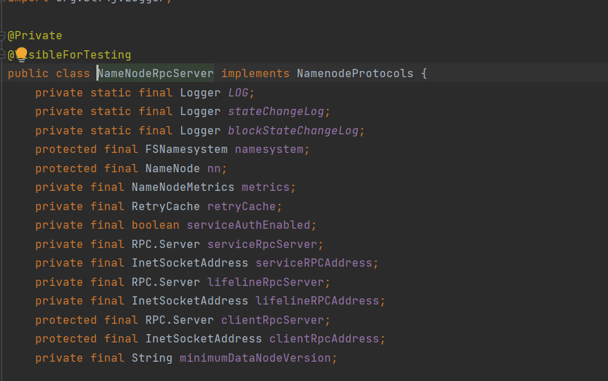{width="5.75in"
height="3.59375in"}

其实从这里其实就可以看到为什么active
NameNode切换后会失败了，我们先看一下InetSocketAddress的构造器：

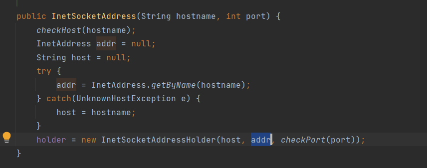{width="5.75in"
height="2.2604166666666665in"}

InetSocketAddress里存的是构造时NameNode的ip，所以我们迁移之后ip变化，会导致和NameNode的连接失败，所以checkpoint会在切换active
NameNode后失败。

**重启失败**

下午观察ResourceManager和flink 的日志，发现RM分给了Application
Master的container，但是状态一直是Accept，没有转化为Start或者Running，flink那边则报Yarn没有申请到容器，可能没有可用的资源，但是此时资源是充足的。

先回顾一下yarn任务的提交流程：

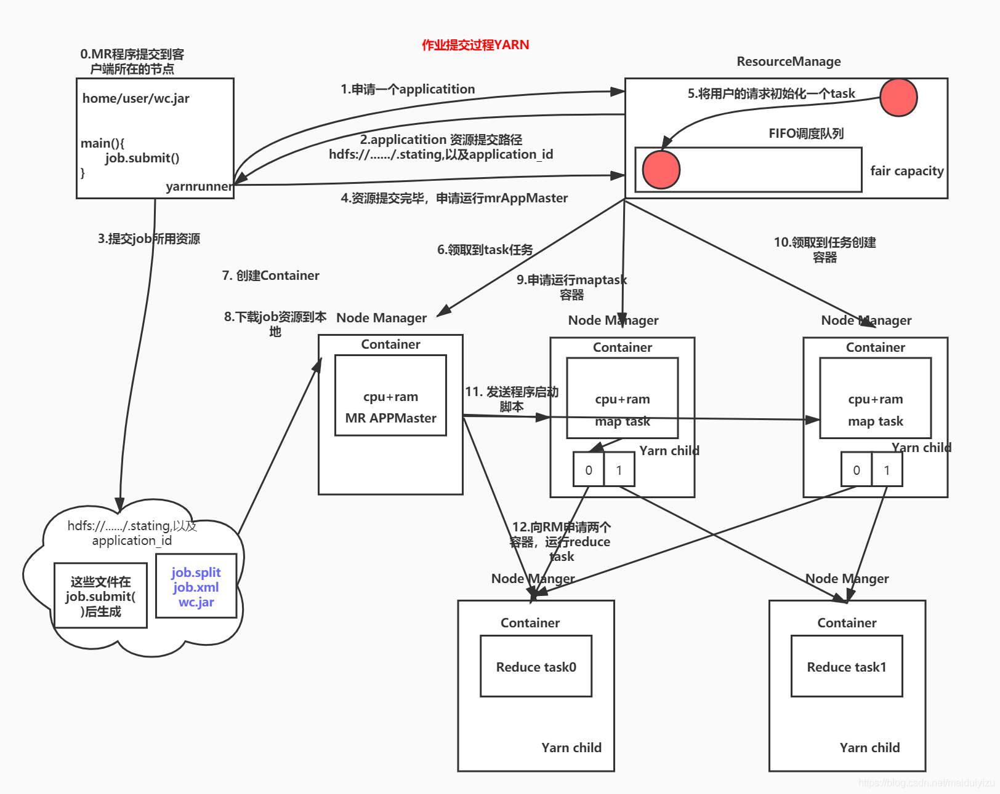

主要关注的是图里步骤3-9，flink这里执行到了步骤四，迟迟等不来容器分配并执行的响应，所以会报Yarn响应的错误：

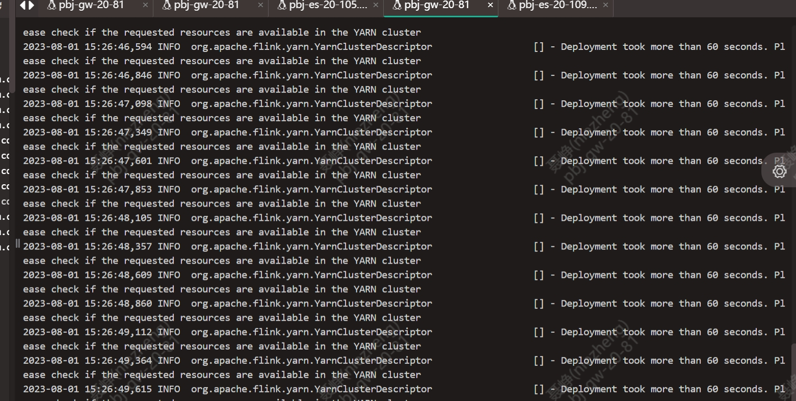

然后Yarn这边则是执行到了步骤8，对应的Container（即Application
Master）下载不到job的配置资源，于是启动不起来Application
Master，状态也就一直处于Accept，无法转为Start和Running。

NodeManager下载不了job的资源其实是和上一个原因相同。

因此重启NodeManager集群即可恢复正常。

## 主要应用故障

### DSP应用侧故障说明

**故障现象**

14.42
告警群内发出数据延迟、flink任务lag数持续上升警报，观察到flink任务运行未停止；

   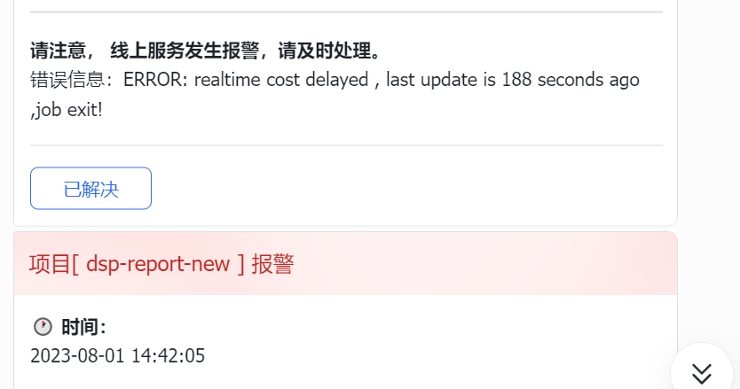
   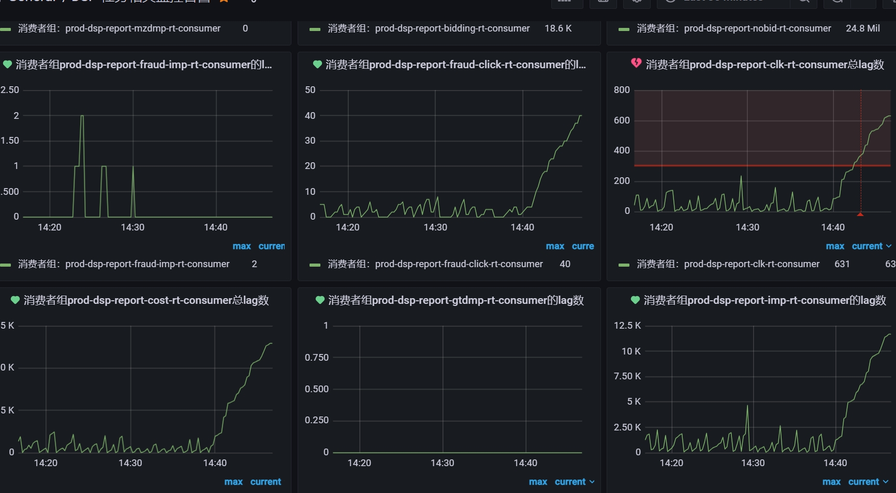

观察mysql表ads_dsp_cost_rt，发现数据更新时间延迟超过阈值，
查看监控flink消耗任务异常；

14.46
排查发现似乎与namenode切换有关，联系得知正在进行新节点nn主从切换，便等待切换完成；

14.50
lag持续上升，故以为是识别nn主节点失败，故重启flink的消耗任务，但执行失败；

14.53 提交flink任务皆失败，进行反馈并尝试其它任务，发现flink15提交报错；

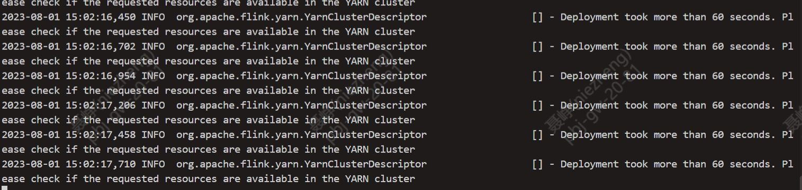

15.05-16:30 解决故障

a.由于报错信息是连接yarn集群超时，以为是flink提交yarn异常进行了一系列操作

b.发现flink12提交任务阻塞

16:40 排查可能是新的主nn异常导致，恢复之前51节点的nn为主；

16:50 flink任务重启消耗恢复正常；

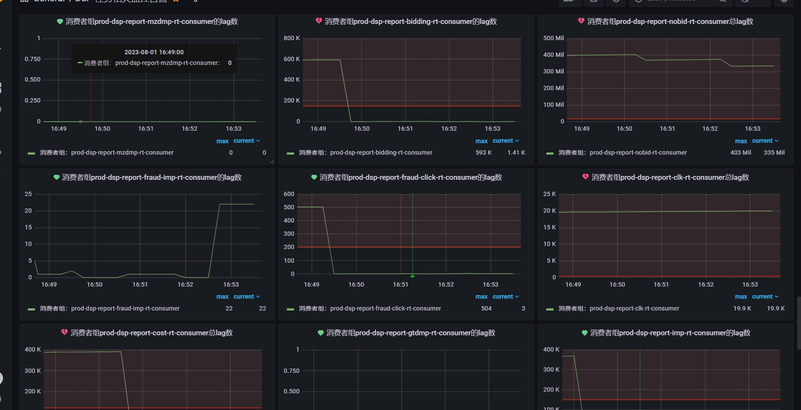

16:51 flink任务异常导致小时任务无数据，恢复后开始重跑小时任务；

17:30 再次切换nn主从导致任务再次执行阻塞，恢复数据中止；

17:34 重启提交任务成功；

17:35-后续 恢复其它任务；

a.遇到权限问题，单纯用root或者optz无法重启

b.启动成功后并未处于阻塞状态flink并未进行消费计算

c.此时数据不完整，小时任务执行不完整

d.此前未出现用户权限限制，但这次由于用户权限不对，导致恢复时间花费较长

e.定位问题来源花费时间较长导致恢复缓慢

18:04
report报表小时数据恢复完毕，几分钟过后报警群开始告警，告警信息为消耗数据长时间未更新

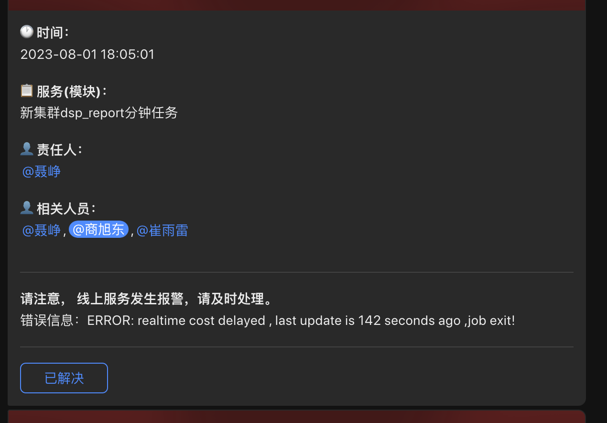

18:04 观察Flink任务启动异常

19:30 Flink任务全启动完毕，堆积数据消费完毕，开始恢复report报表小时数据

20:30 小时任务恢复完成

### SSP应用侧故障说明

**故障现象**

14:39 SSP所有Flink任务未报异常，但lag数据持续增长，触发告警。

16:18 parllay业务反馈显示用户无网页追踪行为日志。

**故障恢复**

以 SSP 处理竞价日志为例：

14:39 开始lag数持续增长 如图

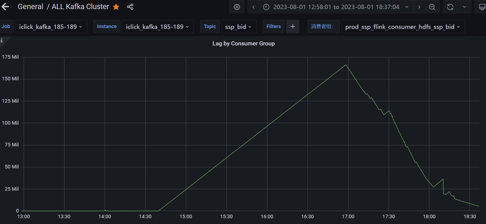

此时flink任务显示正常运行，但lag数持续升高，此时正在进行第二台namenode迁移，选择手动停掉任务后，进行任务重启，发现flink任务无法提交至yarn集群，提交任务卡死，导致任务无法重启。

16:50左右

重新切换回旧nameNode,flink任务正常启动，lag数持续降低，开始消费

17:46左右

重新开始迁移第二台nameNode, 需要重启所有flink任务

发现异常，部分flink任务无法启动，提示hdfs目录无写入权限，如图

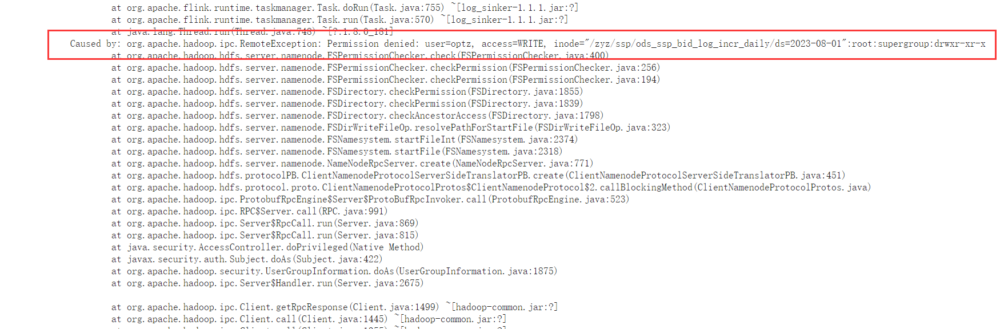

尝试修改hdfs目录权限未果，无法修改成功

重新同步权限后，异常解决

20:00点左右

所有任务正常启动

## 迁移问题汇总及规避方案

**运维采用规范方法统一管理应用部署**

任务启动用户不规范，未使用统一用户导致执行权限异常，任务启动失败。

规划化整理各应用部署方案，提升部署效率。

规避方案：

统一使用 optz 用户启动任务，用 root 用户启动后续进行切换，完善部署脚本；

**问题排查方向问题**

未及时定位到问题来源，处理未及时回滚

**平台侧信息得知不准确，影响范围以及现象不正确，误导排查方向**

规避方案：

影响范围要准确，确定是部分任务还是全部任务，任务类型

告知现象时最好使用原始日志和脚本，不要简化或者二次编辑，命令出现明显错误会严重误导排查方向

**对运行中的实时/离线任务未充分测试**

平台迁移测试不充分，测试集群没有任务运行，只测试了迁移对平台服务的影响，没有测试对正在运行任务的影响。

规避方案：

测试集群使用不够，没有可运行任务，增加使用或者测试前编写专用于迁移测试的demo

**需要冗余 gateway 机器**

配置不完全齐全，仅有81机器有完整任务配置

规避方案：将剩余的gateway利用起来，增加相应的配置作为备用；

**加强沟通效率**

规避方案：

开始迁移时，相关人员可以在会议室面对面沟通，及时同步有关信息，避免扩大异常

## 下一步

~~统一管理应用部署：修改任务统一启动用户为optz \@聂峥~~

~~增加 gateway
配置（2台机器[10.11.20.91](http://10.11.20.91)、[10.11.20.197](http://10.11.20.197)）
\@聂峥~~

~~ResourceManager 和 ZooKeeper 迁移前进行充分测试 \@宋品如@聂峥~~

~~再次迁移时确保任务可以快速重启，中断时间\<2min \@聂峥~~

~~离线/实时测试程序提供，覆盖每一种任务部署类型，贴近真实使用场景@商旭东@汤英杰@聂峥~~
