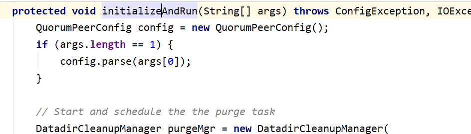
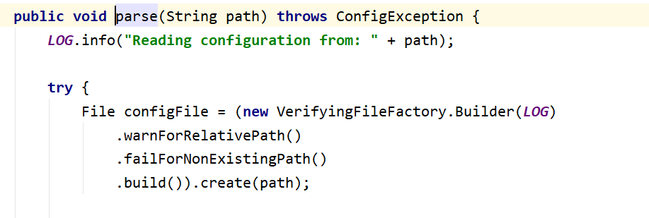
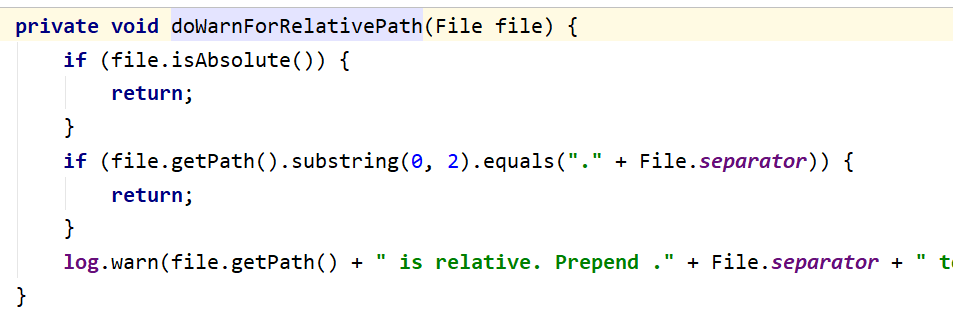

# Clickhouse配置zookeeper遇到的坑

背景说明:公司最近要使用clickhouse做实时项目,准备搭一套clickhouse集群

需要用到zookeeper,根据clickhouse的官网要求,选择了最新的3.6.2 版本的zookeeper


java版本:

```sh
java version "1.8.0_181"
Java(TM) SE Runtime Environment (build 1.8.0_181-b13)
Java HotSpot(TM) 64-Bit Server VM (build 25.181-b13, mixed mode)
```

根据官网的要求配置好zoo.cfg和java parameter

[Clickhouse官网配置地址](https://clickhouse.tech/docs/en/operations/tips/#zookeeper)

zoo.cfg

```properties
tickTime=2000
initLimit=300
syncLimit=10
clientPort=2181
maxClientCnxns=2000
dataDir=/opt/module/zookeeper/clickhouse/data
dataLogDir=/opt/module/zookeeper/clickhouse/logs
autopurge.snapRetainCount=10
autopurge.purgeInterval=1
preAllocSize=131072
snapCount=3000000
leaderServes=yes
standaloneEnabled=false
dynamicConfigFile=/etc/zookeeper-clickhouse/conf/zoo.cfg.dynamic
```


zookeeper-env.sh:
```sh
NAME=zookeeper-clickhouse
ZOOCFGDIR=/etc/$NAME/conf

# TODO this is really ugly
# How to find out, which jars are needed?
# seems, that log4j requires the log4j.properties file to be in the classpath

#CLASSPATH="$ZOOCFGDIR:/usr/build/classes:/usr/build/lib/*.jar:/usr/share/zookeeper/zookeeper-3.5.1-metrika.jar:/usr/share/zookeeper/slf4j-log4j12-1.7.5.jar:/usr/share/zookeeper/slf4j-api-1.7.5.jar:/usr/share/zookeeper/servlet-api-2.5-20081211.jar:/usr/share/zookeeper/netty-3.7.0.Final.jar:/usr/share/zookeeper/log4j-1.2.16.jar:/usr/share/zookeeper/jline-2.11.jar:/usr/share/zookeeper/jetty-util-6.1.26.jar:/usr/share/zookeeper/jetty-6.1.26.jar:/usr/share/zookeeper/javacc.jar:/usr/share/zookeeper/jackson-mapper-asl-1.9.11.jar:/usr/share/zookeeper/jackson-core-asl-1.9.11.jar:/usr/share/zookeeper/commons-cli-1.2.jar:/usr/src/java/lib/*.jar:/usr/etc/zookeeper"

ZOOCFG="$ZOOCFGDIR/zoo.cfg"
ZOO_LOG_DIR=/var/log/$NAME
USER=zookeeper
GROUP=zookeeper
PIDDIR=/var/run/$NAME
PIDFILE=$PIDDIR/$NAME.pid
#SCRIPTNAME=/etc/init.d/$NAME
JAVA=/usr/share/java
ZOOMAIN="org.apache.zookeeper.server.quorum.QuorumPeerMain"
ZOO_LOG4J_PROP="INFO,ROLLINGFILE"
JMXLOCALONLY=false
JAVA_OPTS="-Xms{{ cluster.get('xms','128M') }} \
    -Xmx{{ cluster.get('xmx','6G') }} \
    -Xloggc:/var/log/$NAME/zookeeper-gc.log \
    -XX:+UseGCLogFileRotation \
    -XX:NumberOfGCLogFiles=16 \
    -XX:GCLogFileSize=16M \
    -verbose:gc \
    -XX:+PrintGCTimeStamps \
    -XX:+PrintGCDateStamps \
    -XX:+PrintGCDetails
    -XX:+PrintTenuringDistribution \
    -XX:+PrintGCApplicationStoppedTime \
    -XX:+PrintGCApplicationConcurrentTime \
    -XX:+PrintSafepointStatistics \
    -XX:+UseParNewGC \
    -XX:+UseConcMarkSweepGC \
-XX:+CMSParallelRemarkEnabled"
```

然后在`zoo.cfg.dynamic`里配置好我们的集群节点 

==PS:如果开启dynamicConfigFile,集群节点必须配置在对应的文件里,否则起不起来,否则会报这个错误:==

```sh
2021-01-27 21:42:01,483 [myid:] - INFO  [main:QuorumPeerConfig@174] - Reading configuration from: /opt/module/zookeeper/bin/../conf/zoo.cfg
2021-01-27 21:42:01,491 [myid:] - ERROR [main:QuorumPeerMain@98] - Invalid config, exiting abnormally
org.apache.zookeeper.server.quorum.QuorumPeerConfig$ConfigException: parameter: server.3 must be in a separate dynamic config file
	at org.apache.zookeeper.server.quorum.QuorumPeerConfig.parseProperties(QuorumPeerConfig.java:374)
	at org.apache.zookeeper.server.quorum.QuorumPeerConfig.parse(QuorumPeerConfig.java:194)
	at org.apache.zookeeper.server.quorum.QuorumPeerMain.initializeAndRun(QuorumPeerMain.java:124)
	at org.apache.zookeeper.server.quorum.QuorumPeerMain.main(QuorumPeerMain.java:90)
2021-01-27 21:42:01,494 [myid:] - INFO  [main:ZKAuditProvider@42] - ZooKeeper audit is disabled.
2021-01-27 21:42:01,496 [myid:] - ERROR [main:ServiceUtils@42] - Exiting JVM with code 2
```


启动

```sh
./bin/zkServer.sh start
/etc/zookeeper-clickhouse/conf/zoo.cfg
ZooKeeper JMX enabled by default
Using config: 
grep: : No such file or directory
grep: : No such file or directory
mkdir: cannot create directory ‘’: No such file or directory
Starting zookeeper ... FAILED TO START
```

启动失败!!!! 什么鬼?

查看日志

```sh
2021-01-27 21:31:33,626 [myid:] - INFO  [main:QuorumPeerConfig@174] - Reading configuration from: 
2021-01-27 21:31:33,631 [myid:] - ERROR [main:QuorumPeerMain@113] - Unexpected exception, exiting abnormally
java.lang.StringIndexOutOfBoundsException: String index out of range: 2
	at java.lang.String.substring(String.java:1963)
	at org.apache.zookeeper.server.util.VerifyingFileFactory.doWarnForRelativePath(VerifyingFileFactory.java:62)
	at org.apache.zookeeper.server.util.VerifyingFileFactory.validate(VerifyingFileFactory.java:44)
	at org.apache.zookeeper.server.util.VerifyingFileFactory.create(VerifyingFileFactory.java:39)
	at org.apache.zookeeper.server.quorum.QuorumPeerConfig.parse(QuorumPeerConfig.java:180)
	at org.apache.zookeeper.server.quorum.QuorumPeerMain.initializeAndRun(QuorumPeerMain.java:124)
	at org.apache.zookeeper.server.quorum.QuorumPeerMain.main(QuorumPeerMain.java:90)
2021-01-27 21:31:33,633 [myid:] - INFO  [main:ZKAuditProvider@42] - ZooKeeper audit is disabled.
2021-01-27 21:31:33,635 [myid:] - ERROR [main:ServiceUtils@42] - Exiting JVM with code 1
```

从日志上没看到具体的报错原因,从堆栈信息猜测是配置的参数解析失败了

研究了参数,和clickhouse官网一致,还是找不到问题

没办法,看源码吧




从main函数追踪下去



最后看到这个地方



报错就是这里,传入的配置文件不对,getPath()是个空串

为什么会出这个问题?

然后我重新解压了一份zookeeper,没有使用clickhouse推荐配置,直接启动,完美运行

问题出在clickhouse的配置上了

然后追踪zkEnv.sh脚本的代码

```sh
if [ "x$ZOOCFGDIR" = "x" ]
then
  if [ -e "${ZOOKEEPER_PREFIX}/conf" ]; then
    ZOOCFGDIR="$ZOOBINDIR/../conf"
  else
    ZOOCFGDIR="$ZOOBINDIR/../etc/zookeeper"
  fi
fi

if [ -f "${ZOOCFGDIR}/zookeeper-env.sh" ]; then
  . "${ZOOCFGDIR}/zookeeper-env.sh"
fi

if [ "x$ZOOCFG" = "x" ]
then
    ZOOCFG="zoo.cfg"
fi

ZOOCFG="$ZOOCFGDIR/$ZOOCFG"
```


然后再看一眼clickhouse的配置

```sh
ZOOCFG="$ZOOCFGDIR/zoo.cfg"
```

问题找到了

zookeeper脚本里`ZOOCFG`拼接了一下,导致最终传入的路径是错误的

这里改为

```sh
ZOOCFG=zoo.cfg
```

就ok了

改完启动,问题解决!

然后研究了一下这个启动脚本

```sh
if [ -f "${ZOOCFGDIR}/zookeeper-env.sh" ]; then
  . "${ZOOCFGDIR}/zookeeper-env.sh"
fi

if [ "x$ZOOCFG" = "x" ]
then
    ZOOCFG="zoo.cfg"
fi

ZOOCFG="$ZOOCFGDIR/$ZOOCFG"

if [ -f "$ZOOCFGDIR/java.env" ]
then
    . "$ZOOCFGDIR/java.env"
fi
```

运行完`zookeeper-env.sh`后会加载`java.env`

所以其实官网的参数也可以运行的,只要写在`java.env`里就行

问题虽然很小,但是也耽误了点时间

所以写了这个博客记录一下,帮大家节省点时间