# Flink 介绍

## flink是什么?

Apache Flink是一个框架和分布式处理引擎，用于对==无界和有界数据流==进行有状态计算。Flink设计为在所有常见的集群环境中运行，以内存速度和任何规模执行计算。

主要优势：

* 低延迟，高吞吐，高性能
  * 事件触发
  * 网络层使用netty
  * actor并发模型（akka）
* 数据一致性
  * 状态
  * 事件时间，水位线
  * checkpiont
  * 精确一次语义
* 可靠性
  * 动态流控：反压机制
  * 内存管理
  * 故障恢复
  * 高可用
    
    

flink吞吐量普遍在Storm的3-5倍

# FLink架构

Flink采用了分布式中常见的Master-Worker架构,主要由一个Jobmanager和多个TaskManager构成

JobManager：

* 接收application
* 管理taskmanager和slot
* 协调job执行（checkpoint，任务恢复等）

Taskmanager：

* 执行task

# 核心特性及其原理

## 状态

flink中有状态函数和运算符在各个元素(element)/事件(event)的处理过程中存储的数据

（注意：状态数据可以修改和查询，可以自己维护，根据自己的业务场景，保存历史数据或者中间结果到状态(state)中）

一个小的实例，计算流的sum值

这个实例中，source和sum算子后面存储的中间值就是状态

## 事件时间和水位线

### 引入

回想一下spark-streaming，

如果我们有这么一个简单的需求，统计每小时内的访问数，我们按照小时开个窗口

理想情况下每个数据进入对应的窗口，第一个小时访问数是5，第二个小时访问数是3，第三个小时访问数是4

假如因为某种原因，数据延迟到达了，数据进入窗口的实际情况是下面这样

第一个小时访问数是3，第二个窗口访问数是5，第三个窗口访问数是3

这个和实际情况不符，导致数据计算结果不正确

我们用的是物理世界的时间开窗，但是没有办法保证数据按时按序到达

事件时间+水位线就是为了解决乱序时间这一问题

### 事件时间

事件时间其实就是时间流动不是物理的,而是基于事件的,即每个消息事件附带的时间戳,可能是某个字段,或者某个字段的计算值

简而言之,每个消息要自己附带时间戳

### 水位线（Watermark）

自己附带的时间戳肯定是没法保证时间递增的，那么如何触发窗口闭合?

假定有个时间线,绝对是单调递增的，当这个时间线大于窗口闭合时间，就闭合窗口

这个时间线就是水位线

水位线基本属性：

* 必须单调递增，以确保任务的事件时间时钟在向前推进，而不是在后退。
* 它们与数据的时间戳相关。带有时间戳T的水位线表示，所有后续数据的时间戳都应该大于T。
  
  

当前消息时间戳最大值-最大延迟~=水位线

**水位线的触发**

水位线是检测触发的，以一定的频率检测(默认200ms)是否触发水位线

这张图比较巧合，在水位线触发的时候正好水位线前的数据都到了，假如水位线在11的时候触发呢？

数据8就延迟了，当然我们可以增大水位线来解决这个问题，但不是每次能增加水位线来解决

比如: 

如果业务要求实时性在1min,但是数据迟到的最大值可能是5min,我们到底要设置多少的水位线呢?

为了少量的数据牺牲实时性,还是为了实时性牺牲准确性?

**迟到数据的处理**

allowedLateness的实现原理：

正常的窗口闭合逻辑：

* 水位线更新
* 窗口闭合
* 触发计算
* 清理状态

如果不立马清理状态，让状态存活一段时间，当延迟数据在状态存活时到达，再次触发计算，就可以向下游再次发送一条数据

只要下游能支持更新，就可以解决刚才实时性和准确性二选一的问题

当然，如果状态彻底消失，就没有办法了，只能使用flink提供的侧输出来输出迟到数据

## checkpoint

checkpoint,目标是为了能够在任务失败或者停止后能够恢复任务

[Chandy-Lamport algorithm](http://research.microsoft.com/en-us/um/people/lamport/pubs/chandy.pdf)

分布式异步屏障快照算法

还是刚才那个例子，如果3处理完成，在处理4的时候任务失败

任务应该怎么恢复？

应该把每个算子的状态置为仅3流过后的值

这就是这个算法的一个基本原理

实际执行时，jobManager会发起checkpoint，然后source算子插入屏障，屏障记录流经的每个算子的状态值
Source Task自身做快照，并保存到状态后端；

Source Task将barrier跟数据流一块往下游发送；

当下游的Operator实例接收到CheckPoint barrier后，对自身做快照

task做完快照后会告诉Jobmanager，他把快照保存到了哪里，

如果jobManager在规定时间内收到所有的回执

checkpoint成功，否则删除已收到回执的快照

## 精确一次语义

### checkpoint的精确一次

我们现在看下在拥有checkpoint之后，数据流是什么样子：

数据流被checkpoint分割成多个不重叠的小批，

如果在任意时刻任务失败，我们只需要从最近的checkpoint恢复就可以

上面讲checkpoint时，为了便于理解，对算法做了很多简化

实际上数据处理流程很复杂，比如算子的上游有多个并行度时，情况就变成下图的样子：

这里从图中可以看到，当上游的第一个屏障先到达时，这个数据流的数据没有继续消费，而是阻塞等待其他数据流的屏障到达

这就是屏障对齐,这个机制牺牲了一点实时性,保证了数据在flink中以checkpoint分割后,一批数据全部成功消费或者失败后全部重放

这个就是checkpoint的Exactly Once语义

**扩展**

如果没有对齐,看上图第一个,有屏障来就立马发出,会出现什么情况?

下面abc数据还没有处理,checkpoint就已经完成了,这里会导致数据丢失,这在flink里是不可忍受的

但是flink也提供了不对齐屏障的选项,来满足高实时需求的场景,这个怎么解决数据丢失的?

* 对输入缓冲区中的第一个屏障做出反应
* 立刻把屏障插入输出缓冲区的末端,让他立刻发送给下游
* 对所有被越过的数据标记为异步存储,并创建这个算子的快照
* 处理异步标记的数据时,更新算子的快照
* 如果标记的数据都处理完成,这个快照就标记为对齐快照
  
  

未对齐检查点的恢复

flink任务恢复时,只能从已对齐的检查点恢复,这样一来,未对齐的检查点中处理完成的数据(可能已经写入下游),会再次被消费处理

因此,不对齐屏障模式,在flink里面就是checkpoint的at least once(至少一次)

### 端到端事务

checkpoint+屏障对齐解决了flink内部处理数据的一致性问题,

这保证了flink在处理处理一批数据(以checkpoint划分)时,可以保证全部成功或者失败后全部重放

要想实现整个pipeline中的数据精确一次,只需要下游能够实现事务,并且上游能够重新消费就可以了

flink是分布式计算引擎,想要实现分布式事务,还是不太容易的

这里flink采用的算法是经典的==二阶段提交算法==

* precommit
* commit/abort

简单的说就是每个实例都执行事务，把数据先发送给下游,但是不要提交

如果所有实例都返回ok,就提交,有一个返回失败或者超时,就abort(或者回滚)

checkpoint机制提供了一个简单实现二阶段提交的办法

首先,checkpoint自己就是一个二阶段提交协议的实现,这个是由flink(JobManager)自己来实现的，

回想一下checkpoint的实现原理，只有当所有task都给jobmanager快照成功回执，checkpoint才会成功

如果checkpoint成功,就表示预提交都成功,即下游事务都成功，可以commit

如果checkpoint失败,就表示预提交失败或者超时,即下游事务有失败或者超时，需要abort

checkpoint的屏障对齐 + 端到端的二阶段提交 

这个组合就完整的解决了数据一致性问题

## 反压机制

flink的设计目标是7*24h不间断运行的,可靠性也是一个必须要解决的问题

回忆一下spark-streaming 背压,sparkstreaming任务失败很大的一个原因就是oom

单个批次数据量过大就是oom导致任务失败

当然spark也提供了限制消费速率,反压等机制来解决这个问题

flink的解决方案:

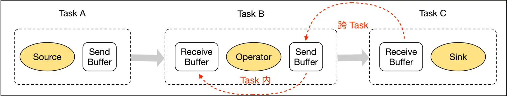

了解了数据传输流程，我们再具体了解一下跨 TaskManager 的反压过程，如下图所示，Producer 端生产数据速率为 2，Consumer 消费数据速率为 1。Flink 反压是怎么做的？

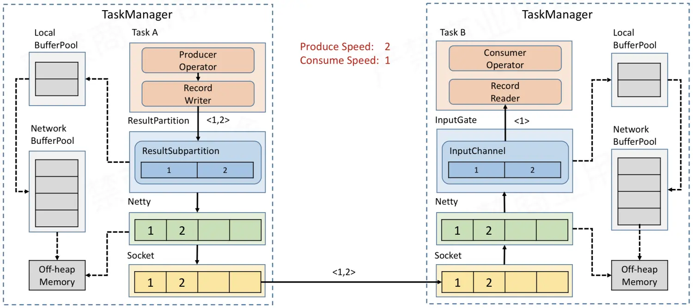

这里，NetWork BufferPool 是 TaskManager 内所有 Task 共享的 BufferPool，TaskManager 初始化时就会向堆外内存申请 NetWork BufferPool。LocalBufferPool 是每个 Task 自己的 BufferPool，假如一个 TaskManager 内运行着 5 个 Task，那么就会有 5 个 LocalBufferPool，但 TaskManager 内永远只有一个 NetWork BufferPool。Netty 的 Buffer 也是初始化时直接向堆外内存申请内存空间。虽然可以申请，但是必须明白内存申请肯定是有限制的，不可能无限制的申请，我们在启动任务时可以指定该任务最多可能申请多大的内存空间用于 NetWork Buffer。

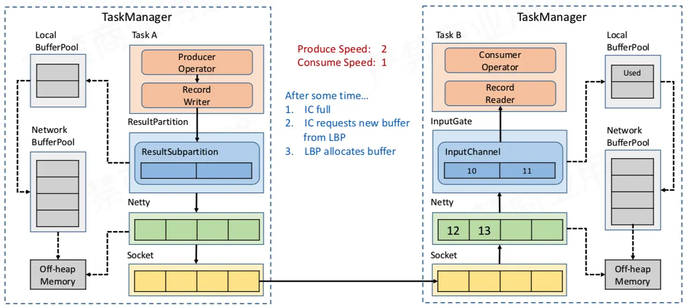

* sink写入慢
* 导致消费InputChannel变慢
* InputChannel满了
* InputChannel向LocalBufferPool申请内存
  
  

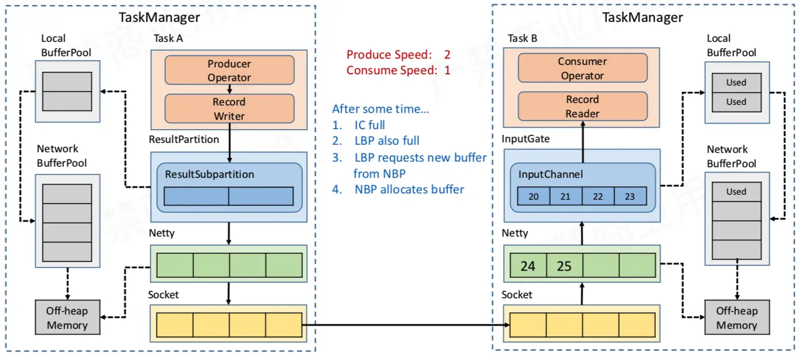

* LocalBufferPool也满了
* LocalBufferPool再向NetworkBufferPool申请
  
  

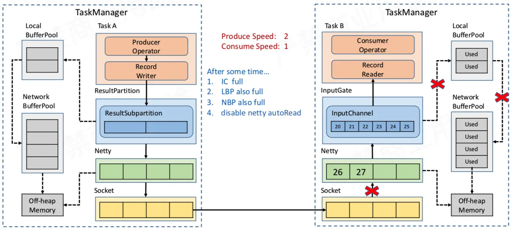

* NetworkBufferPool满了
* 不能申请了,NetBufferPool再初始化的时候就申请好了,不能扩展
* InputGate不能申请新的内存
* 不从netty消费了,netty缓存也满了
* netty不从socket消费了
* socket缓存满了

可以看到上图中多个 ❌，表示 Buffer 已满，数据已经不能往下游写了，发生了阻塞。

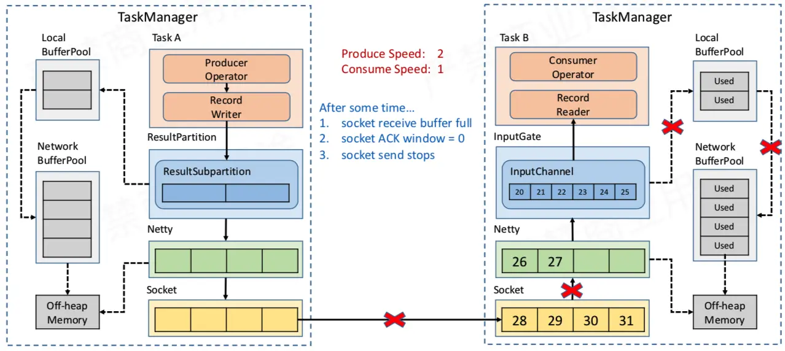

* TCP 的 Socket 通信有动态反馈的流控机制
* 上游没有缓存来接收消息,上游不会往下游发送
  
  

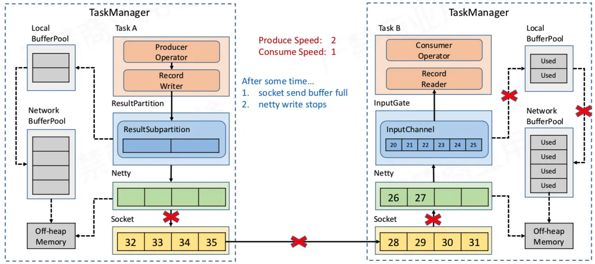

* 上游的socket缓存满了
* netty不能往socket写了,数据存到netty的缓存
  
  

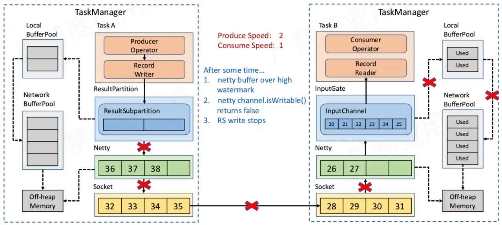

* netty的缓存满了
* ResultSubpartition不能往netty写数据了
  
  

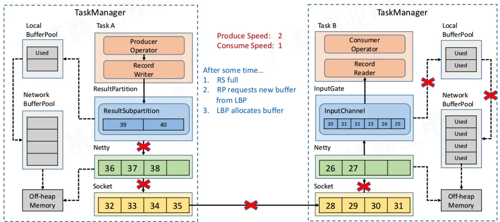

* ResultSubpartition的内存用完了
* 向LocalBufferPool申请
  
  

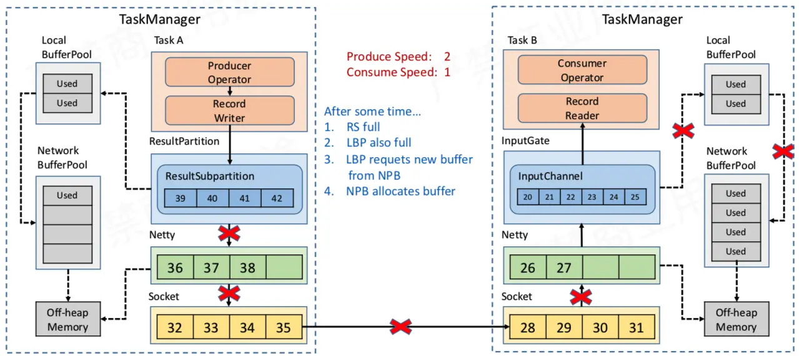

* LocalBufferPool内存也用完了
* LocalBufferPool向NetWorkBufferPool申请
  
  

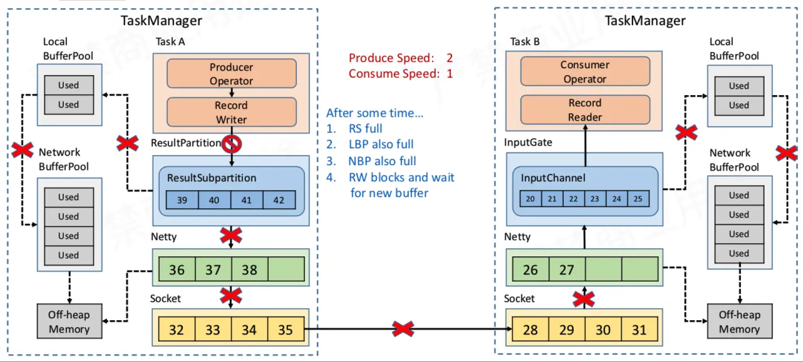

* NetworkBufferPool内存用完
* NetworkBufferPool不在申请
* 这个时候应该让算子就不能往下游再写数据,不然就出问题了

task内的反压机制

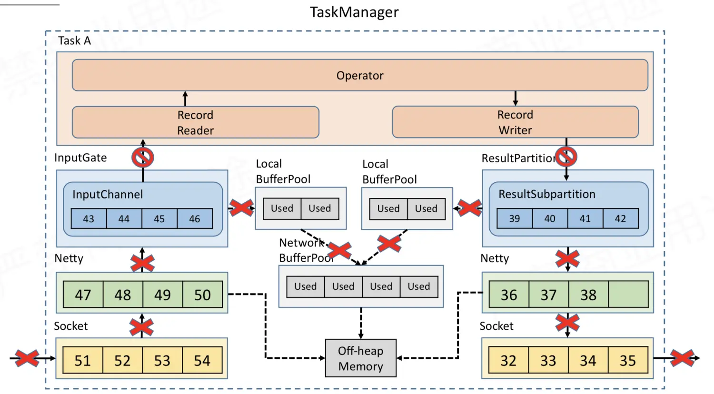

整个TaskManager只有一个NetworkBufferPool,

由于NetworkBufferPool没有可用内存,

算子就申请不到新的内存用来写入,

自然算子的输入侧也开时反压,流程同之前讲的一样

结论:

flink通过反压机制实现了动态流控,数据摄入速度完全取决于最慢的算子的处理速度

而且不会因为数据量导致OOM

## 内存管理

> 在 JVM 中处理大量数据最直接的方式就是将这些数据做为对象存储在堆内存中，然后直接在内存中操作这些数据，如果想进行排序则就是对对象列表进行排序。然而这种方法有一些明显的缺点，首先，在频繁的创建和销毁大量对象的时候，监视和控制堆内存的使用并不是一件很简单的事情。如果对象分配过多的话，那么会导致内存过度使用，从而触发 OutOfMemoryError，导致 JVM 进程直接被杀死。另一个方面就是因为这些对象大都是生存在新生代，当 JVM 进行垃圾回收时，垃圾收集的开销很容易达到 50% 甚至更多。最后就是 Java 对象具有一定的空间开销（具体取决于 JVM 和平台）。
> 
> 在此背景下，Flink 一直有自己的内存数据处理方法。Flink 将对象序列化为固定数量的预先分配的内存段，而不是直接把对象放在堆内存上。它的 DBMS 风格的排序和连接算法尽可能多地对这个二进制数据进行操作，以此将序列化和反序列化开销降到最低。如果需要处理的数据多于可以保存在内存中的数据，==Flink 的operator会将部分数据溢出到磁盘==。

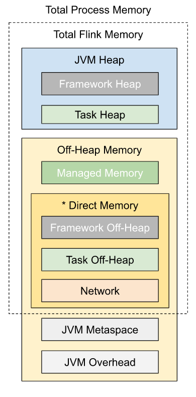

flink的内存模型结论：

network用到的内存是初始化时分配的,并且不会增长

Managed Memory内存也是初始化分配的,超过了不会申请,只会写入磁盘

框架用到的基础内存很小,预留128M(除极端情况,是完全足够的)

只剩下task heap和task off-heap不受管控

如果出现OOM，基本只有以下情况

1. 堆外内存不足
   1. 用户代码使用了堆外内存，但是没配置对应参数，导致内存申请超出限制
   2. 用户代码使用了堆外内存，并且使用的堆外内存超过了配置的值
2. 堆内内存OOM
   1. 给的内存不够
   2. 代码有问题

> spark也在主动管理内存，
> 
> 但是spark的网络io这块，内存不是固定的，需要和计算、缓存用到的内存争夺
> 
> 因此很多堆外内存不足报错都是netty申请不到内存
> 
> 但是实际上有可能是用户代码申请了堆外内存，或者计算和缓存用的内存太多（笛卡尔积，数据倾斜）
> 
> 影响问题的定位

## 故障恢复

虽然flink已经从内存方面尽力保证程序稳定，但是还是没办法避免任务由于意外情况失败

因此，flink提供了自动重启机制，来尽量帮助用户减少手动重启任务这种操作

Flink 通过重启策略和故障恢复策略来控制 Task 重启：

重启策略决定是否可以重启以及重启的间隔；

故障恢复策略决定哪些 Task 需要重启。

### 重启策略：

* 无重启策略
  * task失败，任务失败
  * 一般测试使用
* 固定延迟重启策略
  * 两次重启之间有固定的重启间隔
  * 连续重启一定次数后任务失败
  * 重启成功次数清零
  * 适用于可能会意外退出的情况（比如连接断开，网络波动）
* 故障率重启策略
  * 两次重启之间有固定的重启间隔
  * 没有重启次数限制，当一段时间内重启次数超过固定值，任务失败
  * 适用于能够重启成功，但运行时间不长的情况（通常是代码有bug）
    
    

### 故障恢复策略：

* 全局
  * 全部task重启
  * 相当于job重启，更彻底
* region
  * 只重启受影响的task

## 高可用

综上，任务可靠性已经很高了，

但现在还有一个影响任务运行的因素，

Jobmanager是单点的，如果JobManager失败，任务整体就会失败

所以需要JobManager的高可用

具体实现有zookeeper和Kubernetes两种（略）

但是我们没有使用zookeeper或者Kubernetes，

因为yarn有任务重试机制，

只要开启yarn任务重试，就可以实现Jobmanager的高可用，

这钟方式相比于zookeeper或者Kubernetes，

同一时刻只需要运行一个Jobmanager即可，资源利用率更高

Yarn的重试机制经过了长时间的检验，是非常可靠的

# flink在ifans中的应用

* 实时收录功能设计
  * 离线计算方式的收录功能收录时间长
  * 用户提出需求->第二天爬虫爬取->第三天凌晨离线计算->第三天用户可以查看
  * 总收录时长超过48h
  * 用户提出需求->爬虫立即爬取->flink计算->用户查看
  * 实时收录现在全流程只需要5-10分钟
* 笔记监控功能设计
  * 利用flink对爬虫数据做计算,聚合,join后写入olap
  * 向用户展示所监控笔记的最新数据以及时间段内历史情况
* 舆情监控功能设计
* 直播监控功能设计
* 账号监控功能设计
  
  

与离线处理模块相比,离线模块满足的通常是以天为粒度,时效性为T+1的需求

flink优势是数据粒度更细,可以提供分钟甚至秒级的数据粒度,同时实时性更高,基本可以保证全流程分钟级的实效性

未来展望

可以利用flink-sql做实时数仓,实现流批一体,简化整个项目的结构
