# hadoop 集群关键角色迁移方案

## Hadoop 迁移

### Hadoop 迁移变更列表

-   NameNode IP变更
-   10.11.20.51-\>10.11.20.213
-   10.11.20.52-\>10.11.20.214
-   ResourceManager域名+ip变更
-   bjuc49.optaim.com(10.11.20.49)-\>bjuc51.optaim.com(10.11.20.213)
-   bjuc50.optaim.com(10.11.20.50)-\>bjuc52.optaim.com(10.11.20.214)
-   Zookeeper域名+ip变更
-   bjuc53.optaim.com(10.11.20.53)-\>bjuc51.optaim.com(10.11.20.213)
-   bjuc54.optaim.com(10.11.20.54)-\>bjuc52.optaim.com(10.11.20.214)
-   bjuc55.optaim.com(10.11.20.55)-\>hadoopm3.optaim.com(10.11.20.215)
-   Hive域名+ip变更
-   bjuc49.optaim.com(10.11.20.49)-\>hadoopu1.optaim.com(10.11.20.216)
-   bjuc50.optaim.com(10.11.20.50)-\>hadoopm3.optaim.com(10.11.20.215)
-   flink,spark依赖配置变更
-   hdfs、yarn，hive等配置项变更
-   hdfs-site.xml
-   yarn-site.xml
-   hive-site.xml
-   flink-default.yaml
-   spark-default.xml
-   其他受影响的服务
-   Druid
-   ES
-   CLickhouse
-   受影响的任务
-   实时任务
-   Flink
-   Spark streaming
-   离线任务
-   Spark
-   Hive
-   其他依赖hdfs、yarn、hive的任务

### Hadoop 迁移时间规划

-   07/27 前梳理 NameNode 切换对应用的影响（部分应用）
-   梳理完毕 NameNode 切换对各应用、框架的影响和具体切换事项
-   08/01 进行 NameNode 节点切换（部分应用）
-   在此之前硬编码使用旧 NameNode 的应用需修改完毕
-   08/03 前梳理 RM、Zookeeper 切换对应用的影响（全部应用）
-   切换对各应用的影响、框架的影响和具体切换事项
-   08/08 进行 ResourceManger切换（全部应用）
-   中间需当天两次重启应用，使应用全部切换新RM
-   08/09 进行 zookeeper 的扩缩容
-   重启应用，启用新ZK（部分应用）

### Hadoop 迁移关联的项目列表


### 机器服役年龄统计

[IDC
Server](https://mh4k64q7w1.feishu.cn/sheets/shtcnA7xacn8VvH6Be2M481rcxg)

> 统计了所有hadoop集群使用的机器，平均服役年龄约7年2个月，其中Namenode和ResourceManager都是服役7年的机器，且这几台机器还是单网卡，容灾能力比较差。

### 近段时间硬件故障统计

-   2022-12-02 149节点硬件故障，拉回维修
-   2022-12-08 183节点硬件故障，拉回维修
-   2022-12-30 143节点系统损坏，重装系统后加入集群
-   不排除硬件问题，暂时无法找到原因，继续观察
-   2023-01-01 141节点自动重启，启动失败
-   检查日志无发现，更新驱动后继续观察
-   2023-01-09 141节点再次自动重启，启动失败
-   和dell售后沟通后基本确定主板出问题，拉回维修

PS：硬件故障的3台机器服役年龄均为7-8年，和关键角色机器服役年限相近

### 原本的迁移计划

[集群高可用专项](集群高可用专项)

[parllay 基础平台 k8s
化进度表](https://mh4k64q7w1.feishu.cn/base/bascnRLnNeuhr4vY02coUsSEmYc)

原计划是等待parllay全部k8s化之后，Hadoop可以使用烽火台去年新采购的机器，但是考虑到最近硬件故障率升高，k8s化周期又比较长，这个方案可能时间上不太适合。

## 新方案

### 新的计划

最近一个月共3台机器因硬件问题维修，故障率明显升高。按原计划在iparllay完成k8s化后迁移，但是根据目前进度，k8s化周期会比较长，为了保证集群稳定，建议新采购4台机器用作hadoop关键角色。配置需求如下：

| 品牌  | 规格  | 配置                              | 台数  | 备注  |
|-------|-------|---------------------------------|------|-------|
| dell  |       | cpu：32 core                    | 5     | 4台用作关键角色部署，还有一台用作DataNode |
|       |       | 内存：128 GB 内存                |       |   |
|       |       | 8TB ✖️2（数据）                  |       |  |
|       |       | 网络：万兆网卡✖️2                 |       |   |


### 角色分配

Master1：
-   NameNode
-   JournalNode
-   FailoverController
-   Zookeeper
-   ResourceManager
-   HbaseMaster

Master2：
-   NameNode
-   JournalNode
-   FailoverController
-   Zookeeper
-   ResourceManager
-   HbaseMaster

Master3（其他关键角色）：
-   Zookeeper
-   JournalNode
-   JobHistory（以及flink、spark等）
-   HbaseMaster
-   Impala StateStore
-   Impala Catalog
-   Mysql（主从）
-   HiveMetastore
-   HiveServer2
-   Hue

Utility（管理、监控等角色）:
-   Mysql（主从）
-   ClouderaManager
-   Cloudera Management Service(可以拆分,移动)
-   HiveMetastore
-   HiveServer2
-   Hue
-   Oozie

还有一台机器可以暂时用于datanode，后续如果集群扩增，可以转为Utility分担一些次要角色

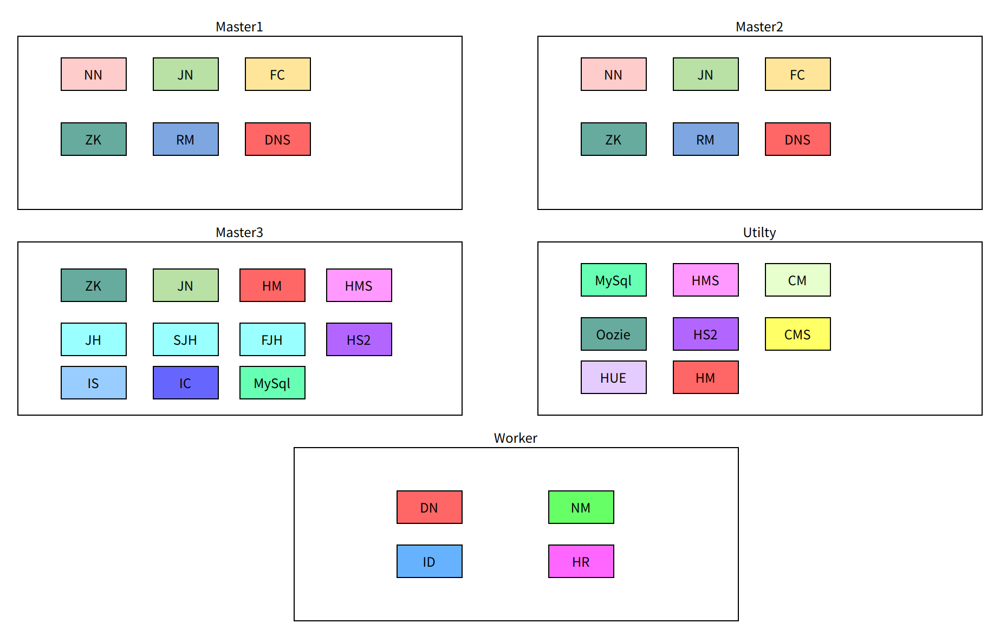

### 迁移方案

需要迁移的角色：
-   NameNode
-   JournalNode
-   FailoverController
-   Zookeeper
-   ResourceManager
-   ClouderaManager
-   Cloudera Management Service
-   Mysql
-   DNS
-   HbaseMaster
-   Impala StateStore
-   Impala Catalog
-   HiveMetastore
-   HiveServer2
-   Hue

### 停机方式

涉及关键角色比较多，停机迁移方式比较容易，集群整体停机约3-4小时，集群迁移之后修改配置文件重启任务即可

### 不停机方式

NN与RM的不停机迁移基础是HA，迁移前必须测试HA切换没有问题

验证方式：
1.  找到NameNode active节点（NN1）和 standby节点（NN2）
2.  验证NN1-\>NN2切换
3.  webUI上停止NN1（注意：只是停止，不是删除），或者登录NN1节点手动kill  Namenode进程
4.  然后观察NN2是否变成active，运行的任务是否受到影响（注意观察NN2的日志，确认切换中间无ERROR）
5.  正常情况下会立刻自动切换，线上任务不受影响，如有异常，及时重启NN1，并手动强制变成active，恢复任务，解决异常
6.  观察无异常则启动关闭节点，等待NN1启动完成（元数据加载并退出维护模式，转为standby）
    1. 注意不要在standby还没启动完成时继续验证，会导致集群不可用，建议多等几分钟
7.  再次验证NN2-\>NN1切换，步骤同上

RM的验证同NN，不再赘述

### NN、RM

NN和RM的切换至少需要一次运行任务的重启，以下是详细步骤

1.  找到NameNode active节点（NN1）和 standby节点（NN2）
2.  ResourceManager active节点（RM1）和 standby（RM2）
3.  要迁移到的新节点为MS1，MS2,迁移关系：
  1.  NN1、RM1-\>MS1
  2.  NN2、RM2-\>MS2
4.  修改NN1和RM1的配置文件，HA改为NN1（RM1）和MS2
5.  重启NN1，关闭NN2
6.  把NN2的元数据和配置文件同步到MS2上
  1.  NN2元数据目录/hadoop/dfs/nn/current
  2.  HA改为NN1（RM1）和MS2
7.  启动MS上NN和RM
8.  切换NN和RM的active 为MS2
  1.  这样可以有时间窗口重启角色与任务
  2.  重启所有datanode（依次重启）、任务
  3.  注意这里需要手动修改配置文件（HA改为MS1和MS2）后启动角色和任务
9.  关闭NN1
10. 把NN1的元数据和配置文件同步到MS1上
  1.  HA改为MS1和MS2
11. 启动MS1上的NN和RM
12. 再次重启所有datanode（依次重启）
13. 迁移完成

### 简化操作（多次重启任务

实际操作中可以使用CDH提供的迁移功能，简化操作，但是缺点是任务至少需要重启两次，步骤如下：

1.  找到NameNode active节点（NN1）和 standby节点（NN2）
2.  ResourceManager active节点（RM1）和 standby（RM2）
3.  要迁移到的新节点为MS1、MS2,迁移关系：
  1.  NN1、RM1-\>MS1
  2.  NN2、RM2-\>MS2
4.  迁移NN2到MS2

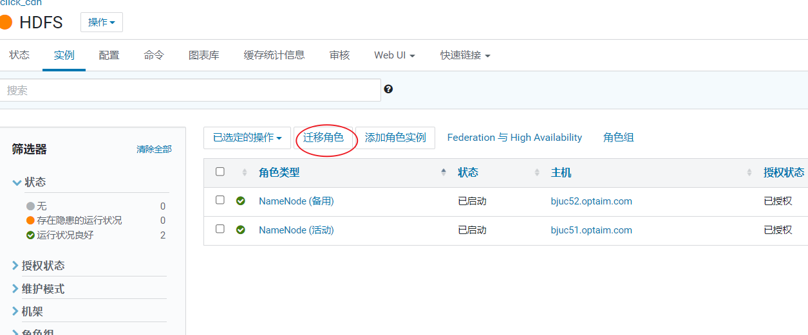

5.  停止并删除RM2节点

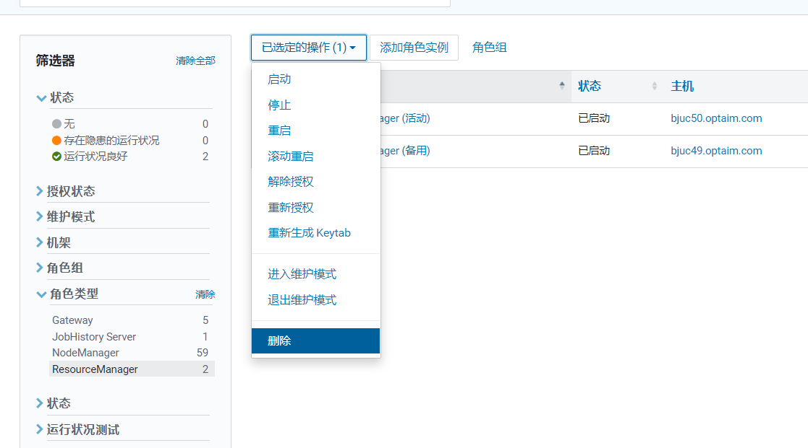

6.  新增RM到MS2

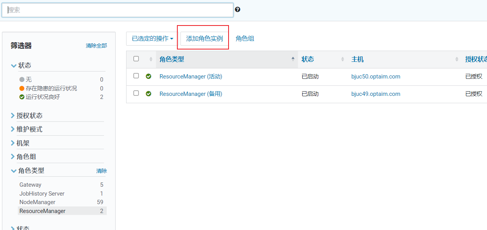

7.  重启所有datanode（依次重启）、任务
8.  重启完成后继续迁移NN和RM
9.  迁移NN1到MS1（同上）
10. 停止并删除RM2节点，新增RM到MS1（同上）
11. 重启所有datanode（依次重启）、任务

### ZK、FC、JN、Hbase

这几个服务相对比较简单，对于业务可以无感知迁移，可以在最后处理，步骤如下

1.  在CDH上新增角色到MS1、MS2、MS3
2.  停止并删除旧的角色即可
3.  依次进行，不要同时停止多个相同的角色

### Hive、Impala

Hive
server2对业务影响比较大，依赖Mysql，最好先迁移mysql（不过重启不影响业务，可以迁移mysql后分别重启）

impala相对使用较少，可以直接迁移

1.  停止并删除旧的角色
2.  在CDH上新增角色到MS3、Utility
3.  依次进行，不要同时停止多个相同的角色

### Mysql、Cloudera Manager、ClouderaManager service、DNS

业务无感知，并且可以分别迁移，推荐先迁移MySQL

MySQL现有的互为主从为49-\>50

hive、cloudera
Manager直连的是49节点，建议先把50节点mysql停机，然后设置Utility和49互为主从

之后切换cloudera manager连接的mysql，并重启服务

然后修改hive、oozie、hue等连接的mysql，并重启服务（依次重启）

等其他依赖mysql的服务迁移结束后，再把49关闭，Utility和MS3设置为互为主从

Cloudera Manager及各个service

先在Utility节点安装Cloudera Manager server，然后把旧节点的数据拷贝过来

启动sever，修改所有agent节点的server为Utility，重启agent（不影响业务）

启动各个service

删除旧的server

DNS

复制49上的bind9配置文件到MS1，并启动bind9

然后复制50上的bind9配置文件到MS2，并启动bind9

更改所有节点的DNS

确认所有节点使用新的DNS后停止旧节点

### 推荐顺序

1.  ZK、FC、JN
2.  Mysql（Utility节点和49互为主从）
3.  NN、RM（这里需要业务改配置重启）
4.  Hbase、hive、Impala（也需要业务重启）


以下角色迁移业务侧无感知

5.  Mysql收尾
6.  ClouderaManager
7.  Cloudera Management Service
8.  DNS
9.  时钟同步等收尾工作

PS：kafka可能需要提前释放出来（涉及到zookeeper），最好迁移至新的卡夫卡

### 测试结论

经过一周的完整测试,原迁移方案有些不适合,遇到以下问题:

1.  Cloudera Manager对于迁移namenode和journal node不友好
  1.  官方提供的迁移工具需要停止整个集群,而且每次只能迁移单个角色(注意,还不是节点,多个角色需要多次停止集群)
  2.  就算手动维护NameNode数据,NameNode也无法通过增删角色完成迁移(会损坏Cloudera
    Manager,导致服务报错)
  3.  也就是说Cloudera Manager限制了namenode的节点(由uuid保证)
  4.  测试通过手动修改uuid,使新机器\'继承\'旧节点角色,然后手动维护数据,ok
  5.  因此新方案可以使用这种方式(缺点是要继承所有的角色,但是大部分都是无状态的,只需要维护NameNode和journalNode状态即可)
  6.  journalNode可以通过增删角色,手动维护数据的方式迁移(这样可以让角色合并或者分离)
2.  Zookeeper是所有服务的基石,迁移必须要重启所有服务
  1.  不一定要停机,可以滚动重启
  2.  找到重启次数最少的方案
  3.  测试中遇到概率脑裂问题(已解决)
  4.  查明是和zookeeper的id有关,cloudera manager自动生成的id是随机的,如果id比现有节点的任意一个小,就会出现脑裂问题,所以启动角色时需要人工确认,保证zookeeper的id是递增的
3.  ResourceManager、Hive无状态服务,迁移角色相对比较简单,但是业务肯定会受到影响
  1.  如果完全不停机,需要任务重启两次(最好任务能先停止一小段时间,完全切换后只需重启一次)

### 具体操作步骤及脚本

#### 前置准备

1.  kafka迁移,释放旧的kafka
2.  新的4个节点
a.  系统ubuntu18.04
b.  其中2台复用旧的namenode域名(ip和域名都可以更换,但是为了减少问题,先复用域名,后续有机会可以再修改域名)
3.  新dns准备(新旧两套同时运行,逐步替换)

新节点列表(暂定)

| 域名             | ip                     | 用途                      |
|----------------|------------------------|--------------------------|
|bjuc51.optaim.com|                        |    NameNode              |
|                 |                        |   journalNode           |
|                 |                        |    zookeeper             |
|                 |                        |    FailoverController    |
|                 |                        |    ResourceManager       |
|bjuc52.optaim.com|                        |    NameNode              |
|                 |                        |    journalNode           |
|                 |                        |    zookeeper             |
|                 |                        |    FailoverController    |
|                 |                        |    ResourceManager       |
|hadoopm3.optaim.com |                        |   journalNode           |
|                 |                        |    zookeeper             |
|                 |                        |    HiveMetastore         |
|                 |                        |    HiveServer2           |
|                 |                        |    Hue                   |
|                 |                        |    Mysql(从)             |
| hadoopu1.optaim.com    |                        |    Mysql（主）           |
|                 |                        |    ClouderaManager       |
|                 |                        |   Cloudera Management Service  |
|                 |                        |    HiveMetastore         |
|                 |                        |    HiveServer2           |
|                 |                        |    Hue                   |
|                 |                        |    Oozie                 |

####  mysql迁移

目标：同步mysql数据到hadoopu1.optaim.com，并和10.11.20.49互为主从

线上mysql是10.11.20.49和10.11.20.50互为主备,hive等连接的是49节点,49的数据比较完整

hadoopu1.optaim.com节点需要新安装一个mysql

 ```Python
 apt install mariadb-server-10.1
 ```

配置文件copy旧的即可,保持一致性

备份10.11.20.49节点的数据

  ```Python
  mysqldump -h10.11.20.49 -uroot -p123456 \
  --all-databases  \
  --add-drop-database \
  --add-drop-table \
  --apply-slave-statements  \
  --single-transaction \
  --quick \
  --skip-lock-tables \
  --master-data=1\
  --flush-logs \
  > master.sql

  ```

设置10.11.20.49节点为master,并load数据

  ```Python
  change master to
  master_host='10.11.20.49',master_port=3306,master_user='root',master_password='Qwaszx'
  source master.sql

  ```

更改10.11.20.49的master,使hadoopu1.optaim.com(使用ip,以免混乱)和10.11.20.49互为主从

PS:切换前后MySQL数据做备份

#### CLouderaManager迁移

目标：clouderanManger从10.11.20.49迁移到hadoopu1.optaim.com

clouderanManger进入维护模式

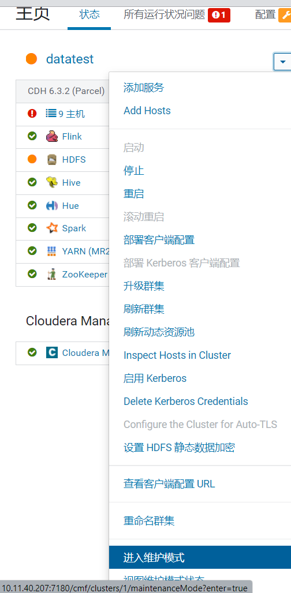

10.11.20.49停止clouderaManager server

  ```Shell
  systemctl stop cloudera-scm-server

  ```

hadoopu1.optaim.com安装clouderaManager

  ```Shell
  #! /bin/bash

  SOURCE="$(readlink -f ${BASH_SOURCE[0]})"
  BIN_DIR="$( cd -P "$( dirname "$SOURCE"  )" && pwd )"

  environment='export JAVA_HOME=/usr/java/jdk1.8.0_181-cloudera
  export CLASSPATH=.:$CLASSPATH:$JAVA_HOME/lib
  export PATH=$PATH:$JAVA_HOME/bin

  function init(){
  wget http://10.11.40.101:10086/cloudera/jdk1.8.0_181-cloudera.tar
  wget http://10.11.40.101:10086/cloudera/cm/pool/contrib/e/enterprise/cloudera-manager-daemons_6.3.1~1466458.ubuntu1804_all.deb
  wget http://10.11.40.101:10086/cloudera/cm/pool/contrib/e/enterprise/cloudera-manager-server_6.3.1~1466458.ubuntu1804_all.deb
  wget http://10.11.40.101:10086/cloudera/cm/pool/contrib/e/enterprise/cloudera-manager-agent_6.3.1~1466458.ubuntu1804_amd64.deb

  if [ ! -d /usr/java/ ];then
  mkdir -p /usr/java/
  fi

  tar -xvf jdk1.8.0_181-cloudera.tar -C /usr/java/
  wget https://repo1.maven.org/maven2/mysql/mysql-connector-java/5.1.49/mysql-connector-java-5.1.49.jar
  mv mysql-connector-java-5.1.49.jar /usr/share/java/mysql-connector-java.jar
  echo "$environment" > /etc/profile.d/environment.sh
  timedatectl set-timezone Asia/Shanghai
  }
  function install_cm_agent(){
  apt-get install -yq mariadb-server
  apt-get install -yq libsasl2-modules-gssapi-mit
  apt-get install -yq libssl-dev
  apt-get install -yq rpcbind
  apt-get install -yq python-psycopg2
  apt-get install -yq python-mysqldb
  apt-get install -yq apache2
  apt-get install -yq iproute2

  if [ -e cloudera-manager-daemons_6.3.1~1466458.ubuntu1804_all.deb ]&&[ -e  cloudera-manager-server_6.3.1~1466458.ubuntu1804_all.deb ];then
  dpkg -i cloudera-manager-daemons_6.3.1~1466458.ubuntu1804_all.deb
  dpkg -i cloudera-manager-server_6.3.1~1466458.ubuntu1804_all.deb
  dpkg -i cloudera-manager-agent_6.3.1~1466458.ubuntu1804_amd64.deb
  fi
  }
  init
  install_cm_agent

  ```

修改/etc/cloudera-scm-agent/config.ini,并启动server

  ```Shell
  systemctl start cloudera-scm-server

  ```

启动完成后会发现没有agent,需要陆续修改所有cloudera
agent(包括hadoopm3.optaim.com和hadoopu1.optaim.com)

  ```Shell
  sed -i 's|server_host=bjuc49.optaim.com|server_host=hadoopu1.optaim.com|'  /etc/cloudera-scm-agent/config.ini

  ```

等待所有节点都接入hadoopu1.optaim.com

#### Mysql收尾

目标：连接到旧的mysql的服务都改为连接hadoopu1.optaim.com

连接10.11.20.49 mysql ,查看已经建立的所有连接

  ```Shell
  show processlist;
  ```

此时应该只有hive、hue、oozie等用户（scm已经迁到新的mysql了）

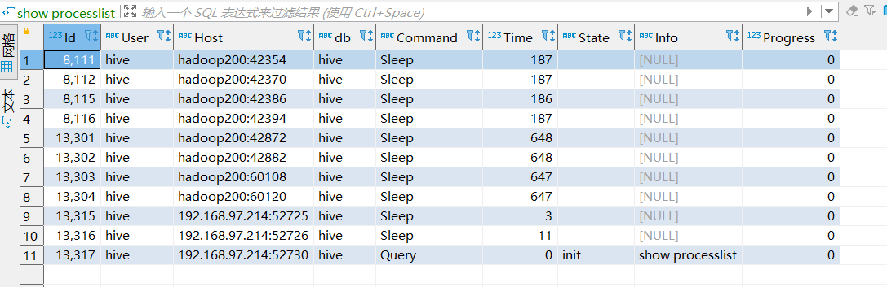

修改这三个服务连接的mysql

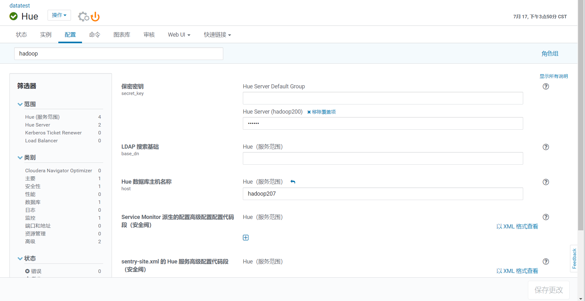

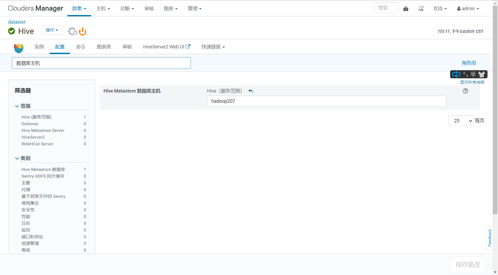

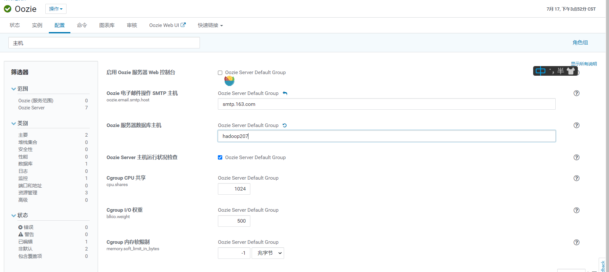

手动依次重启这三个服务,重启完成后再次查看已建立的连接

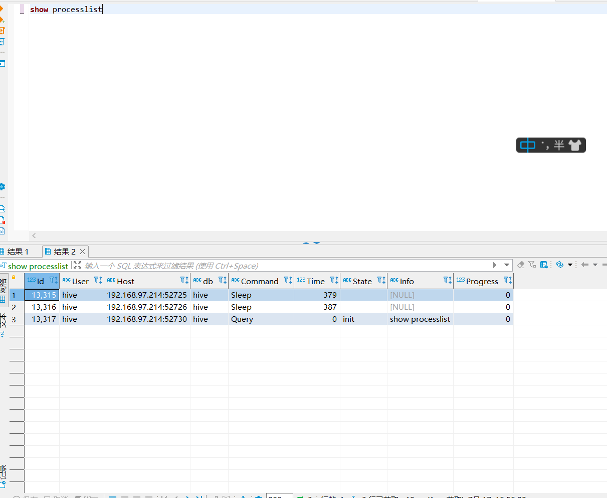

此时应该发现除了自己本地客户端之外,其他的连接都断开了,mysql迁移结束

PS:

此时可以断开10.11.20.49的主从,转而使hadoopm3.optaim.com和hadoopu1.optaim.com互为主从

至此mysql迁移结束

#### ClouderaManager Service迁移

停止所有ClouderaManager Service

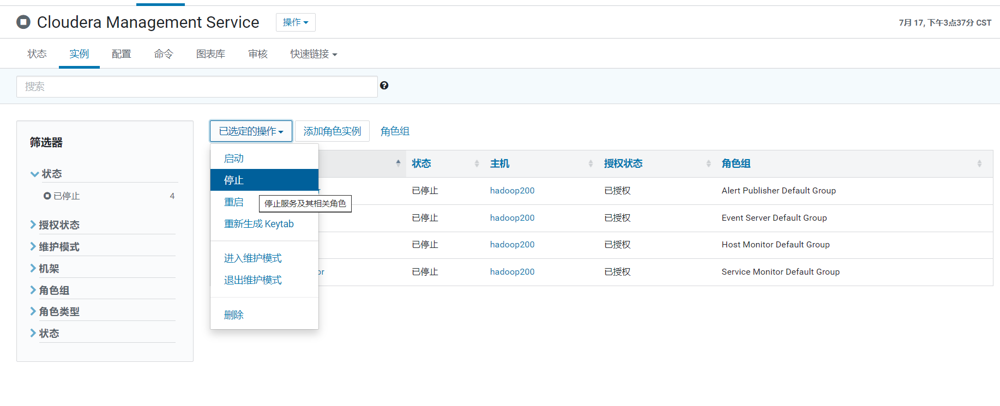

然后删除角色

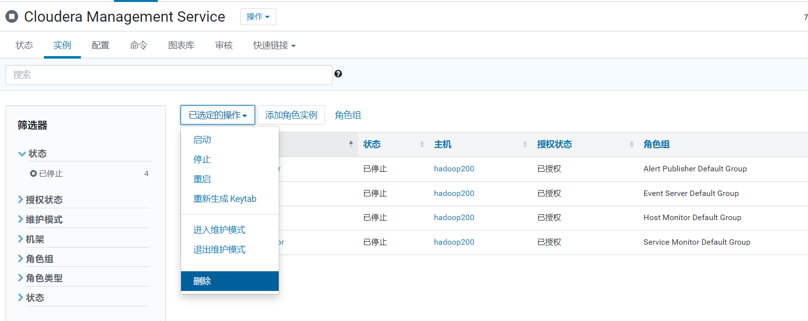

然后在hadoopu1.optaim.com上新增并启动这几个角色

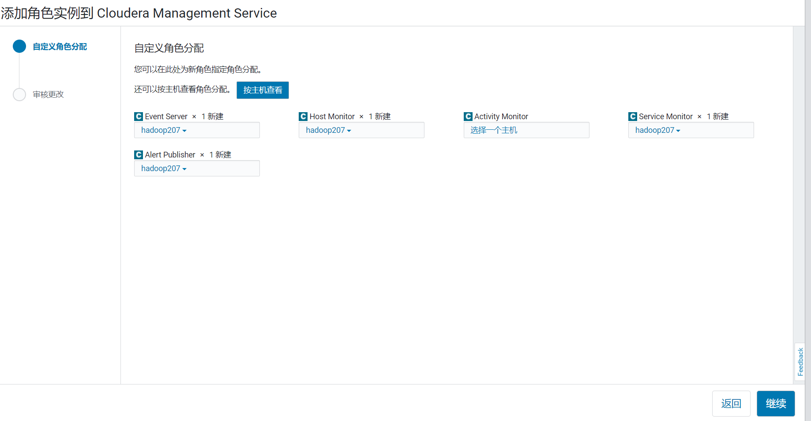

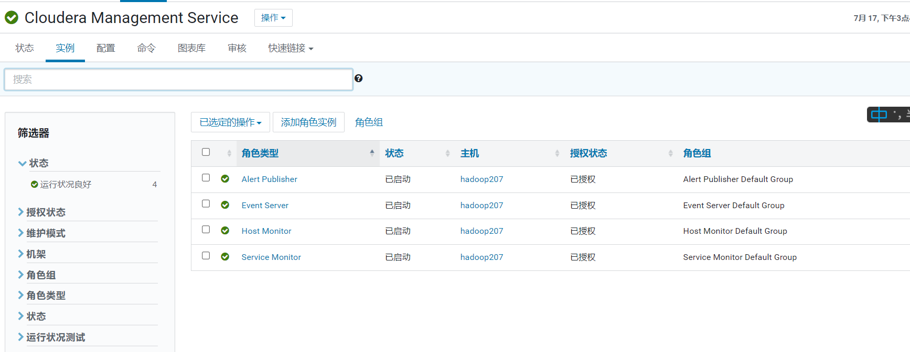

等待clouderaManager监控恢复

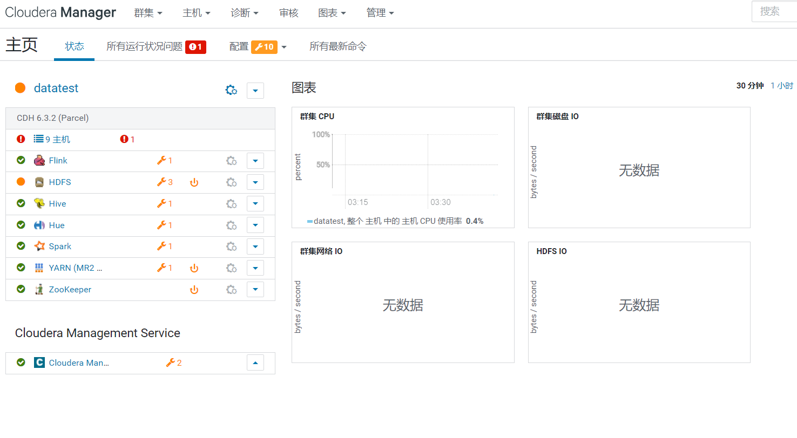

注意:此处可以先不要重启服务,后续一起重启即可

**NameNode迁移**

NameNode需要复用旧的agent的uuid,先停止10.11.20.51并取得uuid

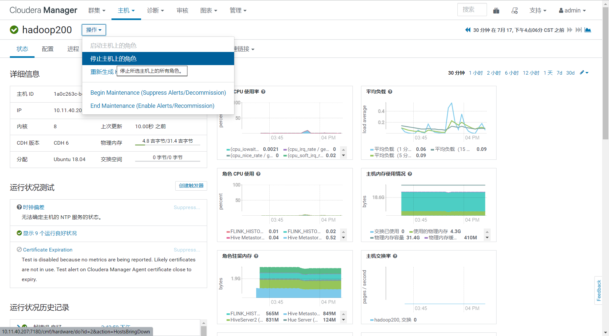

  ```Shell
  systemctl stop cloudera-scm-agent.service
  cat /var/lib/cloudera-scm-agent/uuid

  ```

把得到的uuid写入 bjuc51.optaim.com节点

  ```Shell
  echo -n 'xxxxx' > /var/lib/cloudera-scm-agent/uuid

  ```

然后重启cloudera-scm-agent

  ```Shell
  systemctl restart cloudera-scm-agent.service

  ```

等待节点重启完成,然后

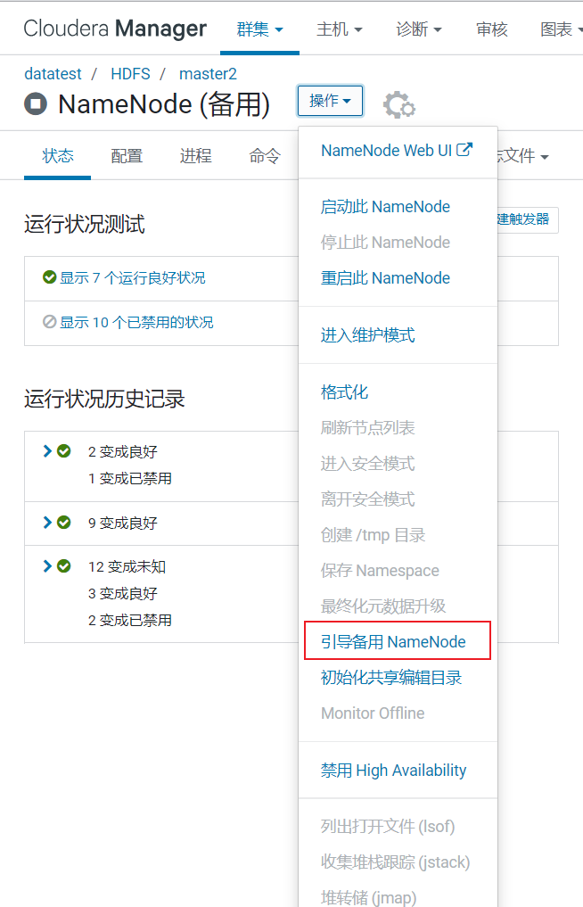

或者使用命令行(手动编辑配置文件)

  ```Shell
  hdfs namenode -conf /tmp/hdfs-site.xml -bootstrapStandby

  ```

然后去对应的目录下查看是否存在fsimage

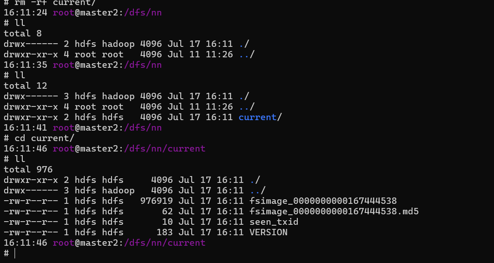

之后启动NameNode和FailoverController

由于域名没有改变,此时应该不需要重启其他服务(没有新增需要重启的项)

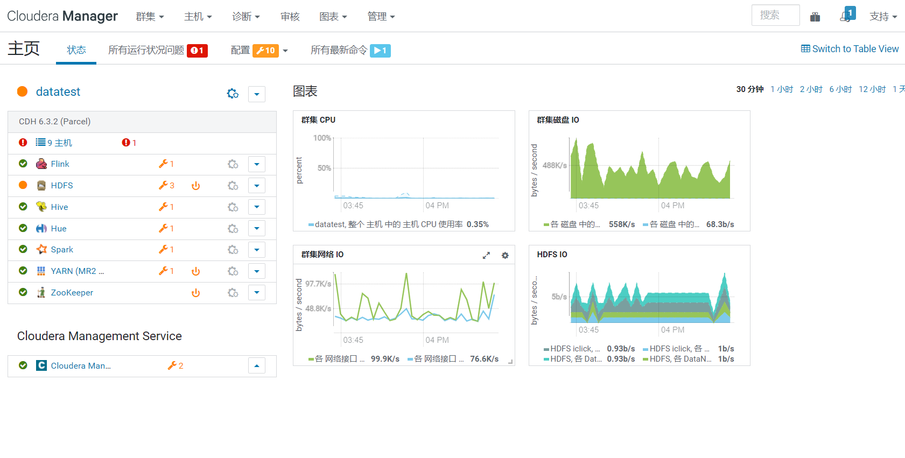

注意事项：

-   fsimage每个小时合并一次
-   时间间隔不要太长
-   尽量选择合并之后的半小时内操作
-   DNS修改时机很重要，这一部分先不要修改DNS，最好等journalnode起来之后再切换

第一个NameNode迁移完成

PS：部分任务可能需要重启

#### journalNode迁移

journalNode有3个,其中2个和NameNode一起\`借壳重生\`了,还有一个需要迁移到hadoopm3.optaim.com

先把bjuc51.optaim.com上的journalNode恢复

需要手动维护journalNode的数据

1.  使用scp,然后修改权限
2.  使用10.11.20.51执行-initializeSharedEdits

  ```Shell
  hdfs namenode -conf tmp/hdfs-site.xml -initializeSharedEdits\
  ```
hdfs-site.xml
  ```xml
  <property>
  <name>dfs.namenode.shared.edits.dir.iclick.namenode126</name>
  <value>qjournal://hadoop201:8485;hadoop202:8485;hadoop203:8485;master2:8485/iclick</value>
  </property>

  ```

要求:

1.  上面这个property对应的journal必须全是空的(就是没有数据)
2.  只填写需要初始化的journalnode(bjuc51.optaim.com)

建议使用scp,因为域名复用,有点混乱,不细心可能会导致配置出错

然后启动bjuc51.optaim.com上的journalNode

PS：最好在这个时候修改DNS

bjuc52.optaim.com上的NameNode和journalNode同样的方式操作

最后迁移10.11.20.53上的journalNode到hadoopm3.optaim.com

先停止10.11.20.53上的journalNode

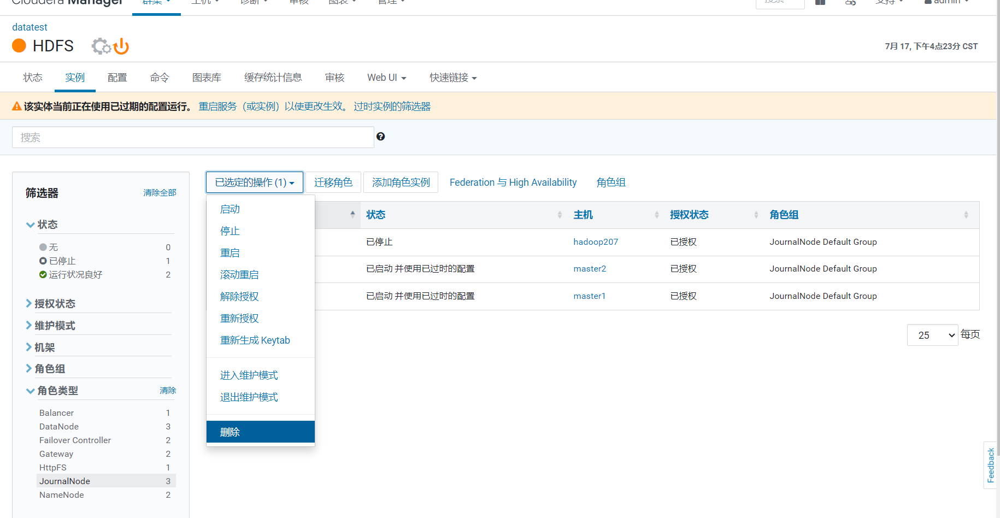

然后新增journalNode并启动

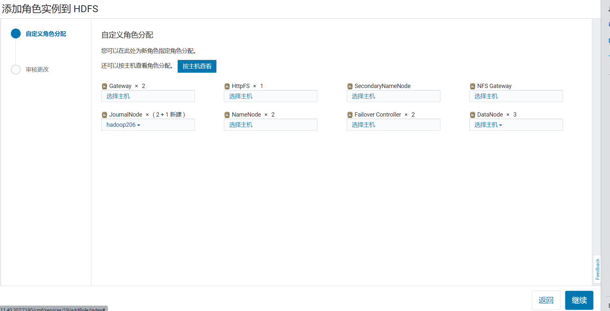

和刚才一样需要手动维护journalNode的数据,略

至此journalNode和NameNode迁移完成

#### zookeeper迁移

zookeeper线上节点是bjuc53.optaim.com,bjuc54.optaim.com,bjuc55.optaim.com

分两步实施

1.  增加bjuc51.optaim.com、bjuc51.optaim.com两个节点
2.  重启相关服务（滚动重启），重启业务相关任务
3.  减少bjuc53.optaim.com,bjuc54.optaim.com,bjuc55.optaim.com并增加hadoopm3.optaim.com
4.  再次重启相关服务（滚动重启），按需重启业务任务

操作步骤略

注意事项：

1.  新增节点时，不要直接启动，需要人工修改并确认id，保证是递增的
2.  新增或减少节点需要观察日志，确认所有节点工作正常之后再进行下一步，保证zk不能出现脑裂
3.  保证操作顺序

节点对应id

  ------------------------------------------------------ ----------------
  节点                                                   myid

  bjuc53.optaim.com                                      1

  bjuc54.optaim.com                                      2

  bjuc55.optaim.com                                      3

  bjuc51.optaim.com                                      4

  bjuc52.optaim.com                                      5

  hadoopm3.optaim.com                                    6
  ------------------------------------------------------ ----------------

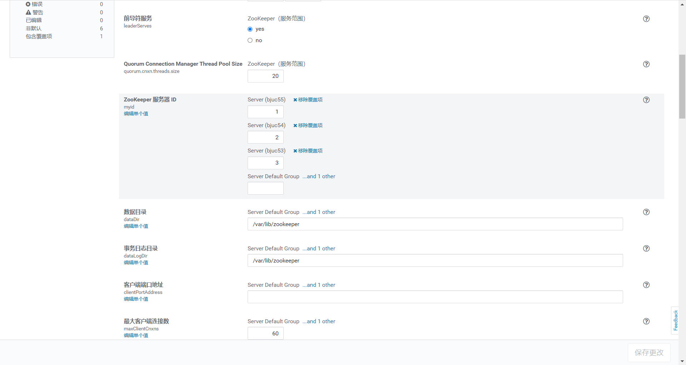

#### ResourceManager等

-   ResourceManager
-   Hive
-   Hue
-   oozie
-   JobHistory
-   Hbase
-   Impala

这些服务都是无状态或者暂时没有用到的，直接删除角色再新增就可以，操作略

但是这几个服务业务可能会用到，尽量能留出时间，统一操作，业务和服务在这一阶段重启

#### 迁移结束

迁移结束之后需要退出维护模式

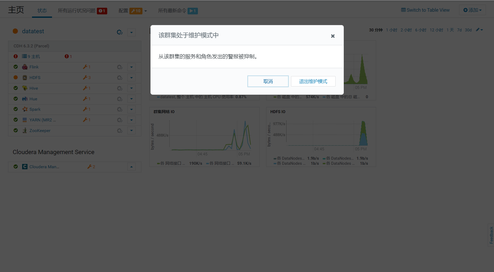

修改dns至bjuc51.optaim.com、bjuc51.optaim.com

修改时间同步server至bjuc51.optaim.com

其他待补充。。。

#### 时间花费

第一阶段

-   mysql+cloudera manager+Hive/hue/oozie mysql
-   1-2天

第二阶段

-   第一个NamNode+journalNode
-   2-3天

第三阶段

-   第二个NamNode+journalNode
-   2-3天

第三阶段

-   单个jounalNode迁移
-   1-2天

第四阶段

-   zookeeper扩容+RM迁移等
-   1-2天

第四阶段

-   zookeeper缩容
-   3-4天

第五阶段

-   DNS等收尾
-   2-3天

业务需要配合的地方

只有在第三和第四阶段需要业务配合

最好是能

准备阶段(部分任务需要重启)

-   ip硬编码(hdfs),域名硬编码(yarn),提前改新域名重启
-   NameNode重启前结束

第一次重启(更改配置)

-   ResourceManager(第一台),Hive,spark,flink
-   hdfs-site.xml
-   yarn-site.xml
-   hive-site.xml
-   flink.yaml
-   spark.xml
-   ip硬编码(hdfs),域名硬编码(yarn),提前改新域名
-   基础镜像重做

第二次重启(更改配置)

-   ResourceManager(第二台),Hive
-   同第一次

第三重启

-   zookeeper缩容

本周目标

-   硬编码问题解决
-   固定的hosts文件(同硬编码问题)
-   任务梳理

8/1--8/5

-   NameNode迁移

8/7--8/15

-   尽量能在白天两次切换完成
-   重启任务
-   尽量早上第一次切换

影响范围

-   实时任务
-   Flink
-   Spark Streaming
-   离线任务
-   T+1
-   H+1/M+1(提前准备镜像)
-   Druid
-   ES
-   Clickhouse
