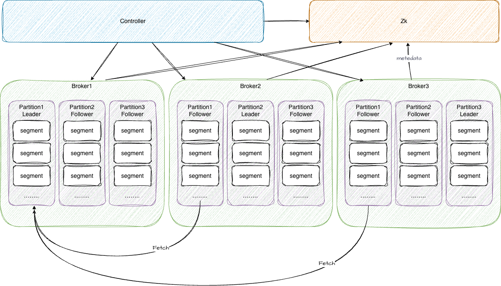
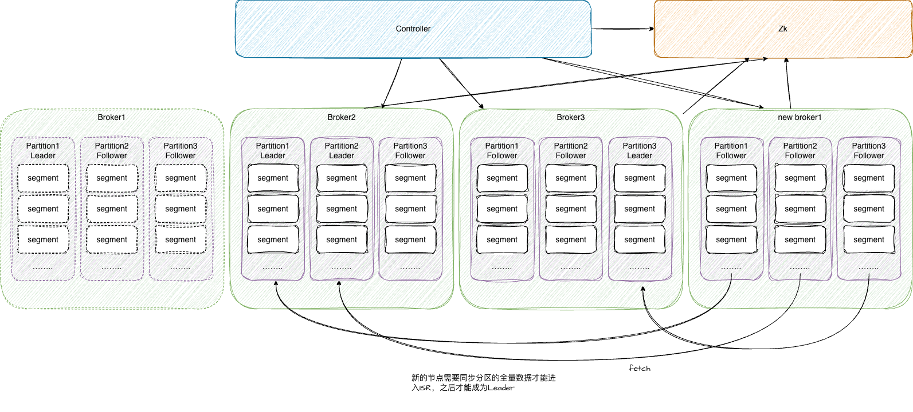
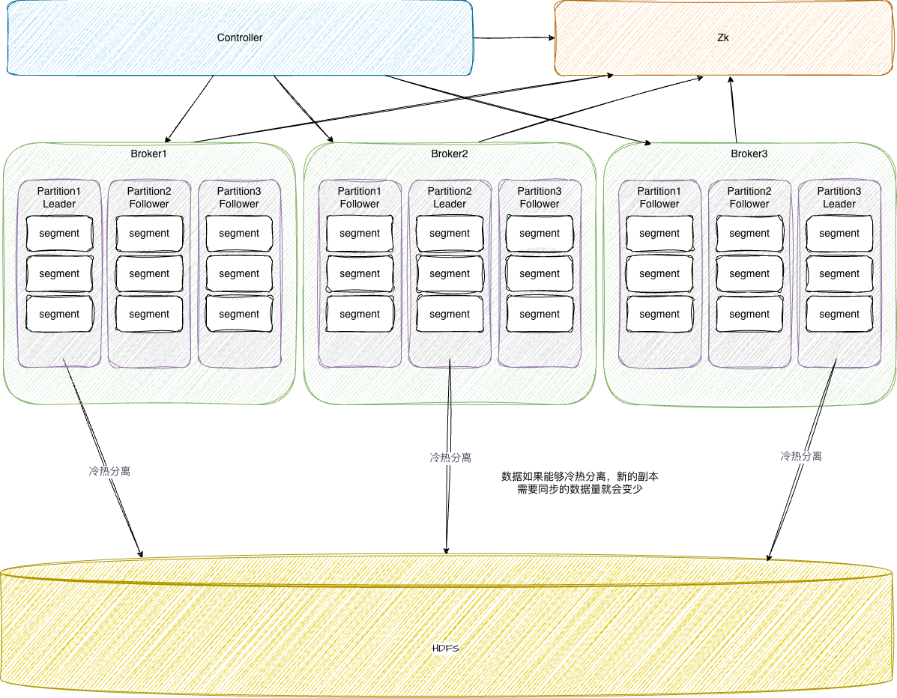
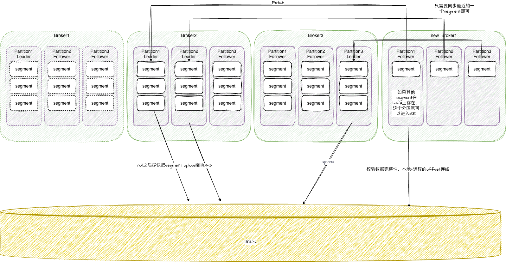
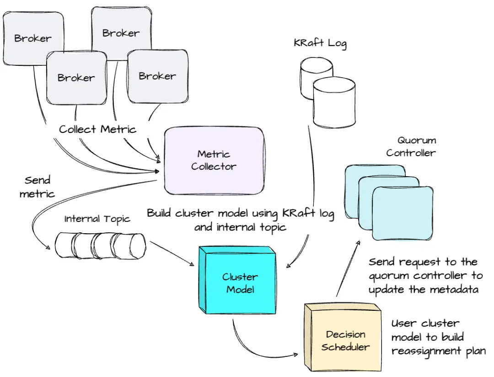

### 一、集群现状

kafka是由多副本机制来保证数据的可用性的，每个副本需要保留完整的数据（通常是几天的数据），这些副本占据了broker上的大量存储空间，并且大多数数据是冷数据，不会被消费。

如果使用新的机器替换老机器，由于副本要保证数据的完整性，需要同步所有分区的所有数据：

这导致了分区迁移或者分区追数的时候，需要同步的数据量大，耗时高，带宽大，并且多数数据并不一定会被使用（不一定会被消费）。

现状痛点分析

1.  难扩容和缩容，增减节点需要手动重平衡
2.  迁移成本高，每次分区迁移需要完整的副本同步
3.  副本的需要存储完整的数据，副本上的数据存储始终浪费，并且副本迁移同步数据的流量也是很大的浪费

### 二.使用分层存储架构

针对长久以来kakfa的运维痛点，社区有共识将数据进行冷热分离，冷数据存储到远程存储上，热数据保留在本地以备消费。

从而官方孵化出来了分层存储架构（3.9版本release），希望能降低一部分运维成本。

比如同样使用新的机器替换老机器，不用同步所有的数据了，只需要和leader保证数据一致，同步一部分的segment即可。

这样分区迁移成本可能从数小时压缩至几十分钟了，提升效果还是比较明显的。

说明：

分层存储官方只实现了基本的功能，具体的远程存储及其实现需要自己编码。我们选择相对可靠的HDFS来做远程存储。

将本地存储与HDFS的优势融合。本地存储以其低延迟、高性能的特点，在日常运行中承担着主要的数据读写任务；HDFS以其强大的可扩展性和容错能力，作为数据备份及冷数据长期保存。共同构建起既保证了实时性又兼顾了稳定性的数据存储体系。

技术要点&难点

1.需要实现kafka社区版本分层存储涉及的所有接口，稳定读写Hdfs
2.需要明确leader本地segment上传hdfs的策略,改进或开发新策略，将滚动完成的segment快速上传到hdfs
3.根据测试的冷读场景下直读hdfs性能，确定是否引入远程读本地缓存机制
4.确认读写长尾的问题（即部分block读取或写入慢），根据情况确定由hdfs客户端重试还是业务客户端进行重试
5.解决当hdfs不可用时需要退化成本地模式，以及HDFS集群恢复后全流程如何恢复
6.测试segment上传速率小于生产速率时，考虑并行上传功能
7.确定follower支持读是否可行，目前：需要客户端支持，比较难推进

  

### 三、动态副本迁移

远程存储降低了一部分的运维成本，但是本地存储的数据量还是比较大，副本的迁移成本还是相对比较高。

为了保障本地数据能够cover绝大部份的消费，可能要本地留存数个小时的数据，副本需要同步这部分的全量数据。

在此之上，我们考虑把追数的数据量进一步减少，让分区只需要同步最新的segment（最大1G，大多数情况下只有几百M）。

比如同样使用新的机器替换老机器，每个分区只用同步的最新的一个segment即可：

这样分区迁移成本就可以压缩到分钟级别甚至秒级了。

  

说明：通过增量同步+远端存储等技术减少副本动态迁移时需要同步的数据量，即新增副本不再需要同步全量的segent，只需要同步最后1个active的segment即可，大大减少同步所需时间。

技术要点&难点：

1.为了尽可能的少同步数据，需要改造副本同步逻辑，只同步active的segment，需要解决如何将active的segment的起始offset同步给新增副本的问题
2.只同步active的segment，会导致新增副本和HDFS远端数据不连续,破坏了数据完整性。解决方案：增加副本和远端是否同步的状态标识。
相关问题：
  a.解决远端offset在各个副本之间共享的问题
  b.解决标识在leader和各副本之间同步的问题
  c.元数据共享是基于zk的高版本基于kraft协议,改造要基于Kraft协议，需要重新了解Kraft协议。
3.改造副本加入ISR的条件，在追上active的segment的同时，还需要和远端连续。
4.leader切换时，尤其是不洁选举时，增加和远端连续的判断，只有连续的副本才有资格

  

### 四、Autobalance（自动故障容灾&负载均衡）

基于以上方案，kafka的分区重分配等成本极大的降低，我们可以自动的处理kakfa中一些常见的运维问题，从而减少人工介入的情况，进一步降低运维成本。

架构图：

  

架构说明：

1.指标收集：用来定期收集预定义的指标，如网络流量吞吐量、副本个数等，上报到内部的topic;  
  
2.状态管理：在 controller 上，维护一个 ClusterModel（集群模型）来表示集群的当前状态和分区负载。集群的变化，如 broker 的增加、移除，或分区的重新分配和删除，都是通过监控 KRaft（Kafka 的 Raft 实现，用于元数据）元数据来更新 ClusterModel。同时，controller 持续从内部topic中消费，预处理提取的指标，并更新 ClusterModel，以确保它准确地反映集群的当前状态.  
  
3.决策调度器：旨在帮助集群实现特定目标，例如每个 broker写入流量均衡。只有活跃的控制器参与决策和调度。在开始决策过程之前，捕捉 ClusterModel 的快照，并利用该快照的状态进行后续调度。决策过程采用类似于 Cruise Control（一个用于 Kafka 集群管理的开源工具）的启发式调度算法

功能说明：

通过智能调度算法自动感知集群状态变化，并根据实际负载情况动态调整节点数量。当检测到流量激增时，能够将备用节点加入到现有集群中，以缓解压力；反之，在高峰期过后，则可以平滑地减少活跃节点数，从而有效降低运营成本。此外，得益于HDFS的强大支持，即便是在进行大规模扩容或缩减操作期间，也能够确保数据的一致性和完整性不受影响。

  

4.1 场景一：自动容灾

如果某个broker宕机，就不需要等待人工介入，超时还未恢复的话可以快速的将副本自动分配到其他节点上

4.2 场景二：节点扩容

新增broker节点时，可以快速的将部分分区迁移到新的节点上，让新节点快速承担流量。

4.3 场景三：流量均衡

集群中如果节点间流量不均衡，我们可以自动发现流量不均衡的情况，并自动处理。

  

### 五、整体部署

具体部署时，按照我们现在的机型，通常有1-2块nvme-ssd和多块hdd盘，我们计划hdd盘搭建KAFKA专用HDFS，nvme盘用于部署kafka。

这样既能保障kafka的高性能，又能利用HDFS的高吞吐。

  

  

### 六、预期收益

1.  维护时的流量消耗降低
2.  存储成本降低，冷数据只需hdd存储，不占用昂贵的nvme存储
3.  常备机器资源降低，流量热点时按需增加kafka节点即可，热点过后可以及时释放
4.  集群自愈能力增强，降低人工介入频率
5.  降低运维成本，节省人力

<!--stackedit_data:
eyJoaXN0b3J5IjpbLTEwMjQ5NTA0NjIsMTUxNDM4NzU3NiwxMz
I5MDE2NTIxXX0=
-->