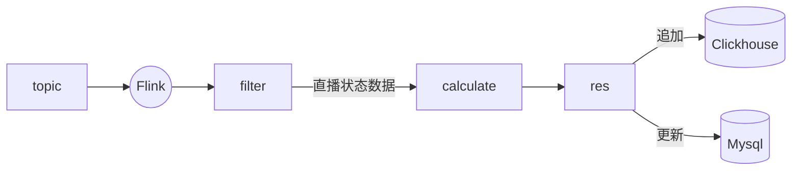
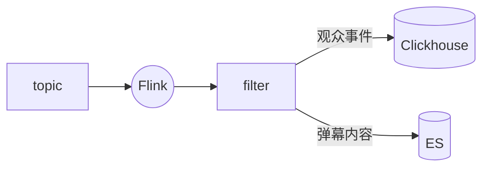

# 所属需求

[原型链接](https://www.tapd.cn/55103384/prong/stories/view/1155103384001006885)

# 设计目标

实时解析直播数据，转化合并后写入下游OLAP

上游数据繁杂，需要整理合并，统一数据字段

# 整体设计

```mermaid
graph TB
	前端--"记录sec_uid"-->tb_dd[(Mysql_订单表)]
	tb_dd.->tb_user[(Mysql_用户表)]
	subgraph sc direction LR [Schedule]
        schedule-.监控时间.->tb_dd
        schedule--请求爬虫接口-->Spider_主页信息       
        schedule--请求直播接口-->Spider_直播
        
    end
    
    Spider_主页信息-->tp2[Kafka]
    Spider_主页信息--同步接口,补充uid-->tb_dd
	Spider_直播-->tp2[Kafka]
	tp2-->ck_主播历史明细
	tp2-->flink1
	
	flink1-->ck_商品历史明细
	
	tp2-->flink2
	flink2-->ck_直播间状态历史
	
    flink2-->Mysql_直播间状态
    tp2-->flink3
    flink3-->ck_观众事件明细
    flink3-->ES_弹幕词云
    
	
```

# 详细设计

## 直播间状态



| type                       | desc                     |
| -------------------------- | ------------------------ |
| WebcastRoomUserSeqMessage  | 直播间观众消息           |
| WebcastStartLiveMessage    | 直播开始                 |
| WebcastEndLiveMessage      | 直播结束                 |
| WebcastLikeMessage         | 直播间点赞消息（点赞数） |
| WebcastEcomMessage         | 直播正在购买消息         |
| WebcastLiveRoomInfoMessage | 直播间                   |

核心字段：

* 开始时间 
* 结束时间  
* 观看人数
* 峰值人数(观看人数最大值) 
* 平均在线人数 
* 总点赞数 
* 预估购买人数


## 直播观众事件


| type                     | desc                                 |
| ------------------------ | ------------------------------------ |
| WebcastChatMessage       | 弹幕                                 |
| WebcastFansclubMessage   | 加入粉丝团                           |
| WebcastGiftMessage       | 送礼                                 |
| WebcastSocialMessage     | 互动？                               |
| WebcastScreenChatMessage | 屏幕消息（房管或其他主播发送的消息） |
| WebcastLikeMessage       | 点赞                                 |
| WebcastMemberMessage     | 进入直播间总览信息  |

观众事件核心字段：
* user信息         
* 观众事件类型 

## 商品数据


| type    | desc           |
| ------- | -------------- |
| product | 直播间商品消息 |

商品核心字段：
* 产品ID
* 产品名称
* 产品图url
* 价格
* 初始最高价
* 最低价
* 商品类型
* 佣金比例
* 佣金费用
* 上架时间
* 下架时间
* 全网总销量
* 预估销量
* 上架时在线人数


## Clickhouse字段设计

https://docs.qq.com/sheet/DZHRsU3BzdEpCdVBJ


