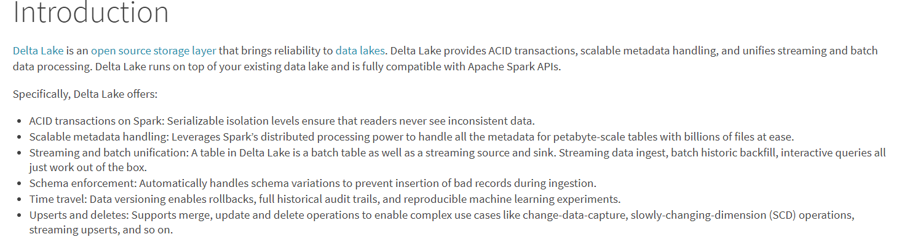

# 数据湖是什么？

维基百科上定义，数据湖（Data Lake）是一个以原始格式存储数据的存储库或系统。它按原样存储数据，而无需事先对数据进行结构化处理。一个数据湖可以存储结构化数据（如关系型数据库中的表），半结构化数据（如CSV、日志、XML、JSON），非结构化数据（如电子邮件、文档、PDF）和二进制数据（如图形、音频、视频）。

核心：强大的存储层（直观感受：数据湖=hadoop，这确实是数据湖最简单的一种实现方式）

# 为什么需要数据湖？

对于企业来说，只能存储数据还不够，要想发挥其价值，应该还有分析能力


数据分析有两种思路：

第一个是自上而下的，第二个是自下而上的

自上而下就是根据业务需求，我们定义好pipeline和表结构，然后填充数据，即传统的数仓模式

自下而上就是先拿到数据，然后我们针对需求，根据数据做挖掘，分析，获得我们想要的结果

自下而上的优点：

* 可以处理半结构化数据甚至是非结构化数据,如json，xml，图片等
* 能够保存原始数据，某些和当前业务关联度不高的但未来可能有用的信息可以保存下来

这种方式更适合大数据领域，而且能够为企业带来更多的收益

自下而上的这种思路，就需要数据湖来实现

因此越来越多的数据公司选择数据湖


# 怎么构建数据湖？

上面说了数据湖是强大的存储层，那么数据湖通常选择hadoop或者云存储平台，我们以hadoop为例：

但是直接保存在hadoop上还是有很多问题的：

* 数据格式混乱
* 没有元数据约束
* 计算的中间数据无法保证一致性
* 流式读写的天然困难


目前数据湖的开源解决方案主要有三个：

Databricks的==Delta Lake==

Uber的==Hudi==

Netflix的==Iceberg==

共同点：

* 执行引擎：目前支持完善的只有Spark，但是三家都有和执行引擎解耦的计划
* 事务（ACID）保证
* 更新和删除数据
* Streaming Source 和 Streaming Sink（流读流写）
* schema演化（元数据动态扩展）
* 数据格式：列式存储（一种或多种）

delta lake：事务日志、时间旅行

Hudi：

时间轴：核心概念，所有特性实现都是基于此

所有的操作都抽象为有时间的数据流，在hudi的视角看来，文件就是某一时间点的数据，你的删改，都是数据来迟了，数据时间戳小于当前时间戳造成的

写操作做了扩展：copy on write 和 merge on read

Iceberg：

实现原理类似于Delta lake，但是要更复杂，安全性更高

兼容性是最好的，文件系统和计算引擎都抽象了接口，扩展性是最好的


没有本质上的区别，只是现阶段侧重点不同，未来可能会高度同质化


# Delta Lake




几个重要的特性：

1. Spark上的ACID事务：可序列化的隔离级别确保读者永远不会看到不一致的数据。
2. 可扩展的元数据处理：利用Spark的分布式处理能力，可以轻松处理数十亿个文件的PB级表的所有元数据。
3. 流和批处理的统一：Delta Lake中的表既是批处理表，又是流的源和接收器。流数据提取，批处理历史回填，交互式查询都可以直接使用。
4. schema演化：自动处理schema变化
5. 时间旅行：数据版本控制支持回滚
6. Upserts和Deletes：支持合并，更新和删除操作


**Delta Lake到底是什么**

Delta Lake 是一个jar包,而不是一个service,**~~目前~~只支持Spark引擎。**

总结:

Parquet文件 + Meta 文件 + 一组操作的API = Delta Lake.


```
什么是Delta Lake?
Delta Lake是一个开源存储层，可为数据湖带来可靠性。Delta Lake提供ACID事务，可伸缩的元数据处理，并统一流和批处理数据处理
```

官方称自己是开源的存储层,那么作为一个存储层,他应该至少需要有存储位置和存储格式

```
Delta Lake在哪里存储数据？
写入数据时，您可以指定云存储中的位置。Delta Lake以Parquet格式将数据存储在该位置。
```

1. delta lake是一个大数据框架,所以他没有自己的存储,他把数据存储在了hdfs上(也可以是其他分布式存储系统,s3,阿里云等)

```
Delta Lake使用什么格式存储数据?
Delta Lake使用版本化的Parquet文件将您的数据存储在您的云存储中。除版本外，Delta Lake还存储事务日志，以跟踪对表或Blob存储目录所做的所有提交以提供ACID事务。
```

2. Delta 并没有自己发明一种新文件存储格式，而是复用了parquet，但是parquet只是一个列式存储格式，没有对文件的增加、删除、更新的操作。为了实现上面提到的特性，Delta的思路类似于Hbase，把所有的操作都抽象成了新增，删除操作变为标记删除，但是不同于Hbase，他只是一个jar包，而不是服务，没有自己的进程。和Hbase一样，他需要记录每次操作，来区分哪些是新增，哪些是删除，因此Delta引入了meta文件目录。

# Delta文件结构

Delta的文件结构：

分为parquet文件和meta文件目录


**parquet文件**

数据目录下的parquet文件，就是我们保存的数据，和hive一样，他也支持分区（子文件夹形式），这是一种控制粒度的辅助手段

**事务日志**


` _delta_log/`被称为事务日志目录,里面有很多个json文件和checkpoint.parquet文件,还有唯一的_last_checkpoint

json文件里面保存的就是json,我们可以格式化看看里面保存了什么:

```json
{
	"commitInfo": {
		"timestamp": 1602238274958,
		"operation": "WRITE",
		"operationParameters": {
			"mode": "ErrorIfExists",
			"partitionBy": "[]"
		},
		"isBlindAppend": true,
		"operationMetrics": {
			"numFiles": "1",
			"numOutputBytes": "923361",
			"numOutputRows": "54294"
		}
	}
} 
{
	"protocol": {
		"minReaderVersion": 1,
		"minWriterVersion": 2
	}
} 
{
	"metaData": {
		"id": "ede86ac0-ffbe-4636-a868-806e820200fc",
		"format": {
			"provider": "parquet",
			"options": {}
		},
		"schemaString": "{\"type\":\"struct\",\"fields\":[{\"name\":\"mid\",\"type\":\"long\",\"nullable\":true,\"metadata\":{\"comment\":\"up?id\"}},{\"name\":\"brands\",\"type\":\"string\",\"nullable\":true,\"metadata\":{\"comment\":\"????top10\"}},{\"name\":\"ds\",\"type\":\"string\",\"nullable\":true,\"metadata\":{}}]}",
		"partitionColumns": [],
		"configuration": {},
		"createdTime": 1602238270215
	}
} 
{
	"add": {
		"path": "part-00000-b0ae37a6-9aac-4637-a790-dd46e196aba5-c000.snappy.parquet",
		"partitionValues": {},
		"size": 923361,
		"modificationTime": 1602238274783,
		"dataChange": true
	}
}
```

```json
{
	"commitInfo": {
		"timestamp": 1602312400480,
		"operation": "WRITE",
		"operationParameters": {
			"mode": "Overwrite",
			"partitionBy": "[]"
		},
		"readVersion": 9,
		"isBlindAppend": false,
		"operationMetrics": {
			"numFiles": "1",
			"numOutputBytes": "923361",
			"numOutputRows": "54294"
		}
	}
} 
{
	"add": {
		"path": "part-00000-440192dc-068d-4645-ba42-2f70fdf87ab5-c000.snappy.parquet",
		"partitionValues": {},
		"size": 923361,
		"modificationTime": 1602312399889,
		"dataChange": true
	}
} 
{
	"remove": {
		"path": "part-00000-54147551-52e2-4e3b-b157-650cce71e81e-c000.snappy.parquet",
		"deletionTimestamp": 1602312400455,
		"dataChange": true
	}
} 
{
	"remove": {
		"path": "part-00000-68c0443a-d6ff-4fa3-b85e-3ec36e966e0d-c000.snappy.parquet",
		"deletionTimestamp": 1602312400455,
		"dataChange": true
	}
} 
{
	"remove": {
		"path": "part-00000-5aaf792a-dcf2-4dcd-bd83-76fc0800eae0-c000.snappy.parquet",
		"deletionTimestamp": 1602312400455,
		"dataChange": true
	}
} 
{
	"remove": {
		"path": "part-00000-04b40ba7-3e13-423c-b13d-ca39b4b979b7-c000.snappy.parquet",
		"deletionTimestamp": 1602312400455,
		"dataChange": true
	}
} 
{
	"remove": {
		"path": "part-00000-a249fad0-9229-4f24-ba70-17f7ea4659d6-c000.snappy.parquet",
		"deletionTimestamp": 1602312400455,
		"dataChange": true
	}
}
```


* commit信息
* 版本协议(用来做兼容性检查)
* 元数据，即schema
* 文件指针(分为add和remove)

json文件一般都是小文件，而且如果读取所有的json文件信息，当commit很多的时候，性能会下降的非常厉害，Delta的解决方案是合并commit，默认会每10个commit合并一次，合并成一个parquet文件，这个文件叫做checkpoint，checkpoint里面保存的就是元数据（即schema信息）和文件指针，同时生成一个文本文件`_last_checkpoint`


# 如何支持更新删除的

之前也提到了，Delta的删除是标记删除，文件本身并没有真正的删除，但是从Delta的文件结构可以知道，Delta数据的粒度其实是每个parquet文件，它做不到只对某条数据的删除，因此它的删除操作其实是转换成了更新操作，所以我们要搞懂Delta是怎么更新数据的。


* 使用进来的数据A创建一个a3文件。 这个阶段，显然有数据重复了，因为A里部分数据是a1,a2已经存在的。
* 读取a1,a2的数据，和A求差集，也就是过滤掉A中在a1,a2里出现的数据，然后创建新的文件a3,a4,a5。这个时候所有的老数据都有了一份。
* 现在，我们标记删除所有的老数据在的parquet文件，也就是a1,a2。现在目录里应该只有a3,a4,a5三个文件。a3是A集合的数据，a4,a5是去掉和A重复的数据，他们构成了完整的一个数据集。
* 现在系统会检测当前的版本号是不是11,记得我们刚开始事务的时候么我们发现版本号是11,如果现在还是11，说明没有人更改过数据，所以我们可以放心的提交。否则，我们可能需要重新执行所有流程。
* 提交数据，生成000…012.json. 该文件表示版本号为12,同时里面会标记删除了a1,a2,同时a3,a4,a5为新增的parquet文件。

Delta更新数据时，会把更新后的数据和新数据生成一个parquet文件，然后再用要更新的数据和旧的数据（全量，这里可以使用分区来提高性能）做join，取差集，然后把不含要更新数据的数据集生成新的parquet，同时给旧的文件打上删除标记。

从这里可以看到，Delta每次更新数据其实还是一个很重的操作，新生成了一份全量的数据，这也是他事务和时间旅行特性的实现方式，json文件的生成是最后一步，如果某个步骤失败，不会有json文件生成，也没有文件的实质删除，就不会影响现有的数据。

# 时间旅行

根据事务日志,想要查看或者回滚旧数据,只需要从最新的checkpoint开始读取json文件,即可知道某个版本的有效文件时哪些,用这种方法,就可以完成时间旅行功能. 

# 流和批的统一

从Delta的原理上来说，他天生就是批处理的，每一批数据一个commit，所以我们关注一下他是怎么流读流写的。

流写：

这个特性实际上并不是Delta带来的，这其实是spark的特性，spark streaming的工作原理就是微批模拟流，每一个时间窗口内执行一个批处理操作，只需要在每个时间窗口内执行一次commit，就实现了Delta的流写操作，但是这里有个问题，Delta实质上还是没有完全解决更新操作代价很大这个问题，因此在流模式中，如果更新频繁，且数据量大，很容易造成数据堆积，消费过慢的问题。Hudi的解决方案就是merge on read。

流读：

因为Delta的事务日志（json文件），他记录了每次的新增文件，所以可以根据日志来读取每次新增的文件实现流式读取，这有点类似于mysql的binlog日志文件。由于他只读取新增的文件，更新数据的时候会新增全量数据的多个文件，因此Delta实际上是不支持更新读的，流式读取时他会自动忽略所有更新操作（包括删除）。

# schema验证

delta lake对schema的验证很严格：

1. delta表在写数据的时候，如果dataframe包含了表schema中没有的字段，那么会报错；

2. delta表在写数据的时候，dataframe中的数据类型要和schema中的一致，否则会报错；

3. delta表在写数据的时候，如果dataframe中没有表schema中对应的字段，那么在写数据时，对应字段默认为空值；

   schema验证非常严格，按照Databricks的解释，开启schema验证的数据是干净的，完全转换后的，可以直接生产使用的“黄金数据”，这些数据通常可以直接用于报表展示、机器学习等

   
   
   这里是不是和我们说的数据湖的自下而上，可以保存非结构化数据有冲突？
   
   

# schema演化

schema可以动态的扩展，开启相关选项即可

意思就是表的schema可以根据数据动态变化

比如目前的schema有两列：name，age
新增一行数据{name=“Bob”，address=“beijing”}
那么这个表的schema就会变成name，age，address


青铜数据和白银数据比较适合schema演化，黄金数据就比较适合schema验证

# 数据湖架构探索


