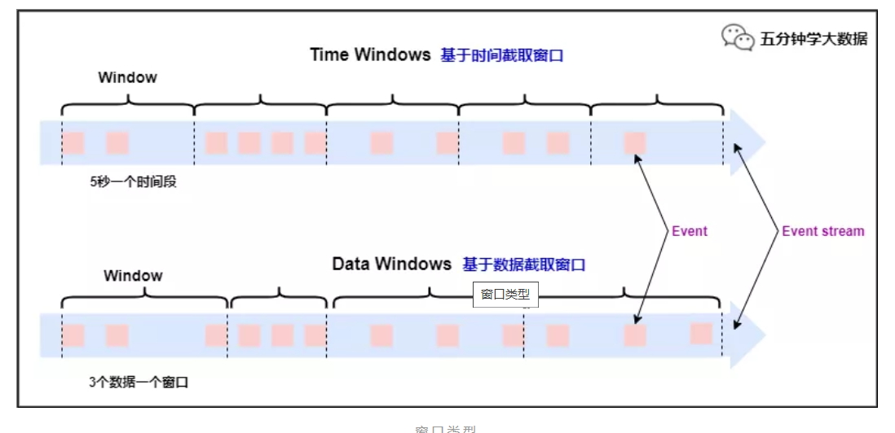
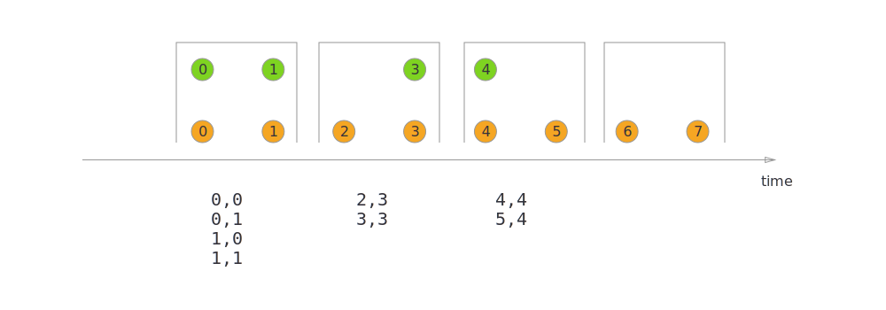
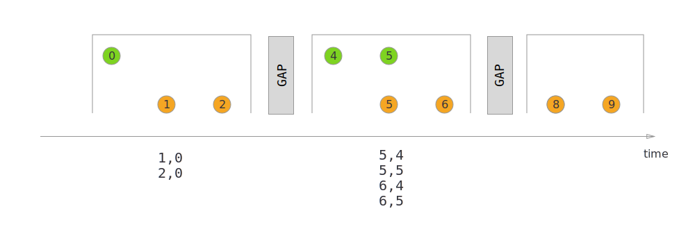

Flink概念


# Task和slot

## task和算子链

==算子==即流中的方法,概念同spark

多个连续算子称为一个==算子链==,要求算子分区不变

==task==:一个算子链,但是针对一条数据

task有可能有多个算子,也可能只有一个


默认情况,Flink会==自己优化==,尽可能合并算子为算子链来优化,这个选项也是可以关闭的

也可以手动指定

```scala
//关闭算子链
StreamExecutionEnvironment.disableOperatorChaining()

//以当前 operator 为起点开始新的连接。如下的两个 mapper 算子会链接在一起而 filter 算子则不会和第一个 mapper 算子进行链接。
someStream.filter(...).map(...).startNewChain().map(...)

//任何算子不能和当前算子进行链接
someStream.map(...).disableChaining()
```


spark也是会做算子链来减少shuffle的

但是Flink的==shuffle==和spark有区别:

spark的shuffle是数据从一个分区流到多个分区,没有==1->n==这种关系的会被合并为一个stage

flink这里的shuffle当前数据随机发送到另一个编号的分区里,实际上是一种分配策略

可以理解为Flink没有同spark一样的shuffle


> PS:只有PartitionTransformation的Transformation才能触发重分区,之后的每个算子会保留上一个算子的Transformation(不是继承)
>
> 后续算子不一定进行分区操作,但是Transformation会嵌套之前所有的Transformation

## slot和资源组

slot其实就是资源,用来运行一个task的资源

slot是抽象的，没有严格的限制，只是确定当前tm可以接受多少个task

==不共享，slot就是线程数，共享之后不是==

> slot：保证每个算子链只能有一个实例（线程）的隔离机制
>
> 运行不同算子链实例的线程组
>
> 为了线程安全

slot=核数,因为只做了内存隔离,为了避免CPU竞争,一般等于核数

并行度=总slot数


slot默认是可以共享的

如果不共享,上游task和下游task不在同一个slot,进行数据交换(本机or网络)

> 不共享时一个taskmanager的并行度=最慢的task执行时间/source的task的执行时间
>
> 这里不考虑背压的情况

如下图:


设置共享

如果不设置共享,就和流水线一样,资源利用率不够高,可能会出现其他算子等待一个算子计算的情况,从而出现背压

同时并行度基本等于taskManager数,比较低

设置共享止之后,task结束之后会立马执行另一个task(极大概率是自己的下游task)

> PS :TaskManager是一个进程,如果是内部slot数据交换,会很快
>
> 设置共享之后来看实际并行度最大等于slot的个数(没有CPU切换的情况下)


### ==资源组==

可以设置资源组来减少数据交换

```scala
//配置算子的资源组。Flink 会将相同资源组的算子放置到同一个 slot 槽中执行，并将不同资源组的算子分配到不同的 slot 槽中，从而实现 slot 槽隔离。如果所有输入操作都在同一个资源组, 资源组将从输入算子开始继承。 Flink 默认的资源组名称为 "default"，算子可以显式调用 slotSharingGroup("default") 加入到这个资源组中。

someStream.filter(...).slotSharingGroup("name")
```


# 分区和Keyby

## 分区

分区类似于spark的分区概念,相同分区的数据会在同一个taskmanager中执行

下游算子分区数=IPC channel的结果个数(源码)=下游算子并行度

由于taskManager和slot的关系,相同分区的数据只是在同一个taskmanager,并不一定是同一个slot

==分区和slot没有一一对应关系,可以一对多==

分区更像是一种逻辑上的,分区决定task读写数据的哪部分

从这里看,flink的并行度逻辑上是和资源无关的,但是一般设置并行度=slots(还是避免CPU竞争)

实际并行度=slots，到那时并行度每个算子可以随意设置，这时会改变分区数


> PS:这里要注意,spark是一个分区的数据在一个excutor中执行,可以多线程利用多个cpu
>
> 但是Flink不同,flink同一个分区的数据只能出现在同一个taskmanager中,一个task只能出现在一个slot,所以只能利用一个CPU
>
> 也就是说
>
> spark的一个执行进程(excutor),处理一个分区的所有数据
>
> 而Flink的一个执行进程(taskmanager),同时处理n(slot数)个分区的数据

## 分区策略

分区策略是指数据从当前taskmanager到另外一个taskmanager的过程(数据)

Flink提供了8钟分区策略:

* GlobalPartitioner(分配到下游第一个分区,实现全局有序,例如windowAll算子)
* ShufflePartitioner(random随机分配)
* RebalancePartitioner(轮询,主要是均匀分配)
* RescalePartitioner(缩放,上游的分区和下游的分区在一个节点,没有数据转移)
  * 只与本机建立channel
* BroadcastPartitioner(广播,上游的数据会发送到下游的每个分区)
* ForwardPartitioner(并行度一致,且上下游分区在同一节点)
  * 只与本机建立channel
* KeyGroupStreamPartitioner(HASH,keyby使用的方式)
* CustomPartitionerWrapper(自定义)

## keyby

keyby作用等同于spark的groupby,但是实现不太一样

spark时将相同的key的数据变成一个数据集,flink时流式,没有数据集的概念,一般情况下算子处理的只是单条数据

因此,Flink对DataStream做了扩展,经过keyby之后变成可KeyedStream

KeyedStream中额外扩展了一个KeySelector,使用KeySelector可以得到key

然后又新建了Partitioner分区器,KeyGroupStreamPartitioner包装了KeySelector,并重写了 selectChannel分区方法

分区算法==固定==为	

keyGroupId =key.hashCode()  % maxParallelism

partition=keyGroupId * parallelism / maxParallelism

这样,相同key的数据同进入相同的分区,算子也可以调用KeySelector得到他的key

相同的key可以利用状态等做处理,就可以打到类似分组的效果

> PS:keyby会有shuffle,但是如果source端的分区算法和keyby一致,且分区数一致,可以避免shuffle
>
> 实际没什么意义,因为source操作是在每不同slot执行的(依据并行度),数据来源就不能保证分区
>
> 除非让source端分区算法和keyby的分区算法一致,需要source端来做匹配(kafka可以自定义分区算法)

# 时间语义（过期）

==1.12标记过期了时间语义，现在默认就是事件时间==

```java
env.getConfig().setAutoWatermarkInterval(0);//禁用水位线，即以前的ProcessingTime
```

```scala
val env: StreamExecutionEnvironment = StreamExecutionEnvironment.getExecutionEnvironment
	env.setParallelism(1)
	//设置时间戳对象（机器时间[process、source]，事件时间）
	env.setStreamTimeCharacteristic(TimeCharacteristic.EventTime)
	// 每隔5秒产生一个水位线
    env.getConfig.setAutoWatermarkInterval(5000)
```

## 机器时间

指执行相应操作的机器的系统时间。分布式系统之间可能会有不同的时间

**ProcessingTime(默认)**

消息进入算子的时间,此状态下默认水位线interval是0(其他是200ms),即不产生水位线

**IngestionTime**

消息进入source的时间

## 事件时间

消息本身所带的时间信息

# 水位线


水位线是个时间戳,代表程序认为这个时间线已经到这个时间点

但是对于**分布式系统**或者**事件时间**来说,每个机器的时间不一致,可能某个消息在系统中出现**延迟**,消息附带的时间戳比时间线早

因此需要设置一个延迟等待值,时间线相对后移一点,让大家等待消息到达

==水位线~=最大时间线-等待值==（为什么约等于？因为水位线是检测触发的，以一定的频率检测是否触发水位线）

水位线就是一个大家公认的确定消息都到达(没有消息延迟)的时间线

水位线是一个触发操作,interval默认是200ms,每200ms去检查可不可以生成新的水位线

> 水位线上是和算子绑定的,但是开启了插槽共享之后,水位线实际是和taskmanager相关,一个taskmanager的一个算子,所有key的水位线一致

## 并行流中的水位线

任务中间出现shuffle(数据下游多个算子)时,水位线取两个流中最小值

时间语义和interval是一致的,所以两个流的时间线更新都是同时触发

# 开窗

数据需要聚合时,需要在流里指定一定范围的数据做聚合,这个数据范围就是数据窗口

窗口是针对每个分组的,keyby分流之后

PS:全局窗口也是一样得逻辑,窗口的聚合操作只有一个并行度(也就是会shuffle变成1个taskmanager,实质上就是key变成default)

窗口时左闭右开的,即[0,5)

> 窗口的本质其实对数据做边界确认，确认这个数据是哪个窗口的，然后更新该窗口的状态，窗口关闭时销毁这个窗口的状态
>
> 所以，滚动窗口和Session本质只有一个状态组，滑动窗口要保留多个状态组(keygroup的状态)（注意：保留的不是多份数据，是多份状态）



## 分类

主要有几个分类规则

* 按时间或计数分
  * 非时间窗口都是GlobalWindow(代码上的划分)
* 按窗口类型分:
  * 滚动:Tumbling
  * 滑动:Sliding
  * 会话:Session
  * 全局:Global  (全局窗口和时间类型就没有关系了)
* 机器时间或事件时间

因此有以下几种窗口

> PS:滚动窗口只保留一份数据,滑动窗口保留(窗口大小/滑动时间)个数据


```scala
//滚动，事件时间
val avgTemp = sensorData
  .keyBy(_.id)
  .window(TumblingEventTimeWindows.of(Time.seconds(1)))
  .process(new TemperatureAverager)
//滚动，机器时间
val avgTemp = sensorData
  .keyBy(_.id)
  .window(TumblingProcessingTimeWindows.of(Time.seconds(1)))
  .process(new TemperatureAverager)
//滑动，事件时间
val slidingAvgTemp = sensorData
  .keyBy(_.id)
  .window(SlidingEventTimeWindows.of(Time.hours(1), Time.minutes(15)))
  .process(new TemperatureAverager)
//滑动，机器时间
val slidingAvgTemp = sensorData
  .keyBy(_.id)
  .window(SlidingProcessingTimeWindows.of(Time.hours(1), Time.minutes(15)))
  .process(new TemperatureAverager)

//会话窗口：间隔超过gap后为新窗口
val sessionWindows = sensorData
  .keyBy(_.id)
  .window(EventTimeSessionWindows.withGap(Time.minutes(15)))
  .process(...)

val sessionWindows = sensorData
  .keyBy(_.id)
  .window(ProcessingTimeSessionWindows.withGap(Time.minutes(15)))
  .process(...)
```

> * windowAll的并行度为1,且不可改变(类似于keyby(x=>1))
> * GlobalWindow不是GlobalWindows
> * GlobalWindows没有窗口闭合概念,想要触发计算需要触发器来实现
> * WindowFunction是窗口闭合才会触发,GlobalWindows无法触发

## 聚合

* reduce

  * 归约,多个同类型数据变成一个

* aggregate

  * 先定义个累加器,然后每个数据更新累加器

* process（只是处理，不聚合，利用状态）

  顺序：reduce/aggregate	-> process

  reducer/aggregate 是来一条计算一条,process是先缓存起来,等到满足条件,再转成list

  输入值是个迭代器，所以process数据是批量计算的

  > 本质上window是按照window定义给每条分配相应的window，然后在window闭合的时候process，并更新状态
  
  ****

```scala
val env: StreamExecutionEnvironment = StreamExecutionEnvironment.getExecutionEnvironment
val stream: DataStream[SourceReading] = env.addSource(new SendSource).setParallelism(1)
    stream.map(sr=>(sr.id,sr.temperature))
          .keyBy(_._1)
          .timeWindow(Time.seconds(5))
		  .aggregate(new MyAvgFunction)
          .print()
    env.execute()
  }

class MyAvgFunction extends AggregateFunction[(String,Double),(String,Double,Int),(String,Double)]{
  override def createAccumulator(): (String, Double, Int) = {
    (null,0.0,0)
  }
```

全局聚合函数

```scala
val env: StreamExecutionEnvironment = StreamExecutionEnvironment.getExecutionEnvironment
    env.setParallelism(1)
    env.addSource(new SendSource)
        .map(sr=>(sr.id,sr.temperature))
        .keyBy(_._1)
        .timeWindow(Time.seconds(5))
        .process(new MyProcess)
        .print()
    env.execute()
  }

class MyProcess extends ProcessWindowFunction[(String,Double),(String,Double,Double,Long),String,TimeWindow]{
	override def process(key: String, context: Context, elements: Iterable[(String, Double)], out: Collector[(String, Double, Double,Long)]): Unit = {
		val windowEnd: Long = context.window.getEnd
//      elements.map()
      	out.collect((key,elements.maxBy(_._2)._2,elements.minBy(_._2)._2,windowEnd))
    }
```

## 迟到

对于事件时间,无论水位线设置多少,都有可能有数据延迟到达的情况,这种数据默认会被抛弃

但是在窗口中可以设置策略来处理迟到数据

```scala
val lateOutputTag = OutputTag[T]("late-data")

val input: DataStream[T] = ...

val result = input
    .keyBy(<key selector>)
    .window(<window assigner>)
    .allowedLateness(<time>)
    .sideOutputLateData(lateOutputTag)
    .<windowed transformation>(<window function>)

val lateStream = result.getSideOutput(lateOutputTag)
```

PS:这个只在WindowedStream和AllWindowedStream中有侧输出,其他多流Stream中无意义

## Trigger

触发器,消息到来做一定处理,预处理,每个窗口都有triggle,triggle决定了窗口闭合

触发器有5个方法来允许触发器处理不同的事件(Trigger):

* onElement()方法：每个元素被添加到窗口时调用
* onEventTime()方法：当一个已注册的事件时间计时器启动时调用
  * ctx(在WindowOperator中实现)可以注册定时器
* onProcessingTime()方法：当一个已注册的处理时间计时器启动时调用
* onMerge()方法：与状态性触发器相关，当使用session window时，两个触发器对应的窗口合并时，合并两个触发器的状态。
* clear() 相应窗口被清除时触发(不等同于PURGE,这里指时间戳大于等于maxTimestamp时,PURGE和FIRE可以触发多次)

FIRE:执行窗口函数,但不清除状态(非自己定义的)和数据

PURGE:执行clear函数

CONTINUE:无操作

FIRE_AND_PURGE:执行窗口函数,清除状态和元素

FIRE意味着窗口闭合

```scala
object TriggerExample {
  def main(args: Array[String]): Unit = {
    val env: StreamExecutionEnvironment = StreamExecutionEnvironment.getExecutionEnvironment
    env.setParallelism(1)
    val stream = env.addSource(new SendSource)
      .keyBy(_.id)
      .timeWindow(Time.seconds(5))
      .trigger(new MyTrigger)
      .process(new MyProcessFunc)
      .print()
    env.execute()
  }
}


class MyTrigger extends Trigger[SourceReading,TimeWindow] {
    
    var firstSeen: ValueState[Boolean] = _
    
    override def onElement(element: SourceReading, timestamp: Long, window: TimeWindow, ctx: Trigger.TriggerContext): TriggerResult = {
      firstSeen= ctx.getPartitionedState(new ValueStateDescriptor[Boolean]("firstseen",Types.of[Boolean]))
      if(!firstSeen.value()){
        val l: Long = ctx.getCurrentProcessingTime/1000*1000+1000
        ctx.registerProcessingTimeTimer(l)
        ctx.registerProcessingTimeTimer(window.getEnd)
        firstSeen.update(true)
      }
      TriggerResult.CONTINUE
    }
	//机器时间
    override def onProcessingTime(time: Long, window: TimeWindow, ctx: Trigger.TriggerContext): TriggerResult = {
      if(time==window.getEnd){
        TriggerResult.FIRE_AND_PURGE
      }else{
        println(time)
        ctx.registerProcessingTimeTimer(time+1000)
        TriggerResult.FIRE
      }
    }
	//事件时间
    override def onEventTime(time: Long, window: TimeWindow, ctx: Trigger.TriggerContext): TriggerResult = {
      TriggerResult.CONTINUE
    }

    override def clear(window: TimeWindow, ctx: Trigger.TriggerContext): Unit = {
      firstSeen.clear()
    }
  }

```


## Evictor

作用范围:

* 触发器之后,窗口计算之前
* 窗口计算之后

驱逐器能够在触发器触发之后，窗口函数使用之前或之后从窗口中清除元素。
evictBefore()在窗口函数之前使用。而 evictAfter() 在窗口函数之后使用。
在使用窗口函数之前被逐出的元素将不被处理。

```scala
class MyEvictor() extends Evictor[MyTime, TimeWindow] {
    
  override def evictBefore(iterable: lang.Iterable[TimestampedValue[MyTime]], i: Int, w: TimeWindow, evictorContext: Evictor.EvictorContext): Unit = {
    val ite: util.Iterator[TimestampedValue[MyTime]] = iterable.iterator()
    while (ite.hasNext) {
      val elment: TimestampedValue[MyTime] = ite.next()
      //指定事件事件获取到的就是事件时间
      println("驱逐器获取到的时间：" + elment.getTimestamp)
      //模拟去掉非法参数数据
      if (elment.getValue.timestamp <= 0) {
        ite.remove()
      }
    }
  }

  override def evictAfter(iterable: lang.Iterable[TimestampedValue[MyTime]], i: Int, w: TimeWindow, evictorContext: Evictor.EvictorContext): Unit = {

  }
}
```

# 流的合并

## connect

两个流合并,然后一起处理(参数变成两份)

后续算子依然是单独处理两个流,但是经过process后,类型统一,变回DataStream,变成一个流

```scala
stream1
      .connect(stream2)
      .map(i=>i,str=>str)
```

## union

作用同connet，只是要求两流类型一致

DataStream类型没有变化

join和coGroup的底层调用其实就是union，把两个流封装成了元组类（A,B）

其实从coGroup的实现原理上来说，用connect更合适，但是这里选择了unoin

## jion

双流join,匹配结果类似于inner join,两个流都有的才返回

join的底层实现是coGroup

join重写了FlatJoinCoGroupFunction.coGroup方法,所以只返回匹配上的(实际就是两层循环遍历，只要有一个null，就不会返回值)

```scala
stream1
      .join(stream2)
        .where(e=>e)
        .equalTo(_.toInt)
        .window(TumblingEventTimeWindows.of(Time.milliseconds(2)))
//		.window(SlidingEventTimeWindows.of(Time.milliseconds(2),Time.milliseconds(1)))
//		.window(EventTimeSessionWindows.withGap(Time.milliseconds(1)))
        .apply((i1,i2)=>i1+i2.toInt)
```

### Tumbling Window Join



### Sliding Window Join(慎用)

> interval join代替


### Session Window Join



### Interval Join

==只支持事件时间==

滑动窗口join的优化

> 默认包含上下界


```scala
orangeStream
    .keyBy(elem => /* select key */)
    .intervalJoin(greenStream.keyBy(elem => /* select key */))
    .between(Time.milliseconds(-2), Time.milliseconds(1))
    .process(new ProcessJoinFunction[Integer, Integer, String] {
        override def processElement(left: Integer, right: Integer, ctx: ProcessJoinFunction[Integer, Integer, String]#Context, out: Collector[String]): Unit = {
         out.collect(left + "," + right); 
        }
      });
    });
```

> 下限时间设置为负值

## coGroup

join的底层实现

left join,full join等可以用此实现

本质是把两个流分别转换成(T1->T2)元组,然后union成一个流,再做keyby

join重写了FlatJoinCoGroupFunction.coGroup方法,所以只返回匹配上的(实际就是两层循环遍历，只要有一个null，就不会返回值)

这里需要自定义处理逻辑，实际底层也是重写coGroup方法

所以类型变成了两个列表,join是元组

```scala
stream2
	.coGroup(stream1)
	.where(_.toInt)
	.equalTo(i=>i)
	.window(EventTimeSessionWindows.withGap(Time.milliseconds(10)))
	.apply(func)
	.flatMap()
```

# RichFunction

当我们使用富函数时，我们可以实现两个额外的方法：
- open()方法是rich function的初始化方法，当一个算子例如map或者filter被调用之前open()会被调用。open()函数通常用来做一些只需要做一次即可的初始化工作。
- close()方法是生命周期中的最后一个调用的方法，通常用来做一些清理工作。


通常用的函数都是AbstractRichFunction的子类,它还实现了:

- getRuntimeContext() 获得上下文环境
- setRuntimeContext()写入上下文环境

另外，`getRuntimeContext()`方法提供了函数的RuntimeContext的一些信息，例如函数执行的并行度，当前子任务的索引，当前子任务的名字。同时还它还包含了访问**分区状态**的方法。

```scala
class MyFlatMap extends RichFlatMapFunction[Int, (Int, Int)] {
  var subTaskIndex = 0

  override def open(configuration: Configuration): Unit = {
    subTaskIndex = getRuntimeContext.getIndexOfThisSubtask
    // 做一些初始化工作
    // 例如建立一个和HDFS的连接
  }

  override def flatMap(in: Int, out: Collector[(Int, Int)]): Unit = {
    if (in % 2 == subTaskIndex) {
      out.collect((subTaskIndex, in))
    }
  }

  override def close(): Unit = {
    // 清理工作，断开和HDFS的连接。
  }
}
```

##  State

> 目前只有键控流的算子可以直接使用状态,其他Stream虽然实现了RichFunction,但是不支持状态
>
> KeyedStream 有部分算子有带state的版本,简化代码编写

* ValueState
* ListState
* MapState
* ReducingState
  * 底层存了哈希表<key,<name,value>>
  * 描述符里存reduce函数,更新value
* AggregatingState
  * 同window的aggregate,创建了一个累加器,所以输出类型可以不一致

```scala
object RichFlatMapStateExample {
  def main(args: Array[String]): Unit = {
    val env = StreamExecutionEnvironment.getExecutionEnvironment
    env.setParallelism(1)
    val stream = env
      .addSource(new SendSource)
      .keyBy(_.id)
      .flatMap(new TemperatureAlertFunction(1.7))
    stream.print()
    env.execute()
  }

 class TemperatureAlertFunction(val threshold:Double) extends RichFlatMapFunction[SourceReading,(String,Double,Double)] {
   lazy val lasttemp: ValueState[Double] = getRuntimeContext.getState(new ValueStateDescriptor[Double]("lasttemp",Types.of[Double]))
   override def flatMap(value: SourceReading, out: Collector[(String, Double, Double)]): Unit = {
     val diff: Double = (lasttemp.value()-value.temperature).abs
     if(diff>threshold){
       out.collect((value.id,value.temperature,diff))
     }
     lasttemp.update(value.temperature)
   }
 }
}
```

## State TTL

state的生命周期,在描述符中定义

```scala
val ttlConfig = StateTtlConfig
    .newBuilder(Time.seconds(1))
    .setUpdateType(StateTtlConfig.UpdateType.OnCreateAndWrite)
    .setStateVisibility(StateTtlConfig.StateVisibility.NeverReturnExpired)
    .build
    
val stateDescriptor = new ValueStateDescriptor[String]("text state", classOf[String])
stateDescriptor.enableTimeToLive(ttlConfig)
```

## 累加器

累加器没有使用state,实现原理类似于spark,在每个taskmanager中启用一份累加器,最后合并到Jobmanager

所以他只能获取本地的存储值,全局值在JobManager中保存

上下文环境的getAccumulator方法也只是获取本地的累加器,没啥用

==这个累加器的值一般在UI中查看,和计算关系不大==,相当于Metrics,想要得到累加器的结果,只有env的返回Result中存在

官方写的计数器,使用方法:

```scala
public class CounterTest {

    public static void main(String[] args) throws Exception {
        //获取执行环境
        final StreamExecutionEnvironment env = StreamExecutionEnvironment.getExecutionEnvironment();

        //--hostname 10.24.14.193  --port 9000
        final ParameterTool params = ParameterTool.fromArgs(args);
        String hostname = params.has("hostname") ? params.get("hostname") : "localhost";
        int port = params.has("port") ? params.getInt("port") : 9000;

        System.out.println("hostName=" + hostname + " port=" + port);

        //数据来源
        DataStream<String> text = env.socketTextStream(hostname, port, "\n");

        //operate
        text.map(new RichMapFunction<String, String>() {

            //第一步：定义累加器
            private IntCounter numLines = new IntCounter();

            @Override
            public void open(Configuration parameters) throws Exception {
                super.open(parameters);

                //第二步：注册累加器
                getRuntimeContext().addAccumulator("num-lines", this.numLines);
            }

            @Override
            public String map(String s) throws Exception {
                //第三步：累加
                this.numLines.add(1);
                return s;
            }
        });

        //数据去向
        text.print();

        //执行
        JobExecutionResult socketTest = env.execute("socketTest");

        //第四步：结束后输出总量；如果不需要结束后持久化，可以省去，因为在flinkUI中可以看到
        //String total = socketTest.getAccumulatorResult("num-lines").toString();
```


# ProcessFunction

ProcessFunction继承自RichFunction,同时额外扩展了一些功能

* 侧输出
* 定时器(只在KeyedProcessFunction中有实现,其他没有做实现)
* 基于上一条,其他ProcessFunction虽然都可以重写onTimer方法,但是注册会报错

Flink提供了8个Process Function：

* ProcessFunction
* KeyedProcessFunction
* CoProcessFunction
* ProcessJoinFunction
* BroadcastProcessFunction
  * 无定时器
* KeyedBroadcastProcessFunction
* ProcessWindowFunction
  * 无定时器
* ProcessAllWindowFunction
  * 无定时器

## 侧输出

```scala
val env: StreamExecutionEnvironment = StreamExecutionEnvironment.getExecutionEnvironment
env.setParallelism(1)
val stream: DataStream[SourceReading] = env.addSource(new SendSource)
      .process(new FreezingMonitor)
	//获取侧输出
val stream2= stream.getSideOutput(new OutputTag[String]("freezing-alarms"))
    stream2.print()
    env.execute()
  }

class FreezingMonitor extends ProcessFunction[SourceReading,SourceReading]{
    
    override def processElement(value: SourceReading, ctx: ProcessFunction[SourceReading, SourceReading]#Context, out: Collector[SourceReading]): Unit = {
      if(value.temperature<32){
          //侧输出
        ctx.output(new OutputTag[String]("freezing-alarms"),s"${value.temperature} freezing")
      }
      out.collect(value)
    }
  }
```

## 定时器

原理:

定时器任务是注册一个定时任务,当水位线第一次超过定时任务的时间戳时,触发onTimer函数

源码中维护了一个queue(针对每个key)来保存注册的定时任务,因此可以注册多个,但是如果时间戳相同,不会放入queue

queue实质实现是个堆,因此按时间戳排序

因此,注册多个相同的时间戳不会重复执行多次onTimer

> 如果是window,定时器会被Trigger接管(Trigger的ctx也可以注册定时器)
>
> 只能在keyedProcessFunction中使用

==定时器是也是状态,也会被checkpoint==

```scala
class TempIncreaseAlertFunction extends KeyedProcessFunction[String,SourceReading,String]{
  lazy val lastTemp: ValueState[Double] = getRuntimeContext.getState(new ValueStateDescriptor[Double]("last-temp",Types.of[Double]))
  lazy val currentTimer: ValueState[Long] = getRuntimeContext.getState(new ValueStateDescriptor[Long]("timer",Types.of[Long]))
    //定时器
  override def onTimer(timestamp: Long, ctx: KeyedProcessFunction[String, SourceReading, String]#OnTimerContext, out: Collector[String]): Unit = {
      out.collect("传感器id为：" + ctx.getCurrentKey + " 的传感器温度值已经连续1s上升了！")
      currentTimer.clear()
    }
//每个元素的执行操作
  override def processElement(value: SourceReading, ctx: KeyedProcessFunction[String, SourceReading, String]#Context, out: Collector[String]): Unit = {
    val previousTemp: Double = lastTemp.value()
    val currentTime: Long = currentTimer.value()
    if (previousTemp==0.0||value.temperature<previousTemp){
       //删除定时器
      ctx.timerService().deleteProcessingTimeTimer(currentTime)
      currentTimer.clear()
    }else if(value.temperature>previousTemp&&currentTime==0){
      val timerTime: Long = value.ts+1000
        //注册定时器,时间戳
    ctx.timerService().registerProcessingTimeTimer(timerTime)
      currentTimer.update(timerTime)
    }

  }
```

# 广播流

* 先定义一个Map状态描述符
* 用描述符把被广播流变成BroadcastStream
* 接收流connect广播流
* process算子,实现BroadcastProcessFunction 或 KeyedBroadcastProcessFunction
* 重写processBroadcastElement方法,被广播流元素更新,写入MAP
* 重写processElement方法,接收流处理操作

>  流和流以及task和task之间是没有直接通讯的,都是通过state来进行沟通,processBroadcastElement有读写状态的权限,另一个只有读的权限
>
>  MapStateDescriptor里的key和分组key没有一毛钱关系,这里不知道为啥使用MapState,感觉上没有必要
>
>  广播流和可以普通的流一样操作,不一定非要使用State(但一定要声明MapState)

广播流原理：

* 被广播的流的数据会发送给下游所有

```scala
// 一个 map descriptor，它描述了用于存储规则名称与规则本身的 map 存储结构
MapStateDescriptor<String, Rule> ruleStateDescriptor = new MapStateDescriptor<>(
			"RulesBroadcastState",
			BasicTypeInfo.STRING_TYPE_INFO,
			TypeInformation.of(new TypeHint<Rule>() {}));
		
// 广播流，广播规则并且创建 broadcast state
BroadcastStream<Rule> ruleBroadcastStream = ruleStream
                        .broadcast(ruleStateDescriptor);
//接收流
stream.connet(ruleBroadcastStream).process()
```

```scala
new KeyedBroadcastProcessFunction<Color, Item, Rule, String>() {

    // 存储部分匹配的结果，即匹配了一个元素，正在等待第二个元素
    // 我们用一个数组来存储，因为同时可能有很多第一个元素正在等待
    private final MapStateDescriptor<String, List<Item>> mapStateDesc =
        new MapStateDescriptor<>(
            "items",
            BasicTypeInfo.STRING_TYPE_INFO,
            new ListTypeInfo<>(Item.class));

    // 与之前的 ruleStateDescriptor 相同
    private final MapStateDescriptor<String, Rule> ruleStateDescriptor = 
        new MapStateDescriptor<>(
            "RulesBroadcastState",
            BasicTypeInfo.STRING_TYPE_INFO,
            TypeInformation.of(new TypeHint<Rule>() {}));

    @Override
    public void processBroadcastElement(Rule value,
                                        Context ctx,
                                        Collector<String> out) throws Exception {
        ctx.getBroadcastState(ruleStateDescriptor).put(value.name, value);
    }

    @Override
    public void processElement(Item value,
                               ReadOnlyContext ctx,
                               Collector<String> out) throws Exception {

        final MapState<String, List<Item>> state = getRuntimeContext().getMapState(mapStateDesc);
        final Shape shape = value.getShape();
    
        for (Map.Entry<String, Rule> entry :
                ctx.getBroadcastState(ruleStateDescriptor).immutableEntries()) {
            final String ruleName = entry.getKey();
            final Rule rule = entry.getValue();
    
            List<Item> stored = state.get(ruleName);
            if (stored == null) {
                stored = new ArrayList<>();
            }
    
            if (shape == rule.second && !stored.isEmpty()) {
                for (Item i : stored) {
                    out.collect("MATCH: " + i + " - " + value);
                }
                stored.clear();
            }
    
            // 不需要额外的 else{} 段来考虑 rule.first == rule.second 的情况
            if (shape.equals(rule.first)) {
                stored.add(value);
            }
    
            if (stored.isEmpty()) {
                state.remove(ruleName);
            } else {
                state.put(ruleName, stored);
            }
        }
    }
}
```

# CheckpointedFunction

CheckpointedFunction是个接口,用来做检查点的

目前用来扩展状态功能,比如非KeyedProcessFunction的状态，但是只支持ListState

由于StreamingRuntimeContext只保存keyedStateStore,KeyedProcessFunction之外的状态不保存

若也想实现状态功能,需要继承CheckpointedFunction

> PS：状态其实还是保存在每个taskManager上，只是持久化在Jobmanager中执行
>
> checkpoint中保存的其实是状态的列表（对应不同的并行度），每个并行度对应一个ListState
>
> 但是在做checkpoint时对列表做了合并，使用时一般不按照List来使用，按照Value使用
>
> why：为什么要用ListState不用ValueState？
>
> 重新恢复时可能会出现并行度改变，并行度减少时有可能丢失状态，所以用List，这样就算并行度减少，也可以由相应逻辑处理

`CheckpointedFunction` 接口提供了访问 non-keyed state 的方法，需要实现如下两个方法：

```scala
void snapshotState(FunctionSnapshotContext context) throws Exception;

void initializeState(FunctionInitializationContext context) throws Exception;
```

进行 checkpoint 时会调用 `snapshotState()`。 用户自定义函数初始化时会调用 `initializeState()`，初始化包括第一次自定义函数初始化和从之前的 checkpoint 恢复。 因此 `initializeState()` 不仅是定义不同状态类型初始化的地方，也需要包括状态恢复的逻辑。

当前 operator state 以 list 的形式存在。这些状态是一个 *可序列化* 对象的集合 `List`，彼此独立，方便在改变并发后进行状态的重新分派。 换句话说，这些对象是重新分配 non-keyed state 的最细粒度。根据状态的不同访问方式，有如下几种重新分配的模式：


* **Even-split redistribution:** 每个运算符都返回一个状态元素列表。从逻辑上讲，整个状态是所有列表的串联。在还原/重新分发时，该列表被平均分为与并行运算符一样多的子列表。每个运算符都有一个子列表，该子列表可以为空，也可以包含一个或多个元素。例如，如果并行度为1，则运算符的检查点状态包含元素，`element1`并且`element2`在将并行度增加为2时，`element1`可能会在运算符实例0中结束，而`element2`将转到运算符实例1。


* **Union redistribution:** 每个算子保存一个列表形式的状态集合。整个状态由所有的列表拼接而成。当作业恢复或重新分配时，每个算子都将获得所有的状态数据。 如果列表可能有很高的基数，请不要使用此功能。检查点元数据将存储每个列表项的偏移量，这可能导致RPC帧大小或内存不足错误。

```scala
class BufferingSink(threshold: Int = 0)
  extends SinkFunction[(String, Int)]
    with CheckpointedFunction {

  @transient
  private var checkpointedState: ListState[(String, Int)] = _

  private val bufferedElements = ListBuffer[(String, Int)]()

  override def invoke(value: (String, Int), context: Context): Unit = {
    bufferedElements += value
    if (bufferedElements.size == threshold) {
      for (element <- bufferedElements) {
        // send it to the sink
      }
      bufferedElements.clear()
    }
  }

  override def snapshotState(context: FunctionSnapshotContext): Unit = {
    checkpointedState.clear()
    for (element <- bufferedElements) {
      checkpointedState.add(element)
    }
  }
	//初始化函数的上下文环境可以访问checpoint
  override def initializeState(context: FunctionInitializationContext): Unit = {
      //初始化状态
    val descriptor = new ListStateDescriptor[(String, Int)](
      "buffered-elements",
      TypeInformation.of(new TypeHint[(String, Int)]() {})
    )
	
    checkpointedState = context.getOperatorStateStore.getListState(descriptor)

    if(context.isRestored) {
      for(element <- checkpointedState.get()) {
        bufferedElements += element
      }
    }
  }

}
```

# 一致性保证


* **Source 端**：需要source端支持重消费，配合状态和检查点即可完成。

* **Flink 内部端**：利用 Checkpoint 机制，把状态存盘，发生故障的时候可以恢复，保证内部的状态一致性。

  [Flink可靠性的基石-checkpoint机制详细解析](https://mp.weixin.qq.com/s?__biz=Mzg2MzU2MDYzOA==&mid=2247483947&idx=1&sn=adae434f4e32b31be51627888e7d9f76&chksm=ce77f4faf9007decd2f78a788a89e6777bb7bec79f4e59093474532ca5cf774284e2fe35e1bd&token=1679639512&lang=zh_CN&scene=21#wechat_redirect)

* **Sink 端**：sink端需要支持幂等性或事务（分布式事务->二阶段提交）

## 可重置的源函数

应用程序只有使用可以重播输出数据的数据源时，才能提供令人满意的一致性保证。如果外部系统暴露了获取和重置读偏移量的API，那么source函数就可以重播源数据。这样的例子包括一些能够提供文件流的偏移量的文件系统，或者提供seek方法用来移动到文件的特定位置的文件系统。或者Apache Kafka这种可以为每一个主题的分区提供偏移量并且可以设置分区的读位置的系统。一个反例就是source连接器连接的是socket，socket将会立即丢弃已经发送过的数据。

一个可重置的源函数需要实现CheckpointedFunction接口，还需要能够存储读偏移量和相关的元数据，例如文件的路径，分区的ID。这些数据将被保存在list state或者union list state中。

下面的例子将CountSource重写为可重置的数据源。

**scala version**

```scala
class ResettableCountSource
    extends SourceFunction[Long] with CheckpointedFunction {

  var isRunning: Boolean = true
  var cnt: Long = _
  var offsetState: ListState[Long] = _

  override def run(ctx: SourceFunction.SourceContext[Long]) = {
    while (isRunning && cnt < Long.MaxValue) {
      // synchronize data emission and checkpoints
      ctx.getCheckpointLock.synchronized {
        cnt += 1
        ctx.collect(cnt)
      }
    }
  }

  override def cancel() = isRunning = false

  override def snapshotState(
    snapshotCtx: FunctionSnapshotContext
  ): Unit = {
    // remove previous cnt
    offsetState.clear()
    // add current cnt
    offsetState.add(cnt)
  }

  override def initializeState(
      initCtx: FunctionInitializationContext): Unit = {

    val desc = new ListStateDescriptor[Long](
      "offset", classOf[Long])
    offsetState = initCtx
      .getOperatorStateStore
      .getListState(desc)
    // initialize cnt variable
    val it = offsetState.get()
    cnt = if (null == it || !it.iterator().hasNext) {
      -1L
    } else {
      it.iterator().next()
    }
  }
}
```

## 幂等sink连接器

对于大多数应用，SinkFunction接口足以实现一个幂等性写入的sink连接器了。需要以下两个条件：

* 结果数据必须具有确定性的key，在这个key上面幂等性更新才能实现。例如一个计算每分钟每个传感器的平均温度值的程序，确定性的key值可以是传感器的ID和每分钟的时间戳。确定性的key值，对于在故障恢复的场景下，能够正确的覆盖结果非常的重要。
* 外部系统支持针对每个key的更新，例如关系型数据库或者key-value存储。

下面的例子展示了如何实现一个针对JDBC数据库的幂等写入sink连接器，这里使用的是Apache Derby数据库。

```java
val readings: DataStream[SensorReading] = ...

// write the sensor readings to a Derby table
readings.addSink(new DerbyUpsertSink)

// -----

class DerbyUpsertSink extends RichSinkFunction[SensorReading] {
  var conn: Connection = _
  var insertStmt: PreparedStatement = _
  var updateStmt: PreparedStatement = _

  override def open(parameters: Configuration): Unit = {
    // connect to embedded in-memory Derby
    conn = DriverManager.getConnection(
       "jdbc:derby:memory:flinkExample",
       new Properties())
    // prepare insert and update statements
    insertStmt = conn.prepareStatement(
      "INSERT INTO Temperatures (sensor, temp) VALUES (?, ?)")
    updateStmt = conn.prepareStatement(
      "UPDATE Temperatures SET temp = ? WHERE sensor = ?")
  }

  override def invoke(SensorReading r, context: Context[_]): Unit = {
    // set parameters for update statement and execute it
    updateStmt.setDouble(1, r.temperature)
    updateStmt.setString(2, r.id)
    updateStmt.execute()
    // execute insert statement
    // if update statement did not update any row
    if (updateStmt.getUpdateCount == 0) {
      // set parameters for insert statement
      insertStmt.setString(1, r.id)
      insertStmt.setDouble(2, r.temperature)
      // execute insert statement
      insertStmt.execute()
    }
  }

  override def close(): Unit = {
    insertStmt.close()
    updateStmt.close()
    conn.close()
  }
}
```

## 事务性sink连接器(二阶段提交)

二阶段提交流程:

* prepare:协调者(jobmanager)询问参与者(taskmanager)是否可以提交
* 参与者返回ack
* commit:协调者发起commit请求
* 参与者commit,并返回提交结果
* 协调者回收提交结果,如果有失败,发起rollback,如果成功,发起commit(利用外部的事务特性)

要求:

* 外部系统必须提供事务支持，或者sink的实现能在外部系统上模拟事务功能。
* 在检查点操作期间，事务必须处于open状态，并接收这段时间数据的持续写入。
* 事务必须等到检查点操作完成的通知到来才可以提交。在恢复周期中，可能需要一段时间等待。如果sink系统关闭了事务（例如超时了），那么未被commit的数据将会丢失。
* sink必须在进程挂掉后能够恢复事务或重启事务。一些sink系统会提供事务ID，用来commit或者abort一个开始的事务。
* commit一个事务必须是一个幂等性操作。sink系统或者外部系统能够观察到事务已经被提交，或者重复提交并没有副作用。

下面的例子可能会让上面的一些概念好理解一些。

```scala
class TransactionalFileSink(val targetPath: String, val tempPath: String)
    extends TwoPhaseCommitSinkFunction[(String, Double), String, Void](
      createTypeInformation[String].createSerializer(new ExecutionConfig),
      createTypeInformation[Void].createSerializer(new ExecutionConfig)) {

  var transactionWriter: BufferedWriter = _

  // Creates a temporary file for a transaction into
  // which the records are written.
  override def beginTransaction(): String = {
    // path of transaction file
    // is built from current time and task index
    val timeNow = LocalDateTime.now(ZoneId.of("UTC"))
      .format(DateTimeFormatter.ISO_LOCAL_DATE_TIME)
    val taskIdx = this.getRuntimeContext.getIndexOfThisSubtask
    val transactionFile = s"$timeNow-$taskIdx"

    // create transaction file and writer
    val tFilePath = Paths.get(s"$tempPath/$transactionFile")
    Files.createFile(tFilePath)
    this.transactionWriter = Files.newBufferedWriter(tFilePath)
    println(s"Creating Transaction File: $tFilePath")
    // name of transaction file is returned to
    // later identify the transaction
    transactionFile
  }

  /** Write record into the current transaction file. */
  override def invoke(
      transaction: String,
      value: (String, Double),
      context: Context[_]): Unit = {
    transactionWriter.write(value.toString)
    transactionWriter.write('\n')
  }

  /** Flush and close the current transaction file. */
  override def preCommit(transaction: String): Unit = {
    transactionWriter.flush()
    transactionWriter.close()
  }

  // Commit a transaction by moving
  // the precommitted transaction file
  // to the target directory.
  override def commit(transaction: String): Unit = {
    val tFilePath = Paths.get(s"$tempPath/$transaction")
    // check if the file exists to ensure
    // that the commit is idempotent
    if (Files.exists(tFilePath)) {
      val cFilePath = Paths.get(s"$targetPath/$transaction")
      Files.move(tFilePath, cFilePath)
    }
  }

  // Aborts a transaction by deleting the transaction file.
  override def abort(transaction: String): Unit = {
    val tFilePath = Paths.get(s"$tempPath/$transaction")
    if (Files.exists(tFilePath)) {
      Files.delete(tFilePath)
    }
  }
}
```

TwoPhaseCommitSinkFunction[IN, TXN, CONTEXT]包含如下三个范型参数：

* IN表示输入数据的类型。
* TXN定义了一个事务的标识符，可以用来识别和恢复事务。
* CONTEXT定义了自定义的上下文。

TwoPhaseCommitSinkFunction的构造器需要两个TypeSerializer。一个是TXN的类型，另一个是CONTEXT的类型。

最后，TwoPhaseCommitSinkFunction定义了五个需要实现的方法：

* beginTransaction(): TXN开始一个事务，并返回事务的标识符。
* invoke(txn: TXN, value: IN, context: Context[_]): Unit将值写入到当前事务中。
* preCommit(txn: TXN): Unit预提交一个事务。一个预提交的事务不会接收新的写入。
* commit(txn: TXN): Unit提交一个事务。这个操作必须是幂等的。
* abort(txn: TXN): Unit终止一个事务。


# 状态和检查点

## 状态

* 键控状态
  * keyedStream的相关RichFunction
* 算子状态
  * 继承CheckpointedFunction
* 广播流状态

## 状态后端

检查点的持久化容器，目前有：

* [MemoryStateBackend](https://ci.apache.org/projects/flink/flink-docs-release-1.12/zh/ops/state/state_backends.html#memorystatebackend)
* [FsStateBackend](https://ci.apache.org/projects/flink/flink-docs-release-1.12/zh/ops/state/state_backends.html#fsstatebackend)
* [RocksDBStateBackend](https://ci.apache.org/projects/flink/flink-docs-release-1.12/zh/ops/state/state_backends.html#rocksdbstatebackend)

## 检查点

检查点算法是异步快照算法，每个checkpoint是截至某一条数据完成后，这条数据流过时的所有算子的状态记录

类似于河流里随水流移动的一个浮漂，浮漂经过每个观测点时观测点状态的记录

数据在0，1，2 分别经过a,b,c 算子，检查点保存 a0,b1,c2

```scala
val env = StreamExecutionEnvironment.getExecutionEnvironment
//状态后端
val backend = new FsStateBackend(FLINK_STATEBACKEND_CHECKPOINT)
env.setStateBackend(backend)

// 每 30000ms 开始一次 checkpoint
env.enableCheckpointing(30000)
// 设置模式为精确一次 (这是默认值)
env.getCheckpointConfig.setCheckpointingMode(CheckpointingMode.EXACTLY_ONCE)
// 确认 checkpoints 之间的时间会进行 500 ms
env.getCheckpointConfig.setMinPauseBetweenCheckpoints(10000)
// Checkpoint 必须在2分钟内完成，否则就会被抛弃
env.getCheckpointConfig.setCheckpointTimeout(120000)
// 可容忍checkpoint失败次数
env.getCheckpointConfig.setTolerableCheckpointFailureNumber(3)
// 同一时间只允许一个 checkpoint 进行
env.getCheckpointConfig.setMaxConcurrentCheckpoints(1)
//有保存点的情况下优先从checkpoint恢复
env.getCheckpointConfig.setPreferCheckpointForRecovery(true)
//设置全局并行度
//  env.setParallelism(3)
//重启策略
//PS:默认策略会重启int最大值次，导致任务一直处于重启状态，checkpoint出现连续空文件夹，同时导致有效checkpoint无法使用
env.setRestartStrategy(RestartStrategies.fixedDelayRestart(2, Time.seconds(30)))

```


Flink 使用 [Chandy-Lamport algorithm](https://en.wikipedia.org/wiki/Chandy-Lamport_algorithm) 算法的一种变体，称为异步 barrier 快照（*asynchronous barrier snapshotting*）。

当 checkpoint coordinator（job manager 的一部分）指示 task manager 开始 checkpoint 时，它会让所有 sources 记录它们的偏移量，并将编号的 *checkpoint barriers* 插入到它们的流中。这些 barriers 流经 job graph，标注每个 checkpoint 前后的流部分。


Checkpoint *n* 将包含每个 operator 的 state，这些 state 是对应的 operator 消费了**严格在 checkpoint barrier \*n\* 之前的所有事件，并且不包含在此（checkpoint barrier \*n\*）后的任何事件**后而生成的状态。

当 job graph 中的每个 operator 接收到 barriers 时，它就会记录下其状态。拥有两个输入流的 Operators（例如 `CoProcessFunction`）会执行 *barrier 对齐（barrier alignment）* 以便当前快照能够包含消费两个输入流 barrier 之前（但不超过）的所有 events 而产生的状态。


Flink 的 state backends 利用写时复制（copy-on-write）机制允许当异步生成旧版本的状态快照时，能够不受影响地继续流处理。只有当快照被持久保存后，这些旧版本的状态才会被当做垃圾回收。

## 保存点

手动执行的检查点，目前与检查点完全一致

## JobManager HA

分两种情况,standalone(包括k8s)和yarn

### standalone3

需要配置HA策略

```yaml
high-availability: NONE #NONE,ZOOKEEPER,或者kubernetes(下一行)
#high-availability: org.apache.flink.kubernetes.highavailability.KubernetesHaServicesFactory
high-availability.storageDir: hdfs:///user/flink/ha
high-availability.zookeeper.client.acl: open
high-availability.zookeeper.path.root: /flink
```

这里主要是需要借助外部存储元数据和leader选举(需要同时有多个job manager )

### yarn

yarn-site.xml

```xml
<property>
  <name>yarn.resourcemanager.am.max-attempts</name>
  <value>4</value>
  <description>
    The maximum number of application master execution attempts.
  </description>
</property>
```

flink-conf.yml

```yaml
yarn.application-attempts: 10
```

如果是用yarn,就不需要像standalone一样配置高可用策略,因为yarn有ApplicationMaster的自动重启机制,元数据也是存在RM里的

保障了他可以在JobManager挂了之后自动重启,因此只需要一个JobManager

## Task重启策略

### 固定延迟重启策略

如果尝试超过了给定的最大次数，作业将最终失败。在连续的重新启动尝试之间，重启策略等待一段固定长度的时间。

通过在`flink-conf.yaml`中设置如下配置参数，替代启用此策略。

```yaml
restart-strategy: fixed-delay
```

| 钥匙                         | 默认 | 类型 | 描述                                                         |
| :--------------------------- | :--- | :--- | :----------------------------------------------------------- |
| 重新启动策略。固定延迟。尝试 | 1个  | 整数 | 为失败如果宣布弗林克重试作业之前执行的次数`restart-strategy`已设置为`fixed-delay`。 |
| 重新启动策略。固定延迟。延迟 | 1秒  | 期间 | 如果`restart-strategy`将设置为，则两次连续重启尝试之间的延迟`fixed-delay`。当程序与外部系统进行交互时（例如，连接或挂起的事务在尝试重新执行之前应达到超时），延迟重试可能会有所帮助。可以使用表示法指定：“ 1分钟”，“ 20秒” |

例如：

```yaml
restart-strategy.fixed-delay.attempts: 3
restart-strategy.fixed-delay.delay: 10 s
```

固定重启重启策略也可以在程序中设置：

```scala
val env = ExecutionEnvironment.getExecutionEnvironment()
env.setRestartStrategy(RestartStrategies.fixedDelayRestart(
  3, // 尝试重启的次数
  Time.of(10, TimeUnit.SECONDS) // 延时
))
```

### 故障率重启策略

故障率重启策略在故障发生后重启作业，但是当**故障率**（每个时间间隔发生故障的次数）超过设定的限制时，作业会最终失败。一段固定长度的时间。

通过在`flink-conf.yaml`中设置如下配置参数，替代启用此策略。

```yaml
restart-strategy: failure-rate
```

| 钥匙                                   | 默认  | 类型 | 描述                                                         |
| :------------------------------------- | :---- | :--- | :----------------------------------------------------------- |
| 重新启动策略。失败率。延迟             | 1秒   | 期间 | 如果`restart-strategy`将设置为，则两次连续重启尝试之间的延迟`failure-rate`。可以使用表示法指定：“ 1分钟”，“ 20秒” |
| 重新启动策略。失败率。失败率间隔       | 1分钟 | 期间 | 测量失败率的时间间隔（如果`restart-strategy`已设置为）`failure-rate`。可以使用表示法指定：“ 1分钟”，“ 20秒” |
| 重新启动策略。失败率。最大失败次数间隔 | 1个   | 整数 | 如果`restart-strategy`设置为，则在失败的给定时间间隔内的最大重新启动次数`failure-rate`。 |

例如：

```yaml
restart-strategy.failure-rate.max-failures-per-interval: 3
restart-strategy.failure-rate.failure-rate-interval: 5 min
restart-strategy.failure-rate.delay: 10 s
```

故障率重启策略也可以在程序中设置：

```scala
val env = ExecutionEnvironment.getExecutionEnvironment()
env.setRestartStrategy(RestartStrategies.failureRateRestart(
  3, // 每个时间间隔的最大故障次数
  Time.of(5, TimeUnit.MINUTES), // 测量故障率的时间间隔
  Time.of(10, TimeUnit.SECONDS) // 延时
))
```

### 没有重启策略

作业直接失败，不尝试重启。

```yaml
restart-strategy: none
```

不重启策略也可以在程序中设置：

```scala
val env = ExecutionEnvironment.getExecutionEnvironment()
env.setRestartStrategy(RestartStrategies.noRestart())
```

# 异步 I/O 

在与外部系统交互（用数据库中的数据扩充流数据）的时候，需要考虑与外部系统的通信延迟对整个流处理应用的影响。

简单地访问外部数据库的数据，比如使用 `MapFunction`，通常意味着**同步**交互： `MapFunction` 向数据库发送一个请求然后一直等待，直到收到响应。在许多情况下，等待占据了函数运行的大部分时间。

与数据库异步交互是指一个并行函数实例可以并发地处理多个请求和接收多个响应。这样，函数在等待的时间可以发送其他请求和接收其他响应。至少等待的时间可以被多个请求摊分。大多数情况下，异步交互可以大幅度提高流处理的吞吐量。


*注意：*仅仅提高 `MapFunction` 的并行度（parallelism）在有些情况下也可以提升吞吐量，但是这样做通常会导致非常高的资源消耗：更多的并行 `MapFunction` 实例意味着更多的 Task、更多的线程、更多的 Flink 内部网络连接、 更多的与数据库的网络连接、更多的缓冲和更多程序内部协调的开销。

## 先决条件

如上节所述，正确地实现数据库（或键/值存储）的异步 I/O 交互需要支持异步请求的数据库客户端。许多主流数据库都提供了这样的客户端。

如果没有这样的客户端，可以通过创建多个客户端并使用线程池处理同步调用的方法，将同步客户端转换为有限并发的客户端。然而，这种方法通常比正规的异步客户端效率低。

## 异步 I/O API

Flink 的异步 I/O API 允许用户在流处理中使用异步请求客户端。API 处理与数据流的集成，同时还能处理好顺序、事件时间和容错等。

在具备异步数据库客户端的基础上，实现数据流转换操作与数据库的异步 I/O 交互需要以下三部分：

* 实现分发请求的 `AsyncFunction`
* 获取数据库交互的结果并发送给 `ResultFuture` 的 *回调* 函数
* 将异步 I/O 操作应用于 `DataStream` 作为 `DataStream` 的一次转换操作。

下面是基本的代码模板：

```scala
/**
 * 实现 'AsyncFunction' 用于发送请求和设置回调。
 */
class AsyncDatabaseRequest extends AsyncFunction[String, (String, String)] {

    /** 能够利用回调函数并发发送请求的数据库客户端 */
    lazy val client: DatabaseClient = new DatabaseClient(host, post, credentials)

    /** 用于 future 回调的上下文环境 */
    implicit lazy val executor: ExecutionContext = ExecutionContext.fromExecutor(Executors.directExecutor())


    override def asyncInvoke(str: String, resultFuture: ResultFuture[(String, String)]): Unit = {

        // 发送异步请求，接收 future 结果
        val resultFutureRequested: Future[String] = client.query(str)

        // 设置客户端完成请求后要执行的回调函数
        // 回调函数只是简单地把结果发给 future
        resultFutureRequested.onSuccess {
            case result: String => resultFuture.complete(Iterable((str, result)))
        }
    }
}

// 创建初始 DataStream
val stream: DataStream[String] = ...

// 应用异步 I/O 转换操作
val resultStream: DataStream[(String, String)] =
    AsyncDataStream.unorderedWait(stream, new AsyncDatabaseRequest(), 1000, TimeUnit.MILLISECONDS, 100)
```

**重要提示**： 第一次调用 `ResultFuture.complete` 后 `ResultFuture` 就完成了。 后续的 `complete` 调用都将被忽略。

下面两个参数控制异步操作：

* **Timeout**： 超时参数定义了异步请求发出多久后未得到响应即被认定为失败。 它可以防止一直等待得不到响应的请求。
* **Capacity**： 容量参数定义了可以同时进行的异步请求数。 即使异步 I/O 通常带来更高的吞吐量，执行异步 I/O 操作的算子仍然可能成为流处理的瓶颈。 限制并发请求的数量可以确保算子不会持续累积待处理的请求进而造成积压，而是在容量耗尽时触发反压。

### 超时处理

当异步 I/O 请求超时的时候，默认会抛出异常并重启作业。 如果你想处理超时，可以重写 `AsyncFunction#timeout` 方法。

### 结果的顺序

`AsyncFunction` 发出的并发请求经常以不确定的顺序完成，这取决于请求得到响应的顺序。 Flink 提供两种模式控制结果记录以何种顺序发出。

* **无序模式**： 异步请求一结束就立刻发出结果记录。 流中记录的顺序在经过异步 I/O 算子之后发生了改变。 当使用 *处理时间* 作为基本时间特征时，这个模式具有最低的延迟和最少的开销。 此模式使用 `AsyncDataStream.unorderedWait(...)` 方法。
* **有序模式**: 这种模式保持了流的顺序。发出结果记录的顺序与触发异步请求的顺序（记录输入算子的顺序）相同。为了实现这一点，算子将缓冲一个结果记录直到这条记录前面的所有记录都发出（或超时）。由于记录或者结果要在 checkpoint 的状态中保存更长的时间，所以与无序模式相比，有序模式通常会带来一些额外的延迟和 checkpoint 开销。此模式使用 `AsyncDataStream.orderedWait(...)` 方法。

> PS：异步io必须位于算子链头部（task的第一个算子）

# 部署


1. 使用Intellij IDEA创建一个Maven新项目
2. 勾选`Create from archetype`，然后点击`Add Archetype`按钮
3. `GroupId`中输入`org.apache.flink`，`ArtifactId`中输入`flink-quickstart-scala`，`Version`中输入`1.10.0`，然后点击`OK`
4. 点击向右箭头，出现下拉列表，选中`flink-quickstart-scala:1.10.0`，点击`Next`
5. `Name`中输入`FlinkTutorial`，`GroupId`中输入`com.atguigu`，`ArtifactId`中输入`FlinkTutorial`，点击`Next`
6. 最好使用IDEA默认的Maven工具：Bundled（Maven 3），点击`Finish`，等待一会儿，项目就创建好了

```scala
import org.apache.flink.streaming.api.scala._

//默认使用方式，自动判断执行环境
val env = StreamExecutionEnvironment.getExecutionEnvironment
env.setBufferTimeout(timeoutMillis)//控制缓冲区延迟

//手动指定，本地环境
val localEnv: StreamExecutionEnvironment.createLocalEnvironment()

//手动指定，集群环境
val remoteEnv = StreamExecutionEnvironment.createRemoteEnvironment()
```

## 启动yarn-session

```bash
./yarn-session.sh   -n 2 -s 2 -jm 1024 -tm 1024 -nm test -d  

#执行任务
./flink run -c com.wc.StreamWordCount  FlinkTutorial-1.0-SNAPSHOT-jar-with-dependencies.jar --host lcoalhost –port 7777
```

其中：

-n(--container)：TaskManager的数量。

-s(--slots)：     每个TaskManager的slot数量，默认一个slot一个core，默认每个taskmanager的slot的个数为1，有时可以多一些taskmanager，做冗余。

-jm：JobManager的内存（单位MB)。

-tm：每个taskmanager的内存（单位MB)。

-nm：yarn 的appName(现在yarn的ui上的名字)。 

-d：后台执行。

## 不启动yarn-session，直接执行job

```bash
#application Master中执行main
./flink run –m yarn-per-job -c com.wc.StreamWordCount  FlinkTutorial-1.0-SNAPSHOT-jar-with-dependencies.jar --host lcoalhost –port 7777
#本地执行main，把JobGraph提交给jobManager
/flink run –m yarn-application -c com.wc.StreamWordCount  FlinkTutorial-1.0-SNAPSHOT-jar-with-dependencies.jar --host lcoalhost –port 7777
```

```
 flink run \
    -t yarn-per-job \
    -d \
    -p 6 \
    -s $SAVEPOINT \
    -c $MAIN_CLASS \
    ./target/$PIPELINE_JAR \
```


# CEP

POM：

```xml
<dependency>
  <groupId>org.apache.flink</groupId>
  <artifactId>flink-cep-scala_${scala.binary.version}</artifactId>
  <version>${flink.version}</version>
</dependency>
```

* begin
* where
* next
* within
* select：返回一条
* flatselect：返回多条

```scala
val loginFailPattern = Pattern.begin[LoginEvent]("begin")
  .where(_.eventType.equals("fail"))
  .next("next")
  .where(_.eventType.equals("fail"))
  .within(Time.seconds(10))

val patternStream = CEP.pattern(stream, loginFailPattern)

val loginFailDataStream = patternStream
      .select((pattern: Map[String, Iterable[LoginEvent]]) => {
        val first = pattern.getOrElse("begin", null).iterator.next()
        val second = pattern.getOrElse("next", null).iterator.next()

        (second.userId, second.ip, second.eventType)
      })
```

**超时事件的处理**

```scala
val complexResult = patternStream.select(orderTimeoutOutput) {
  (pattern: Map[String, Iterable[OrderEvent]], timestamp: Long) => {
    val createOrder = pattern.get("begin")
    OrderTimeoutEvent(createOrder.get.iterator.next().orderId, "timeout")
  }
} {
  pattern: Map[String, Iterable[OrderEvent]] => {
    val payOrder = pattern.get("next")
    OrderTimeoutEvent(payOrder.get.iterator.next().orderId, "success")
  }
}

val timeoutResult = complexResult.getSideOutput(orderTimeoutOutput)

complexResult.print()
timeoutResult.print()
```

# Metrics

Flink 提供的 Metrics 可以在 Flink 内部收集一些指标，通过这些指标让开发人员更好地理解作业或集群的状态。由于集群运行后很难发现内部的实际状况，跑得慢或快，是否异常等，开发人员无法实时查看所有的 Task 日志，比如作业很大或者有很多作业的情况下，该如何处理？此时 Metrics 可以很好的帮助开发人员了解作业的当前状况。

可以通过web UI或者Rest API来查看Metrics

## Metric Types

Metrics 的类型如下：

1. 首先，常用的如 Counter，写过 mapreduce 作业的开发人员就应该很熟悉 Counter，其实含义都是一样的，就是对一个计数器进行累加，即对于多条数据和多兆数据一直往上加的过程。
2. 第二，Gauge，Gauge 是最简单的 Metrics，它反映一个值。比如要看现在 Java heap 内存用了多少，就可以每次实时的暴露一个 Gauge，Gauge 当前的值就是heap使用的量。
3. 第三，Meter，Meter 是指统计吞吐量和单位时间内发生“事件”的次数。它相当于求一种速率，即事件次数除以使用的时间。
4. 第四，Histogram，Histogram 比较复杂，也并不常用，Histogram 用于统计一些数据的分布，比如说 Quantile、Mean、StdDev、Max、Min 等。

## Metric Group

Metric 在 Flink 内部有多层结构，以 Group 的方式组织，它并不是一个扁平化的结构，Metric Group + Metric Name 是 Metrics 的唯一标识。

Metric Group 的层级有 TaskManagerMetricGroup 和TaskManagerJobMetricGroup，每个 Job 具体到某一个 task 的 group，task 又分为 TaskIOMetricGroup 和 OperatorMetricGroup。Operator 下面也有 IO 统计和一些 Metrics，整个层级大概如下图所示。Metrics 不会影响系统，它处在不同的组中，并且 Flink支持自己去加 Group，可以有自己的层级。

## System Metrics

System Metrics，将整个集群的状态已经涵盖得非常详细。具体包括以下方面：

* Master 级别和 Work 级别的 JVM 参数，如 load 和 time；其 Memory 划分也很详细，包括 heap 的使用情况，non-heap 的使用情况，direct 的使用情况，以及 mapped 的使用情况；Threads 可以看到具体有多少线程；还有非常实用的 Garbage Collection。
* Network 使用比较广泛，当需要解决一些性能问题的时候，Network 非常实用。Flink 不只是网络传输，还是一个有向无环图的结构，可以看到它的每个上下游都是一种简单的生产者消费者模型。Flink 通过网络相当于标准的生产者和消费者中间通过有限长度的队列模型。如果想要评估定位性能，中间队列会迅速缩小问题的范围，能够很快的找到问题瓶颈。

```
•CPU
•Memory
•Threads
•Garbage Collection
•Network
•Classloader
•Cluster
•Availability
•Checkpointing
•StateBackend
•IO
```

# REST API

集群模式下固定为jobmanager上的某个端口（默认8081）

yarn模式下，前缀变为：

`http://yarn-master-ip:8088/proxy/application_ID`

例如：

`http://bjuc50.optaim.com:8088/proxy/application_1612753584503_3533/v1/jobs/overview`

https://ci.apache.org/projects/flink/flink-docs-release-1.12/zh/ops/rest_api.html