# HUE

# 什么是HUE？

 	==HUE=HadoopUser Experience==，是一个==开源==的Apache Hadoop UI系统，由Cloudera Desktop演化而来，最后Cloudera公司将其贡献给Apache基金会的Hadoop社区。通过HUE我们可以在浏览器端完成与Hadoop集群的交互工作。

3.11主要特点：

* Hive，Impala，MySQL，Oracle，PostGresl，SparkSQL，Solr SQL，Phoenix的SQL编辑器…
* 使用Solr的动态搜索仪表板
* Spark和Hadoop笔记本
* 通过Oozie编辑器和仪表板安排作业和工作流程

# 使用

## 布局

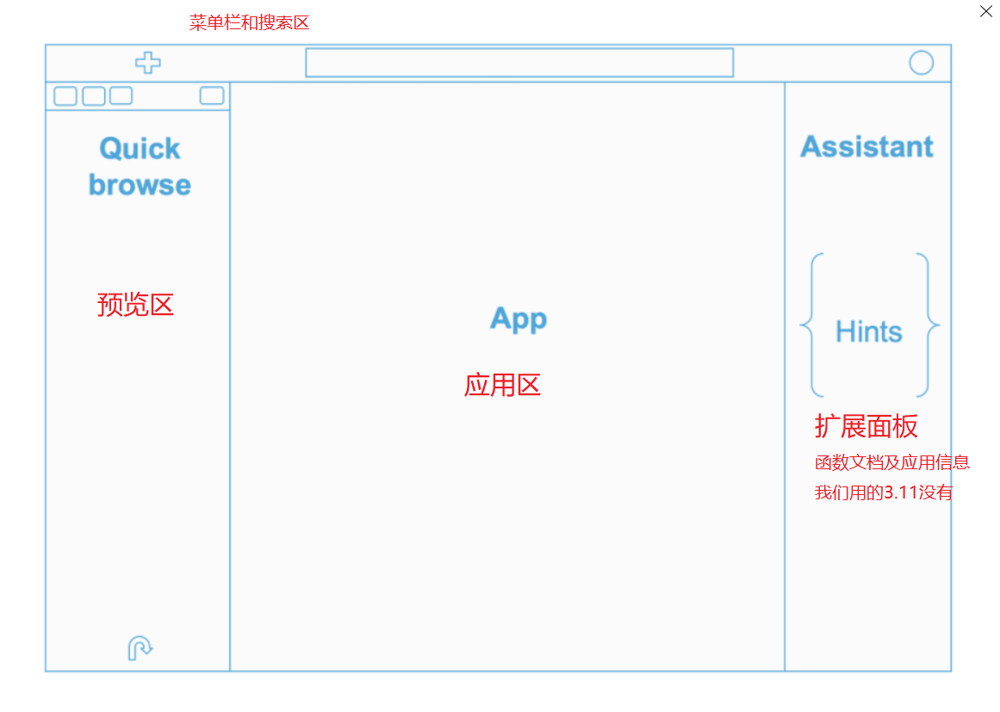

## 功能选择

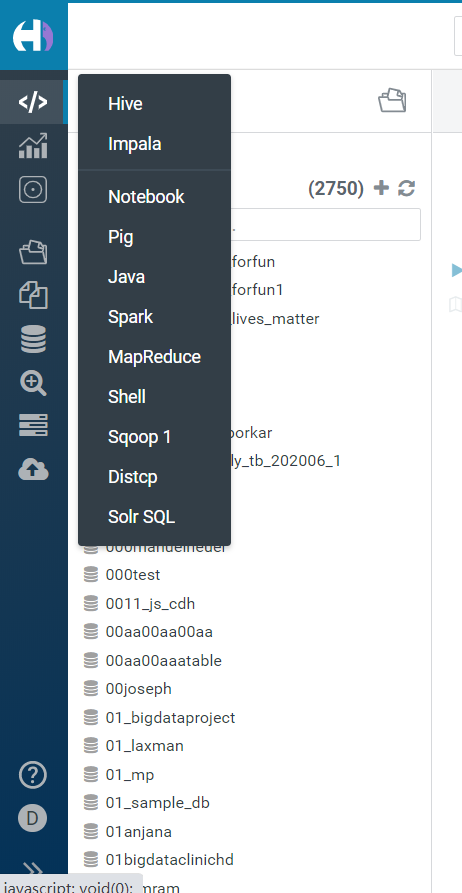

## 文件系统

HDFS文件系统的web界面，类似于NameNode的Browser，但是功能要多一点，更方便使用。

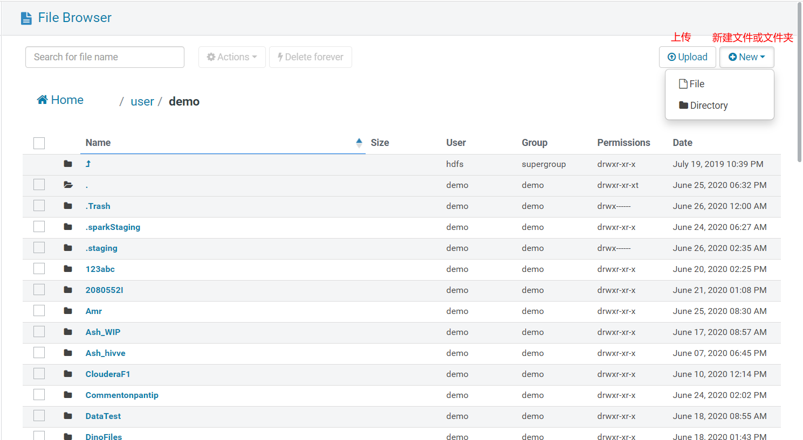

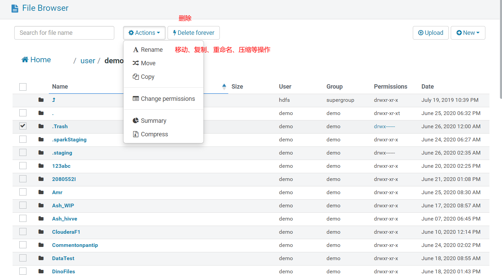

## HIVE使用

### 控制板结构

左侧为数据库和表的信息，右侧为sql编辑器

### 表的Schema

PS：3.11版本是view more查看schema详细

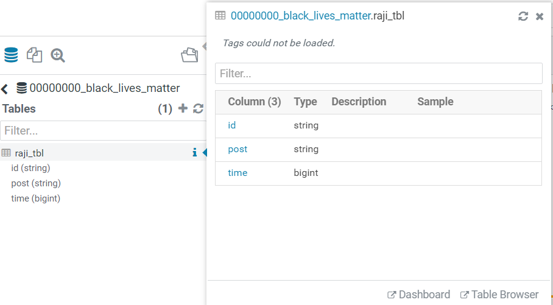

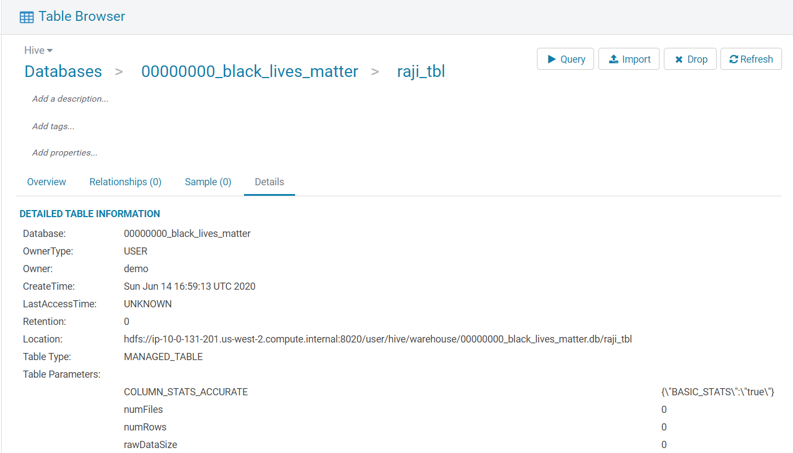

### 自动补全和智能提示

### SQL的格式化和Explain

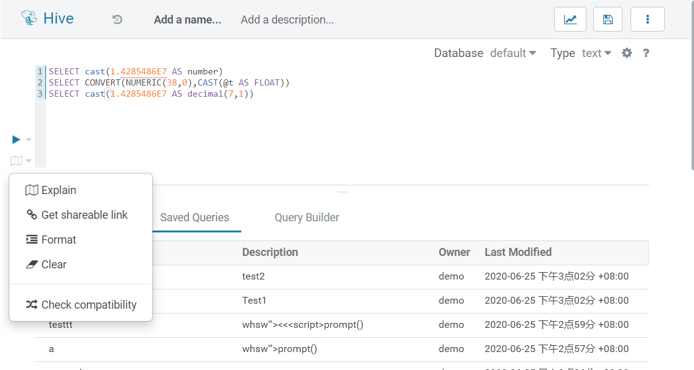

explain分析sql执行计划，stage越少，sql的效率越高。

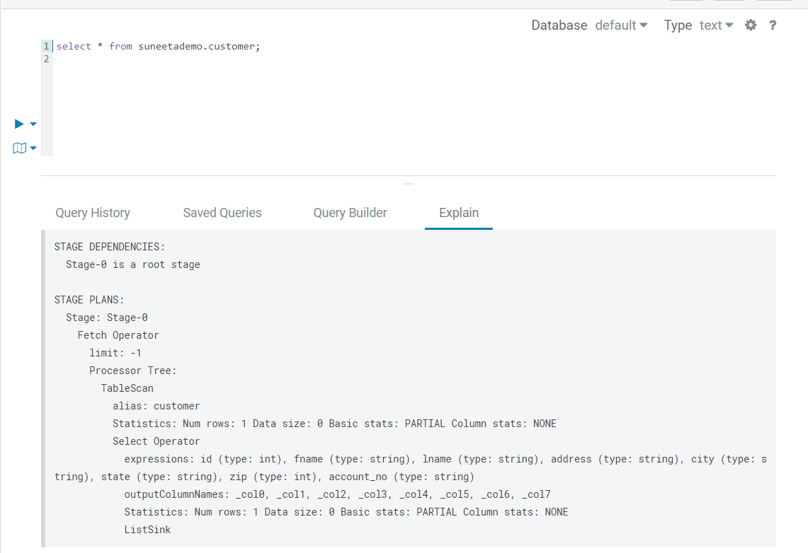

### 查询结果导出

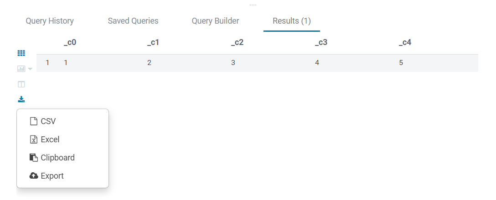

也可以直接将结果用仪表板展示：

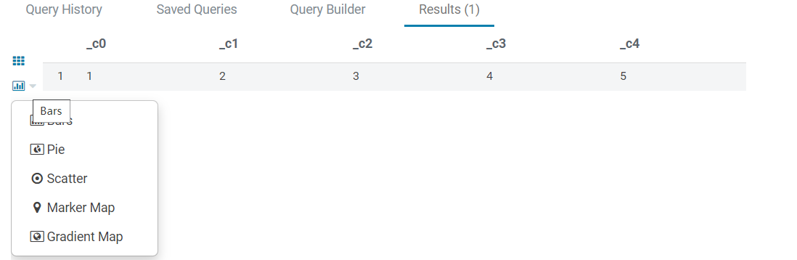

## 制图（仪表板）

可以通过配置数据源来做数据的可视化展示

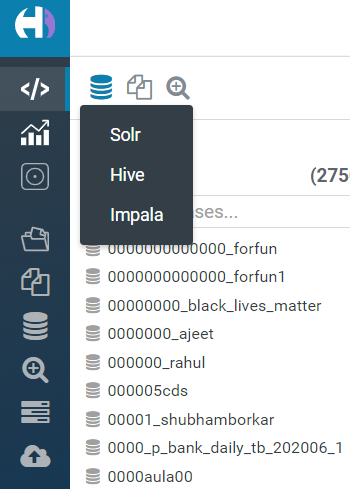

## 应用执行
只实例MapReduce，其他应用类似

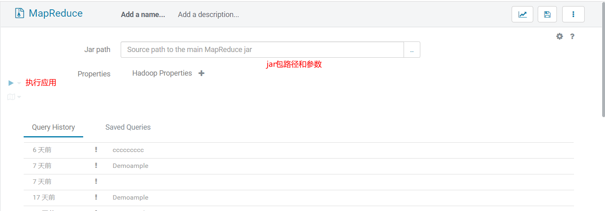

## 工作流调度

HUE的工作流调度基于Oozie，最新版Oozie支持多流并行执行。

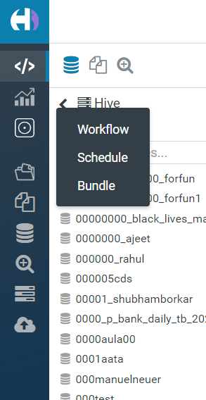

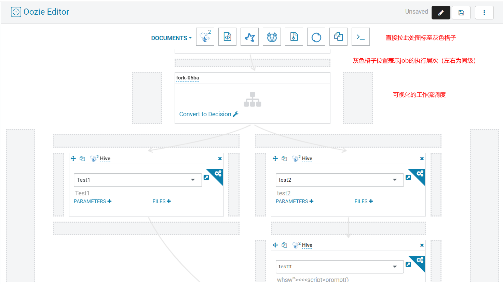

# 链接

[官网][web]

[官方demo][demo]

[web]:https://gethue.com/
[demo]:https://demo.gethue.com/