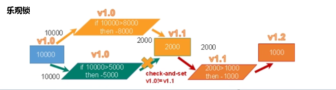

# JUC

## 一、JUC概述

### 1.1什么是JUC

在Java中，线程部分是一个重点，本篇文章说的JUC也是关于线程的。JUC就是java.util.concurrent工具包的简称。这是一个处理线程的工具包，JDK1.5开始出现的。

### 1.2进程和线程概念

#### 1.2.1进程

进程（Proces）是计算机中的程序关于某数据结合上的一次运行活动，是系统进行资源分配和调度的基本单位，是操作系统结构的基础。在当代面向线程设计的计算机结构中，进程是线程的容器。程序是指令、数据及其组织形式的描述，进程是程序的实体。是计算机中的程序关于某数据集合上的一次运行活动，是系统进行资源分配和调度的基本单位，是操作系统结构的基础。程序是指令、数据及其组织形式的描述，进程是程序的实体。

#### 1.2.2线程

线程（thread）是操作系统能够进行运算调度的最小单位。它被包含在进程之中，是进程中的实际运作单位。一条线程指的事进程汇总一个单一顺序的控制流，一个进程汇总可以并发多个线程，每条线程并行执行不同的任务。

### 1.3线程的状态

#### 1.3.1线程状态枚举类

**Thread.State**

```java
    public enum State {
        /**
         * Thread state for a thread which has not yet started.
         */
        NEW,(新建)

        /**
         * Thread state for a runnable thread.  A thread in the runnable
         * state is executing in the Java virtual machine but it may
         * be waiting for other resources from the operating system
         * such as processor.
         */
        RUNNABLE,(准备就绪)

        /**
         * Thread state for a thread blocked waiting for a monitor lock.
         * A thread in the blocked state is waiting for a monitor lock
         * to enter a synchronized block/method or
         * reenter a synchronized block/method after calling
         * {@link Object#wait() Object.wait}.
         */
        BLOCKED,(阻塞)

        /**
         * Thread state for a waiting thread.
         * A thread is in the waiting state due to calling one of the
         * following methods:
         * <ul>
         *   <li>{@link Object#wait() Object.wait} with no timeout</li>
         *   <li>{@link #join() Thread.join} with no timeout</li>
         *   <li>{@link LockSupport#park() LockSupport.park}</li>
         * </ul>
         *
         * <p>A thread in the waiting state is waiting for another thread to
         * perform a particular action.
         *
         * For example, a thread that has called <tt>Object.wait()</tt>
         * on an object is waiting for another thread to call
         * <tt>Object.notify()</tt> or <tt>Object.notifyAll()</tt> on
         * that object. A thread that has called <tt>Thread.join()</tt>
         * is waiting for a specified thread to terminate.
         */
        WAITING,(不见不散)

        /**
         * Thread state for a waiting thread with a specified waiting time.
         * A thread is in the timed waiting state due to calling one of
         * the following methods with a specified positive waiting time:
         * <ul>
         *   <li>{@link #sleep Thread.sleep}</li>
         *   <li>{@link Object#wait(long) Object.wait} with timeout</li>
         *   <li>{@link #join(long) Thread.join} with timeout</li>
         *   <li>{@link LockSupport#parkNanos LockSupport.parkNanos}</li>
         *   <li>{@link LockSupport#parkUntil LockSupport.parkUntil}</li>
         * </ul>
         */
        TIMED_WAITING,(过时不候)

        /**
         * Thread state for a terminated thread.
         * The thread has completed execution.
         */
        TERMINATED;(终结)
    }
```

#### 1.3.2wait和sleep

* sleep是Thread的静态方法，wait是Object的方法，任何对象实例都能调用
* sleep不会释放锁，它也不需要占用锁，wait会释放锁，但调用它的前提是当前线程占有锁（代码要在synchronized中）
* 它们都可以被interrupted方法中断

### 1.4并发与并行

#### 1.4.1并发

同一时刻多个线程在访问同一个资源，多个线程多一个点

例子：春运抢票，电商秒杀

#### 1.4.2并行

多项工作一起执行，之后在汇总

例子：一遍吃饭一遍写代码

### 1.5管程

是一种同步机制，保证同一时间，只有一个线程访问被保护的数据或代码，JVM同步基于进入和退出，使用管程对象实现的

### 1.6用户线程和守护线程

#### 1.6.1用户线程

自定义线程

#### 1.6.2守护线程

比如说垃圾回收 

主线程结束了，用户线程还在运行，JVM存活

没有用户线程了，都是守护线程，JVM结束

## 二、Lock接口

### 2.1Synchronized

#### 2.1.1概念

synchronized是Java中的关键字，是一种同步锁。它修饰的对象有以下几种

* 修饰一个代码块，被修饰的代码块称为同步代码块，起作用的范围是大括号{}括起来的代码，作用的对象是调用这个代码块的对象
* 修饰一个方法，被修饰的方法称为同步方法，起作用的范围是整个方法，作用的对象是调用这个方法的对象
* 修饰一个静态方法，其作用范围是整个静态方法，作用的对象是这个类的所有对象
* 修饰一个类，其作用范围是synchrnoized后面括号括起来的部门，作用的对象是这个类的所有对象

#### 2.1.2Synchrnoized实现卖票的例子

***3个售票员 卖出30张票***

```java
package com.xzhang;

/**
 * @author xzhang
 * @version 1.0
 * @date 2021/11/24 15:13
 */
public class SaleTicket {
    public static void main(String[] args) {
        //第二步，创建多个线程，调用资源类
        final Ticket ticket = new Ticket();
        new Thread(new Runnable() {
            public void run() {
                for (int i = 0; i < 30; i++) {
                    ticket.sale();
                }
            }
        },"A").start();

        new Thread(new Runnable() {
            public void run() {
                for (int i = 0; i < 30; i++) {
                    ticket.sale();
                }
            }
        },"B").start();

        new Thread(new Runnable() {
            public void run() {
                for (int i = 0; i < 50; i++) {
                    ticket.sale();
                }
            }
        },"C").start();
    }

}

//第一步，创建资源类
class Ticket{
    private int numTicket = 30;
    public synchronized void sale(){
        if(numTicket>=0){
            System.out.println(Thread.currentThread().getName()+":卖出:"+(1)+" 剩下："+numTicket--);
        }
    }
}
```

#### 2.1.3Lock接口与Synchronized区别

* Lock锁实现提供了比使用同步方法和语句可以获得的更广泛的锁操作。Lock提供了比Synchronized更多的功能

* Lock不是Java语言内置的，Synchronized是Java语言的关键字，因此是内置特性。Lock是一个类，通过这个类可以实现同步访问
* Lock和Synchronized有一点非常大的不同，采用Synchronized不需要用户手动释放锁，而Lock需要手动释放锁，如果没有释放，就可能导致死锁现象

#### 2.1.4Lock卖票

```java
package com.xzhang;

import java.util.concurrent.locks.ReentrantLock;

/**
 * @author xzhang
 * @version 1.0
 * @date 2021/11/24 15:46
 */
public class SaleTicket2 {
    public static void main(String[] args) {
        final Ticket2 ticket2 = new Ticket2();
        new Thread(new Runnable() {
            public void run() {
                for (int i = 0; i < 50; i++) {
                    ticket2.sale();
                }
            }
        }, "A").start();

        new Thread(new Runnable() {
            public void run() {
                for (int i = 0; i < 50; i++) {
                    ticket2.sale();
                }
            }
        }, "B").start();

        new Thread(new Runnable() {
            public void run() {
                for (int i = 0; i < 50; i++) {
                    ticket2.sale();
                }
            }
        }, "C").start();

    }
}

class Ticket2 {
    private int numTicket = 30;

    //创建可重入锁
    private final ReentrantLock lock = new ReentrantLock();

    public void sale() {
        //上锁
        lock.lock();

        try {
            //判断是否有票
            if (numTicket >= 0) {
                System.out.println(Thread.currentThread().getName() + ":卖出:" + (1) + " 剩下：" + numTicket--);
            }
        } finally {
            //解锁
            lock.unlock();
        }
    }
}
```

#### 2.1.5线程间的通讯（Synchronized）

```java
package com.xzhang;

/**
 * @author xzhang
 * @version 1.0
 * @date 2021/11/25 10:13
 */
public class Thread1 {
    public static void main(String[] args) {
        final Share share = new Share();
        new Thread(new Runnable() {
            public void run() {
                for (int i = 1; i <= 10; i++) {
                    try {
                        share.incr();
                    } catch (InterruptedException e) {
                        e.printStackTrace();
                    }
                }
            }
        },"A").start();

        new Thread(new Runnable() {
            public void run() {
                for (int i = 1; i <= 10; i++) {
                    try {
                        share.decr();
                    } catch (InterruptedException e) {
                        e.printStackTrace();
                    }
                }
            }
        },"B").start();
    }

}

class Share {
    private int number = 0;

    public synchronized void incr() throws InterruptedException {
        if (number != 0) {
            this.wait();
        }
        number++;
        System.out.println(Thread.currentThread().getName()+":"+number);
        this.notifyAll();
    }

    public synchronized void decr() throws InterruptedException {
        if (number != 1) {
            this.wait();
        }
        number--;
        System.out.println(Thread.currentThread().getName()+":"+number);
        this.notifyAll();
    }

}
```

#### 2.1.6 虚假唤醒

原因：wait（）在哪里睡就在哪里醒

解决方案：把wait（）放在循环中

```java
if(number != 1){
	......
    this.wait();
}//使用if会造成虚假唤醒

while(number != 1){
    ......
    this.wait();
}//替换成while，解决虚假唤醒问题
```

#### 2.1.7线程间的通讯（Lock）

```java
package com.xzhang;

import java.util.concurrent.locks.Condition;
import java.util.concurrent.locks.Lock;
import java.util.concurrent.locks.ReentrantLock;

/**
 * @author xzhang
 * @version 1.0
 * @date 2021/11/25 11:23
 */
public class Thread2 {
    public static void main(String[] args) {
        final Share2 share2 = new Share2();
        new Thread(new Runnable() {
            public void run() {
                for (int i = 0; i < 10; i++) {
                    share2.incr();
                }
            }
        },"A").start();

        new Thread(new Runnable() {
            public void run() {
                for (int i = 0; i < 10; i++) {
                    share2.decr();
                }
            }
        },"B").start();

    }
}

class Share2{
    private int number = 0;

    private Lock lock = new ReentrantLock();
    private Condition condition = lock.newCondition();

    public void incr(){
        lock.lock();
        try{
            while (number != 0){
                condition.await();
            }
            number++;
            System.out.println(Thread.currentThread().getName()+":"+number);
            condition.signalAll();

        } catch (InterruptedException e) {
            e.printStackTrace();
        } finally {
            lock.unlock();
        }
    }

    public void decr(){
        lock.lock();
        try{
            while (number != 1){
                condition.await();
            }
            number--;
            System.out.println(Thread.currentThread().getName()+":"+number);
            condition.signalAll();

        } catch (InterruptedException e) {
            e.printStackTrace();
        } finally {
            lock.unlock();
        }
    }
}
```

#### 2.1.8线程间的定制化通信


```java
package com.xzhang;

import java.util.concurrent.locks.Condition;
import java.util.concurrent.locks.Lock;
import java.util.concurrent.locks.ReentrantLock;

/**
 * @author xzhang
 * @version 1.0
 * @date 2021/11/26 9:43
 */
public class Thread3 {
    public static void main(String[] args) {
        final ShareResource shareResource = new ShareResource();
        new Thread(new Runnable() {
            public void run() {
                try {
                    for (int i = 1; i <= 10; i++) {
                        shareResource.print5(i);
                    }
                } catch (InterruptedException e) {
                    e.printStackTrace();
                }
            }
        },"A").start();

        new Thread(new Runnable() {
            public void run() {
                try {
                    for (int i = 1; i <= 10; i++) {
                        shareResource.print10(i);
                    }
                } catch (InterruptedException e) {
                    e.printStackTrace();
                }
            }
        },"B").start();

        new Thread(new Runnable() {
            public void run() {
                try {
                    for (int i = 1; i <= 10; i++) {
                        shareResource.print15(i);
                    }
                } catch (InterruptedException e) {
                    e.printStackTrace();
                }
            }
        },"C").start();
    }
}

class ShareResource {
    private int flag = 1;

    private Lock lock = new ReentrantLock();

    //创建3个condition
    private Condition c1 = lock.newCondition();
    private Condition c2 = lock.newCondition();
    private Condition c3 = lock.newCondition();

    public void print5(int loop) throws InterruptedException {
        lock.lock();
        try {
            while (flag != 1) {
                c1.await();
            }
            for (int i = 1; i <= 5; i++) {
                System.out.println(Thread.currentThread().getName() + ":" + i + "轮数:" + loop);
            }
            flag = 2;
            c2.signal();
        } finally {
            lock.unlock();
        }
    }


    public void print10(int loop) throws InterruptedException {
        lock.lock();
        try {
            while (flag != 2) {
                c2.await();
            }
            for (int i = 1; i <= 10; i++) {
                System.out.println(Thread.currentThread().getName() + ":" + i + "轮数:" + loop);
            }
            flag = 3;
            c3.signal();
        } finally {
            lock.unlock();
        }
    }

    public void print15(int loop) throws InterruptedException {
        lock.lock();
        try {
            while (flag != 3) {
                c3.await();
            }
            for (int i = 1; i <= 15; i++) {
                System.out.println(Thread.currentThread().getName() + ":" + i + "轮数:" + loop);
            }
            flag = 1;
            c1.signal();
        } finally {
            lock.unlock();
        }
    }
}
```

#### 2.1.9多线程编程步骤

* 创建资源类，在资源类创建属性和操作方法

* 在资源类操作方法

  * 判断
  * 干活
  * 通知

* 创建多个线程，调用资源来的操作方法
* 防止虚假唤醒问题

## 三、集合的线程安全

### 3.1集合线程不安全演示

```java
package com.xzhang;

import java.util.ArrayList;
import java.util.List;
import java.util.UUID;

/**
 * @author xzhang
 * @version 1.0
 * @date 2021/11/26 11:17
 * ArrayList中add()方法没有Synchronized 是线程不安全的
 */
public class Thread4 {
    public static void main(String[] args) {
        List<String> list = new ArrayList<>();
        for (int i = 0; i < 10; i++) {
            new Thread(new Runnable() {
                public void run() {
                    //向集合添加内容
                    list.add(UUID.randomUUID().toString().substring(0, 8));
                    //从集合获取内容
                    System.out.println(list);
                }
            }, String.valueOf(i)).start();
        }

    }
}
```


#### 3.1.1解决方案-Vector

```java
package com.xzhang;

import java.util.ArrayList;
import java.util.List;
import java.util.UUID;
import java.util.Vector;

/**
 * @author xzhang
 * @version 1.0
 * @date 2021/11/26 11:17
 */
public class Thread4 {
    public static void main(String[] args) {
//        List<String> list = new ArrayList<>();
        List<String> list = new Vector<>();
        for (int i = 0; i < 10; i++) {
            new Thread(new Runnable() {
                public void run() {
                    //向集合添加内容
                    list.add(UUID.randomUUID().toString().substring(0, 8));
                    //从集合获取内容
                    System.out.println(list);
                }
            }, String.valueOf(i)).start();
        }
    }
}
```

#### 3.1.2解决方案-Collections

```java
package com.xzhang;

import java.util.*;

/**
 * @author xzhang
 * @version 1.0
 * @date 2021/11/26 11:17
 */
public class Thread4 {
    public static void main(String[] args) {
//        List<String> list = new ArrayList<>();
//        List<String> list = new Vector<>();
        List<String> list = Collections.synchronizedList(new ArrayList<>());
        for (int i = 0; i < 10; i++) {
            new Thread(new Runnable() {
                public void run() {
                    //向集合添加内容
                    list.add(UUID.randomUUID().toString().substring(0, 8));
                    //从集合获取内容
                    System.out.println(list);
                }
            }, String.valueOf(i)).start();
        }

    }
}
```

#### 3.1.3解决方案-CopyOnWriteArrayList（常用）

```java
package com.xzhang;

import java.util.*;
import java.util.concurrent.CopyOnWriteArrayList;

/**
 * @author xzhang
 * @version 1.0
 * @date 2021/11/26 11:17
 */
public class Thread4 {
    public static void main(String[] args) {
//        List<String> list = new ArrayList<>();
//        List<String> list = new Vector<>();
//        List<String> list = Collections.synchronizedList(new ArrayList<>());
        List<String> list = new CopyOnWriteArrayList();
        for (int i = 0; i < 10; i++) {
            new Thread(new Runnable() {
                public void run() {
                    //向集合添加内容
                    list.add(UUID.randomUUID().toString().substring(0, 8));
                    //从集合获取内容
                    System.out.println(list);
                }
            }, String.valueOf(i)).start();
        }

    }
}
```

#### 3.1.4写时复制&读时合并

并发读，独立写


### 3.2HashSet线程不安全

```java
package com.xzhang;

import java.util.*;
import java.util.concurrent.CopyOnWriteArrayList;

/**
 * @author xzhang
 * @version 1.0
 * @date 2021/11/26 11:17
 */
public class Thread4 {
    public static void main(String[] args) {
        Set<String> set = new HashSet<>();
        for (int i = 0; i < 30; i++) {
            new Thread(()->{
                set.add(UUID.randomUUID().toString().substring(0,8));
                System.out.println(set);
            },String.valueOf(i)).start();
        }
    }
}
```


#### 3.2.1解决方案-CopyOnWriteSet

```java
package com.xzhang;

import java.util.*;
import java.util.concurrent.CopyOnWriteArrayList;
import java.util.concurrent.CopyOnWriteArraySet;

/**
 * @author xzhang
 * @version 1.0
 * @date 2021/11/26 11:17
 */
public class Thread4 {
    public static void main(String[] args) {
        Set<String> set = new CopyOnWriteArraySet<>();
        for (int i = 0; i < 30; i++) {
            new Thread(()->{
                set.add(UUID.randomUUID().toString().substring(0,8));
                System.out.println(set);
            },String.valueOf(i)).start();
        }
    }
}
```

### 3.3HashMap线程不安全

```java
package com.xzhang;

import java.util.*;
import java.util.concurrent.CopyOnWriteArrayList;
import java.util.concurrent.CopyOnWriteArraySet;

/**
 * @author xzhang
 * @version 1.0
 * @date 2021/11/26 11:17
 */
public class Thread4 {
    public static void main(String[] args) {
        Map<String, String> map = new HashMap<>();
        for (int i = 0; i < 30; i++) {
            String key = String.valueOf(i);
            new Thread(() -> {
                map.put(key, UUID.randomUUID().toString().substring(0, 8));
                System.out.println(map);
            }, String.valueOf(i)).start();
        }
    }
}
```


#### 3.3.1解决方案-ConcurrentHashMap

```java
package com.xzhang;

import java.util.*;
import java.util.concurrent.ConcurrentHashMap;
import java.util.concurrent.CopyOnWriteArrayList;
import java.util.concurrent.CopyOnWriteArraySet;

/**
 * @author xzhang
 * @version 1.0
 * @date 2021/11/26 11:17
 */
public class Thread4 {
    public static void main(String[] args) {
        Map<String, String> map = new ConcurrentHashMap<>();
        for (int i = 0; i < 30; i++) {
            String key = String.valueOf(i);
            new Thread(() -> {
                map.put(key, UUID.randomUUID().toString().substring(0, 8));
                System.out.println(map);
            }, String.valueOf(i)).start();
        }
    }
}
```

## 四、多线程锁

### 4.1Synchronized 

#### 4.1.1Synchronized修饰 普通同步方法，锁住的是当前对象

```java
class Phone{
    public synchronized void sendSMS() throws Exception{
        TimeUnit.SECONDS.sleep(4);
        System.out.println("-----sendSMS");
    }
    public synchronized void sendEmail() throws Exception{
        System.out.println("-----sendEmail");
    }
}
```

#### 4.1.2Synchronized修饰静态同步方法，锁住的是当前类的Class对象

```java
class Phone{
    public synchronized static void sendSMS() throws Exception{
        TimeUnit.SECONDS.sleep(4);
        System.out.println("-----sendSMS");
    }
    public synchronized static void sendEmail() throws Exception{
        System.out.println("-----sendEmail");
    }
}
```

#### 4.1.3Synchronized修饰同步方法块，锁住的是Synchronized括号里配置的对象

```java
class Phone{
    public void sendHello(){
        synchronized(this) {
            System.out.println("sendHello");
        }
    }
}
```

### 4.2 公平锁和非公平锁

#### 4.2.1源码

* 两个构造器
  * 无参构造器默认非公平锁
  * 有参构造器可以传入参数

```java
 /**
     * Creates an instance of {@code ReentrantLock}.
     * This is equivalent to using {@code ReentrantLock(false)}.
     */
    public ReentrantLock() {
        sync = new NonfairSync();
    }

    /**
     * Creates an instance of {@code ReentrantLock} with the
     * given fairness policy.
     *
     * @param fair {@code true} if this lock should use a fair ordering policy
     */
    public ReentrantLock(boolean fair) {
        sync = fair ? new FairSync() : new NonfairSync();
    }

```

#### 4.2.2特点

* 非公平锁
  * 线程饿死
  * 执行效率高

* 公平锁
  * 阳光普照
  * 执行效率低

### 4.3可重入锁（递归锁）

Synchronized和Lock都是可重入锁

​	Synchronized是隐式的

​	Lock是显式的

#### 4.3.1 Synchronized

```java
package com.xzhang;

/**
 * @author xzhang
 * @version 1.0
 * @date 2021/11/26 15:54
 */
public class Lock {
    public static void main(String[] args) {
        Object o = new Object();
        new Thread(()->{
            synchronized (o){
                System.out.println(Thread.currentThread().getName()+"：外层");
                synchronized (o){
                    System.out.println(Thread.currentThread().getName()+"：中层");
                    synchronized (o){
                        System.out.println(Thread.currentThread().getName()+"：内层");
                    }
                }
            }
        },"A").start();
    }
}
```

#### 4.3.2Lock

```java
package com.xzhang;

import java.util.concurrent.locks.Lock;
import java.util.concurrent.locks.ReentrantLock;

/**
 * @author xzhang
 * @version 1.0
 * @date 2021/11/26 15:54
 */
public class LockThread {

    public static void main(String[] args) {
        Lock lock = new ReentrantLock();
        new Thread(() -> {
            try {
                lock.lock();
                System.out.println(Thread.currentThread().getName() + "外层");
                try {
                    lock.lock();
                    System.out.println(Thread.currentThread().getName() + "中层");
                    try {
                        lock.lock();
                        System.out.println(Thread.currentThread().getName() + "内层");
                    } finally {
                        lock.unlock();
                    }
                } finally {
                    lock.unlock();
                }
            } finally {
                lock.unlock();
            }
        }, "A").start();

    }
}
```

### 4.4死锁

#### 4.4.1什么是死锁

两个或者两个以上的进程在执行过程中，因为争夺资源而造成一直陪你过互相等待的现象，如果没有外力的干涉，它们无法再执行下去


#### 4.4.2产生死锁的原因

* 系统资源不足
* 进程运行过程中推进的顺序是不合适的
* 资源分配不当

#### 4.4.3演示

```java
package com.xzhang;

/**
 * @author xzhang
 * @version 1.0
 * @date 2021/11/26 16:26
 */
public class DeadLock {
    static Object a = new Object();
    static Object b = new Object();
    public static void main(String[] args) {
        new Thread(()->{
            synchronized (a){
                System.out.println(Thread.currentThread().getName()+"已经持有锁a,试图获取锁b");
                synchronized (b){
                    System.out.println(Thread.currentThread().getName()+"获取锁b");
                }
            }
        },"A").start();

        new Thread(()->{
            synchronized (b){
                System.out.println(Thread.currentThread().getName()+"已经持有锁b,试图获取锁a");
                synchronized (a){
                    System.out.println(Thread.currentThread().getName()+"获取锁a");
                }
            }
        },"A").start();

    }
}
```

#### 4.4.4验证是否是死锁

* jps （ps -ef）
* jstack jvm自带的堆栈跟踪工具


## 五、Callable接口

### 5.1创建线程的方式

#### 5.1.1Thread类

继承Thread类

#### 5.1.2Runable接口

实现Runable接口

#### 5.1.3Callable接口

实现Callable接口

#### 5.1.4线程池

ThreadPool

### 5.2Runable和Callable区别

#### 5.2.1返回值

* Callbale有返回值
* Runnable无返回值

#### 5.2.2异常

* Callable接口无计算结果会抛出异常
* Runnable接口不会抛出异常

#### 5.2.3实现方法

* Callable实现call()方法
* Runnable实现run()方法

### 5.3通过Callable接口创建线程

#### 5.3.1 中间类FutureTask

* Thread类中没有参数类型为Callable的构造参数

* 找一个类，既和Runnable有关系，又和Callable有关系
* Runnable接口有实现类FutureTask
* FutureTask构造可以传递Callable
* FutuerTask叫做未来任务

```java
package com.xzhang;

import java.util.concurrent.Callable;
import java.util.concurrent.Future;
import java.util.concurrent.FutureTask;

/**
 * @author xzhang
 * @version 1.0
 * @date 2021/11/26 17:42
 */
public class ThreadCompare  {
    public static void main(String[] args) {
        new Thread(new ThreadFirst(),"A").start();
        //传统形式
        FutureTask<Integer> future1  = new FutureTask<>(new ThreadSecond());
        //lam表达式形式
        FutureTask<Integer> future2  = new FutureTask<>(()->{
            return 100;
        });
    }
}

class ThreadFirst implements Runnable{

    @Override
    public void run() {

    }
}

class ThreadSecond implements Callable{

    @Override
    public Integer call() throws Exception {
        return 200;
    }
}
```

#### 5.3.2未来任务

* 我在拉屎，想喝水，去买水不合适，拉屎会中断
* 单开启线程找别人帮你买
* 水买回来，需要的时候直接get

## 六、JUC强大的辅助类

### 6.1减少计数CountDownLatch

CountDownLatch类可以设置一个计数器，然后通过counntDown方法来进行减1操作，使用await方法等待计数器不大于0，然后继续执行await方法之后的语句

* CountDownLatch主要有两个方法，当一个或者多个线程调用await方法时，这些线程会阻塞
* 其他线程调用CountDown方法会讲计数器减1（调用CountDown方法的线程不会阻塞）
* 当计数器的值变为0时，因await方法阻塞的线程会被唤醒，继续执行

```java
import java.util.concurrent.CountDownLatch;

public class CountDownLatchDemo {
    public static void main(String[] args) throws InterruptedException {
        System.out.println("===============");
        CountDownLatch countDownLatch = new CountDownLatch(10);
        for (int i = 1; i <= 10; i++) {
            new Thread(()->{
                System.out.println(Thread.currentThread().getName()+" 号员工下班了");
                countDownLatch.countDown();
            },String.valueOf(i)).start();
        }

        countDownLatch.await();
        System.out.println("老板下班了");
    }
}
```

### 6.2循环栅栏CyclicBarrier

一个同步辅助类，它允许一组线程互相等待，知道到达某个公共屏障点，在设计一组固定大小的线程的程序中，这些线程必须不时的相互等待，此时CycliBarrier很有用，因为该barrier在释放等待线程后可以重用

```java
import java.util.concurrent.BrokenBarrierException;
import java.util.concurrent.CyclicBarrier;

public class CyclicBarrierDemo {
    private static int number = 7;
    public static void main(String[] args) {
        CyclicBarrier cyclicBarrier = new CyclicBarrier(number, () -> {
            System.out.println("集齐七颗龙珠召唤神龙！！！");
        });

        for (int i = 1; i <=7; i++) {
            new Thread(()->{
                try {
                    System.out.println(Thread.currentThread().getName()+"颗龙珠获取到");
                    cyclicBarrier.await();
                } catch (InterruptedException e) {
                    e.printStackTrace();
                } catch (BrokenBarrierException e) {
                    e.printStackTrace();
                }
            },String.valueOf(i)).start();
        }

    }
}
```

### 6.信号灯Semaphore

一个计数信号量，从概念上讲，信号量维护了一个许可集。如果有必要，在许可可用前会阻塞每一个acquire()，然后再活的该许可。每个release()添加一个许可，从而可能释放一个正在阻塞的获取者。但是，不适用实际的许可对象，Semaphore只对可用许可的号码进行技术，并采取相应的行动。

```java
package com.xzhang;

import java.util.concurrent.Semaphore;
import java.util.concurrent.TimeUnit;

/**
 * @author xzhang
 * @version 1.0
 * @date 2021/11/29 9:36
 */

//6辆汽车，停在3个停车位
public class SemaPhoreDemo {
    public static void main(String[] args) {
        //创建Semaphore，设置许可数量
        Semaphore semaphore = new Semaphore(3);

        //模拟6辆汽车
        for (int i = 1; i <=6 ; i++) {
            new Thread(()->{
                //抢占
                try {
                    semaphore.acquire();
                    System.out.println("第 "+Thread.currentThread().getName()+" 辆汽车抢到车位");
                    //设置抢占时间
                    TimeUnit.SECONDS.sleep(1);
                    System.out.println("第 "+Thread.currentThread().getName()+" 辆汽车----------离开车位");
                } catch (InterruptedException e) {
                    e.printStackTrace();
                }finally {
                    semaphore.release();
                }
            },String.valueOf(i)).start();
        }
    }
}
```

## 七、读写锁

### 7.1乐观锁&悲观锁




### 7.2表锁&行锁

一张表中有100条数据，处理第5条

表锁：整张表上锁，所有行都不能操作

行锁：第5条上锁，其他的所有行均可操作

### 7.3读锁&写锁

读锁：共享锁，有可能发生死锁


写锁：独占锁，有可能发生死锁


### 7.4读写锁演示

```java
package com.xzhang;

import java.util.HashMap;
import java.util.Map;
import java.util.concurrent.TimeUnit;
import java.util.concurrent.locks.Lock;
import java.util.concurrent.locks.ReadWriteLock;
import java.util.concurrent.locks.ReentrantReadWriteLock;

/**
 * @author xzhang
 * @version 1.0
 * @date 2021/11/29 9:56
 */
public class ReadWriteLockDemo {
    public static void main(String[] args) {
        MyCache myCache = new MyCache();
        for (int i = 1; i <=5 ; i++) {
           final  int finalI = i;
            new Thread(()->{
                myCache.put(finalI+"", finalI+"");
            },String.valueOf(i)).start();
        }

        for (int i = 1; i <=5 ; i++) {
            final  int finalI = i;
            new Thread(()->{
                myCache.get(finalI+"");
            },String.valueOf(i)).start();
        }
    }
}

class MyCache{
    private volatile Map<String,Object> map = new HashMap<>();
    //创建读写锁
    private ReadWriteLock rwLock = new ReentrantReadWriteLock();

    public void  put(String key ,Object value){
        //添加写锁
        Lock lock = rwLock.writeLock();
        lock.lock();
        try {
            System.out.println(Thread.currentThread().getName()+"正在进行写操作"+key);
            TimeUnit.MICROSECONDS.sleep(100);
            map.put(key,value);
            System.out.println(Thread.currentThread().getName()+"写完了"+key);
        } catch (InterruptedException e) {
            e.printStackTrace();
        }finally {
            lock.unlock();
        }

    }

    public  Object  get(String key ){
        Object result = null;
        ReadWriteLock rwLock = new ReentrantReadWriteLock();
        Lock lock = rwLock.readLock();
        lock.lock();
        try {
            System.out.println(Thread.currentThread().getName()+"正在取数据"+key);
            TimeUnit.MICROSECONDS.sleep(100);
            result = map.get(key);
            System.out.println(Thread.currentThread().getName()+"取完了"+key);
        } catch (InterruptedException e) {
            e.printStackTrace();
        }finally {
            lock.unlock();
        }
        return  result;
    }
}
```

### 7.5锁的演变

读写锁：一个资源可以被多个读线程访问，或者可以被一个写线程访问，但是不能同时存在读写操作，读写互斥，读读共享

| 无锁             | 添加锁                          | 读写锁                                                   |
| ---------------- | ------------------------------- | -------------------------------------------------------- |
| 多个线程抢占资源 | 使用Synchronized和ReentrantLock | ReentrantReadWriteLock                                   |
| 乱               | 都是独占的，每次只能一个操作    | 读读 可以共享，提升性能，同时多人进行读操作              |
|                  | 读读 1，不能共享                | 写写 1                                                   |
|                  | 读写 1                          | 缺点：                                                   |
|                  | 写写 1                          | 造成锁饥饿，一直读，没有写操作                           |
|                  |                                 | 读的时候，不能写，只有读完成之后，才可以写，写操作可以读 |
|                  |                                 |                                                          |
|                  |                                 |                                                          |
|                  |                                 |                                                          |

### 7.6锁的降级

将写锁降级为读锁，读锁不能升级为写锁


```java
package com.xzhang;

import java.util.concurrent.locks.ReentrantReadWriteLock;

/**
 * @author xzhang
 * @version 1.0
 * @date 2021/11/29 10:42
 */
public class LowerLock {
    public static void main(String[] args) {
        //可重入对写锁对象
        ReentrantReadWriteLock rwLock = new ReentrantReadWriteLock();

        //分别创建读写锁
        ReentrantReadWriteLock.ReadLock readLock = rwLock.readLock();
        ReentrantReadWriteLock.WriteLock writeLock = rwLock.writeLock();

        //锁降级
        writeLock.lock();
        System.out.println("获取写锁");
        readLock.lock();
        System.out.println("获取读锁");
        writeLock.unlock();
        System.out.println("释放写锁");
        readLock.unlock();
        System.out.println("释放读锁");
    }
}
```

## 八、阻塞队列

### 8.1概述

阻塞队列，首先是一个队列，通过一个共享的队列，可以使得数据由队列的一端输入，另一端输出


### 8.2分类


#### 8.2.1ArrayBlockingQueue（常用）

基于数组的阻塞队列实现，在其内部，维护了一个定长数组，一遍缓存队列中的数据对象，除了一个订场数组外，在其内部还保存着两个整型变量，分别标识着队列的头部和尾部在数组中的位置。

***由数组结构组成的有界阻塞队列***

#### 8.2.2LinkedBlockingQueue（常用）

***由链表结构组成的有界阻塞队列***

默认大小值为 integer.MAX_VALUE

#### 8.2.3DelayQueue

***使用优先级队列实现的延迟无界阻塞队列***

#### 8.2.4PriorityBlockingQueue

***支持优先级排序的无界阻塞队列***

#### 8.2.5SynchronousQueue

***不存储元素的阻塞队列，也即单个元素的队列***

#### 8.2.6LinkedTransferQueue

***由链表组成的无界阻塞队列***

#### 8.2.7LinkedBlockingQueue

***由链表组成的双向阻塞队列***

### 8.3核心方法

#### 8.3.1方法分类

| 方法类型 | 抛出异常  | 特殊值   | 阻塞   | 超时               |
| -------- | --------- | -------- | ------ | ------------------ |
| 插入     | add(e)    | offer(e) | put(e) | offer(e,time,unit) |
| 移除     | remove()  | poll()   | take() | poll(time,unit)    |
| 检查     | element() | peek()   | 不可用 | 不可用             |


#### 8.3.2 演示

```java
package com.xzhang;

import java.util.concurrent.ArrayBlockingQueue;
import java.util.concurrent.BlockingQueue;
import java.util.concurrent.TimeUnit;

/**
 * @author xzhang
 * @version 1.0
 * @date 2021/11/29 13:52
 */
public class BlockingQueueDemo {
    public static void main(String[] args) throws InterruptedException {
        BlockingQueue<String> blockingQueue = new ArrayBlockingQueue(1);
        System.out.println(blockingQueue.add("a"));
        System.out.println(blockingQueue.element());
        System.out.println(blockingQueue.remove());

        System.out.println(blockingQueue.offer("b"));
        System.out.println(blockingQueue.offer("c"));
        System.out.println(blockingQueue.peek());
        System.out.println(blockingQueue.poll());
        System.out.println(blockingQueue.peek());
        System.out.println(blockingQueue.poll());


        blockingQueue.put("d");
//        blockingQueue.put("f");
        System.out.println(blockingQueue.take());
//        System.out.println(blockingQueue.take());

        System.out.println(blockingQueue.offer("e"));
        System.out.println(blockingQueue.offer("f", 3L, TimeUnit.SECONDS));
    }
}
```

## 九、线程池

### 9.1线程池概述

#### 9.1.1概念

线程池是一种线程使用模式，线程过多会带来调度开销，进而影响缓存局部性和整体性能。而线程池维护者多个线程，等待着监督管理者分配可并发执行的任务。这避免了在处理短时间任务时创建与销毁线程的代价。线程池不仅能够保证内核的充分利用，还能防止过分调用。

#### 9.1.2优势

线程池做的工作主要是控制运行的线程数量，处理过程汇总将任务放入队列，然后在线程创建后启动这些任务，如果线程数量超过了最大数量，超出数量的线程排队等候，等待其他线程执行完毕，再从队列中取出任务来执行。

#### 9.1.4特点

* 降低资源消耗：通过重复利用已经创建的线程降低线程创建和小慧造成的消耗

* 提高响应速度：当任务到达时，任务可以不需要等待线程创建就能立即执行

* 提高线程的可管理性：线程是稀缺资源，如果无限制的创建，不仅会消耗系统资源，还会降低系统的稳定性，使用线程池统一的分配，调优和监控。

### 9.2架构

Java中的线程池是通过Executor框架实现的，该框架中用到了Executor，Executors，ExecutorService，ThreadPoolExecutor


### 9.3分类

#### 9.3.1Executors.newFixedThredPool(int)

一池N线程

**特点：**

* 线程池中的线程处于一定的量，可以很好的控制线程的并发量
* 线程可以重复被使用，在显式关闭前，都将一直存在
* 超出一定量的线程被提交时，需要在队列中等待

```java
package com.xzhang.pool;

import java.util.concurrent.ExecutorService;
import java.util.concurrent.Executors;

/**
 * @author xzhang
 * @version 1.0
 * @date 2021/11/29 15:32
 */
public class ThreadPoolDemo1 {
    public static void main(String[] args) {
        ExecutorService threadPool = Executors.newFixedThreadPool(5);
        try{
            for (int i = 1; i <=10 ; i++) {
                threadPool.execute(()->{
                    System.out.println(Thread.currentThread().getName()+"正在执行");
                });
            }
        }catch (Exception e){
            e.printStackTrace();
        }finally {
            threadPool.shutdown();
        }
    }
}
```

#### 9.3.2Executors.newSingleThreadExecutor()

一个任务一个任务的执行，一池一线程

```java
package com.xzhang.pool;

import java.util.concurrent.ExecutorService;
import java.util.concurrent.Executors;

/**
 * @author xzhang
 * @version 1.0
 * @date 2021/11/29 15:32
 */
public class ThreadPoolDemo1 {
    public static void main(String[] args) {
        ExecutorService threadPool = Executors.newFixedThreadPool(5);
        ExecutorService threadPool2 = Executors.newSingleThreadExecutor();
        try{
            for (int i = 1; i <=10 ; i++) {
                threadPool2.execute(()->{
                    System.out.println(Thread.currentThread().getName()+"正在执行");
                });
            }
        }catch (Exception e){
            e.printStackTrace();
        }finally {
            threadPool2.shutdown();
        }
    }
}
```

#### 9.3.3Executors.newCachedThreadPool()

线程池根据需求创建线程，可扩容，遇强则强

```java
package com.xzhang.pool;

import java.util.concurrent.ExecutorService;
import java.util.concurrent.Executors;

/**
 * @author xzhang
 * @version 1.0
 * @date 2021/11/29 15:32
 */
public class ThreadPoolDemo1 {
    public static void main(String[] args) {
        ExecutorService threadPool = Executors.newFixedThreadPool(5);
        ExecutorService threadPool2 = Executors.newSingleThreadExecutor();
        ExecutorService threadPool3 = Executors.newCachedThreadPool();
        try{
            for (int i = 1; i <=10 ; i++) {
                threadPool3.execute(()->{
                    System.out.println(Thread.currentThread().getName()+"正在执行");
                });
            }
        }catch (Exception e){
            e.printStackTrace();
        }finally {
            threadPool3.shutdown();
        }
    }
}
```

### 9.4底层原理

上面几种创建线程池的方法都是使用了ThreadPoolExecutor


一共有七个参数

#### 9.4.1

```java
int corePoolSize //常驻线程数量（核心）
```

#### 9.4.2

```java
int maxmumPoolSize //最大线程数量
```

#### 9.4.3

```java
long keepAliveTime //存活时间
```

#### 9.4.4

```java
Timeunit unit //时间单位
```

#### 9.4.5

```java
BlockingQueue<Runnable> workQueue //阻塞队列
```

#### 9.4.6

```java
ThreadFactory threadFactory //线程工厂
```

#### 9.4.7

```java
RejectedExecutionHandler handler//拒绝策略
```

### 9.5工作流程

#### 9.5.1执行流程图


#### 9.5.2两个细节

* 当执行execute()后，线程池才创建
* 当常驻线程数被占满，阻塞队列也被占满，此时再来一个新的任务，那么会优先去最大线程中执行

### 9.6拒绝策略

#### 9.6.1JDK内置的拒绝策略


### 9.7自定义线程池（常用）

```java
package com.xzhang.pool;

import java.util.concurrent.*;

/**
 * @author xzhang
 * @version 1.0
 * @date 2021/11/29 15:38
 */
public class ThreadPoolDemo2 {
    public static void main(String[] args) {
        ExecutorService threadPool = new ThreadPoolExecutor(
                2,
                5,
                2L,
                TimeUnit.SECONDS,
                new ArrayBlockingQueue<>(3),
                Executors.defaultThreadFactory(),
                new ThreadPoolExecutor.AbortPolicy()
        );


        try{
            for (int i = 1; i <=10 ; i++) {
                threadPool.execute(()->{
                    System.out.println(Thread.currentThread().getName()+"正在执行");
                });
            }
        }catch (Exception e){
            e.printStackTrace();
        }finally {
            threadPool.shutdown();
        }

    }
}
```

