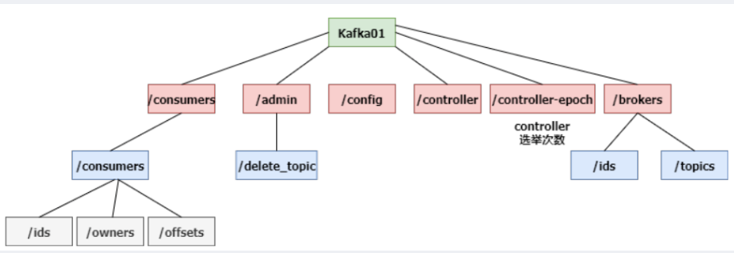

# Kafka 概念

**定义：**

Kafka是一个分布式的，基于**发布/订阅**模式的消息队列

Kafka是分布式的，基于发布订阅模式的消息队列。

==版本变化：==

==0.8：==zookeeper不再存储consumer的offset，改为自己维护

==2.8==：取消了对zookeeper的依赖，转而自己实现Raft算法（zookeeper是ZAP算法）

ZAB算法更严谨，实现难度更高，同时也意味着效率更低，为了一致性舍弃了效率，当topic数和分区数过多时，leader切换延迟很高，造成了kafka的瓶颈

raft算法出现比较晚，协议相对比较保守，速度更快

## 架构


## Zookeeper（raft代替）




zookeeper主要是用来存储Kafka的元数据：

* 集群配置
* 管理信息（删除，分区迁移等）
* controller选举（epoch为选举次数）
* 节点管理(id,topics)

## broker

一台kafka服务器就是一个broker。一个集群由多个broker组成。一个broker可以容纳多个topic；最好是3的倍数

## Topic

一个消息主题，里面存放一类数据，可以理解为一个队列或者是一个表

## Partition

分区，为了扩展，一个topic可以分布到多个partition（最好是节点数的倍数），分区内有序

**==Replication==**

副本数，为了数据安全，每个topic可以设置副本数（默认是3），副本其实就是Partition的完整备份，存在不同的节点上，防止节点故障

为了写入的一致性，只有每个分区的一个副本可以写数据，这个副本就是leader，由选举获得（LEO最大者优先）

**ISR：**

* ISR是一个和leader保持同步的集合（就是副本所在的节点集合）
* follower如果长时间没有和leader同步数据，会被踢出ISR
* Leader发生故障，在ISR里选举


**LEO：**每个副本最后的offset（最新的偏移量）

**HW（High Watermark）：**所有ISR中最小的LEO


> **follower的LEO大于等于该Partition的HW**，即follower追上leader之后，就可以重新加入ISR了。
>
> 选出新Leader后，其余的follower会先**将各自的log文件高于HW的部分截掉**，然后从新的leader同步数据。

## Offset

每条消息的id，不是文件的偏移量

## Segment

数据分片，每个分区的细分，每个segment对应一个数据文件和索引文件（1.0之后还有个时间索引，共两个索引文件）

**Kafaka文件存储机制**

* 一个topic有多个partition（每个partition就是一个log文件）
* 每个partition分为多个segment（文件的切分），segment是概念，没有实质文件或文件夹
* 每个segment有两个文件（.log和.index)

## ISR

* ISR是一个和leader保持同步的集合
* follower如果长时间没有和leader同步数据，会被踢出ISR
* Leader发生故障，在ISR里选举

## Kafka生产者

**分区原因：**

* 可以提高并发
* 方便扩展qu
* PS:分区策略（是否指定分区，有无key）

**ACK：**确认收到回执

* Kafka默认是leader和follower全部同步之后在发送ack
* 缺点是延时高一点

**ack的三种模式:**

即ack的返回时间点

| afks | description                                                  | Exactly Once语义 |
| ---- | ------------------------------------------------------------ | ---------------- |
| 0    | 接收到立马返回，broker故障时可能会丢失数据                   | At Most Once     |
| 1    | 只要leader落盘就返回，leader故障可能丢失数据                 |                  |
| -1   | 全部落盘后返回，可能会数据重复（全部落盘了，但是没有ack就挂了） | At Least Once    |

**幂等性：**

要启用幂等性，只需要将Producer的参数中enable.idempotence设置为true即可

事务:

设置transactional.id即可

At Least Once + 幂等性+事务 = Exactly Once(即数据不丢不重)

> kafka事务和数据库的事务不同,kafka的事务中间提交的消息也是可见的,也是顺序写入了data log的,但是与非事务写入不同的是,事务会在底层存储时额外加两个index文件(\*.snapshot,\*.txnindex),消费者需要设置消费的隔离级别为read_committed(默认是read_uncommitted)来只消费事务成功的消息


**故障处理：**

* LEO：每个副本最后的offset（最新的偏移量）
* HW（High Watermark）：所有副本中最小的LEO

> **follower的LEO大于等于该Partition的HW**，即follower追上leader之后，就可以重新加入ISR了。
>
> 选出新Leader后，其余的follower会先**将各自的log文件高于HW的部分截掉**，然后从新的leader同步数据。

## Kafka消费者

**Consumer Group （CG）：**

* 消费者组，由多个consumer组成；
* 消费者组内每个消费者负责消费不同分区的数据，一个分区只能由一个消费者消费；
* 消费者组之间互不影响。
* 此举提高了消费者的并发

**消费方式：**

* consumer采用pull（拉）模式从broker中读取数据。
* 如果kafka没有数据，消费者可能会陷入循环中；可以设置时长参数timeout

**分区分配策略：**

* roundrobin：单张发牌模式
* range：堆发牌模式

**offset：**

> Kafka 0.9版本之前，consumer默认将offset保存在Zookeeper中，从0.9版本开始，consumer默认将offset保存在Kafka一个内置的topic中，该topic为**__consumer_offsets**。

**Rebalance：**

当有新的消费者加入消费者组、已有的消费者推出消费者组或topic的分区发生变化，就会触发到分区的重新分配，重新分配的过程叫做Rebalance。

## Kafka高效读写

* 顺序写磁盘
* 应用Pagecache：把内存当硬盘
* 零拷贝（零复制）

# Kafka安装部署

* 解压并创建日志文件夹

```shell
[aaa@hadoop102 kafka]$ mkdir logs
```

* 修改**server.properties**

```properties
#broker的全局唯一编号，不能重复
broker.id=0
#删除topic功能使能
delete.topic.enable=true
#处理网络请求的线程数量
num.network.threads=3
#用来处理磁盘IO的现成数量
num.io.threads=8
#发送套接字的缓冲区大小
socket.send.buffer.bytes=102400
#接收套接字的缓冲区大小
socket.receive.buffer.bytes=102400
#请求套接字的缓冲区大小
socket.request.max.bytes=104857600
#kafka运行日志存放的路径	
log.dirs=/opt/module/kafka/logs
#topic在当前broker上的分区个数
num.partitions=1
#用来恢复和清理data下数据的线程数量
num.recovery.threads.per.data.dir=1
#segment文件保留的最长时间，超时将被删除
log.retention.hours=168
#配置连接Zookeeper集群地址
zookeeper.connect=hadoop102:2181,hadoop103:2181,hadoop104:2181
```

* 配置环境变量  **/etc/profile.d/**
* 分发并修改**broker.id**

# Kafaka操作命令

```shell
# 单点启动
bin/kafka-server-start.sh -daemon config/server.properties
# 单点停止
bin/kafka-server-stop.sh


# 查看所有topic
bin/kafka-topics.sh --zookeeper hadoop102:2181 --list
# 查看单个topic
bin/kafka-topics.sh --zookeeper hadoop102:2181 \
--describe --topic first
#  创建topic
bin/kafka-topics.sh --zookeeper hadoop102:2181 \
--create \
--replication-factor 3 \
--partitions 1 \
--topic first
# 删除topic
bin/kafka-topics.sh --zookeeper hadoop102:2181 \
--delete --topic first
# 修改topic
bin/kafka-topics.sh --zookeeper hadoop102:2181 --alter --topic first --partitions 6


# 生产消息
bin/kafka-console-producer.sh \
--broker-list hadoop102:9092 \
--topic first
# 消费消息
bin/kafka-console-consumer.sh \
--bootstrap-server hadoop102:9092 \
--from-beginning \
--topic first
```

群起脚本：

```bash
#! /bin/bash

case $1 in
"start"){
        for i in hadoop102 hadoop103 hadoop104
        do
                echo " --------启动 $i Kafka-------"
                # 用于KafkaManager监控
                ssh $i "export JMX_PORT=9988 && /opt/module/kafka/bin/kafka-server-start.sh -daemon /opt/module/kafka/config/server.properties "
        done
};;
"stop"){
        for i in hadoop102 hadoop103 hadoop104
        do
                echo " --------停止 $i Kafka-------"
                ssh $i "/opt/module/kafka/bin/kafka-server-stop.sh stop"
        done
};;
esac
```

# Kaka API

导入依赖：

```xml
<dependency>
	<groupId>org.apache.kafka</groupId>
	<artifactId>kafka-clients</artifactId>
	<version>0.11.0.0</version>
</dependency>
```
```java
//AdminUtils
public static void createKafaTopic(String ZkStr,KafkaTopicBean topic) {  
	ZkUtils zkUtils = ZkUtils.apply(ZkStr, 30000, 30000,JaasUtils.isZkSecurityEnabled()); 
    AdminUtils.createTopic(zkUtils,
                           topic.getTopicName(),  
                           topic.getPartition(),
                           topic.getReplication(),  
                           new Properties(), 
                           new RackAwareMode.Enforced$());  
    zkUtils.close();
}
public static void deleteKafaTopic(String ZkStr,KafkaTopicBean topic) {  
    ZkUtils zkUtils = ZkUtils.apply(ZkStr, 30000, 30000,JaasUtils.isZkSecurityEnabled()); 
         
    AdminUtils.deleteTopic(zkUtils, topic.getTopicName());  
    zkUtils.close();
}
```

## Producer API

### 异步发送

* 需要一个properties，设置Producer参数

* 创建KafkaProducer实例<K,V>

* 调用send()方法

  * *可选*：传入回调函数的实现类(重写onCompletion方法)

* producer.close();

### 同步发送

* 异步发送的基础上，调用send的get方法即可

* send().get()

```java
//设置Producer参数
Properties props = new Properties();
props.put("bootstrap.servers", "hadoop102:9092");//kafka集群，broker-list
props.put("acks", "all");
props.put("retries", 1);//重试次数
props.put("batch.size", 16384);//批次大小
props.put("linger.ms", 1);//等待时间
props.put("buffer.memory", 33554432);//RecordAccumulator缓冲区大小
props.put("key.serializer","org.apache.kafka.common.serialization.StringSerializer");
props.put("value.serializer","org.apache.kafka.common.serialization.StringSerializer");
//创建生产者
Producer<String, String> producer = new KafkaProducer<>(props);
//发送消息
for (int i = 0; i < 100; i++) {
 	producer.send(new ProducerRecord<String, String>("first", Integer.toString(i), Integer.toString(i)), new Callback() {
//回调函数，该方法会在Producer收到ack时调用，为异步调用
	@Override
	public void onCompletion(RecordMetadata metadata, Exception exception) {
        if (exception == null) {
            System.out.println("success->" + metadata.offset());
        } else {
            exception.printStackTrace();
        }
    }
    });//此处调用get(),就是同步发送
}
producer.close();
```
## Consumer API

### 自动提交offset

- 需要一个properties，设置Producer参数
- 创建KafkaConsumer<K,V>实例
- subscribe()方法，绑定topics
- 调用poll()方法，消费数据

```java
//设置Consumer参数
Properties props = new Properties();
props.put("bootstrap.servers", "hadoop102:9092");
props.put("group.id", "test");
props.put("enable.auto.commit", "true");
props.put("auto.commit.interval.ms", "1000");
props.put("key.deserializer", "org.apache.kafka.common.serialization.StringDeserializer");
props.put("value.deserializer", "org.apache.kafka.common.serialization.StringDeserializer");
//创建消费者
KafkaConsumer<String, String> consumer = new KafkaConsumer<>(props);
//绑定topics
consumer.subscribe(Arrays.asList("first"));
//consumer.subscribe(Collections.singleton("first"));
//消费数据
while (true) {
    ConsumerRecords<String, String> records = consumer.poll(100);
    for (ConsumerRecord<String, String> record : records)
        System.out.printf("offset = %d, key = %s, value = %s%n", record.offset(), record.key(), record.value());
}
```

### 手动提交offset

相对于自动提交，手动提交主要改变有：

* 自动提交参数enable.auto.commit 设为false
* 若为同步提交，消费数据时调用consumer.commitSync();
* 若为异步提交，调用consumer.commitAsync(),内部传入回调函数OffsetCommitCallback的实现类

```java
//关闭自动提交offset
props.put("enable.auto.commit", "false");
//同步提交，当前线程会阻塞知道offset提交成功
consumer.commitSync();
//异步提交
consumer.commitAsync(new OffsetCommitCallback() {
    @Override
    public void onComplete(Map<TopicPartition, OffsetAndMetadata> offsets, Exception exception) {
        if (exception != null) {
            System.err.println("Commit failed for" + offsets);
        }
    }
});
```

### 自定义存储offset

1. 维护一个集合Map<TopicPartition,Long>，用于存放offset；
2. 订阅topic时，传入ConsumerRebalanceListener()的实现类；
3. 实现类中实现两个方法：
        1. **onPartitionsRevoked**：提交offset到自定义介质（将集合永久化)
        2. **onPartitionsAssigned**：
              1. 从外部介质获得offset记录（把集合从硬盘读到内存）；		
              2. 根据分区，获取对应的offset；
              3. 指定每个分区的偏移量；
4. 消费数据时，每消费一条数据，都向集合中添加一条记录；

```java
public class MyconsumerDIY {
    static Map<TopicPartition,Long> offset;
    public static void main(String[] args) {
        offset =new HashMap<TopicPartition, Long>();
        Properties properties = new Properties();
        properties.setProperty("group.id", "test");
        properties.setProperty("bootstrap.servers", "hadoop102:9092");
        KafkaConsumer<String, String> consumer = new KafkaConsumer<String, String>(properties,new StringDeserializer(),new StringDeserializer());
        
//订阅topic时，传入ConsumerRebalanceListener()的实现类
        consumer.subscribe(Collections.singleton("first"), new ConsumerRebalanceListener() {
            //该方法会在Rebalance之前调用,提交Offset到自定义介质
            public void onPartitionsRevoked(Collection<TopicPartition> partitions) {
                //提交Offset到自定义介质
				//commitOffset();
            }
			//该方法会在Rebalance之后调用，根据当前消费者分配到的分区，获取对应的offset
            public void onPartitionsAssigned(Collection<TopicPartition> partitions) {
                //从外部介质获得offset记录
                //getOffset(); 
                //根据在分区结果获取新的Offset
                for (TopicPartition partition : partitions) {
                    Long aLong = offset.get(partition);
                    //指定每个分区的偏移量
                    consumer.seek(partition,aLong);
                }

            }
        });
        //消费数据
        while (true) {
            ConsumerRecords<String, String> poll = consumer.poll(100);
            if (poll.count() ==0) continue;
            for (ConsumerRecord<String, String> rec : poll) {
                System.out.println(rec.value());
                //每消费一条数据，做一次记录
                offset.put(new TopicPartition(rec.topic(),rec.partition()),rec.offset());

            }
        }
    }
}
```

```java
	/**
	 * 将Offset提交到自定义介质
	 */
     private static void commitOffset() {
        ObjectOutputStream outputStream = null;
        try {
            outputStream = new ObjectOutputStream(new FileOutputStream(OFFSET_FILE));
            outputStream.writeObject(offset);
        } catch (IOException e) {
            e.printStackTrace();
        } finally {
            if (outputStream != null) {
                try {
                    outputStream.close();
                } catch (IOException e) {
                    e.printStackTrace();
                }
            }
        }
    }
```

```java
	/**
     * 从自定义介质中获取Offset
     */
    private static void getOffset() {
        ObjectInputStream objectInputStream = null;
        try {
            objectInputStream = new ObjectInputStream(new FileInputStream(OFFSET_FILE));
            offset = (Map<TopicPartition, Long>) objectInputStream.readObject();
        } catch (IOException | ClassNotFoundException e) {
            offset = new HashMap<>();
        } catch (ClassCastException e) {
            e.printStackTrace();
        } finally {
            if (objectInputStream != null) {
                try {
                    objectInputStream.close();
                } catch (IOException e) {
                    e.printStackTrace();
                }
            }
        }
    }
```

## 自定义拦截器

* 实现 ProducerInterceptor接口
* 实现其方法，核心逻辑onSend，操纵ProducerRecord

-----------

Producer：

1. 设置参数集合Properties
2. 构建连接器链List，并把其加入参数集合（ProducerConfig.INTERCEPTOR_CLASSES_CONFIG）
3. 发送消息
4. producer.close();
```java
public class MyInterceptor implements ProducerInterceptor<String, String> {
	//获取配置信息或初始化
	@Override
	public void configure(Map<String, ?> configs) {

	}
	//主要逻辑，对record的操作，new之后返回
	@Override
	public ProducerRecord<String, String> onSend(ProducerRecord<String, String> record) {
		return record
	}
	//ack返回或发送失败时调用（expection==null时发送成功，否则失败）
	@Override
	public void onAcknowledgement(RecordMetadata metadata, Exception exception) {

	}
	//关闭资源
	@Override
	public void close() {

	}
}
```

```java
// 1 设置配置信息
Properties props = new Properties();
props.put("bootstrap.servers", "hadoop102:9092");
props.put("acks", "all");
props.put("retries", 0);
props.put("batch.size", 16384);
props.put("linger.ms", 1);
props.put("buffer.memory", 33554432);
props.put("key.serializer", "org.apache.kafka.common.serialization.StringSerializer");
props.put("value.serializer", "org.apache.kafka.common.serialization.StringSerializer");
		
// 2 构建拦截链
List<String> interceptors = new ArrayList<>();
interceptors.add("com.atguigu.kafka.interceptor.TimeInterceptor"); 	interceptors.add("com.atguigu.kafka.interceptor.CounterInterceptor"); 
props.put(ProducerConfig.INTERCEPTOR_CLASSES_CONFIG, interceptors);
		 
String topic = "first";
Producer<String, String> producer = new KafkaProducer<>(props);

// 3 发送消息
for (int i = 0; i < 10; i++) {
    ProducerRecord<String, String> record = new ProducerRecord<>(topic, "message" + i);
	producer.send(record);
		}
		 
// 4 一定要关闭producer，这样才会调用interceptor的close方法
producer.close();
```

# flume和Kafka对接

## Kafaka Source

```properties
# source类型
a1.sources.s1.type = org.apache.flume.source.kafka.KafkaSource
# kafka brokers列表
a1.sources.s1.kafka.bootstrap.servers = hadoop102:9092,hadoop103:9092,hadoop104:9092
# 配置消费的kafka topic
a1.sources.s1.kafka.topics = testTopic3
# 配置消费者组的id
a1.sources.s1.kafka.consumer.group.id = consumer_testTopic3
# 一批数据的最大消息数
a1.sources.s1.batchSize = 5000
# 一批数据的等待时间
a1.sources.s1.batchDurationMillis = 200
```

## Kafka Channel

```properties
# channel类型
a1.channels.c1.type = org.apache.flume.channel.kafka.KafkaChannel
# kafka brokers列表
a1.channels.c1.kafka.bootstrap.servers=hadoop102:9092,hadoop103:9092,hadoop104:9092
# kafka 对接的topic
a1.channels.c1.kafka.topic = channel1
# 配置消费者组的id
a1.channels.c1.kafka.consumer.group.id = flume-consumer
```

## Kafka Sink

```properties
# sink类型
a1.sinks.k1.type = org.apache.flume.sink.kafka.KafkaSink
# kafka brokers列表
a1.sinks.k1.kafka.bootstrap.servers = hadoop102:9092,hadoop103:9092,hadoop104:9092
# 配置生产者的topic
a1.sinks.k1.kafka.topic = first
# 批处理大小，数据量满足就发送
a1.sinks.k1.kafka.flumeBatchSize = 20
# acks模式（1,0，-1）
a1.sinks.k1.kafka.producer.acks = 1
# 等待时间，时间到了就发送
a1.sinks.k1.kafka.producer.linger.ms = 1
```

## 官网详细设置

### Kafka Source

| Property Name                    | Default   | Description                                                  |
| -------------------------------- | --------- | ------------------------------------------------------------ |
| **type**                         | –         | 组件类型名称，需要是`org.apache.flume.source.kafka.KafkaSource` |
| **kafka.bootstrap.servers**      | –         | source使用的Kafka集群中的代理列表                            |
| kafka.consumer.group.id          | flume     | consumer group 唯一标识. 在多个源或代理中设置相同的ID表示它们是同一个consumer group的一部分 |
| **kafka.topics**                 | –         | 以逗号分隔的主题列表，kafka消费者将从中读取消息。            |
| **kafka.topics.regex**           | –         | 正则表达式，用于定义源订阅的主题集。 此属性具有比`kafka.topics`更高的优先级，并覆盖`kafka.topics`（如果存在） |
| batchSize                        | 1000      | 一批中写入Channel的最大消息数                                |
| batchDurationMillis              | 1000      | 将批处理写入通道之前的最长时间（以毫秒为单位）每当达到大小和时间的第一个时，就会写入批处理。 |
| backoffSleepIncrement            | 1000      | 当Kafka主题为空时触发的初始和增量等待时间。 等待期将减少对空的Kafka主题的主动ping操作。 一秒钟对于摄取用例是理想的，但是对于使用拦截器的低延迟操作，可能需要较低的值。 |
| maxBackoffSleep                  | 5000      | Kafka主题出现为空时触发的最长等待时间。 5秒是摄取用例的理想选择，但使用拦截器的低延迟操作可能需要较低的值。 |
| useFlumeEventFormat              | false     | 默认情况下，事件从Kafka主题直接作为字节直接进入事件主体。 设置为true以将事件读取为Flume Avro二进制格式。 与KafkaSink上的相同属性或Kafka Channel上的parseAsFlumeEvent属性一起使用时，这将保留在生成端发送的任何Flume标头。 |
| setTopicHeader                   | true      | 设置为true时，将检索到的消息的主题存储到由`topicHeader`属性定义的标头中。 |
| topicHeader                      | topic     | 如果setTopicHeader属性设置为true，则定义用于存储接收消息主题名称的标头名称。 如果与Kafka Sink `topicHeader`属性结合使用，应该小心，以避免将消息发送回循环中的同一主题。 |
| migrateZookeeperOffsets          | true      | 如果找不到Kafka存储的偏移量，请在Zookeeper中查找偏移量并将它们提交给Kafka。 这应该是支持从旧版本的Flume无缝Kafka客户端迁移。 迁移后，可以将其设置为false，但通常不需要这样做。 如果未找到Zookeeper偏移量，则Kafka配置kafka.consumer.auto.offset.reset定义如何处理偏移量。 有关详细信息，请查看Kafka文档 |
| kafka.consumer.security.protocol | PLAINTEXT | 如果使用某种级别的安全性写入Kafka，则设置为`SASL_PLAINTEXT`，`SASL_SSL`或`SSL`。 有关安全设置的其他信息，请参见下文。 |
| more consumer security props     |           | 如果使用`SASL_PLAINTEXT`，则`SASL_SSL`或`SSL`会引用Kafka安全性以获取需要在使用者上设置的其他属性。 |
| Other Kafka Consumer Properties  | –         | 这些属性用于配置Kafka Consumer。 可以使用Kafka支持的任何consumer property。 唯一的要求是使用前缀`kafka.consumer`添加属性名称。 例如：`kafka.consumer.auto.offset.reset` |

### Kafka Channel

| Property Name                    | Default       | Description                                                  |
| :------------------------------- | :------------ | :----------------------------------------------------------- |
| type                             | –             | 组件类型名称，需要是`org.apache.flume.channel.kafka.KafkaChannel` |
| kafka.bootstrap.servers          | -             | channel使用的Kafka集群中的代理列表,可以是部分代理，但我们建议至少两个，因为HA。 格式为逗号分隔的`hostname:port`列表 |
| kafka.topic                      | flume-channel | channel将使用的Kafka主题                                     |
| kafka.consumer.group.id          | flume         | channel用于向Kafka注册的消费者群组ID。 多个channel必须使用相同的topic和group ，以确保当一个代理失败时，另一个可以获取数据。请注意，使具有相同ID的non-channel消费者可能导致数据丢失。 |
| parseAsFlumeEvent                | true          | 期望在channel中使用FlumeEvent模式的Avro基准。 如果Flume源写入通道，则应该为`true`;如果其他producers正在写入channel正在使用的主题，则应为`false`。 通过使用flume-ng-sdk工件提供的`org.apache.flume.source.avro.AvroFlumeEvent`，可以在Flume之外解析到Kafka的Flume源消息 |
| migrateZookeeperOffsets          | true          | 如果找不到Kafka存储的偏移量，请在Zookeeper中查找偏移量并将它们提交给Kafka。 这应该是支持从旧版本的Flume无缝Kafka客户端迁移。 迁移后，可以将其设置为false，但通常不需要这样做。 如果未找到Zookeeper偏移量，则`kafka.consumer.auto.offset.reset`配置定义如何处理偏移量。 |
| pollTimeout                      | 500           | 在消费者调用的“poll()”中等待的时间（以毫秒为单位）。         |
| defaultPartitionId               | –             | 指定要发送到此通道中的所有事件的Kafka分区ID（整数），除非被`partitionIdHeader`覆盖。 默认情况下，如果未设置此属性，则事件将由Kafka Producer的分区程序分发 - 包括`key`（如果指定）（或由`kafka.partitioner.class`指定的分区程序）。 |
| partitionIdHeader                | –             | 设置时，生产者将从事件头中获取使用此属性的值命名的字段的值，并将消息发送到主题的指定分区。 如果该值表示无效分区，则该事件将不被接受。 如果存在标头值，则此设置将覆盖`defaultPartitionId`。 |
| kafka.consumer.auto.offset.reset | latest        | 当Kafka中没有初始偏移量或服务器上当前偏移量不再存在时（例如因为该数据已被删除）该怎么办：最早：自动将偏移量重置为最早的最新偏移量：自动重置偏移量 到最新的偏移量none：如果没有为消费者组找到任何其他偏移量，则向消费者抛出异常：向消费者抛出异常。 |
| kafka.producer.security.protocol | PLAINTEXT     | 如果使用某种级别的安全性写入Kafka，则设置为`SASL_PLAINTEXT`，`SASL_SSL`或`SSL`。 有关安全设置的其他信息，请参见下文。 |
| kafka.consumer.security.protocol | PLAINTEXT     | 与`kafka.producer.security.protocol`相同，但是用于从Kafkareading/consuming。 |

### kafka sink

| Property Name                    | Default             | Description                                                  |
| -------------------------------- | ------------------- | ------------------------------------------------------------ |
| **type**                         | –                   | 必须设置为`org.apache.flume.sink.kafka.KafkaSink`            |
| **kafka.bootstrap.servers**      | –                   | sink使用的Kafka集群中的代理列表                              |
| kafka.topic                      | default-flume-topic | kafka生产者订阅的topic                                       |
| flumeBatchSize                   | 100                 | 一批中要处理多少条消息                                       |
| kafka.producer.acks              | 1                   | acks模式（1,0，-1）                                          |
| useFlumeEventFormat              | false               | 默认情况下，事件直接从事件主体作为字节放入Kafka主题。 设置为true可将事件存储为Flume Avro二进制格式。 与KafkaSource上的相同属性或Kafka Channel上的parseAsFlumeEvent属性结合使用，将为生产方保留任何Flume标头。 |
| defaultPartitionId               | –                   | 为该通道中要发送到的所有事件指定一个Kafka分区ID（整数），除非被`partitionIdHeader`覆盖。 默认情况下，如果未设置此属性，则事件将由Kafka Producer的分区程序分发-包括通过指定的key（或由kafka.partitioner.class指定的分区）分发。 |
| partitionIdHeader                | –                   | 设置后，接收器将从事件头中获取使用此属性的值命名的字段的值，并将消息发送到主题的指定分区。 如果该值表示无效的分区，则将引发EventDeliveryException。 如果标题值存在，则此设置将覆盖`defaultPartitionId`。 |
| allowTopicOverride               | true                | 设置好后，接收器将允许将消息生成到由topicHeader属性（如果提供）指定的主题中。 |
| topicHeader                      | topic               | 当与`allowTopicOverride`一起设置时，将产生一条消息到使用此属性值命名的标头值中。 当与Kafka Source`topicHeader`属性一起使用时，应避免产生回送。 |
| kafka.producer.security.protocol | PLAINTEXT           | 如果使用某种安全级别写入Kafka，则设置为SASL_PLAINTEXT，SASL_SSL或SSL。 |
| *more producer security props*   |                     | 如果使用 SASL_PLAINTEXT, SASL_SSL or SSL 请参考 [Kafka security](http://kafka.apache.org/documentation.html#security) . |
| Other Kafka Producer Properties  | –                   | 这些属性用于配置Kafka Producer。 可以使用Kafka支持的任何生产者属性。 唯一的要求是在属性名称前添加前缀kafka.producer。 例如：`kafka.producer.linger.ms` |

# Kafka监控

## Kafka Monitor

1. 上传jar包KafkaOffsetMonitor-assembly-0.4.6.jar到集群

2. 在/opt/module/下创建kafka-offset-console文件夹

3. 将上传的jar包放入刚创建的目录下

4. 在/opt/module/kafka-offset-console目录下创建启动脚本start.sh，内容如下：

```sh
#!/bin/bash
java -cp KafkaOffsetMonitor-assembly-0.4.6-SNAPSHOT.jar \
com.quantifind.kafka.offsetapp.OffsetGetterWeb \
--offsetStorage kafka \
--kafkaBrokers hadoop102:9092,hadoop103:9092,hadoop104:9092 \
--kafkaSecurityProtocol PLAINTEXT \
--zk hadoop102:2181,hadoop103:2181,hadoop104:2181 \
--port 8086 \
--refresh 10.seconds \
--retain 2.days \
--dbName offsetapp_kafka &
```

5. 在/opt/module/kafka-offset-console目录下创建mobile-logs文件夹

```shell
mkdir /opt/module/kafka-offset-console/mobile-logs
```

6. 启动KafkaMonitor

```shell
./start.sh
```

7. 登录页面hadoop102:8086端口查看详情

## Kafka Manager

1. 上传压缩包kafka-manager-1.3.3.15.zip到集群

2. 解压到/opt/module

3. 修改配置文件conf/application.conf

```properties
kafka-manager.zkhosts="hadoop102:2181,hadoop103:2181,hadoop104:2181"
```

4. 启动kafka-manager

```shell
bin/kafka-manager
```

5. 登录hadoop102:9000页面查看详细信息(和hadoop冲突，修改)

# 附录

## Kafka Producer压力测试

在/opt/module/kafka/bin目录下面有个文件。

```shell
bin/kafka-producer-perf-test.sh \ 
--topic test \
--record-size 100 \
--num-records 100000 \
--throughput 1000 \
--producer-props bootstrap.servers=hadoop102:9092,hadoop103:9092,hadoop104:9092
```

## Kafka Consumer压力测试

Consumer的测试，如果这四个指标（IO，CPU，内存，网络）都不能改变，考虑增加分区数来提升性能。

```shell
bin/kafka-consumer-perf-test.sh \
--zookeeper hadoop102:2181 \
--topic test \
--fetch-size 10000 \
--messages 10000000 \
--threads 1
```

## 经验

* **Kafka的机器数量**

Kafka机器数量=2\*（峰值生产速度 `M/s`\*副本数/100）+1

* **Kafka的日志保存时间**

默认7天，实际3天

* **Kafka的硬盘大小**

每天的数据量`G`*副本数\*3天/70%

* **副本数设定**

一般我们设置成2个或3个

* **分区数设置**

分区数一般设置为：3-10个


```java
//根据时间消费
Map<TopicPartition,OffsetAndTimestamp> startOffsetMap=KafkaUtil.fetchOffsetsWithTimestamp(topic, sTime, kafkaProp);
```


    num.network.threads 计算密集任务   CPU + 1   CPU8核   9
    num.io.threads IO密集任务           CPU*2    8*2=16 
    数据保存时间3  副本设置2
    压缩
    增加内存到6g  如果内存还不够，需要增加kafka台数。