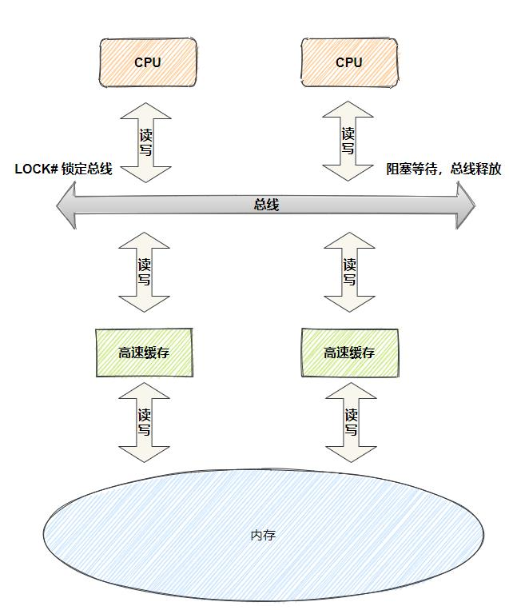

RUST

# 注释

- **普通注释**，其内容将被编译器忽略掉：

- `// 单行注释，注释内容直到行尾。`

- `/* 块注释， 注释内容一直到结束分隔符。 */`

- **文档注释**，其内容将被解析成 HTML 帮助[文档](https://rustwiki.org/zh-CN/rust-by-example/meta/doc.html):

- `/// 为接下来的项生成帮助文档。`

- `//! 为注释所属于的项（译注：如 crate、模块或函数）生成帮助文档。`

文档注释也分为单行注释和块注释，但又有内外之分：

* 内部文档注释（Inner doc comment）
  
  * 单行注释（以 /// 开头）
  
  * 块注释（用 /** ... */ 分隔）

* 外部文档注释（Outer doc comment）
  
  * 单行注释（以 //! 开头）
  
  * 块注释（用 /*! ... */ 分隔）

二者的区别：

内部文档注释是对它之后的项做注释，与使用 #[doc="..."] 是等价的。
外部文档注释是对它所在的项做注释，与使用 #![doc="..."] 是等价的。

# Formatted Print

使用方式：

* `format!`: 将格式化文本写入 [`String`](https://doc.rust-lang.org/stable/rust-by-example/std/str.html)
* `print!`: 相同，`format!`但文本打印到控制台 (io::stdout)。
* `println!`: 相同，`print!`但附加了换行符。
* `eprint!`: 相同`format!`但文本打印到标准错误 (io::stderr)。
* `eprintln!`: 相同，`eprint!`但附加了换行符。
* `write!`:
* `writeln!`:
* `format_args!`:

规则：

{arg:spec}

spec: （（填充:char）对齐：<^>）（签名：+ 或-）（#：漂亮打印）（补零：0）（长度:usize）（精度:.usize）（类型:EeXxobp）(debug:?)

usize：只能是整型，如果是别名需要后缀'$'

Ee:科学计数法使用E还是e

Xx:16进制大写还是小写

o:八进制

b:二进制

p:使用内存地址

debug:输出完整的

漂亮打印：进制加前缀，debug输出转义

```
format_string := text [ maybe_format text ] *
maybe_format := '{' '{' | '}' '}' | format
format := '{' [ argument ] [ ':' format_spec ] '}'
argument := integer | identifier

format_spec := [[fill]align][sign]['#']['0'][width]['.' precision]type
fill := character
align := '<' | '^' | '>'
sign := '+' | '-'
width := count
precision := count | '*'
type := '' | '?' | 'x?' | 'X?' | identifier
count := parameter | integer
parameter := argument '$'
```

实例：

```rust
// 基础替换，{}对应后续的值，括号数和值的数要一致
println!("{} days", 31);
// 转义，两个{{或者}}会转义成{和}
println!("Hello {{}}");
// 序列（数组）替换，用下标指定值
println!("{0}, this is {1}. {1}, this is {0}", "Alice", "Bob");

// 别名替换，使用别名指定值
println!("{subject} {verb} {object}",
    object="the lazy dog",
    subject="the quick brown fox",
    verb="jumps over");

// 对齐&填充
// :{字符}{方向：<^>}{长度} 指定填充字符和对齐方式
assert_eq!(format!("Hello {:<5}!", "x"),  "Hello x    !");
assert_eq!(format!("Hello {:-<5}!", "x"), "Hello x----!");
assert_eq!(format!("Hello {:^5}!", "x"),  "Hello   x  !");
assert_eq!(format!("Hello {:>5}!", "x"),  "Hello     x!");
// ：后的长度要使用参数指定，需末尾加$（只接受usize）
println!("Hello {:5}!", "x");
println!("Hello {:1$}!", "x", 5);
println!("Hello {1:0$}!", 5, "x");
println!("Hello {:width$}!", "x", width = 5);

// 签名
+- 这适用于数字类型，表示应始终打印符号。默认情况下从不打印正号，默认情况下仅对有符号值打印负号。此标志表示应始终打印正确的符号 (+或-)。
- - 目前未使用
# - 此标志表示应使用“替代”打印形式。替代形式是：
#? - 漂亮打印Debug格式（添加换行符和缩进）
#x - 在参数前面加上一个 0x
#X - 在参数前面加上一个 0X
#b - 在参数前面加上一个 0b
#o - 在参数前面加上一个 0o
0 - 这用于指示整数格式的填充width既应使用0字符完成，又应具有符号意识。类似的格式{:08}会产生00000001整数1，而相同的格式会产生-0000001整数-1。请注意，负版本比正版本少一个零。请注意，填充零始终位于符号（如果有）之后和数字之前。当与#标志一起使用时，适用类似的规则：在前缀之后但在数字之前插入填充零。前缀包含在总宽度中。
```

# 数据类型

## 标量类型

* 有符号整数：`i8`，`i16`，`i32`，`i64`，`i128`和`isize`（32/64，依赖架构）
* 无符号整数：`u8`，`u16`，`u32`，`u64`，`u128`和`usize`（32/64，依赖架构）
* 浮点数：`f32`,`f64`
* `char`Unicode 标量值，如`'a'`,`'α'`和`'∞'`（每个 4 个字节）
* `bool`布尔值，`true`或`false`
* 和 unit type `()`，其唯一可能的值是一个空元组：`()`

尽管 unit type的值是一个元组，但它不被视为复合类型，因为它不包含多个值。表达式的默认返回值。

可以在数字文字中插入下划线以提高可读性，例如 `1_000`与 相同`1000`，并且`0.000_001`与 相同`0.000001`。

## 复合类型

* 元组 `(1, true)`，签名：(T1, T2, ...)，类型不需要一致
  * 空元组和unit不一样，不是所有空元组都是unit
  * 元组里面必须有`,`，单一元组后面要加`,`,否则就是表达式了
  * 元组调用：`expr.0`, `expr.1`, etc.
* 数组 `[1, 2, 3] `,签名：[T; length]，类型必须一致
* 切片slice：类似于软拷贝，不保存值，只保存地址和长度，签名：&[T] ，如：&s[0..9]

## 自定义类型

Rust 自定义数据类型主要通过两个关键字形成：

`struct`: 定义一个结构

* 元组，命名元组，指定具体的元组类型，使用()
  
  * struct Pair(i32, f32);
  * 可以理解为字段名匿名的结构体，在不关心字段名时使用

* 字段，使用{}
  
  * struct Point {
    
        x: f32,
        y: f32,
    
    }
  
  * ==实例化时使用：而不是\===

`..`为结构体更新语法，如果其他属性与另一个对象一致，可以省略，但是旧的结构体对象会无法使用，因为这里是move语义（所以叫更新语法）

```rust
let user2 = User {
    active: user1.active,
    username: user1.username,
    email: String::from("another@example.com"),
    sign_in_count: user1.sign_in_count,
};

let user2 = User {
    email: String::from("another@example.com"),
    ..user1
};
```

`enum`: 定义一个枚举

枚举更像是一个多个结构体的集合，子项由结构体或者元组组成

```rust
enum WebEvent {
    // An `enum` may either be `unit-like`,
    PageLoad,
    PageUnload,
    // like tuple structs,
    KeyPress(char),
    Paste(String),
    // or c-like structures.
    Click { x: i64, y: i64 },
}
//如果没有显式的标注()或{}，则enum是有符号值（即isize），此时可以指定isize值
enum Logger{
    None=1,//如果写成None()，无法指定isize，因为此时指定的其实是名为None的元组，已经不是primitive值了
    Info=3,
    Warn=5,
    Error=7,
}
//使用指定的isize方法 self as usize 
```

## 内存布局

### struct&tuple

struct和tuple不保证字段顺序，这样可以对齐时补充的最少，struct和tuple必须和操作系统内存对齐。

```rust
struct Foo{
    count: u8,
    data1: u32,
    data2: u16,
}

// 编译器实际可能的内存布局
//struct Foo {
//    count: u8,
//    data2: u16,
//    _pad1:u8,
//    data1: u32,
//}

```

### enum

```rust
enum Foo {
    A(u32),
    B(u64),
    C(u8),
}
struct FooRepr {
    data: u64, // 根据 tag 的不同，这一项可以为 u64，u32，或者 u8
    tag: u8,   // 0 = A，1 = B， 2 = C ,大小为一个字节到4个字节之间，参考Option，编辑器有特殊优化
    _pad1: [u8; 3],//字节对齐，以32位为例
}
```

数组的本质：一串连续的内存空间，内存大小是内部类型的整数倍

切片的本质：两个usize，第一个是指针（内存地址，切片开始的地址），第二个是len（元素的个数，不是内存的长度）

```rust

#![allow(unused)]
fn main() {
    struct Nothing; // 无字段意味着没有大小

    // 所有字段都无大小意味着整个结构体无大小
    struct LotsOfNothing {
        foo: Nothing,
        qux: (),      // 空元组无大小
        baz: [u8; 0], // 空数组无大小
    }
}

```

### Vec

栈上占用3个usize的字节（64位，3个u64），第一个是堆上的指针，中间是cap（申请的堆内存可以存放多少值，初始时和len一致，扩容时x2），后一个是len（这个vec有多少个值）

vec是动态数组，也就是说每次扩容，会在堆上新创建一个数组，然后改变指针，他不是链表，不能使用零散的内存

### String

类似于Vec，也是3个usize，第一个是指向堆上的u8数组的指针，中间是cap（申请的堆内存可以存放多少值），后一个是len（这个string有几个u8）

同vec，也是动态的

## 常量

Rust 有两种不同类型的常量，它们可以在任何范围内声明，包括全局。

* `const`：不可更改的值（常见情况）。
* `static`: 一个可能`mut`有`'static`生命周期的变量。静态生命周期是推断出来的，不必指定。访问或修改可变静态变量是[`unsafe`](https://doc.rust-lang.org/stable/rust-by-example/unsafe.html).

```rust
static mut ttt: i32 =12;
const tt: i32 =12;
```

> const和static的区别是const会内联（在内存里不固定，用到的地方编译器硬编码），推荐使用const，单例模式使用static
> 
> 有内部可变性的类型，使用static（因为const内联，导致常量实际并不是同一个）

# 变量绑定

## let&mut

```rust
//不可改变量
let a=1;
//let b:u8=1;
let b=1i8;//原始类型可以后缀
let aa:f32=1.22_f32;
let unit=();
//可改变量
let mut c=12;
```

## shadowing

可改不可改指的是赋值，如果不是赋值，而是重新绑定，不会报错，这个叫 **shadowing**

```rust
let x = 5;
let x = x + 1;
let x = x * 2;
```

## 先声明

```rust
let a_binding;
    {
        let x = 2;
        // Initialize the binding
        a_binding = x * x;
    }
println!("a binding: {}", a_binding);
```

这样是没问题的，没有违反不可变变量的规则，因为没有绑定值（类似于java的默认值null），但是此时rust是没法推断类型的，使用会报错

## 变量冻结

```rust
let mut _mutable_integer = 7i32;

{
    // shadowing变量为不可改变量
    let _mutable_integer = _mutable_integer;

    // 修改会报错
    _mutable_integer = 50;
    // FIXME ^ Comment out this line

    // `_mutable_integer` goes out of scope
}

// Ok! `_mutable_integer` 现在恢复为可改变量
_mutable_integer = 3;
```

# 类型转换

## as

Rust 不提供原始类型之间的隐式类型转换（强制）。但是，可以使用`as`关键字执行显式类型转换（强制转换）。

```rust
let decimal = 65.4321_f32;

// Error! No implicit conversion
let integer: u8 = decimal;
// FIXME ^ Comment out this line

// Explicit conversion
let integer = decimal as u8;
let character = integer as char;
```

## type

该`type`语句可用于为现有类型赋予新名称。类型必须有`UpperCamelCase`名称(大坨峰命名)，否则编译器会发出警告。唯一例外的规则是基本类型：`usize`，`f32`，等。

```rust
// `NanoSecond` is a new name for `u64`.
type NanoSecond = u64;
type Inch = u64;

// Use an attribute to silence warning.
#[allow(non_camel_case_types)]
type u64_t = u64;
// TODO ^ Try removing the attribute

fn main() {
    // `NanoSecond` = `Inch` = `u64_t` = `u64`.
    let nanoseconds: NanoSecond = 5 as u64_t;
    let inches: Inch = 2 as u64_t;

    // Note that type aliases *don't* provide any extra type safety, because
    // aliases are *not* new types
    println!("{} nanoseconds + {} inches = {} unit?",
        nanoseconds,
        inches,
        nanoseconds + inches);
}

```

## 自定义类型转换

### From 和 Into

From函数是结构体关联函数之一，类似于构造器

Into是From反向使用，不需要实现

```rust
use std::convert::From;

#[derive(Debug)]
struct Number {
    value: i32,
}

impl From<i32> for Number {
    fn from(item: i32) -> Self {
        Number { value: item }
    }
}

fn main() {
    let num = Number::from(30);
    println!("My number is {:?}", num);
    let int = 5;
    // Try removing the type declaration
    let num: Number = int.into();
    println!("My number is {:?}", num);
}

```

### TryFrom 和 TryInto

类似于`From`and`Into`,`TryFrom`并且`TryInto`是用于在类型之间转换的通用Trait。与`From`/不同`Into`， `TryFrom`/`TryInto`用于易出错的转换，因此返回`Results`。

```rust
use std::convert::TryFrom;
use std::convert::TryInto;

#[derive(Debug, PartialEq)]
struct EvenNumber(i32);

impl TryFrom<i32> for EvenNumber {
    type Error = ();

    fn try_from(value: i32) -> Result<Self, Self::Error> {
        if value % 2 == 0 {
            Ok(EvenNumber(value))
        } else {
            Err(())
        }
    }
}

fn main() {
    // TryFrom

    assert_eq!(EvenNumber::try_from(8), Ok(EvenNumber(8)));
    assert_eq!(EvenNumber::try_from(5), Err(()));

    // TryInto

    let result: Result<EvenNumber, ()> = 8i32.try_into();
    assert_eq!(result, Ok(EvenNumber(8)));
    let result: Result<EvenNumber, ()> = 5i32.try_into();
    assert_eq!(result, Err(()));
}
```

### 字符串转化

将任何类型转换为 `String`需要实现[`ToString`](https://doc.rust-lang.org/std/string/trait.ToString.html) Trait

实现[`fmt::Display`](https://doc.rust-lang.org/std/fmt/trait.Display.html)  Trait，会默认实现[`ToString`](https://doc.rust-lang.org/std/string/trait.ToString.html)并且还允许打印`print!`

```rust
use std::fmt;

struct Circle {
    radius: i32
}

impl fmt::Display for Circle {
    fn fmt(&self, f: &mut fmt::Formatter) -> fmt::Result {
        write!(f, "Circle of radius {}", self.radius)
    }
}

fn main() {
    let circle = Circle { radius: 6 };
    println!("{}", circle.to_string());
}
```

解析字符串 实现·`FromStr` Trait即可

```rust
fn main() {
    let parsed: i32 = "5".parse().unwrap();
    let turbo_parsed = "10".parse::<i32>().unwrap();

    let sum = parsed + turbo_parsed;
    println!("Sum: {:?}", sum);
}
```

# 流程控制

与大多数语言类似。

rust中条件表达式不需要用括号括起来。

## if/else

用`if`-分支`else`类似于其他语言。

与它们中的许多不同，布尔条件不需要用括号括起来，每个条件后跟一个块。

`if`-`else`条件是表达式，并且可以有返回值，所有分支必须返回相同的类型。

```rust

let n = 5;
if n < 0 {
    print!("{} is negative", n);
} else if n > 0 {
    print!("{} is positive", n);
} else {
    print!("{} is zero", n);
}

let big_n =
if n < 10 && n > -10 {
    println!(", and is a small number, increase ten-fold");

    // This expression returns an `i32`.
    10 * n
} else {
    println!(", and is a big number, halve the number");

    // This expression must return an `i32` as well.
    n / 2
    // TODO ^ Try suppressing this expression with a semicolon.
};
//   ^ Don't forget to put a semicolon here! All `let` bindings need it.
println!("{} -> {}", n, big_n);

```

## loop

Rust 提供了一个`loop`关键字来表示无限循环。

loop也可以有返回值。返回值放在`break`之后

该`break`语句可用于随时退出循环，而该 `continue`语句可用于跳过剩余的迭代并开始新的迭代。

```rust
let mut count = 0u32;

println!("Let's count until infinity!");

// Infinite loop
loop {
    count += 1;

    if count == 3 {
        println!("three");

        // Skip the rest of this iteration
        continue;
    }

    println!("{}", count);

    if count == 5 {
        println!("OK, that's enough");

        // Exit this loop
        break;
    }
}
```

嵌套

嵌套循环必须用 `'label`标注，并且必须将标签传递给`break`/`continue`语句。

```rust
'outer: loop {
    println!("Entered the outer loop");

    'inner: loop {
        println!("Entered the inner loop");

        // This would break only the inner loop
        //break;

        // This breaks the outer loop
        break 'outer;
    }

    println!("This point will never be reached");
}

println!("Exited the outer loop");
```

## while

```rust
// A counter variable
let mut n = 1;

// Loop while `n` is less than 101
while n < 101 {
    if n % 15 == 0 {
        println!("fizzbuzz");
    } else if n % 3 == 0 {
        println!("fizz");
    } else if n % 5 == 0 {
        println!("buzz");
    } else {
        println!("{}", n);
    }

    // Increment counter
    n += 1;
}
```

## for

语法：

for 表达式 in 范围/迭代器 {}

```rust
fn main() {
    // `n` will take the values: 1, 2, ..., 100 in each iteration
    for n in 1..101 {
        if n % 15 == 0 {
            println!("fizzbuzz");
        } else if n % 3 == 0 {
            println!("fizz");
        } else if n % 5 == 0 {
            println!("buzz");
        } else {
            println!("{}", n);
        }
    }
}
```

或者，`a..=b`可用于包含两端的范围。上面的可以写成：

```rust
fn main() {
    // `n` will take the values: 1, 2, ..., 100 in each iteration
    for n in 1..=100 {
        if n % 15 == 0 {
            println!("fizzbuzz");
        } else if n % 3 == 0 {
            println!("fizz");
        } else if n % 5 == 0 {
            println!("buzz");
        } else {
            println!("{}", n);
        }
    }
}
```

**迭代器**

`into_iter`，`iter`并且`iter_mut`都通过提供对其中数据的不同视图，以不同的方式处理集合到迭代器的转换。

* `iter`- 这通过每次迭代借用集合的每个元素。从而使集合保持不变并可在循环后重复使用。

```rust
fn main() {
    let names = vec!["Bob", "Frank", "Ferris"];

    for name in names.iter() {
        match name {
            &"Ferris" => println!("There is a rustacean among us!"),
            // TODO ^ Try deleting the & and matching just "Ferris"
            _ => println!("Hello {}", name),
        }
    }

    println!("names: {:?}", names);
}
```

* `into_iter`- 这会消耗集合，以便在每次迭代时提供准确的数据。一旦集合被消耗，它就不再可用于重用，因为它已在循环中“移动”。

```rust
fn main() {
    let names = vec!["Bob", "Frank", "Ferris"];

    for name in names.into_iter() {
        match name {
            "Ferris" => println!("There is a rustacean among us!"),
            _ => println!("Hello {}", name),
        }
    }

    println!("names: {:?}", names);
    // FIXME ^ Comment out this line
}
```

* `iter_mut` - 这会可变地借用集合的每个元素，允许就地修改集合。

```rust
fn main() {
    let mut names = vec!["Bob", "Frank", "Ferris"];

    for name in names.iter_mut() {
        *name = match name {
            &mut "Ferris" => "There is a rustacean among us!",
            _ => "Hello",
        }
    }

    println!("names: {:?}", names);
}
```

在上面的片段中注意`match`分支的类型，这是迭代类型的主要区别。类型的差异当然意味着可以执行的不同操作。

## match

语法：

match variable {

v1 表达式 =>{},

_=>{}

}

表达式可以用来过滤,模式匹配里面是逗号

基本同scala，但是额外增加了指针的部分

对于指针，需要区分解构和解引用，因为它们是不同的概念

* 解引用 `*`
* 解构使用`&`, `ref`, 和`ref mut`

```rust
fn main() {
    let number = 13;
    // TODO ^ Try different values for `number`

    println!("Tell me about {}", number);
    match number {
        // Match a single value
        1 => println!("One!"),
        // Match several values
        2 | 3 | 5 | 7 | 11 => println!("This is a prime"),
        // TODO ^ Try adding 13 to the list of prime values
        // Match an inclusive range
        13..=19 => println!("A teen"),
        // Handle the rest of cases
        _ => println!("Ain't special"),
        // TODO ^ Try commenting out this catch-all arm
    }

    let boolean = true;
    // Match is an expression too
    let binary = match boolean {
        // The arms of a match must cover all the possible values
        false => 0,
        true => 1,
        // TODO ^ Try commenting out one of these arms
    };

    println!("{} -> {}", boolean, binary);
}
```

绑定

使用@来绑定多个值，而不需要写多次

```rust
// A function `age` which returns a `u32`.
fn age() -> u32 {
    15
}

fn main() {
    println!("Tell me what type of person you are");

    match age() {
        0             => println!("I haven't celebrated my first birthday yet"),
        // Could `match` 1 ..= 12 directly but then what age
        // would the child be? Instead, bind to `n` for the
        // sequence of 1 ..= 12. Now the age can be reported.
        n @ 1  ..= 12 => println!("I'm a child of age {:?}", n),
        n @ 13 ..= 19 => println!("I'm a teen of age {:?}", n),
        // Nothing bound. Return the result.
        n             => println!("I'm an old person of age {:?}", n),
    }
}
```

## if let

语法：

if let 解构 = 变量 {}

if let 和if的区别是，if 是表达式，if let 不是表达式，而是模式匹配（也就是解构）

语法看起来有点奇怪，可以这样理解：这里的=其实就是帮我们省略了这一串模式匹配，只是看起来不太习惯

```rust
// Our example enum
enum Foo {
    Bar,
    Baz,
    Qux(u32)
}

fn main() {
    // Create example variables
    let a = Foo::Bar;
    let b = Foo::Baz;
    let c = Foo::Qux(100);

    // Variable a matches Foo::Bar
    if let Foo::Bar = a {
        println!("a is foobar");
    }

    // Variable b does not match Foo::Bar
    // So this will print nothing
    if let Foo::Bar = b {
        println!("b is foobar");
    }

    // Variable c matches Foo::Qux which has a value
    // Similar to Some() in the previous example
    if let Foo::Qux(value) = c {
        println!("c is {}", value);
    }

    // Binding also works with `if let`
    if let Foo::Qux(value @ 100) = c {
        println!("c is one hundred");
    }
}
```

## while let

语法：

while let 解构=变量{}

基本类似于if let，只是外面套了个循环，等同于

```rust
loop {
    if match 变量 { 
        解构=>break,
        _=>{},
        }
    } {
    //do something
    }
```

实例：

```rust
fn main() {
    // Make `optional` of type `Option<i32>`
    let mut optional = Some(0);

    // This reads: "while `let` destructures `optional` into
    // `Some(i)`, evaluate the block (`{}`). Else `break`.
    while let Some(i) = optional {
        if i > 9 {
            println!("Greater than 9, quit!");
            optional = None;
        } else {
            println!("`i` is `{:?}`. Try again.", i);
            optional = Some(i + 1);
        }
        // ^ Less rightward drift and doesn't require
        // explicitly handling the failing case.
    }
    // ^ `if let` had additional optional `else`/`else if`
    // clauses. `while let` does not have these.
}
```

# Function

## 签名

fn func_name(var1:type,var2:type) -> type{

}

如果函数的返回值为空（无返回值），则用`!`表示

```rust
fn foo() -> ! {
    panic!("This call never returns.");//必须是使程序结束的指令或者死循环，比如process::exit(1)，panic!和loop{}
}
```

> 目前闭包的返回值不能是！，但是里面可以写退出或者死循环，这是不稳定功能，非测试版编译不了

如果没有定义返回值，则返回值是空元组`()`，例如main函数

```rust
fn some_fn() {
    ()
}
```

()和！是不同的，！不转移所有权，也不影响同级别的返回类型（主要在循环和模式匹配里用到这个特性，无感知）

## 闭包函数

签名：

Fn(u32)->u32

FnMut(u32)->u32

FnOnce(u32)->u32 

FnMut和Fn都是借用，一个可变，一个不可变，FnOnce是move，因此只能调用一次

函数也实现了Fn，FnMut，FnOnce，把函数当闭包使用时，不能有()，直接使用函数名即可

但是函数不能使用非自己定义域内的变量，闭包可以（使用定义闭包的定义域的变量）

### 闭包

闭包是可以捕获封闭环境的函数。例如，一个捕获 x 变量的闭包：

```Rust
// 语法
//|arg|->return_type{};
//省略
//|arg|exp;
|val| val + x
```

闭包的语法和功能使其非常便于即时使用。调用闭包就像调用函数一样。但是，*可以*推断输入和返回类型，并且*必须*指定输入变量名称。

闭包的其他特征包括：

* 使用`||`而不是`()`围绕输入变量。
* `{}`单个表达式的可选正文分隔 ( )（否则为强制性）。
* 捕获外部环境变量的能力。

```rust
fn main() {
    // Increment via closures and functions.
    fn function(i: i32) -> i32 { i + 1 }

    // Closures are anonymous, here we are binding them to references
    // Annotation is identical to function annotation but is optional
    // as are the `{}` wrapping the body. These nameless functions
    // are assigned to appropriately named variables.
    let closure_annotated = |i: i32| -> i32 { i + 1 };
    let closure_inferred  = |i     |          i + 1  ;

    let i = 1;
    // Call the function and closures.
    println!("function: {}", function(i));
    println!("closure_annotated: {}", closure_annotated(i));
    println!("closure_inferred: {}", closure_inferred(i));

    // A closure taking no arguments which returns an `i32`.
    // The return type is inferred.
    let one = || 1;
    println!("closure returning one: {}", one());

}
```

### 使用闭包函数做参数

虽然 Rust 选择如何在没有类型注释的情况下动态捕获变量，但在编写函数时不允许这种歧义。当将闭包作为输入参数时，闭包的完整类型必须使用以下`traits`. 按照限制递减的顺序，它们是：

* `Fn`: 闭包通过引用捕获 ( `&T`)
* `FnMut`: 闭包由可变引用 ( `&mut T`)捕获
* `FnOnce`: 闭包按值捕获 ( `T`)

```rust
fn apply<F>(f: F) where
    // The closure takes no input and returns nothing.
    F: FnOnce() {
    // ^ TODO: Try changing this to `Fn` or `FnMut`.

    f();
}
```

### 使用闭包函数做返回值

根据定义，匿名闭包类型是未知的，因此我们必须使用它 `impl Trait`来返回它们。

返回闭包的有效特征是：

* `Fn`
* `FnMut`
* `FnOnce`

返回闭包时，如果闭包函数里使用了其他变量，必须使用`move`关键字,不能省略

`move`是用来转移所有权的

```rust
//Fn() 是Fn()->()的简写
fn create_fn() -> impl Fn() {
    let text = "Fn".to_owned();

    move || println!("This is a: {}", text)//不能省略move，否则编译不过去
    //||println!("xxxxx")这种是可以不用move的
}

fn create_fnmut() -> impl FnMut() {
    let text = "FnMut".to_owned();

    move || println!("This is a: {}", text)
}

fn create_fnonce() -> impl FnOnce() {
    let text = "FnOnce".to_owned();

    move || println!("This is a: {}", text)
}

fn main() {
    let haystack = vec![1, 2, 3];
    let contains = move |needle| haystack.contains(needle);
    //这里就是把haystack的所有权转给了contains闭包，不加也没关系，也可以运行，只不过变成了借用，加了就是移动
    let fn_plain = create_fn();
    let mut fn_mut = create_fnmut();
    let fn_once = create_fnonce();

    fn_plain();
    fn_mut();
    fn_once();
}
```

### 闭包的本质

闭包本质上是编辑器帮你写了代码

以下面这个闭包为例，编辑器实际上帮你实现了FnOnce 的Trait

因此每个闭包都是不同的类型（匿名类型），即使函数签名一致，也不是同类型，在分支模式下会报类型不兼容

```rust
// |x:i32|x+1 为例
struct closure1;

impl FnOnce<i32> for closure1 {
    type Output = i32;

     fn call_once(self, args: i32) -> Self::Output {
        args+1
    }
}

```

## 高阶函数

函数也是一等公民，可以在函数内定义，或者做表达式，也可以作为返回值或者参数。

```rust
//参数
//fn() 是fn()->()的简写
fn apply<F:fn()->()>(f:F)->bool{}

//返回值
fn create_fn() -> fn()->() {}
```

fn 实现了所有三个闭包 trait（`Fn`、`FnMut` 和 `FnOnce`），所以总是可以在调用期望闭包的函数时传递函数指针作为参数。

# Method

方法其实也是函数，但是被绑定到了struct或者enum

```rust
#[derive(Debug)]
struct Rectangle {
    width: u32,
    height: u32,
}

impl Rectangle {
    fn new(width:u32,height:u32)->Rectangle{
        Rectangle{width,height}
    }
    fn area(&self) -> u32 {
        self.width * self.height
    }
    /*
    &self其实是self:&Rectangle的缩写，代表方法都是borrow，如果第一个参数不是reference，则是move，会失去所有权，下面这个方法可以和上面一样调用
    fn area(self)-> u32{
        self.width * self.height
    }
    */
}
```

# 模式匹配

模式匹配的核心是解构（Pattern），结构可以用在一下地方：

* match
* let
* if let
* while let
* for
* 函数参数

### 原始匹配

`match` 语句中可以直接匹配字面常量，下划线`_`匹配任意情形。

```rust
let x = 1;

match x {
    //_x@1 =>println!("one"), //变量名@值 条件守卫

    1 => println!("one"),
    2 => println!("two"),
    3 => println!("three"),
    _ => println!("anything"),
}
```

以上代码会打印出`one`。

### `_`和`..`

`_`可以在模式匹配或者函数签名中使用，可以忽略某个值（注意是某个，单个值）

以`_`开头的变量表示忽略未使用，编译器不会警告

`..`在模式匹配中表示省略剩余的部分（多个值）

### 匹配值的范围 `..=`、`x..`

该`..=`、`x..`语法允许我们以匹配值的包含范围。

ps:`x..x` 、`..x`和`..`都不能在这里使用，因为`..x`可能包含非零值，而且`..`和省略语法冲突

```rust
    let x = 5;

    match x {
        1..=5 => println!("one through five"),
        6.. => println!("bigger than six ")
        _ => println!("something else"),
    }
```

### 结构匹配

`match` 用于匹配一个表达式的值，寻找满足条件的子分支(`arm`)并执行。每个子分支包含三部分：一系列模式、可选的守卫条件以及主体代码块。

```rust
fn main() {
    let p = Point { x: 0, y: 7 };

    match p {
        Point { x:x, y:y@ 0 } => println!("On the x axis at {}", x),
        //等价于上一个，下面的是简化
        Point { x, y: 0 } => println!("On the x axis at {}", x),

        Point { x:x@ 0, y:y } => println!("On the y axis at {}", y),
        Point { x:0, y } => println!("On the y axis at {}", y),

        Point { x:x, y:y } => println!("On neither axis: ({}, {})", x, y),
        Point { x, y } => println!("On neither axis: ({}, {})", x, y),

    }
}
```

ps：这里指定了值的内部元素是无法在后续使用的，如果要使用，必须用@绑定后使用

### 多个模式

每个子分支可以是多个模式，通过 `|` 符号分割：

```rust
let x = 1;

match x {
    1 | 2 => println!("one or two"),
    3 => println!("three"),
    _ => println!("anything"),
}
```

以上代码打印出`one or two`。

###条件 守卫

通过`if`引入子分支的条件守卫：

```rust
enum OptionalInt {
    Value(i32),
    Missing,
}

let x = OptionalInt::Value(5);

match x {
    OptionalInt::Value(i) if i > 5 => println!("Got an int bigger than five!"),
    OptionalInt::Value(..) => println!("Got an int!"),
    OptionalInt::Missing => println!("No such luck."),
}
```

### @绑定

使用@绑定可以将匹配结果绑定到变量上

```rust
enum Message {
    Hello { id: i32 },
}

let msg = Message::Hello { id: 5 };

match msg {
    Message::Hello {
        id: id_variable @ 3..=7,
    } => println!("Found an id in range: {}", id_variable),
    Message::Hello { id: 10..=12 } => {
        println!("Found an id in another range")
    }
    Message::Hello { id } => println!("Found some other id: {}", id),
}


let a=15;
match a {
    n@0 => println!("I haven't celebrated my first birthday yet"),
    // Could `match` 1 ..= 12 directly but then what age
    // would the child be? Instead, bind to `n` for the
    // sequence of 1 ..= 12. Now the age can be reported.
    n@1 => println!("I'm a child of age {:?}", n),
    n @ (2..=3|4..)  => println!("I'm a teen of age {:?}", n),
    // Nothing bound. Return the result.
    n @_            => println!("I'm an old person of age {:?}", n),
}
```

ps：结构体或枚举里面的元素需要明确元素名，后面再跟 变量名@值

# 泛型

## 语法

泛型使用<T，U>表示，只支持==大坨峰命名法==，且必须出现在函数名或结构体明后面

```rust
// 这个不是泛型
fn reg_fn(_s: S) {}
// 这个才是泛型
fn reg_fn<S>(_s: S) {}
// 实现是指定泛型需要在开始指定
impl<T> GenericVal<T> {}
```

## 关联类型

Trait里可以使用type关键字在内部定义泛型，具体实现可以交给关联函数，而不是一定要给结构体实现

trait 中的泛型与关联类型，有如下区别：

* 如果 trait 中包含泛型参数，那么，可以对同一个目标类型，多次 impl 此 trait，每次提供不同的泛型参数。而关联类型方式只允许对目标类型实现一次。

* 如果 trait 中包含泛型参数，那么在具体方法调用的时候，必须加以类型标注以明确使用的是哪一个具体的实现。而关联类型方式具体调用时不需要标注类型（因为不存在模棱两可的情况）。

应用场景：关联类型本质也是泛型，如果struct（或者enum）实现这个trait的时候，对于一个泛型参数，可能会不同的具体类型参数需要实现，就用泛型，但是如果只可能有一种，就用关联类型


## 附录

| 符号                            | 解释                                                   |
| ----------------------------- | ---------------------------------------------------- |
| `T: U`                        | 泛型参数 `T` 约束于实现了 `U` 的类型                              |
| `T: 'a`                       | 泛型 `T` 的生命周期必须长于 `'a`（意味着该类型不能传递包含生命周期短于 `'a` 的任何引用） |
| `T : 'static`                 | 泛型 T 不包含除 'static 之外的借用引用                            |
| `'b: 'a`                      | 泛型 `'b` 生命周期必须长于泛型 `'a`                              |
| `T: ?Sized`                   | 使用一个不定大小的泛型类型                                        |
| `'a + trait`, `trait + trait` | 复合类型限制                                               |

| 符号                             | 解释                                                            |
| ------------------------------ | ------------------------------------------------------------- |
| `path<...>`                    | 为一个类型中的泛型指定具体参数（如 `Vec<u8>`）                                  |
| `path::<...>`, `method::<...>` | 为一个类型、函数或表达式中的方法指定具体泛型，通常指 turbofish（如 `"42".parse::<i32>()`） |
| `fn ident<...> ...`            | 泛型函数定义                                                        |
| `struct ident<...> ...`        | 泛型结构体定义                                                       |
| `enum ident<...> ...`          | 泛型枚举定义                                                        |
| `impl<...> ...`                | 定义泛型实现                                                        |
| `for<...> type`                | 高级生命周期限制                                                      |
| `type<ident=type>`             | 泛型，其一个或多个泛型必须被指定为特定类型（如 `Iterator<Item=T>`），即默认类型             |

# Trait

```rust
pub trait Summary {
    fn summarize(&self) -> String;//抽象函数，impl必须实现

    fn summarize2(&self) -> String{
        String::new("sss")
    }//这是默认实现
}
impl dyn Summary{
    fn trait_object() {
        println!("trait object impl");
    }
}//这里用来实现trait的固有方法，只能使用Summary::trait_object()调用
```

## trait bound

可以使用\<T:Trait1+Trait2\>来指定多个特质，或者是使用where字句

```rust
impl <A: TraitB + TraitC, D: TraitE + TraitF> MyTrait<A, D> for YourType {}

// Expressing bounds with a `where` clause
impl <A, D> MyTrait<A, D> for YourType 
where
    A: TraitB + TraitC,
    D: TraitE + TraitF {    
}
```

## 静态分发&动态分发

使用指针（dyn）则是动态分发，直接使用变量（impl）则是静态分发

静态分发的代码编译期会展开，为每个泛型生成不同的函数，性能最好，但二进制体积变大

动态分发则使用指针，内存大小确定，编译期只生成一个函数，性能略差，但是二进制体积小

## 用dyn的地方

dyn为动态分发，使用在指针处(&,box..)

* 为Trart实现Trait时
* 实现trait的固有方法时
* 使用Trait的指针时

```rust
impl SomeTrait for dyn AnotherTrait{}

impl dyn Summary{
    fn trait_object() {
        println!("trait object impl");
    }
}

fn animal_speak(animal: &dyn Animal) {
    animal.speak();
}
//等同于
fn animal_speak2<T:Animal>(animal: &T) {
    animal.speak();
}
```

## 派生

通过 `#[derive]` [属性](https://rustwiki.org/zh-CN/rust-by-example/attribute.html)，编译器能够提供某些 trait 的基本实现。如果 需要更复杂的行为，这些 trait 也可以手动实现。

下面是可以自动派生的 trait：

- 比较 trait: [`Eq`](https://doc.rust-lang.org/std/cmp/trait.Eq.html), [`PartialEq`](https://doc.rust-lang.org/std/cmp/trait.PartialEq.html), [`Ord`](https://doc.rust-lang.org/std/cmp/trait.Ord.html), [`PartialOrd`](https://doc.rust-lang.org/std/cmp/trait.PartialOrd.html)
- [`Clone`](https://doc.rust-lang.org/std/clone/trait.Clone.html), 深拷贝，用来从 `&T` 创建副本 `T`。
- [`Copy`](https://doc.rust-lang.org/core/marker/trait.Copy.html)，使类型具有 “复制语义”（copy semantics）而非 “移动语义”（move semantics），最好和Clone一起派生。
- [`Hash`](https://doc.rust-lang.org/std/hash/trait.Hash.html)，从 `&T` 计算哈希值（hash）。
- [`Default`](https://doc.rust-lang.org/std/default/trait.Default.html), 创建数据类型的一个空实例。
- [`Debug`](https://doc.rust-lang.org/std/fmt/trait.Debug.html)，使用 `{:?}` formatter 来格式化一个值。

## Sized, Unsize和 ?Sized的关系

- Sized 标记的是在编译期可确定大小的类型

- Unsized 标记的是动态大小类型，在编译期无法确定其大小
  目前rust中的动态类型有 trait 和 [T]
  其中 [T] 代表一定数量的T在内存中的一次排列，但不知道具体的数量，所以大小是未知的。

- ?Sized 标记的类型包含了 Sized 和 Unsized 所标识的两种类型。
  所以泛型结构体 `struct Bar<T: ?Sized>(T);` 支持编译期可确定大小类型和动态大小类型两种类型。

### 动态大小类型的限制规则

- 只可以通过胖指针来操作 Unsize 类型，如 `&[T]` 或者 `&trait`
- 变量，参数和枚举变量不能使用动态大小类型
- 结构体中只有最有一个字段可以使用动态大小类型，其他字段不可以使用

# 指针

## 引用

&和ref是借用（也叫引用），是rust提供的指针，它们允许你使用值但不获取其所有权

&T + &mut T = T

引用的规则：

- 在任意给定时间，**要么** 只能有一个可变引用，**要么** 只能有多个不可变引用。
  
  - 2018使用NLL后，生命周期

- 引用必须总是有效的。

## 胖指针

指向**动态sized类型**值的**胖指针**：使用的内存空间是**常规指针**所使用的内存空间的两倍，切片(`& [i32]`)这种指针是胖指针(fat pointer)；**trait对象和切片变量的类型其实是胖指针类型！**

ps： trait没有大小，所以实例化时无法确定内存空间，需要第二个usize指定长度(切片指定的是T的个数，trait对象是内容的长度)

Rust中有一个重要的 trait `Sized`，可以用于区分一个类型是不是 DST类型。

所有的 **DST 类型**都不受 `Sized`约束。

我们可以在泛型约束中使用 Sized、!Sized、?Sized 三种写法：

> 1. `T:Sized` 代表类型必须是编译期确定大小的，
> 2. T:!Sized 代表类型必须是编译期不确定大小的，
> 3. T:?Sized 代表以上两种情况都可以。

## 裸指针

```rust
//*const type 不可变指针
//*mut type 可变指针
// 从引用生成裸指针必须类型一致，但是指针之间的转换不需要
let mut num = 5;

let r1 = &num as *const i32;
let r2 = &mut num as *mut i32;
```

解引用指针必须要在unsafe块内

## 智能指针

### Box

分配在堆上，内部只保存了一个指针（占用usize的大小）

**使用场景**

* 当拥有一个无法在编译时确定大小的类型，但又想要在一个要求固定尺寸的上下文环境中使用这个类型的值时。
* 当需要传递大量数据的所有权，但又不希望产生大量数据的复制行为时。
* 当希望拥有一个实现了指定trait的类型值，但又不关心具体的类型时。

### Rc & Weak

Rc使用但处理多所有权的情况，比如图结构里，可能有多个节点指向一个节点

Rc底层实现是RcBox，它的数据实际是保存在堆上的

Rc::clone()会使计数器加1，当计数器为0时，堆上的内存释放

```rust
enum List {
    Cons(i32, Rc<List>),
    Nil,
}

use crate::List::{Cons, Nil};
use std::rc::Rc;

fn main() {
    let a = Rc::new(Cons(5, Rc::new(Cons(10, Rc::new(Nil)))));
    let b = Cons(3, Rc::clone(&a));
    let c = Cons(4, Rc::clone(&a));
}
```

但是，如果出现了循环引用，Rc的计数器不能变为0，为了解决这种情况，提出了Weak（弱引用）

Weak同Rc，但是标记的是RcBox里的weak计数器，即使weak不为0，只要strong为0，也会释放

因此Weak的unwrap可能是None

> Rc适合强关联，Weak适合弱关联
> 
> 比如双向链表，children应该是强关联，parent是弱关联
> 
> 父结点应该拥有其子结点：如果父结点被丢弃了，其子结点也应该被丢弃。然而子结点不应该拥有其父结点：如果丢弃子结点，其父结点应该依然存在。

```rust
struct RcBox<T: ?Sized> {
    strong: Cell<usize>,
    weak: Cell<usize>,
    value: T,
}
pub struct Rc<T: ?Sized> {
    ptr: NonNull<RcBox<T>>,
    phantom: PhantomData<RcBox<T>>,
}
pub struct Weak<T: ?Sized> {
    // This is a `NonNull` to allow optimizing the size of this type in enums,
    // but it is not necessarily a valid pointer.
    // `Weak::new` sets this to `usize::MAX` so that it doesn’t need
    // to allocate space on the heap.  That's not a value a real pointer
    // will ever have because RcBox has alignment at least 2.
    // This is only possible when `T: Sized`; unsized `T` never dangle.
    ptr: NonNull<RcBox<T>>,
}

//从Rc生成Weak
let foo = Rc::new(Foo);
let weak_foo = Rc::downgrade(&foo);
let other_weak_foo = Weak::clone(&weak_foo);
```

### Arc & Weak

`Arc`是一个原子引用计数（Atomically Reference Counted）类型，其特点是：原子性类型工作起来类似原始类型，不过可以安全的在线程间共享。因为线程安全带有性能惩罚，所以并没有默认为所有类型实现原子性，由使用者自由决定。`Arc<T>`拥有与`Rc<T>`相同的API，所有Rc版本的程序，只需要将Rc修改为Arc即可编译和运行

```rust
 use std::sync::{Mutex, Arc};
 use std::thread;

 fn main() {
     let counter = Arc::new(Mutex::new(0));
     let mut handles = vec![];

     for _ in 0..10 {
         let counter = Arc::clone(&counter);
         let handle = thread::spawn(move || {
             let mut num = counter.lock().unwrap();

             *num += 1;
         });
         handles.push(handle);
     }

     for handle in handles {
         handle.join().unwrap();
     }

     println!("Result: {}", *counter.lock().unwrap());
 }
```

### Cell & RefCell & UnsafeCell

如果一个类型可以通过共享引用&T来改变其内部数据，则该类型具有内部可变性。这个明显违反了Rust的借用规则：共享引用不能改变的。`UnsafeCell<T>`是Rust中唯一允许的可跳过这个规则的类型。即使`UnsafeCell<T>`是不可变的，依然可以安全的对其内部数据进行修改。对于`UnsafeCell<T>`，创建多个&mut UnsafeCell<T>是Undefined Behavior的。

在`UnsafeCell<T>`基础上，你可以构建自己的内部可变性类型，某个字段包含为`UnsafeCell<T>`即可，如标准库中的`RefCell<T>`，`Cell<T>`，以及std::sync::atomic中的很多类型。

更准确的定义上说，`UnsafeCell<T>`是智能指针，但是在其基础上构建出来的`Cell<T>`，`RefCell<T>`等并不是智能指针，只能算是container。

对于引用和 `Box<T>`，借用规则的不可变性作用于编译时。对于`RefCell<T>`，不可变性作用于运行时，由此产生的差异是：引用如果违反规则得到编译错误，`RefCell<T>`违反规则会panic并退出

下面以`Cell<T>`，`RefCell<T>`举例

```rust
 use std::cell::{Cell, RefCell};
 fn main() {
     let cell = Cell::new(1);
     cell.set(5);
     println!("{:?}", cell);

     let ref_cell = RefCell::new(String::new());
     ref_cell.borrow_mut().push_str("hello");
     println!("{:?}", ref_cell);
 }
```

1. `Cell<T> `和`RefCell<T>`都可以通过共享引用改变内部的T。它们的区别是`Cell<T>`是直接将T move in和move out，而RefCell是通过可变引用来改变T。所以Cell适合copy type，而RefCell适合handle type。(handle type即智能指针）
2. 它们都是建立在`UnsafeCell`上。`UnsafeCell` Rust 是Rust类型系统的“后门”，可以实现将共享引用转换成可变引用。实现的技巧是按顺序转换类型:` &T->*const T-*mut T-> mut T-> &mut T`。
3. 他们都是非Sync的，所以不能在多线程间共享

# 所有权和生命周期

每个变量只能有一个owner

移动：除primitives外，所有变量的值使用，入参都会造成所有权转换，使其失效

租借：使用&或者&mut （独占使用权，可修改）标记的变量使用，不会使所有权转换，实质就是指针引用

部分引用：在使用`let`解构时`ref` 可以获得引用而不是值，如果只是普通绑定，&和let ref等价

>  只有显式的let才能转移所有权，否则在函数块结束时会被清除

## 生命周期

```rust
&i32        // 常规引用
&'a i32     // 含有生命周期注释的引用
&'a mut i32 // 可变型含有生命周期注释的引用

fn longer<'a>(s1: &'a str, s2: &'a str) -> &'a str {
    if s2.len() > s1.len() {
        s2
    } else {
        s1
    }
}

//HRTB，如果函数返回值生命周期来自泛型，需要在泛型处定义for，告诉编译器下沉到泛型去检验生命周期（因为小于self）
where for<'a> F: Fn(&'a (u8, u16)) -> &'a u8,

<'a:'b,'b>  强制转换，'a比'b长
```

## 省略总结

* 如果是参数只有1个，可以省略
* 没有返回值，可以省略
* 关联函数可以省略（第一个参数是self）
* 只需要标注和返回值相关的生命周期
* 建议：如果返回值确定是static，加上static（测试的时候方便）

# Option&Result

Option和Result是rust用来处理空值和错误的一种方式，他们的实现思路是一致的，可以说Option是Result的一种特例

## panic

panic是不可恢复的错误，panic会导致程序退出，类似于Java里面的Error，属于程序运行中不可预计（不太可能出现）的错误。

```rust
fn main() {
    panic!("crash and burn");
}
```

当出现 panic 时，程序默认会开始 **展开**（*unwinding*），这意味着 Rust 会回溯栈并清理它遇到的每一个函数的数据，不过这个回溯并清理的过程有很多工作。另一种选择是直接 **终止**（*abort*），这会不清理数据就退出程序。那么程序所使用的内存需要由操作系统来清理。如果你需要项目的最终二进制文件越小越好，panic 时通过在 *Cargo.toml* 的 `[profile]` 部分增加 `panic = 'abort'`，可以由展开切换为终止。例如，如果你想要在release模式中 panic 时直接终止：

```toml
[profile.release]
panic = 'abort'

```

## Result

rust使用Result来处理错误，在返回值外面包一层Result来表示程序有可能有错误（异常），如果程序有异常，比如文件不存在，应该返回Err，正常则返回Ok

```rust
enum Result<T, E> {
    Ok(T),
    Err(E),
}
```

Result的两个泛型分别代表正常类型（T）和错误的类型（E）

ps：慎用unwrap和expect，这两个参数会在返回Err时直接panic，写库的话最好不要出现unwrap（写bin可以使用）

## Option

Option和Result一样，也是在返回值外包层Option来表示返回值可能是null，如果返回值是null，应该返回None，正常返回Some

Option（或者说两个variants中有一个是zero size的枚举）有特殊的优化：

* 如果T是NoZero，None为0
  
  * 因此我们使用数值型的变量时，如果确定不为0（或者说0没有意义），可以使用NonZeroUsize、NonZeroIsize进行优化
  * 同理，使用裸指针时，可以使用NonNull优化
  * 这一点同样有用于我们自定义的enum，都可以优化（因此尽可能使用NonZero类型）

* 如果是枚举，None选择不可能值（枚举的变量数）

* 其他加一个标志位（字节对齐，增加一个T的字节位，u8则末尾添一个字节标志位，u32数组则增加4个字节作为标志）

```rust
enum Option<T> {
    Some(T),
    None,
}
```

## ?传播

Result 和Option都可以使用?进行返回值传播

如果这个函数的返回值类型和调用的函数或变量的类型一致（或Err的类型要能够自动转换），则可以直接使用?来简化代码

?表示如果值为Some或者Ok，则正常进行，如果为None或Err，则直接返回None或Err（所以要求类型一致，None就不需要）

```rust
fn read_username_from_file() -> Result<String, io::Error> {
    let f = File::open("hello.txt");
    let mut f = match f {
        Ok(file) => file,
        Err(e) => return Err(e),
    };
    //等价于
    //let mut f=File::open("hello.txt")?;
    ...
}
```

# 集合

**线性序列：向量 vec<T>**

向量是一种可动态增长的数组，用法和一般数组类似，如果要往向量中增加元素，需要用 mut 来创建。

```rust
let mut v = vec![];
```

vec! 是一个宏，用来创建向量字面量，可以用 push 方法往向量中添加新元素。

Rust 对向量和数组都会做越界检查。

**线性序列：双端队列 VecDeque<T>**

双端队列是一种同时具有队列和栈性质的数据结构。

需要显示应用双端队列库

```rust
use std::collections::VecDeque;
```

VecDeque 实现了两种 push 方法，push_front 的行为像栈，push_back 的行为像队列。

通过 get 方法加索引来获取队列中相应值。

**线性序列：链表 LinkedList<T>**

Rust 提供的链表是双向链表，允许从任意一端插入或弹出元素，但通常更推荐使用 vec 或 VecDeque，因为后两者更加高效。

对于比较小的对象，使用链表会造成很多浪费，因为双向链表包含2个指针（64位下16个字节），如果保存u8，那就是16倍的浪费

使用链表需要显示引入库

```rust
use std::collections::LinkedList;
```

提供两种方法向链表中添加元素，push_back 和 push_front，同时也提供 append 方法，用来连接两个链表。

**Key-Value 映射表：HashMap<K, V>（无序）**

key 必须是可哈希的类型，value 必须是在编译器已知大小的类型。

使用前需要显示导入库

```rust
use std::collections::HashMap;
let mut hmap = HashMap::new();
```

通过 insert 方法插入键值对。

**Key-Value 映射表：BTreeMap<K, V>（有序）**

key 必须是可哈希的类型，value 必须是在编译器已知大小的类型。

使用前需要显示导入库

```text
use std::collections::BtreeMap;
let mut bmap = BtreeMap::new();
```

通过 insert 方法插入键值对。

**集合：HashSet<K> 和 BTreeSet<K>**

集合类型可以看做是没有值的映射表。

使用前需要显示导入库

```text
use std::collections::HashSet;
use std::collections::BtreeSet;
```

同样使用 insert 方法添加新元素。

**优先队列：BinaryHeap<T>**

Rust 提供的优先队列，就是一个**二叉最大堆**。

使用前需要显示导入库

```text
use std::collections::BinaryHeap;
```

用 push 方法添加元素，用 peek 方法取出堆中最大值。

# 属性

当属性应用于整个 crate 时，它们的语法是`#![crate_attribute]`，当它们应用于模块或项目时，语法是`#[item_attribute]` （注意缺少的 !`）。

属性可以采用不同语法的参数：

* `#[attribute = "value"]`
* `#[attribute(key = "value")]`
* `#[attribute(value)]`

```rust
// `#[allow(dead_code)]` is an attribute that disables the `dead_code` lint
// 死码
#[allow(dead_code)]
fn unused_function() {}


// crate属性
// This crate is a library
#![crate_type = "lib"]
// The library is named "rary"
#![crate_name = "rary"]

// cfg 后面属性匹配 cfg!是宏，后面是布尔表达式，都表示编译的条件，通过条件才编译
// This function only gets compiled if the target OS is linux
#[cfg(target_os = "linux")]
fn are_you_on_linux() {
    println!("You are running linux!");
}
// And this function only gets compiled if the target OS is *not* linux
#[cfg(not(target_os = "linux"))]
fn are_you_on_linux() {
    println!("You are *not* running linux!");
}
```

# 模块

rust使用模块来做区分，类似于java的package

rust的结构为crate（类似于根目录的概念）-》item-》module-》结构体、函数

## 可见性

默认是私有的，如果想从其他模块访问，需要加pub关键字

pub(path) ：path用来限定范围

pub修饰的模块可以被父类访问（也限定在里面的pub修饰的东西）

pub use可以使重新定义访问权限，即把非pub子类的方法属性变成自己的pub（拿来主义，缩短路径），使其可以跨mod访问

```rust
// A module named `my_mod`
mod my_mod {
    // Items in modules default to private visibility.
    fn private_function() {
        println!("called `my_mod::private_function()`");
    }

    // Use the `pub` modifier to override default visibility.
    pub fn function() {
        println!("called `my_mod::function()`");
    }

    // Items can access other items in the same module,
    // even when private.
    pub fn indirect_access() {
        print!("called `my_mod::indirect_access()`, that\n> ");
        private_function();
    }

    // Modules can also be nested
    pub mod nested {
        pub fn function() {
            println!("called `my_mod::nested::function()`");
        }

        #[allow(dead_code)]
        fn private_function() {
            println!("called `my_mod::nested::private_function()`");
        }

        // Functions declared using `pub(in path)` syntax are only visible
        // within the given path. `path` must be a parent or ancestor module
        pub(in crate::my_mod) fn public_function_in_my_mod() {
            print!("called `my_mod::nested::public_function_in_my_mod()`, that\n> ");
            public_function_in_nested();
        }

        // Functions declared using `pub(self)` syntax are only visible within
        // the current module, which is the same as leaving them private
        pub(self) fn public_function_in_nested() {
            println!("called `my_mod::nested::public_function_in_nested()`");
        }

        // Functions declared using `pub(super)` syntax are only visible within
        // the parent module
        pub(super) fn public_function_in_super_mod() {
            println!("called `my_mod::nested::public_function_in_super_mod()`");
        }
    }

    pub fn call_public_function_in_my_mod() {
        print!("called `my_mod::call_public_function_in_my_mod()`, that\n> ");
        nested::public_function_in_my_mod();
        print!("> ");
        nested::public_function_in_super_mod();
    }

    // pub(crate) makes functions visible only within the current crate
    pub(crate) fn public_function_in_crate() {
        println!("called `my_mod::public_function_in_crate()`");
    }

    // Nested modules follow the same rules for visibility
    mod private_nested {
        #[allow(dead_code)]
        pub fn function() {
            println!("called `my_mod::private_nested::function()`");
        }

        // Private parent items will still restrict the visibility of a child item,
        // even if it is declared as visible within a bigger scope.
        #[allow(dead_code)]
        pub(crate) fn restricted_function() {
            println!("called `my_mod::private_nested::restricted_function()`");
        }
    }
}

fn function() {
    println!("called `function()`");
}

fn main() {
    // Modules allow disambiguation between items that have the same name.
    function();
    my_mod::function();

    // Public items, including those inside nested modules, can be
    // accessed from outside the parent module.
    my_mod::indirect_access();
    my_mod::nested::function();
    my_mod::call_public_function_in_my_mod();

    // pub(crate) items can be called from anywhere in the same crate
    my_mod::public_function_in_crate();

    // pub(in path) items can only be called from within the module specified
    // Error! function `public_function_in_my_mod` is private
    //my_mod::nested::public_function_in_my_mod();
    // TODO ^ Try uncommenting this line

    // Private items of a module cannot be directly accessed, even if
    // nested in a public module:

    // Error! `private_function` is private
    //my_mod::private_function();
    // TODO ^ Try uncommenting this line

    // Error! `private_function` is private
    //my_mod::nested::private_function();
    // TODO ^ Try uncommenting this line

    // Error! `private_nested` is a private module
    //my_mod::private_nested::function();
    // TODO ^ Try uncommenting this line

    // Error! `private_nested` is a private module
    //my_mod::private_nested::restricted_function();
    // TODO ^ Try uncommenting this line
}

```

## 文件层次

上面的示例使用单文件嵌套定义，阅读性很差，所以一般使用文件层次来区分

单文件嵌套：类比java，就是一个文件写一个包的所有class，没有public class

文件层次，就是拆分成多个class文件

```
$ tree .
.
|-- my
|   |-- inaccessible.rs
|   |-- mod.rs //这个是默认文件名，即my模块
|   `-- nested.rs
`-- split.rs
```

split.rs->my/mod.rs->nested.rs/inacessiable.rs

在`split.rs`：

```rust
// This declaration will look for a file named `my.rs` or `my/mod.rs` and will
// insert its contents inside a module named `my` under this scope
mod my;//这里的mod不是导包的意思，是包含了这个模块的意思

fn function() {
    println!("called `function()`");
}

fn main() {
    my::function();

    function();

    my::indirect_access();

    my::nested::function();
}
```

在`my/mod.rs`：

```rust
// Similarly `mod inaccessible` and `mod nested` will locate the `nested.rs`
// and `inaccessible.rs` files and insert them here under their respective
// modules
mod inaccessible;
pub mod nested;

pub fn function() {
    println!("called `my::function()`");
}

fn private_function() {
    println!("called `my::private_function()`");
}

pub fn indirect_access() {
    print!("called `my::indirect_access()`, that\n> ");

    private_function();
}
```

在`my/nested.rs`：

```rust
pub fn function() {
    println!("called `my::nested::function()`");
}

#[allow(dead_code)]
fn private_function() {
    println!("called `my::nested::private_function()`");
}
```

在`my/inaccessible.rs`：

```rust
#[allow(dead_code)]
pub fn public_function() {
    println!("called `my::inaccessible::public_function()`");
}
```

## 嵌套歧义

super 和 self，用在模块嵌套中，区分是哪个的属性/方法

supper::function();

self::function();

## 导包

使用 use 关键字，用法

```rust
use crate::deeply::nested::{
    my_first_function,
    my_second_function,
    AndATraitType
};
use deeply::nested::function as other_function;//起别名
```

## lib

库以“lib”为前缀，默认情况下它们以其 crate 文件命名，但可以通过将`--crate-name`选项传递给`rustc`或使用[`crate_name` 属性](https://doc.rust-lang.org/stable/rust-by-example/attribute/crate.html)来覆盖此默认名称。

```rust
// This crate is a library
#![crate_type = "lib"]
// The library is named "rary"
#![crate_name = "rary"]
```

# 测试

## 测试分类

### 单元测试

单元测试是在每个模块内包含的一个测试模块(子模块)，用来测试本模块的方法

测试模块可以测试任何函数，包括私有，不受限制

可以把单元测试单独提出来作为一个文件

```
.
├── Cargo.lock
├── Cargo.toml
├── src
│   ├── log
│   │   └── tests.rs
│   ├── log.rs
│   ├── lib.rs
│   └── tests.rs
└── tests
    └── tests.rs


.
├── Cargo.lock
├── Cargo.toml
├── src
│   ├── log
│   │   ├── mod.rs
│   │   └── tests.rs
│   ├── main.rs
│   └── tests.rs
└── tests
    └── tests.rs
```

```rust
#[cfg(test)] //这个是让编译器只在测试的时候编译
mod tests {
    use crate::*;

    #[test] //告诉编译器这是测试函数
    fn one_search() {
        let query = "duct";
        let contents = "\
Rust:
safe, fast, productive.
Pick three.";
        let res = search(query, contents);
        assert_eq!(vec!["safe, fast, productive."], res,
                   "expect Vec[\"safe, fast, productive.\"]")
    }
}
```

### 集成测试

集成测试是用来测试整个crate对外暴露的方法的，即和src并列的tests文件夹

tests内的每个文件都是一个crate，可以调用另一个crate的pub方法/类（和单元测试不同，不能随意测试）

```rust
#[test]
fn whole(){
    assert_eq!(2 + 2, 4);
}
```

### 文档测试

文档测试是用来测试文档注释里的example的，用来保证更新之后样例代码能正常使用

* 必须是markdown的代码块包裹
* 必须是lib（或者包含lib+main）
* 可以使用#隐藏（docs看不见，用来解决?和返回值的问题）

```rust
/// 第一行是对函数的简短描述。
///
/// 接下来数行是详细文档。代码块用三个反引号开启，Rust 会隐式地在其中添加
/// `fn main()` 和 `extern crate <cratename>`。比如测试 `doccomments` crate：
///
/// ```
/// let result = doccomments::add(2, 3);
/// assert_eq!(result, 5);
/// ```
pub fn add(a: i32, b: i32) -> i32 {
    a + b
}

/// 文档注释通常可能带有 "Examples"、"Panics" 和 "Failures" 这些部分。
///
/// 下面的函数将两数相除。
///
/// # Examples
///
/// ```
/// let result = doccomments::div(10, 2);
/// assert_eq!(result, 5);
/// ```
///
/// # Panics
///
/// 如果第二个参数是 0，函数将会 panic。
///
/// ```rust,should_panic
/// // panics on division by zero
/// doccomments::div(10, 0);
/// ```
pub fn div(a: i32, b: i32) -> i32 {
    if b == 0 {
        panic!("Divide-by-zero error");
    }

    a / b
}
```

```rust
/// 在文档测试中使用隐藏的 `try_main`。
///
/// ```
/// # // 被隐藏的行以 `#` 开始，但它们仍然会被编译！被隐藏意味着docs不可见
/// # fn try_main() -> Result<(), String> { // 隐藏行包围了文档中显示的函数体
///  use uname::log::try_div;
///  let res = try_div(10, 2)?;
/// # Ok(()) // 从 try_main 返回
/// # }
/// # fn main() { // 开始主函数，其中将展开 `try_main` 函数
/// #    try_main().unwrap(); // 调用并展开 try_main，这样出错时测试会 panic
/// # }
```

## 测试方法

### assert

* assert 
* assert_eq
* assert_ne

都可以在参数追加额外信息,一般assert加就好了

```rust
 #[test]
    fn one_search() {
        let query = "duct";
        let contents = "\
Rust:
safe, fast, productive.
Pick three.";
        let res = search(query, contents);
        assert_eq!(vec!["safe, fast, productive."], res,
                   "expect Vec[\"safe, fast, productive.\"]")
    }
```

### should_panic

```rust
#[cfg(test)]
mod tests {
    use super::*;

    #[test]
    #[should_panic]
    fn greater_than_100() {
        Guess::new(200);
    }
    //or
    #[test]
    #[should_panic(expected = "Guess value must be less than or equal to 100")]//可选参数，特定的pinic
    fn greater_than_100() {
        Guess::new(200);
    }
}
```

### Result

```rust
#[cfg(test)]
mod tests {
    #[test]
    fn it_works() -> Result<(), String> {
        if 2 + 2 == 4 {
            Ok(())//注意，必须返回空元组
        } else {
            Err(String::from("two plus two does not equal four"))
        }
    }
}
```

# Cargo

## lib&bin

一个项目里只能包含一个lib，但可以包含多个bin

使用其他bin可以用：`cargo run --bin multi-file-executable`

```
.
├── Cargo.lock
├── Cargo.toml
├── src/
│   ├── lib.rs
│   ├── main.rs
│   └── bin/
│       ├── named-executable.rs
│       ├── another-executable.rs
│       └── multi-file-executable/
│           ├── main.rs
│           └── some_module.rs
├── benches/
│   ├── large-input.rs
│   └── multi-file-bench/
│       ├── main.rs
│       └── bench_module.rs
├── examples/
│   ├── simple.rs
│   └── multi-file-example/
│       ├── main.rs
│       └── ex_module.rs
└── tests/
    ├── some-integration-tests.rs
    └── multi-file-test/
        ├── main.rs
        └── test_module.rs
```

## 开发依赖

有时仅在测试中才需要一些依赖（比如基准测试相关的）。这种依赖要写在 `Cargo.toml` 的 `[dev-dependencies]` 部分。这些依赖不会传播给其他依赖于这个包的包。

比如说使用 `pretty_assertions`，这是扩展了标准的 `assert!` 宏的一个 crate。

文件 `Cargo.toml`:

```ignore
# 这里省略了标准的 crate 数据
[dev-dependencies]
pretty_assertions = "0.4.0"
```

文件 `src/lib.rs`:

```rust
// 仅用于测试的外部 crate
#[cfg(test)]
#[macro_use]
extern crate pretty_assertions;

pub fn add(a: i32, b: i32) -> i32 {
    a + b
}

#[cfg(test)]
mod tests {
    use super::*;

    #[test]
    fn test_add() {
        assert_eq!(add(2, 3), 5);
    }
}
```

# unsafe

- 解引用裸指针
- 通过 FFI 调用函数（这已经在[之前的章节](https://rustwiki.org/zh-CN/rust-by-example/std_misc/ffi.html)介绍过了）
- 调用不安全的函数
- 内联汇编（inline assembly）

# 宏！

# 标准库

## thread

Rust 通过 `spawn` 函数提供了创建本地操作系统（native OS）线程的机制，该函数的参数是一个通过值捕获变量的闭包（moving closure）。

```rust
use std::thread;

static NTHREADS: i32 = 10;

// 这是主（`main`）线程
fn main() {
    // 提供一个 vector 来存放所创建的子线程（children）。
    let mut children = vec![];

    for i in 0..NTHREADS {
        // 启动（spin up）另一个线程
        children.push(thread::spawn(move || {
            println!("this is thread number {}", i)
        }));
    }

    for child in children {
        // 等待线程结束。返回一个结果。
        let _ = child.join();
    }
}

```

## channel

`mpsc` 是 **多个生产者，单个消费者**（*multiple producer, single consumer*）的缩写。简而言之，Rust 标准库实现通道的方式意味着一个通道可以有多个产生值的 **发送**（*sending*）端，但只能有一个消费这些值的 **接收**（*receiving*）端

```rust
use std::sync::mpsc::{Sender, Receiver};
use std::sync::mpsc;
use std::thread;

static NTHREADS: i32 = 3;

fn main() {
    // 通道有两个端点：`Sender<T>` 和 `Receiver<T>`，其中 `T` 是要发送
    // 的消息的类型（类型标注是可选的）
    let (tx, rx): (Sender<i32>, Receiver<i32>) = mpsc::channel();

    for id in 0..NTHREADS {
        // sender 端可被复制
        let thread_tx = tx.clone();

        // 每个线程都将通过通道来发送它的 id
        thread::spawn(move || {
            // 被创建的线程取得 `thread_tx` 的所有权
            // 每个线程都把消息放在通道的消息队列中
            thread_tx.send(id).unwrap();

            // 发送是一个非阻塞（non-blocking）操作，线程将在发送完消息后
            // 会立即继续进行
            println!("thread {} finished", id);
        });
    }

    // 所有消息都在此处被收集
    let mut ids = Vec::with_capacity(NTHREADS as usize);
    for _ in 0..NTHREADS {
        // `recv` 方法从通道中拿到一个消息
        // 若无可用消息的话，`recv` 将阻止当前线程
        ids.push(rx.recv());
    }

    // 显示消息被发送的次序
    println!("{:?}", ids);
}

```

## path

`Path` 结构体代表了底层文件系统的文件路径。`Path` 分为两种：`posix::Path`，针对 类 UNIX 系统；以及 `windows::Path`，针对 Windows。prelude 会选择并输出符合平台类型 的 `Path` 种类。

> 译注：prelude 是 Rust 自动地在每个程序中导入的一些通用的东西，这样我们就不必每写 一个程序就手动导入一番。

`Path` 可从 `OsStr` 类型创建，并且它提供数种方法，用于获取路径指向的文件/目录 的信息。

注意 `Path` 在内部并不是用 UTF-8 字符串表示的，而是存储为若干字节（`Vec<u8>`）的 vector。因此，将 `Path` 转化成 `&str` 并非零开销的（free），且可能失败（因此它 返回一个 `Option`）。

```rust
use std::path::Path;

fn main() {
    // 从 `&'static str` 创建一个 `Path`
    let path = Path::new(".");

    // `display` 方法返回一个可显示（showable）的结构体
    let display = path.display();

    // `join` 使用操作系统特定的分隔符来合并路径到一个字节容器，并返回新的路径
    let new_path = path.join("a").join("b");

    // 将路径转换成一个字符串切片
    match new_path.to_str() {
        None => panic!("new path is not a valid UTF-8 sequence"),
        Some(s) => println!("new path is {}", s),
    }
}
```

## file

```
fs::File::open()

fs::File::create()

fs::OpenOptions::new().append(true).open("");
```

## process

`process::Output` 结构体表示已结束的子进程（child process）的输出，而 `process::Command` 结构体是一个进程创建者（process builder）。

```rust
use std::process::Command;

fn main() {
    let output = Command::new("rustc")
        .arg("--version")
        .output().unwrap_or_else(|e| {
            panic!("failed to execute process: {}", e)
    });

    if output.status.success() {
        let s = String::from_utf8_lossy(&output.stdout);

        print!("rustc succeeded and stdout was:\n{}", s);
    } else {
        let s = String::from_utf8_lossy(&output.stderr);

        print!("rustc failed and stderr was:\n{}", s);
    }
}
```

`std::Child` 结构体代表了一个正在运行的子进程，它暴露了 `stdin`（标准 输入），`stdout`（标准输出） 和 `stderr`（标准错误） 句柄，从而可以通过管道与 所代表的进程交互。

```rust
use std::error::Error;
use std::io::prelude::*;
use std::process::{Command, Stdio};

static PANGRAM: &'static str =
"the quick brown fox jumped over the lazy dog\n";

fn main() {
    // 启动 `wc` 命令
    let process = match Command::new("wc")
                                .stdin(Stdio::piped())
                                .stdout(Stdio::piped())
                                .stderr(Stdio::piped())
                                .spawn() {
        Err(why) => panic!("couldn't spawn wc: {}", why.description()),
        Ok(process) => process,
    };

    // 将字符串写入 `wc` 的 `stdin`。
    //
    // `stdin` 拥有 `Option<ChildStdin>` 类型，不过我们已经知道这个实例不为空值，
    // 因而可以直接 `unwrap 它。
    match process.stdin.unwrap().write_all(PANGRAM.as_bytes()) {
        Err(why) => panic!("couldn't write to wc stdin: {}",
                           why.description()),
        Ok(_) => println!("sent pangram to wc"),
    }

    // 因为 `stdin` 在上面调用后就不再存活，所以它被 `drop` 了，管道也被关闭。
    //
    // 这点非常重要，因为否则 `wc` 就不会开始处理我们刚刚发送的输入。

    // `stdout` 字段也拥有 `Option<ChildStdout>` 类型，所以必需解包。
    let mut s = String::new();
    match process.stdout.unwrap().read_to_string(&mut s) {
        Err(why) => panic!("couldn't read wc stdout: {}",
                           why.description()),
        Ok(_) => print!("wc responded with:\n{}", s),
    }
}

```

如果你想等待一个 `process::Child` 完成，就必须调用 `Child::wait`，这会返回 一个 `process::ExitStatus`。

```rust
use std::process::Command;

fn main() {
    let mut child = Command::new("sleep").arg("5").spawn().unwrap();
    let _result = child.wait().unwrap();

    println!("reached end of main");
}
```

## filesystem

`std::io::fs` 模块包含几个处理文件系统的函数。

```rust
use std::fs;
use std::fs::{File, OpenOptions};
use std::io;
use std::io::prelude::*;
use std::os::unix;
use std::path::Path;

// `% cat path` 的简单实现
fn cat(path: &Path) -> io::Result<String> {
    let mut f = File::open(path)?;
    let mut s = String::new();
    match f.read_to_string(&mut s) {
        Ok(_) => Ok(s),
        Err(e) => Err(e),
    }
}

// `% echo s > path` 的简单实现
fn echo(s: &str, path: &Path) -> io::Result<()> {
    let mut f = File::create(path)?;

    f.write_all(s.as_bytes())
}

// `% touch path` 的简单实现（忽略已存在的文件）
fn touch(path: &Path) -> io::Result<()> {
    match OpenOptions::new().create(true).write(true).open(path) {
        Ok(_) => Ok(()),
        Err(e) => Err(e),
    }
}

fn main() {
    println!("`mkdir a`");
    // 创建一个目录，返回 `io::Result<()>`
    match fs::create_dir("a") {
        Err(why) => println!("! {:?}", why.kind()),
        Ok(_) => {},
    }

    println!("`echo hello > a/b.txt`");
    // 前面的匹配可以用 `unwrap_or_else` 方法简化
    echo("hello", &Path::new("a/b.txt")).unwrap_or_else(|why| {
        println!("! {:?}", why.kind());
    });

    println!("`mkdir -p a/c/d`");
    // 递归地创建一个目录，返回 `io::Result<()>`
    fs::create_dir_all("a/c/d").unwrap_or_else(|why| {
        println!("! {:?}", why.kind());
    });

    println!("`touch a/c/e.txt`");
    touch(&Path::new("a/c/e.txt")).unwrap_or_else(|why| {
        println!("! {:?}", why.kind());
    });

    println!("`ln -s ../b.txt a/c/b.txt`");
    // 创建一个符号链接，返回 `io::Resutl<()>`
    if cfg!(target_family = "unix") {
        unix::fs::symlink("../b.txt", "a/c/b.txt").unwrap_or_else(|why| {
        println!("! {:?}", why.kind());
        });
    }

    println!("`cat a/c/b.txt`");
    match cat(&Path::new("a/c/b.txt")) {
        Err(why) => println!("! {:?}", why.kind()),
        Ok(s) => println!("> {}", s),
    }

    println!("`ls a`");
    // 读取目录的内容，返回 `io::Result<Vec<Path>>`
    match fs::read_dir("a") {
        Err(why) => println!("! {:?}", why.kind()),
        Ok(paths) => for path in paths {
            println!("> {:?}", path.unwrap().path());
        },
    }

    println!("`rm a/c/e.txt`");
    // 删除一个文件，返回 `io::Result<()>`
    fs::remove_file("a/c/e.txt").unwrap_or_else(|why| {
        println!("! {:?}", why.kind());
    });

    println!("`rmdir a/c/d`");
    // 移除一个空目录，返回 `io::Result<()>`
    fs::remove_dir("a/c/d").unwrap_or_else(|why| {
        println!("! {:?}", why.kind());
    });
}
```

下面是所期望的成功的输出：

```bash
$ rustc fs.rs && ./fs
`mkdir a`
`echo hello > a/b.txt`
`mkdir -p a/c/d`
`touch a/c/e.txt`
`ln -s ../b.txt a/c/b.txt`
`cat a/c/b.txt`
> hello
`ls a`
> a/b.txt
> a/c
`walk a`
> a/c
> a/c/b.txt
> a/c/e.txt
> a/c/d
> a/b.txt
`rm a/c/e.txt`
`rmdir a/c/d`
```

## env

```rust
use std::{env, process};
use minigrep::*;
use std::env::Args;

fn main() {
    let args = env::args();

    let config = parse_config(args).unwrap_or_else(|err| {
        eprintln!("Problem parsing arguments: {}", err);
        process::exit(1);
    });
    ...
}

fn parse_config(mut args: Args) -> Result<Config, &'static str> {
    args.next();
    let query = match args.next() {
        Some(x) => x,
        None => return Err("Didn't get query parameter!")
    };
    let file = match args.next() {
        Some(x) => x,
        None => return Err("Didn't get file parameter!")
    };
    let case_sensitive = env::var("CASE_SENSITIVE").is_ok();
    // println!("{}", case_sensitive);
    Ok(Config::new(query, file, case_sensitive))
}
```

## ffi

# 并发

## Send&Sync

- 如果将一个类型发送(move)到另一个线程是安全的，那么它就是`Send`
- 如果一个类型可以安全地在线程间共享，那么它就是`Sync`的（当且仅当`&T`是`Send`时，`T`是`Sync`的）

Send 和 Sync 也是自动派生的 Trait。这意味着，你不需要去实现它，如果一个类型完全由 Send 或 Sync 类型组成，那么它就是 Send 或 Sync。几乎所有的基本数据类型都是`Send`和`Sync`，因此，几乎所有你将与之交互的类型都是`Send`和`Sync`。

主要的例外情况包括：

- 裸指针既不是 Send 也不是 Sync（因为它们没有安全防护）
- `UnsafeCell`不是 Sync 的（因此`Cell`和`RefCell`也不是）
- `Rc`不是 Send 或 Sync 的（因为 Refcount 是共享的、不同步的）

> 并发时如果生命周期不是静态（否则可能传过去一个空指针），不能传递引用（所以必须使用move，变成FnOnce），因此传递指针时，使用Arc
> 
> 引用其实也不是Send和Sync的，所以使用时只能是FnOnce（加move），move的实际是所指向的值，而不是引用（看起来可能会有一点点误解）
> 
> ```rust
> impl<'b, T> !Send for Ref<'b, T>
> impl<'b, T> !Send for RefMut<'b, T>
> ```

## 并发包

### Arc

见上文智能指针Arc

### Mutex&RwLock

互斥器即互斥锁，每次drop时都会自动释放锁，所以不需要我们unlock

固定搭配是Arc（如果不是多线程，也不需要Mutex；也可以直接设置成static（不能是const，因为内联），但是这样就不会释放内存了,）

```rust
use std::sync::{Mutex, Arc};
use std::thread;

fn main() {
    let counter = Arc::new(Mutex::new(0));
    let mut handles = vec![];

    for _ in 0..10 {
        let counter = Arc::clone(&counter);
        let handle = thread::spawn(move || {
            let mut num = counter.lock().unwrap();

            *num += 1;
        });
        handles.push(handle);
    }

    for handle in handles {
        handle.join().unwrap();
    }

    println!("Result: {}", *counter.lock().unwrap());
}
```

Mutex实质上也实现了内部可变性，所以不需要RefCell和Cell

> RwLock读写锁同Mutex，也实现了内部可变性，多线程中使用

[Rust标准库中的互斥(Mutex) | Rust学习笔记 (skyao.io)](https://skyao.io/learning-rust/std/sync/mutex.html)

### atomic

原子类型，类似锁机制，固定搭配Arc

```rust
use std::sync::Arc;
use std::sync::atomic::{AtomicUsize, Ordering};
use std::thread;

fn main() {
    let spinlock = Arc::new(AtomicUsize::new(1));

    let spinlock_clone = spinlock.clone();
    let thread = thread::spawn(move|| {
        spinlock_clone.store(0, Ordering::SeqCst);
    });

    // Wait for the other thread to release the lock
    while spinlock.load(Ordering::SeqCst) != 0 {}

    if let Err(panic) = thread.join() {
        println!("Thread had an error: {:?}", panic);
    }
}
```

这里需要内存屏障的知识，同java，C++等



内存屏障是限制单线程的，只是多线程中有不同的行为，需要有不同的使用方式

不同的排序语义所阻止的重排序是：

- **Relaxed**， 这是最宽松的规则，它对编译器和 CPU 不做任何限制，可以乱序
- **Release 释放**，设定内存屏障(Memory barrier)，保证它之前的读写内存操作永远在它store之前，但是它后面的操作可能被重排到它store前面
- **Acquire 获取**, 设定内存屏障，保证在它之后的读写内存操作永远在它load之后（写操作不一定），但是它之前的操作却有可能被重排到它load后面，往往和`Release`在不同线程中联合使用
- **AcqRel**, **Acquire**和**Release**的结合，同时拥有它们俩提供的保证。比如你要对一个 `atomic` 自增 1，同时希望该操作之前和之后的读取或写入操作不会被重新排序
- **SeqCst 顺序一致性**， `SeqCst`就像是`AcqRel`的加强版，最严格的 ordering，除了 `AcqRel` 的保证外，它还保证所有线程看到的所有的 `SeqCst` 操作的顺序是一致的。

> 因为在编译器和CPU优化之后，代码顺序和我们写的顺序不一定一样，有些逻辑可能是和执行顺序有关的（比如两个完全无关的变量，但是假定他们会同时修改，如果这个时候根据其中一个的值来判断存在与否，可能获得错误结果），单线程下没有问题，但是多线程下顺序不同结果不同，这个时候就需要使用内存屏障。
> 
> AcqRel和SeqCst区别：
> 
> AcqRel中修改两个变量，其他线程看到的顺序可能是不同的，SeqCst不会出现这种情况
> 
> 这里是因为Acquire,Release模型不会主动去刷新CPU缓存，因此其他线程看到的顺序取决于自己的使用顺序，但是SeqCst会主动去刷新CPU的缓存，强制告诉其他线程数据变更了，因此性能最低

[c++ 内存顺序](https://blog.csdn.net/thalo1204/article/details/84948441)

[如何理解 C++11 的六种 memory order？ - 知乎 (zhihu.com)](https://www.zhihu.com/question/24301047/answer/83422523)

[标准：：memory_order - cppreference.com](https://en.cppreference.com/w/cpp/atomic/memory_order)

[Rust标准库中的原子类型 | Rust学习笔记 (skyao.io)](https://skyao.io/learning-rust/std/sync/atomic-type.html)

### mpsc

见上文channel

### Barrier

让多个线程等待，直到数据全部达到再计算，固定搭配Arc

```rust
use std::sync::{Arc, Barrier};
use std::thread;

let mut handles = Vec::with_capacity(10);
let barrier = Arc::new(Barrier::new(10));
for _ in 0..10 {
    let c = barrier.clone();
    // The same messages will be printed together.
    // You will NOT see any interleaving.
    handles.push(thread::spawn(move|| {
        println!("before wait");
        c.wait();
        println!("after wait");
    }));
}
// Wait for other threads to finish.
for handle in handles {
    handle.join().unwrap();
}
```

**wait 方法**

屏蔽当前线程，直到所有线程在这里会合。

Barrier在所有线程会合后可以重复使用，并且可以连续使用。

单个（任意）线程在从这个函数返回时，会收到一个 is_leader返回 true 的 BarrierWaitResult，其他所有线程都会收到is_leader返回false的结果。

### Condvar

阻止当前线程，直到这个条件变量收到通知，wait时会让出执行权，直到被唤醒

每次notify时，所有阻塞的线程都会被唤醒，重新获取锁，但是此时数据有可能并没有变更

```rust
use std::sync::{Arc, Mutex, Condvar};
use std::thread;

let pair = Arc::new((Mutex::new(false), Condvar::new()));
let pair2 = pair.clone();


thread::spawn(move|| {
    let (lock, cvar) = &*pair2;
    let mut started = lock.lock().unwrap();
    *started = true;
    // 很重要，条件变更时需要唤醒其他线程
    cvar.notify_one();
});

// 
let (lock, cvar) = &*pair;
let mut started = lock.lock().unwrap();
while !*started {
    started = cvar.wait(started).unwrap();
}
//---------------------------------------------
// Wait for the thread to start up.
let (lock, cvar) = &*pair;
// As long as the value inside the `Mutex<bool>` is `true`, we wait.
let _guard = cvar.wait_while(lock.lock().unwrap(), |pending| { *pending }).unwrap();

```

[Rust标准库中的条件变量(Condvar) | Rust学习笔记 (skyao.io)](https://skyao.io/learning-rust/std/sync/condvar.html)

### Once

全局只执行一次的操作

```rust
use std::sync::Once;

static mut VAL: usize = 0;
static INIT: Once = Once::new();

//call_once全局只执行一次，第二次调用不执行
fn get_cached_val() -> usize {
    unsafe {
        INIT.call_once(|| {
            VAL = expensive_computation();
        });
        VAL
    }
}

fn expensive_computation() -> usize {
    // ...
}
```

## 异步

异步是无栈协程，需要runtime，由库提供，运行时底层是线程池，库会对IO等做封装。

> 理解一下Future，rust把Future分成了Leaf Future和Non-Leaf Future，我们使用async写的Future叫做Non-Leaf Future，Leaf Future（就是没有Pending，直接Ready的future，包装系统调用）

这些库的运行时没有go的功能多，主要是依赖Reactor和Executor，Executor是个调度器+线程池，Reactor是一个回调处理器

* Executor是接受Future执行的一个线程（所有的非异步代码都是在当前线程或者线程池做的，每次spawn的所有东西都是在一个线程）
  * 在拿到future的时候，他会检查这个future有没有poll过，没有就创建个waker，然后把waker发送给Reactor，然后挂起future
  * 有poll过的话就执行poll，Pending就继续挂起（其实就是什么都不做），Ready的话就返回
  * 一次poll就是一次轮询
* Reactor是个存储Waker的容器
  * 当回调触发时（比如系统io完成，或者某个future完成），触发对应waker的wake方法
  * wake方法会让Executor执行一次轮询（Executor可能需要一个队列来存储future，因为Executor可能正在忙）

> 工作线程是个event loop，会不停的从队列里拿task来执行
> 
> task（就是实际的future）提供schedule，run等方法，run会轮询一次，轮询的结果如果是Pending并且没执行过，就执行schedule
> 
> schedule就是闭包的指针，也就是我们写的代码，注意schedule里面如果还有future.await，会加入executor队列里
> 
> waker是个指针，可以unsafe转成task的指针（run方法替换成wake方法），每次wake会把自己放进executor的队列里，如果executor没有waker了，就sleep，新的task会唤醒线程
> 
> wake方法与run不同的是，不需要再执行poll方法，直接把状态改为SCHEDULED，并尝试执行schedule（这里的schedule是后半段代码，同Generator，代码会被分割成两个闭包）
> 
> wake为什么不需要poll？因为waker触发的话，就表示已经Ready了

async会让函数或代码块返回future，await会触发异步任务的执行（）

## Pin

Pin是个对指针的封装，表示他里面的指针如果不是Unpin的就不能改变（获得mut），如果是Unpin的，则无任何影响

Unpin是默认实现的，不需要主动实现

这个trait主要是解决自引用的问题，如果一个类里有自引用的指针，复制或者move时就会出问题（指针复制，但是指向的地址还是旧的，就不再指向自己了），解决方案就是加个标记，这种情况不能复制和move，这个标记就是Pin，如果有自引用，使用PhantomPinned（mark类型，或者手动实现`!Unpin`）

```rust
//为什么编译报错？
//其实Pin就是指针再包一层,内存结构就是指针,只不过类型变成Pin
//如果Pin里面的指针属于Unpin,就是正常指针，可以获得mut
//但是如果Pin里面不确定属于Unpin,就不能获得mut
//Box，Pin都是Unpin，所以只要套一层就可以获得mut，直接使用Future是不能获得mut的
//使用Pin<Box>就是为了避免使用unsafe，如果使用unsafe，就没必要使用Pin了
//
//看main.rs

//    let mut unp = Unp { a: 1, b: 2,marker:PhantomPinned };
//     let mut pin = unsafe { Pin::new_unchecked(&mut unp) };
//     let tmp=&mut pin.a;//不能获取mut，因Unp为没有实现Unpin

if let Some(a) = &mut self.a {
    let pin= unsafe{ Pin::new_unchecked(a) };
    // let pin = Pin::new(a).as_mut();
    if let Poll::Ready(()) = pin.poll(cx) {
        self.a.take();
    }
}

// 尝试完成 future `b`.
if let Some(b ) =  &mut self.b {
    let pin= unsafe{ Pin::new_unchecked(b) };
    if let Poll::Ready(()) = pin.poll(cx) {
        self.b.take();
    }
}
```

> 如果按照事件触发（Promise/Future）想，Future就是阻塞结束之后做的工作，系统调用可以分成两部分（等待-触发执行）
> 
> rust不是这么做的
