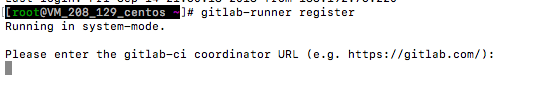

# 1. docker方式安装

> 安装文档：https://docs.gitlab.com/runner/install/docker.html

```bash
docker run -dit \
--name gitlab-runner \
--restart always \
-v /srv/gitlab-runner/config:/etc/gitlab-runner \
-v /var/run/docker.sock:/var/run/docker.sock \
gitlab/gitlab-runner:latest
123456
```

## 1.1 设置信息

```bash
docker exec -it gitlab-runner gitlab-runner register
1
```

# 2. 非docker方式安装

## 2.1 安装GitLab Runner

**安装环境：`Linux`**
其他环境参考：https://docs.gitlab.com/runner/install

1. 下载

```bash
curl -L --output /usr/local/bin/gitlab-runner https://gitlab-runner-downloads.s3.amazonaws.com/latest/binaries/gitlab-runner-linux-amd64
```

1. 添加权限

```bash
chmod +x /usr/local/bin/gitlab-runner
```

1. 新建gitlab-runner用户

```bash
sudo useradd --comment 'GitLab Runner' --create-home gitlab-runner --shell /bin/bash
```

1. 安装

> 安装时需要指定我们上面新建的用户

```bash
gitlab-runner install --user=gitlab-runner --working-directory=/home/gitlab-runner
```

1. 启动

```bash
gitlab-runner start
```

# 3. 配置Runner

## 2.1 获取配置信息

进入你的gitlab ——> settings —— > CI/CD ——> Runners


**这里主要是记住第4 和 第5 的值**

## 3.2 注册

```bash
gitlab-runner register
```

### 3.2.1 输入你的gitlab的URL

上一步记录的第4 的值


### 3.2.2 输入token

输入上一步记录的第5 的值


### 3.2.3 输入描述

输入runner 的描述，自己看着写，后期可以改


### 3.2.4 输入tag

输入标签，这里输入 pibigstar


### 3.2.5 询问是否在未加标签的Build上运行

我这里选择的 `true`，默认为 false。


### 3.2.6 询问是否锁定最近项目

默认为 false，直接回车


### 3.2.7 运行平台

提示你注册成功，输入runner要运行的平台和方式，这里我输入`docker`，回车


### 3.2.8 输入运行的docker镜像

输入runner需要在那个镜像下运行，因为我要运行 go项目，所以我输入的是 `go:1.13`


### 3.2.9 完成注册


### 3.3.0 设置

> 这时页面上会出现这个Runner实例，如果我们设置了tag，那么需要设置一下，就算job没有tag也可以运行
> 
> 

# 4. 编写.gitlab-ci.yml 文件

在你项目根目录下创建文件：.gitlab-ci.yml
写个小demo

```yml
stages:
- build
- test
- deploy

build_maven:
  stage: build
  script:
  - echo "build maven....."
  - echo "mvn clean"
  - echo "done"

test_springboot:
  stage: test
  script:
  - echo "run java test....."
  - echo "java -test"
  - echo "done"

deploy_springboot:
  stage: deploy
  script:
  - echo "deploy springboot...."
  - echo "run mvn install"
  - echo "done"
```

当你项目push到gitlab中之后：
在CI/CD ——> pipelines 中即可看到效果


**可以点进去看每一步执行了那些操作：**
