# 一、运行原理初探

我们之前写的HelloSpringBoot，到底是怎么运行的呢，Maven项目，我们一般从pom.xml文件探究起；


> **pom.xml**


## 父依赖

其中它主要是依赖一个父项目，主要是管理项目的资源过滤及插件！


```xml
<parent>
    <groupId>org.springframework.boot</groupId>
    <artifactId>spring-boot-starter-parent</artifactId>
    <version>2.2.5.RELEASE</version>
    <relativePath/>
    <!-- lookup parent from repository -->
</parent>
```

点进去，发现还有一个父依赖


```xml
<parent>
    <groupId>org.springframework.boot</groupId>
    <artifactId>spring-boot-dependencies</artifactId>
    <version>2.2.5.RELEASE</version>
    <relativePath>../../spring-boot-dependencies</relativePath>
</parent>
```

这里才是真正管理SpringBoot应用里面所有依赖版本的地方，SpringBoot的版本控制中心；

**以后我们导入依赖默认是不需要写版本；但是如果导入的包没有在依赖中管理着就需要手动配置版本了；**


## 启动器 spring-boot-starter

```xml
<dependency>
    <groupId>org.springframework.boot</groupId>
    <artifactId>spring-boot-starter-web</artifactId>
</dependency>
```

**springboot-boot-starter-xxx**：就是spring-boot的场景启动器

**spring-boot-starter-web**：帮我们导入了web模块正常运行所依赖的组件；

SpringBoot将所有的功能场景都抽取出来，做成一个个的starter （启动器），只需要在项目中引入这些starter即可，所有相关的依赖都会导入进来 ， 我们要用什么功能就导入什么样的场景启动器即可 ；我们未来也可以自己自定义 starter；


## 主启动类

分析完了 pom.xml 来看看这个启动类


### 默认的主启动类


```java
//@SpringBootApplication 来标注一个主程序类
//说明这是一个Spring Boot应用
@SpringBootApplicationpublic
class SpringbootApplication {
   public static void main(String[] args) {     
       //以为是启动了一个方法，没想到启动了一个服务      
       SpringApplication.run(SpringbootApplication.class, args);   }
}
```

但是**一个简单的启动类并不简单！**我们来分析一下这些注解都干了什么


### @SpringBootApplication

作用：标注在某个类上说明这个类是SpringBoot的主配置类 ， SpringBoot就应该运行这个类的main方法来启动SpringBoot应用；

进入这个注解：可以看到上面还有很多其他注解！


```java
@SpringBootConfiguration
@EnableAutoConfiguration
@ComponentScan(
    excludeFilters = {@Filter(
    type = FilterType.CUSTOM,
    classes = {TypeExcludeFilter.class}
), @Filter(
    type = FilterType.CUSTOM,
    classes = {AutoConfigurationExcludeFilter.class}
)}
)
public @interface SpringBootApplication {
    // ......
}
```


### @ComponentScan

这个注解在Spring中很重要 ,它对应XML配置中的元素。

作用：自动扫描并加载符合条件的组件或者bean ， 将这个bean定义加载到IOC容器中


### @SpringBootConfiguration

作用：SpringBoot的配置类 ，标注在某个类上 ， 表示这是一个SpringBoot的配置类；

我们继续进去这个注解查看


```java
// 点进去得到下面的 @Component
@Configuration
public @interface SpringBootConfiguration {}

@Component
public @interface Configuration {}
```

这里的 @Configuration，说明这是一个配置类 ，配置类就是对应Spring的xml 配置文件；

里面的 @Component 这就说明，启动类本身也是Spring中的一个组件而已，负责启动应用！

我们回到 SpringBootApplication 注解中继续看。


### @EnableAutoConfiguration

**@EnableAutoConfiguration ：开启自动配置功能**

以前我们需要自己配置的东西，而现在SpringBoot可以自动帮我们配置 ；@EnableAutoConfiguration告诉SpringBoot开启自动配置功能，这样自动配置才能生效；

点进注解接续查看：

**@AutoConfigurationPackage ：自动配置包**

```java
@Import({Registrar.class})
public @interface AutoConfigurationPackage {
}
```

**@import** ：Spring底层注解@import ， 给容器中导入一个组件

Registrar.class 作用：将主启动类的所在包及包下面所有子包里面的所有组件扫描到Spring容器 ；

这个分析完了，退到上一步，继续看

**@Import({AutoConfigurationImportSelector.class}) ：给容器导入组件 ；**

AutoConfigurationImportSelector ：自动配置导入选择器，那么它会导入哪些组件的选择器呢？我们点击去这个类看源码：

1、这个类中有一个这样的方法


```java
// 获得候选的配置
protected List<String> getCandidateConfigurations(AnnotationMetadata metadata, AnnotationAttributes attributes) {
    //这里的getSpringFactoriesLoaderFactoryClass（）方法
    //返回的就是我们最开始看的启动自动导入配置文件的注解类；EnableAutoConfiguration
    List<String> configurations = SpringFactoriesLoader.loadFactoryNames(this.getSpringFactoriesLoaderFactoryClass(), this.getBeanClassLoader());
    Assert.notEmpty(configurations, "No auto configuration classes found in META-INF/spring.factories. If you are using a custom packaging, make sure that file is correct.");
    return configurations;
}
```

2、这个方法又调用了  SpringFactoriesLoader 类的静态方法！我们进入SpringFactoriesLoader类loadFactoryNames() 方法


```java
public static List<String> loadFactoryNames(Class<?> factoryClass, @Nullable ClassLoader classLoader) {
    String factoryClassName = factoryClass.getName();
    //这里它又调用了 loadSpringFactories 方法
    return (List)loadSpringFactories(classLoader).getOrDefault(factoryClassName, Collections.emptyList());
}
```

3、我们继续点击查看 loadSpringFactories 方法

```java
private static Map<String, List<String>> loadSpringFactories(@Nullable ClassLoader classLoader) {
    //获得classLoader ， 我们返回可以看到这里得到的就是EnableAutoConfiguration标注的类本身
    MultiValueMap<String, String> result = (MultiValueMap)cache.get(classLoader);
    if (result != null) {
        return result;
    } else {
        try {
            //去获取一个资源 "META-INF/spring.factories"
            Enumeration<URL> urls = classLoader != null ? classLoader.getResources("META-INF/spring.factories") : ClassLoader.getSystemResources("META-INF/spring.factories");
            LinkedMultiValueMap result = new LinkedMultiValueMap();

            //将读取到的资源遍历，封装成为一个Properties
            while(urls.hasMoreElements()) {
                URL url = (URL)urls.nextElement();
                UrlResource resource = new UrlResource(url);
                Properties properties = PropertiesLoaderUtils.loadProperties(resource);
                Iterator var6 = properties.entrySet().iterator();

                while(var6.hasNext()) {
                    Entry<?, ?> entry = (Entry)var6.next();
                    String factoryClassName = ((String)entry.getKey()).trim();
                    String[] var9 = StringUtils.commaDelimitedListToStringArray((String)entry.getValue());
                    int var10 = var9.length;

                    for(int var11 = 0; var11 < var10; ++var11) {
                        String factoryName = var9[var11];
                        result.add(factoryClassName, factoryName.trim());
                    }
                }
            }

            cache.put(classLoader, result);
            return result;
        } catch (IOException var13) {
            throw new IllegalArgumentException("Unable to load factories from location [META-INF/spring.factories]", var13);
        }
    }
}
```

4、发现一个多次出现的文件：spring.factories，全局搜索它


### spring.factories

我们根据源头打开spring.factories ， 看到了很多自动配置的文件；这就是自动配置根源所在！


**WebMvcAutoConfiguration**

我们在上面的自动配置类随便找一个打开看看，比如 ：WebMvcAutoConfiguration

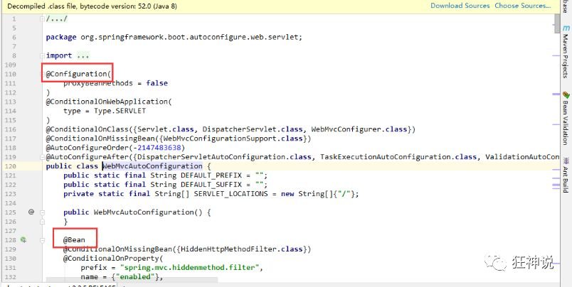

可以看到这些一个个的都是JavaConfig配置类，而且都注入了一些Bean，可以找一些自己认识的类，看着熟悉一下！

所以，自动配置真正实现是从classpath中搜寻所有的META-INF/spring.factories配置文件 ，并将其中对应的 org.springframework.boot.autoconfigure. 包下的配置项，通过反射实例化为对应标注了 @Configuration的JavaConfig形式的IOC容器配置类 ， 然后将这些都汇总成为一个实例并加载到IOC容器中。

**结论：**

1. SpringBoot在启动的时候从类路径下的META-INF/spring.factories中获取EnableAutoConfiguration指定的值
2. 将这些值作为自动配置类导入容器 ， 自动配置类就生效 ， 帮我们进行自动配置工作；
3. 整个J2EE的整体解决方案和自动配置都在springboot-autoconfigure的jar包中；
4. 它会给容器中导入非常多的自动配置类 （xxxAutoConfiguration）, 就是给容器中导入这个场景需要的所有组件 ， 并配置好这些组件 ；
5. 有了自动配置类 ， 免去了我们手动编写配置注入功能组件等的工作；

**现在大家应该大概的了解了下，SpringBoot的运行原理，后面我们还会深化一次！**


## SpringApplication

### 不简单的方法

我最初以为就是运行了一个main方法，没想到却开启了一个服务；


```java
@SpringBootApplication
public class SpringbootApplication {
    public static void main(String[] args) {
        SpringApplication.run(SpringbootApplication.class, args);
    }
}
```

**SpringApplication.run分析**

分析该方法主要分两部分，一部分是SpringApplication的实例化，二是run方法的执行；

### SpringApplication

**这个类主要做了以下四件事情：**

1、推断应用的类型是普通的项目还是Web项目

2、查找并加载所有可用初始化器 ， 设置到initializers属性中

3、找出所有的应用程序监听器，设置到listeners属性中

4、推断并设置main方法的定义类，找到运行的主类

查看构造器：

```java
public SpringApplication(ResourceLoader resourceLoader, Class... primarySources) {
    // ......
    this.webApplicationType = WebApplicationType.deduceFromClasspath();
    this.setInitializers(this.getSpringFactoriesInstances();
    this.setListeners(this.getSpringFactoriesInstances(ApplicationListener.class));
    this.mainApplicationClass = this.deduceMainApplicationClass();
}
```


### run方法流程分析


跟着源码和这幅图就可以一探究竟了！


# 二、JSR303数据校验及多环境切换

##  如何使用

Springboot中可以用@validated来校验数据，如果数据异常则会统一抛出异常，方便异常中心统一处理。我们这里来写个注解让我们的name只能支持Email格式；

```java
@Component //注册bean
@ConfigurationProperties(prefix = "person")
@Validated  //数据校验
public class Person {

    @Email(message="邮箱格式错误") //name必须是邮箱格式
    private String name;
}
```

运行结果 ：default message [不是一个合法的电子邮件地址];


**使用数据校验，可以保证数据的正确性；** 

## 常见参数

```java
@NotNull(message="名字不能为空")
private String userName;
@Max(value=120,message="年龄最大不能查过120")
private int age;
@Email(message="邮箱格式错误")
private String email;

空检查
@Null       验证对象是否为null
@NotNull    验证对象是否不为null, 无法查检长度为0的字符串
@NotBlank   检查约束字符串是不是Null还有被Trim的长度是否大于0,只对字符串,且会去掉前后空格.
@NotEmpty   检查约束元素是否为NULL或者是EMPTY.
    
Booelan检查
@AssertTrue     验证 Boolean 对象是否为 true  
@AssertFalse    验证 Boolean 对象是否为 false  
    
长度检查
@Size(min=, max=) 验证对象（Array,Collection,Map,String）长度是否在给定的范围之内  
@Length(min=, max=) string is between min and max included.

日期检查
@Past       验证 Date 和 Calendar 对象是否在当前时间之前  
@Future     验证 Date 和 Calendar 对象是否在当前时间之后  
@Pattern    验证 String 对象是否符合正则表达式的规则

.......等等
除此以外，我们还可以自定义一些数据校验规则
```


## 多环境切换

profile是Spring对不同环境提供不同配置功能的支持，可以通过激活不同的环境版本，实现快速切换环境；

### 多配置文件

我们在主配置文件编写的时候，文件名可以是 application-{profile}.properties/yml , 用来指定多个环境版本；

**例如：**

application-test.properties 代表测试环境配置

application-dev.properties 代表开发环境配置

但是Springboot并不会直接启动这些配置文件，它**默认使用application.properties主配置文件**；

我们需要通过一个配置来选择需要激活的环境：

```properties
#比如在配置文件中指定使用dev环境，我们可以通过设置不同的端口号进行测试；
#我们启动SpringBoot，就可以看到已经切换到dev下的配置了；
spring.profiles.active=dev
```


### yaml的多文档块

和properties配置文件中一样，但是使用yml去实现不需要创建多个配置文件，更加方便了 !

```yaml
server:
  port: 8081
#选择要激活那个环境块
spring:
  profiles:
    active: prod

---
server:
  port: 8083
spring:
  profiles: dev #配置环境的名称


---

server:
  port: 8084
spring:
  profiles: prod  #配置环境的名称
```

**注意：如果yml和properties同时都配置了端口，并且没有激活其他环境 ， 默认会使用properties配置文件的！**


### 配置文件加载位置

**外部加载配置文件的方式十分多，我们选择最常用的即可，在开发的资源文件中进行配置！**

官方外部配置文件说明参考文档

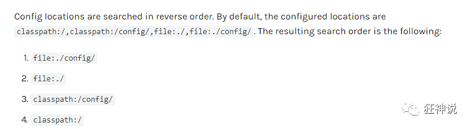

springboot 启动会扫描以下位置的application.properties或者application.yml文件作为Spring boot的默认配置文件：

```
优先级1：项目路径下的config文件夹配置文件
优先级2：项目路径下配置文件
优先级3：资源路径下的config文件夹配置文件
优先级4：资源路径下配置文件
```

优先级由高到底，高优先级的配置会覆盖低优先级的配置；

**SpringBoot会从这四个位置全部加载主配置文件；互补配置；**

我们在最低级的配置文件中设置一个项目访问路径的配置来测试互补问题；

```properties
#配置项目的访问路径
server.servlet.context-path=/kuang
```


### 拓展，运维小技巧

指定位置加载配置文件

我们还可以通过spring.config.location来改变默认的配置文件位置

项目打包好以后，我们可以使用命令行参数的形式，启动项目的时候来指定配置文件的新位置；这种情况，一般是后期运维做的多，相同配置，外部指定的配置文件优先级最高

* 

```sh
java -jar spring-boot-config.jar --spring.config.location=F:/application.properties
```


# 三、SpringBoot Web开发

```xml
<!--
    在工作中,很多情况下我们打包是不想执行测试用例的
    可能是测试用例不完事,或是测试用例会影响数据库数据
    跳过测试用例执
    -->
<plugin>
    <groupId>org.apache.maven.plugins</groupId>
    <artifactId>maven-surefire-plugin</artifactId>
    <configuration>
        <!--跳过项目运行测试用例-->
        <skipTests>true</skipTests>
    </configuration>
</plugin>
```

**自动装配：**

SpringBoot到底帮我们配置了什么？我们能不能进行修改？能修改哪些东西？能不能扩展？

* xxxAutoConfiguration…向容器中自动配置组件
* xxxProperties：自动配置类，装配配置文件中自定义的一些内容

**要解决的问题：**

* 导入静态资源…

* 首页

* jsp, 模板引擎Thymeleaf

  thymeleaf依赖

* 装配扩展SpringMVC

* 增删改查

* 拦截器

* 国际化

# 四、员工管理系统

1. 首页配置
   1. 注意点，所有页面的静态资源都需要使用thymeleaf接管；（导入thymeleaf依赖）
   2. url: @{}
2. 页面国际化
   1. 我们需要配置i18n文件
   2. 我们如果需要在项目中进行按钮自动切换，我们需要自定义一个组件`LocaleResolver`
   3. 记得将自己写的组件配置到spring容器`@Bean`
   4. \#{}

# 五、整合MyBatis

**整合包**

**mybatis-spring-boot-starter**

1. 导入包

   ```xml
   <!--引入mybatis,这是Mybatis官方提供的适配SpringBoot的，而不是SpringBoot自己的-->
   <dependency>
       <groupId>org.mybatis.spring.boot</groupId>
       <artifactId>mybatis-spring-boot-starter</artifactId>
       <version>2.1.1</version>
   </dependency>
   
   ```

2. 配置yml文件

   **application.yml**

   ```yml
   # 配置spring自带的数据源
   spring:
     datasource:
       username: root
       password: root
       url: jdbc:mysql://localhost:3306/mybatis?userSSL=true&useUnicode=true&characterEncoding=UTF-8&serverTimezone=UTC
       driver-class-name: com.mysql.cj.jdbc.Driver
   
   # 整合mybatis
   mybatis:
     # 别名
     type-aliases-package: com.kuang.pojo
     # mapper文件位置
     mapper-locations: classpath:mybatis/mapper/*.xml
   ```

3. mybatis配置

   * User

     ```java
     @Data
     @AllArgsConstructor
     @NoArgsConstructor
     public class User {
         private int id;
         private String name;
         private String password;
     }
     ```

   * UserMapper接口

     ```java
     @Repository
     @Mapper
     public interface UserMapper {
         public User queryUserByName(String name);  
     }
     ```

   * UserMapper.xml配置文件

     ```xml
     <!--namespace=绑定一个指定的Dao/Mapper接口-->
     <mapper namespace="com.kuang.mapper.UserMapper">
         <select id="getUserList" resultType="com.kuang.pojo.User" parameterType="String">
         select * from USER where name = #{name}
       	</select>
     </mapper>
     ```

4. 编写sql

5. service层调用dao层

   * UserService 接口

     ```java
     public interface UserService {
         public User queryUserByName(String name);
     }
     ```

   * UserServiceImpl实现类

     ```java
     @Service
     public class UserServiceImpl implements UserService{
         @Autowired
         UserMapper mapper;
         public User queryUserByName(String name) {
             User user = mapper.queryUserByName(name);
             return user;
         }
     }
     ```

6. controller调用service层

   ```java
   @Autowired
   UserServiceImpl userService;
   public void mian(String args[]){
       User user = userService.queryUserByName("dog");
   }
   ```

# 六、SpringSecurity

1. 引入 Spring Security 模块

2. 编写 Spring Security 配置类

   参考官网：https://spring.io/projects/spring-security

3. 编写基础配置类

   * 定制请求的授权规则
   * 定义认证规则

   ```java
   //AOP : 拦截器
   @EnableWebSecurity
   public class SecurityConfig extends WebSecurityConfigurerAdapter {
   
       // 链式编程
       @Override
       //授权
       protected void configure(HttpSecurity http) throws Exception {
           //首页所有人可以访问，功能页只有对应有权限的人才能访问
           //请求授权的规则
           http.authorizeRequests()
                   .antMatchers("/").permitAll()
                   .antMatchers("/level1/**").hasRole("vip1")
                   .antMatchers("/level2/**").hasRole("vip2")
                   .antMatchers("/level3/**").hasRole("vip3");
   
           //没有权限默认会到登录页面,需要开启登录的页面
           http.formLogin()
                   .loginPage("/toLogin")
                   .usernameParameter("username")
                   .passwordParameter("password")
                   .loginProcessingUrl("/login");
   
           http.csrf().disable();//关闭csrf功能:跨站请求伪造,默认只能通过post方式提交logout请求
           // 开启注销功能
           http.logout().logoutSuccessUrl("/");
           //开启记住我功能
           http.rememberMe().rememberMeParameter("rememberme");
       }
   
       //认证
       @Override
       protected void configure(AuthenticationManagerBuilder auth) throws Exception {
      //在内存中定义，也可以在jdbc中去拿....
      //Spring security 5.0中新增了多种加密方式，也改变了密码的格式。
      //要想我们的项目还能够正常登陆，需要修改一下configure中的代码。我们要将前端传过来的密码进行某种方式加密
      //spring security 官方推荐的是使用bcrypt加密方式。
   
           auth.inMemoryAuthentication().passwordEncoder(new BCryptPasswordEncoder())
                   .withUser("kuangshen").password(new BCryptPasswordEncoder().encode("123456")).roles("vip2","vip3")
                   .and()
                   .withUser("admin").password(new BCryptPasswordEncoder().encode("123456")).roles("vip1","vip2","vip3")
                   .and()
                   .withUser("guest").password(new BCryptPasswordEncoder().encode("123456")).roles("vip1");
       }
   }
   ```

# 七、Shiro

* Subject 用户
* SecurityManager 管理用户
* Realm 连接数据
  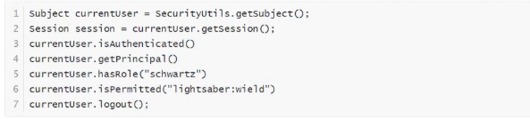
  **简单实验：**

1. 导入依赖

   ```xml
   <dependency>
       <groupId>org.apache.shiro</groupId>
       <artifactId>shiro-spring</artifactId>
       <version>1.5.3</version>
   </dependency>
   ```

2. 编写Shiro配置类

   ```java
   @Configuration
   public class ShrioConfig {
       //ShiroFilterFactoryBean : Step3
       @Bean
       public ShiroFilterFactoryBean getShrioFilterFactoryBean(@Qualifier("securityManager") DefaultWebSecurityManager defaultWebSecurityManager){
           ShiroFilterFactoryBean bean = new ShiroFilterFactoryBean();
           //设置安全管理器
           bean.setSecurityManager(defaultWebSecurityManager);
           return bean;
       }
       
       //DefaultWebSecurityManager : Step2
       @Bean("securityManager")
       public DefaultWebSecurityManager getDefaultWebSecurityManager(@Qualifier("userRealm") UserRealm userRealm){
           DefaultWebSecurityManager securityManager = new DefaultWebSecurityManager();
           //关联userRealm
           securityManager.setRealm(userRealm);
           return securityManager;
       }
       
       //创建 realm 对象, 需要自定义类：Step1
       @Bean
       public UserRealm userRealm(){
           return new UserRealm();
       }
   }
   ```

3. 自定义UserRealm

   ```java
   //自定义的 UserRealm
   public class UserRealm extends AuthorizingRealm {
   
       //授权
       @Override
       protected AuthorizationInfo doGetAuthorizationInfo(PrincipalCollection principalCollection) {
           return null;
       }
   
       //认证
       @Override
       protected AuthenticationInfo doGetAuthenticationInfo(AuthenticationToken authenticationToken) throws AuthenticationException {
           return null;
       }
   }
   ```

**一个小Demo:**

1. 导入依赖

   * springboot-mybatis整合
   * shiro-thymelea整合

   ```xml
   <?xml version="1.0" encoding="UTF-8"?>
   <project xmlns="http://maven.apache.org/POM/4.0.0" xmlns:xsi="http://www.w3.org/2001/XMLSchema-instance"
            xsi:schemaLocation="http://maven.apache.org/POM/4.0.0 https://maven.apache.org/xsd/maven-4.0.0.xsd">
       <modelVersion>4.0.0</modelVersion>
       <parent>
           <groupId>org.springframework.boot</groupId>
           <artifactId>spring-boot-starter-parent</artifactId>
           <version>2.3.1.RELEASE</version>
           <relativePath/> <!-- lookup parent from repository -->
       </parent>
       <groupId>com.kuang</groupId>
       <artifactId>shiro-springboot</artifactId>
       <version>0.0.1-SNAPSHOT</version>
       <name>shiro-springboot</name>
       <description>Demo project for Spring Boot</description>
   
       <properties>
           <java.version>1.8</java.version>
       </properties>
   
       <dependencies>
           <!--shiro-thymeleaf整合-->
           <dependency>
               <groupId>com.github.theborakompanioni</groupId>
               <artifactId>thymeleaf-extras-shiro</artifactId>
               <version>2.0.0</version>
           </dependency>
   
           <dependency>
               <groupId>mysql</groupId>
               <artifactId>mysql-connector-java</artifactId>
               <version>8.0.20</version>
           </dependency>
           <!-- https://mvnrepository.com/artifact/log4j/log4j -->
           <dependency>
               <groupId>log4j</groupId>
               <artifactId>log4j</artifactId>
               <version>1.2.17</version>
           </dependency>
           <dependency>
               <groupId>com.alibaba</groupId>
               <artifactId>druid</artifactId>
               <version>1.1.22</version>
           </dependency>
           <!--引入mybatis,这是Mybatis官方提供的适配SpringBoot的，而不是SpringBoot自己的-->
           <dependency>
               <groupId>org.mybatis.spring.boot</groupId>
               <artifactId>mybatis-spring-boot-starter</artifactId>
               <version>2.1.1</version>
           </dependency>
           <dependency>
               <groupId>org.projectlombok</groupId>
               <artifactId>lombok</artifactId>
               <version>1.18.12</version>
           </dependency>
           <dependency>
               <groupId>org.apache.shiro</groupId>
               <artifactId>shiro-spring</artifactId>
               <version>1.5.3</version>
           </dependency>
           <dependency>
               <groupId>org.springframework.boot</groupId>
               <artifactId>spring-boot-starter-thymeleaf</artifactId>
           </dependency>
           <dependency>
               <groupId>org.springframework.boot</groupId>
               <artifactId>spring-boot-starter-web</artifactId>
           </dependency>
   
           <dependency>
               <groupId>org.springframework.boot</groupId>
               <artifactId>spring-boot-starter-test</artifactId>
               <scope>test</scope>
               <exclusions>
                   <exclusion>
                       <groupId>org.junit.vintage</groupId>
                       <artifactId>junit-vintage-engine</artifactId>
                   </exclusion>
               </exclusions>
           </dependency>
       </dependencies>
   
       <build>
           <plugins>
               <plugin>
                   <groupId>org.springframework.boot</groupId>
                   <artifactId>spring-boot-maven-plugin</artifactId>
               </plugin>
           </plugins>
       </build>
   
   </project>
   ```

2. 整合MyBatis

   * 编写实体类
   * 编写mapper接口、mapper.xml、application.yml配置mybatis（别名，mapper.xml文件位置)
   * 编写service接口，serviceImpl类
     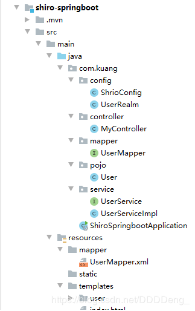

3. 编写Shiro配置类

   ```java
   @Configuration
   public class ShrioConfig {
   
       //ShiroFilterFactoryBean : Step3
       @Bean
       public ShiroFilterFactoryBean getShrioFilterFactoryBean(@Qualifier("securityManager") DefaultWebSecurityManager defaultWebSecurityManager){
           ShiroFilterFactoryBean bean = new ShiroFilterFactoryBean();
           //设置安全管理器
           bean.setSecurityManager(defaultWebSecurityManager);
   
           //添加shiro的内置过滤器
           /*
               anno: 无需认证就可以访问
               authc: 必须认证了才可以访问
               user: 必须拥有 记住我 功能才能用
               perms: 拥有对某个资源的权限才能访问
               role: 拥有某个角色权限才能访问
           */
   
           Map<String, String> filterMap = new LinkedHashMap<>();
   
           //用户授权,正常情况下没有授权会跳转到授权页面
           filterMap.put("/user/add","perms[user:add]");
           filterMap.put("/user/update","perms[user:update]");
   
           //拦截
           //filterMap.put("/user/add","authc");
           //filterMap.put("/user/update","authc");
           filterMap.put("/user/*","authc");
   
           //设置登录请求
           bean.setLoginUrl("/toLogin");
           //设置未授权页面
           bean.setUnauthorizedUrl("/noauth");
           bean.setFilterChainDefinitionMap(filterMap);
           return bean;
       }
   
       //DefaultWebSecurityManager : Step2
       @Bean("securityManager")
       public DefaultWebSecurityManager getDefaultWebSecurityManager(@Qualifier("userRealm") UserRealm userRealm){
           DefaultWebSecurityManager securityManager = new DefaultWebSecurityManager();
           //关联userRealm
           securityManager.setRealm(userRealm);
           return securityManager;
       }
   
       //创建 realm 对象, 需要自定义类：Step1
       @Bean
       public UserRealm userRealm(){
           return new UserRealm();
       }
   
       //整合 ShiroDialect:用来整合shiro thymeleaf
       @Bean
       public ShiroDialect getShiroDialect(){
           return new ShiroDialect();
       }
   }
   ```

4. 自定义UserRealm

   ```java
   //自定义的 UserRealm
   public class UserRealm extends AuthorizingRealm {
   
       @Autowired
       UserServiceImpl userService;
   
       //授权
       @Override
       protected AuthorizationInfo doGetAuthorizationInfo(PrincipalCollection principalCollection) {
           System.out.println("执行了 => doGetAuthorizationInfo");
   
           SimpleAuthorizationInfo info = new SimpleAuthorizationInfo();
           // 拿到当前登录的这个对象
           Subject subject = SecurityUtils.getSubject();
           // 拿到User对象
           User currentUser = (User) subject.getPrincipal();
           // 设置当前用户的权限
           System.out.println(currentUser.getName() + "的权限为 " + currentUser.getPerms());
           info.addStringPermission(currentUser.getPerms());
   
           return info;
       }
   
       //认证
       @Override
       protected AuthenticationInfo doGetAuthenticationInfo(AuthenticationToken authenticationToken) throws AuthenticationException {
           System.out.println("执行了 => 认证AuthenticationToken");
   
           UsernamePasswordToken userToken = (UsernamePasswordToken) authenticationToken;
           //连接真实的数据库
           User user = userService.queryUserByName(userToken.getUsername());
           if(user == null){
               //没有这个人
               return null; //抛出异常 UnknownAccountException
           }
   
           // 登录成功 将用户信息存入session
           Subject currentSubject = SecurityUtils.getSubject();
           Session session = currentSubject.getSession();
           session.setAttribute("loginUser",user.getName());
   
           // 密码认证，shiro做
           return new SimpleAuthenticationInfo(user,user.getPassword(),"");
       }
   }
   ```

# 八、Swagger

学习目标：

* 了解Swagger的作用和概念
* 了解前后端分离
* 在SpringBoot中集成Swagger

## 一、 Swagger简介

**前后端分离时代：**

* 后端：后端控制层，服务层，数据访问层
* 前端：前端控制层，视图层

**Swagger :**

* 号称世界上最流行的API框架；
* RestFul Api文档在线自动生成工具 => Api文档与Api定义同步更新
* 直接运行，可以在线测试API接口
* 支持多种语言：（Java , Php…）

在项目中使用Swagger需要Springfox

* swagger2
* ui

## 二、SpringBoot集成Swagger

1. 新建一个SpringBoot - web 工程

2. 导入相关依赖

   ```xml
   <!-- https://mvnrepository.com/artifact/io.springfox/springfox-swagger2 -->
   <dependency>
       <groupId>io.springfox</groupId>
       <artifactId>springfox-swagger2</artifactId>
       <version>2.9.2</version>
   </dependency>
   <!-- https://mvnrepository.com/artifact/io.springfox/springfox-swagger-ui -->
   <dependency>
       <groupId>io.springfox</groupId>
       <artifactId>springfox-swagger-ui</artifactId>
       <version>2.9.2</version>
   </dependency>
   ```

3. 编写一个Hello工程

4. 配置Swagger ==> Config

   ```java
   @Configuration
   @EnableSwagger2 //开启Swagger
   public class SwaggerConfig {
     
   }
   ```

5. 测试运行：http://localhost:8080/swagger-ui.html

## 三、 **配置Swagger**信息

```java
@Configuration
@EnableSwagger2 //开启Swagger
public class SwaggerConfig {
    //配置了Swagger 的Docket的bean实例
    @Bean
    public Docket docket(){
        return new Docket(DocumentationType.SWAGGER_2).apiInfo(apiInfo());
    }
    
    //配置Swagger信息=apiInfo
    public ApiInfo apiInfo(){
        //作者信息
        Contact contact = new Contact("Daniel","https://www.baidu.com","denglianqing@qq.com");
        return new ApiInfo("Dainel的SwaggerAPI文档",
                "天道酬勤",
                "v1.0",
                "urn:tos",
                contact, "Apache 2.0",
                "http://www.apache.org/licenses/LICENSE-2.0",
                new ArrayList());
    }
}
```

## 四、 Swagger配置扫描接口

**Docket.select（）**

```java
//配置了Swagger 的Docket的bean实例
@Bean
public Docket docket(){
    return new Docket(DocumentationType.SWAGGER_2).apiInfo(apiInfo())
        .select()
        //RequestHandlerSelectors,配置要扫描接口的方式
        //basePackage，指定要扫描的包
        //any(): 扫描全部
        .apis(RequestHandlerSelectors.basePackage("com.kuang.swagger.controller"))
        .paths(PathSelectors.ant("/kuang/**"))
        .build();
}
```

> 题目：我只希望我的Swagger在生产环境中使用，在发布的时候不使用
>
> * 判断是不是生产环境 flag = false
> * 注入enable （flag）

```java
//配置了Swagger 的Docket的bean实例
@Bean
public Docket docket(Environment environment){

    //设置要显示的Swagger环境
    Profiles profiles = Profiles.of("dev","test");
    //通过  environment.acceptsProfiles 判断是否处在自己设定的环境中
    boolean flag = environment.acceptsProfiles(profiles);
    ...
}
```

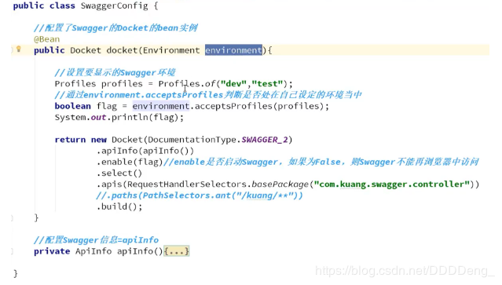

**配置API文档的分组**

```java
.groupName("狂神")
```

如何配置多个分组；多个Docket实例即可
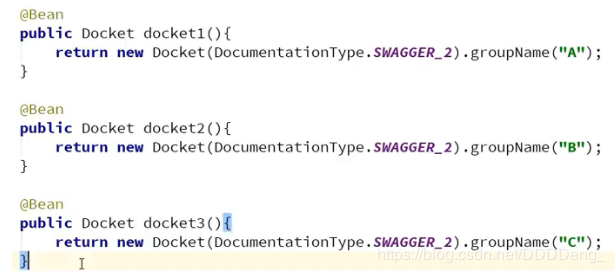

## 五、 接口注释

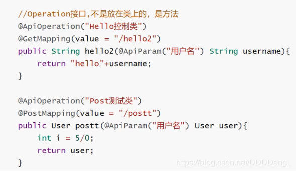
**总结：**

1. 我们可以通过Swagger给一些比较难理解的属性或者接口，增加注释信息；
2. 接口文档实时更新
3. 可以在线测试

Swagger是一个优秀的工具，几乎所有的大公司都有使用它

【注意点】在正式发布的时候，关闭Swagger！！出于安全考虑，而且节省运行的内存。

# 九、任务

## 一、异步任务

1. 给要实现异步任务加上注解 **@Async**

   ```java
   @Service
   public class AsyncService {
       @Async
       public void hello(){
           try {
               Thread.sleep(3000);
           } catch (InterruptedException e) {
               e.printStackTrace();
           }
           System.out.println("数据正在处理...");
       }
   }
   ```

2. 在main方法开启异步功能 **@EnableAsync**

   ```java
   @EnableAsync // 开启异步注解功能
   @SpringBootApplication
   public class Springboot09TaskApplication {
       public static void main(String[] args) {
           SpringApplication.run(Springboot09TaskApplication.class, args);
       }
   }
   ```

## 二、邮件任务

1. 导入依赖

   ```xml
   <dependency>
       <groupId>org.springframework.boot</groupId>
       <artifactId>spring-boot-starter-mail</artifactId>
   </dependency>
   ```

2. 配置邮箱和密码

   ```properties
   spring.mail.username=514906666@qq.com
   spring.mail.password=xxyyzzhhll
   spring.mail.host=smtp.qq.com
   # 开启加密验证
   spring.mail.properties.mail.smtp.ssl.enable=true
   ```

3. 测试发送邮件(组合邮件，带附件)

   ```java
   @SpringBootTest
   class Springboot09TaskApplicationTests {
   
       @Autowired
       JavaMailSenderImpl mailSender;
   
       @Test
       void contextLoads2() throws MessagingException {
   
           //一个复杂的邮件
           MimeMessage mimeMessage = mailSender.createMimeMessage();
           //组装
           MimeMessageHelper helper = new MimeMessageHelper(mimeMessage, true);
           //正文
           helper.setSubject("Test");
           helper.setText("<h2 style='color:red'> 这是一封测试邮件 </h2>",true);
           //附件
           helper.addAttachment("data1",new File("D:\\testdata\\2017-01-01.xls"));
   
           helper.setTo("dishifu@126.com");
           helper.setFrom("514906666@qq.com");
   
           mailSender.send(mimeMessage);
       }
   ```

## 三、定时任务

> 1. TaskScheduler 任务调度者
> 2. TaskExecutor 任务执行者
> 3. **@EnableScheduling** 开启定时功能的注解
> 4. **@Scheduled** 什么时候执行
> 5. **Cron表达式**

1. 编写定时服务

   ```java
   @Service
   public class ScheduledService {
   
       //在一个特定的时间执行这个方法
   
       //cron 表达式
       //秒 分 时 日 月 周几
   
       /*
           30 17 17 * * ?  每天10点15分30 执行一次
           30 0/5 10,18 * * ?  每天10点和18点，每隔五分钟执行一次
       */
   
       @Scheduled(cron = "30 17 17 * * ?")
       public void Hello(){
           System.out.println("hello,被执行了!");
       }
   
   }
   ```

2. 在启动类开启定时功能

   ```java
   @EnableAsync // 开启异步注解功能
   @EnableScheduling //开启定时功能的注解
   @SpringBootApplication
   public class Springboot09TaskApplication {
       public static void main(String[] args) {
           SpringApplication.run(Springboot09TaskApplication.class, args);
       }
   }
   ```

# 十、整合Redis

## SpringBoot整合

SpringBoot 操作数据：spring-data jpa jdbc mongodb redis！

SpringData 也是和 SpringBoot 齐名的项目！

说明： 在 SpringBoot2.x 之后，原来使用的jedis 被替换为了 lettuce?

jedis : 采用的直连，多个线程操作的话，是不安全的，如果想要避免不安全的，使用 jedis pool 连接
 池！ 更像 BIO 模式

lettuce : 采用netty，实例可以再多个线程中进行共享，不存在线程不安全的情况！可以减少线程数据
 了，更像 NIO 模式

源码分析：

```csharp
@Bean
@ConditionalOnMissingBean(name = "redisTemplate") // 我们可以自己定义一个
redisTemplate来替换这个默认的！
public RedisTemplate<Object, Object> redisTemplate(RedisConnectionFactory redisConnectionFactory)
	throws UnknownHostException {
	// 默认的 RedisTemplate 没有过多的设置，redis 对象都是需要序列化！
	// 两个泛型都是 Object, Object 的类型，我们后使用需要强制转换 <String, Object>
	RedisTemplate<Object, Object> template = new RedisTemplate<>();
	template.setConnectionFactory(redisConnectionFactory);
	return template;
}
@Bean
@ConditionalOnMissingBean // 由于 String 是redis中最常使用的类型，所以说单独提出来了一个bean！
public StringRedisTemplate stringRedisTemplate(RedisConnectionFactory redisConnectionFactory)
	throws UnknownHostException {
	StringRedisTemplate template = new StringRedisTemplate();
	template.setConnectionFactory(redisConnectionFactory);
	return template;
}
```

## 整合测试一下

### 1 、导入依赖

```xml
<!-- 操作redis -->
<dependency>
	<groupId>org.springframework.boot</groupId>
	<artifactId>spring-boot-starter-data-redis</artifactId>
</dependency>
```

### 2 、配置连接

```properties
## 配置redis
spring.redis.host=127.0.0.1
spring.redis.port= 6379
```
### 3、测试

```java
@SpringBootTest
class Redis02SpringbootApplicationTests {
	@Autowired
	private RedisTemplate redisTemplate;
	@Test
	void contextLoads() {
		// redisTemplate 操作不同的数据类型，api和我们的指令是一样的
		// opsForValue 操作字符串 类似String
		// opsForList 操作List 类似List
		// opsForSet
		// opsForHash
		// opsForZSet
		// opsForGeo
		// opsForHyperLogLog
		// 除了基本的操作，我们常用的方法都可以直接通过redisTemplate操作，比如事务，和基本的CRUD
		// 获取redis的连接对象
		// RedisConnection connection = redisTemplate.getConnectionFactory().getConnection();
		// connection.flushDb();
		// connection.flushAll();
		redisTemplate.opsForValue().set("mykey","关注狂神说公众号");
		System.out.println(redisTemplate.opsForValue().get("mykey"));
	}
}
```
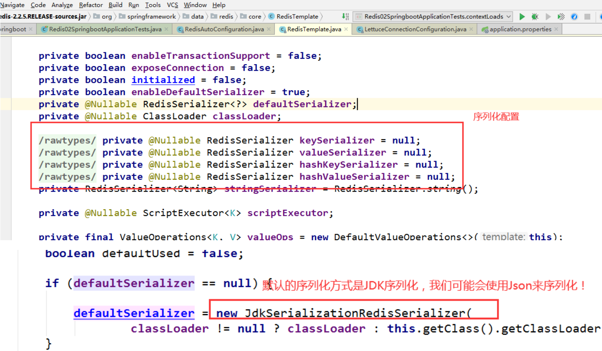

#### 关于对象的保存：

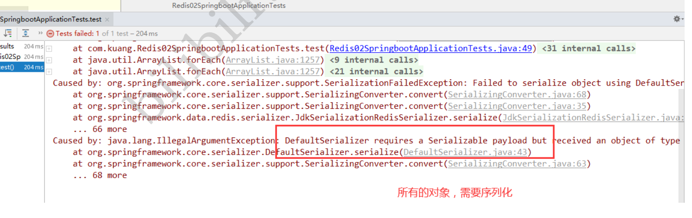

我们来编写一个自己的 RedisTemplete

```java
import com.fasterxml.jackson.annotation.JsonAutoDetect;
import com.fasterxml.jackson.annotation.PropertyAccessor;
import com.fasterxml.jackson.databind.ObjectMapper;
import org.springframework.context.annotation.Bean;
import org.springframework.context.annotation.Configuration;
import org.springframework.data.redis.connection.RedisConnectionFactory;
import org.springframework.data.redis.core.RedisTemplate;
import org.springframework.data.redis.serializer.Jackson2JsonRedisSerializer;
import org.springframework.data.redis.serializer.StringRedisSerializer;

@Configuration
public class RedisConfig {
	// 自己定义了一个 RedisTemplate
	@Bean
	@SuppressWarnings("all")
	public RedisTemplate<String, Object> redisTemplate(RedisConnectionFactory factory) {
	// 我们为了自己开发方便，一般直接使用 <String, Object>
	RedisTemplate<String, Object> template = new RedisTemplate<String,Object>();
	template.setConnectionFactory(factory);
        
	// Json序列化配置
	Jackson2JsonRedisSerializer jackson2JsonRedisSerializer = new Jackson2JsonRedisSerializer(Object.class);
	ObjectMapper om = new ObjectMapper();
	om.setVisibility(PropertyAccessor.ALL, JsonAutoDetect.Visibility.ANY);
	om.enableDefaultTyping(ObjectMapper.DefaultTyping.NON_FINAL);
	jackson2JsonRedisSerializer.setObjectMapper(om);
	// String 的序列化
	StringRedisSerializer stringRedisSerializer = new StringRedisSerializer();
        
	// key采用String的序列化方式
	template.setKeySerializer(stringRedisSerializer);
	// hash的key也采用String的序列化方式
	template.setHashKeySerializer(stringRedisSerializer);
	// value序列化方式采用jackson
	template.setValueSerializer(jackson2JsonRedisSerializer);
	// hash的value序列化方式采用jackson
	template.setHashValueSerializer(jackson2JsonRedisSerializer);
	template.afterPropertiesSet();
        
	return template;
	}
}
```

# 十一、分布式Dubbo + Zookeeper

zookeeper ：注册中心

dubbo-admin : 监控管理后台，查我们注册了哪些服务，哪些服务被消费了

Dubbo：jar包

步骤：

前提：zookeeper服务已启动

1. 提供者提供服务

   * 导入依赖

   * 配置注册中心的地址，以及服务发现名，和要扫描的包

     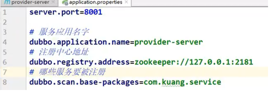

   * 在想要被注册的服务上面，再增加一个注解**@Service**（dubbo包下的）

2. 消费者如何消费

   * 导入依赖
   * 配置注册中心的地址，配置自己的服务名
     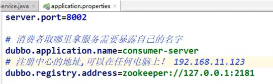
   * 从远程注入服务 **@Reference**

**微服务架构存在的问题:**

**分布式架构会遇到的四个核心问题**

1. 这么多服务，客户端该如何去访问
2. 这么多服务，服务之间如何进行通信
3. 这么多服务，如何管理
4. 服务挂了，该怎么办

==》 解决方案：

 SpringCloud，是一套生态，就是用来解决以上分布式架构的4个问题。

 想使用SpringCloud，必须掌握SpringBoot，因为SpringCloud是基于SpringBoot的

```
1. API网关，服务路由
2. HTTP，RPC框架，异步调用
3. 服务注册与发现，高可用
4. 熔断机制，服务降级
```

# 彩蛋

如何更改启动时显示的字符拼成的字母，SpringBoot呢？也就是 banner 图案；

只需一步：到项目下的 resources 目录下新建一个banner.txt 即可。

图案可以到：https://www.bootschool.net/ascii 这个网站生成，然后拷贝到文件中即可！

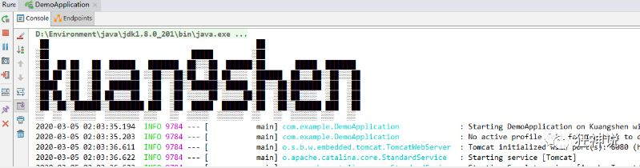

# 狂神说Java SpringBoot

[狂神说SpringBoot01：Hello,World！](http://mp.weixin.qq.com/s?__biz=Mzg2NTAzMTExNg%3D%3D&chksm=ce6107eff9168ef93424fc2422c74ec5ad5755e4944bbc8a07609f185ec1ad6037eb5ae0f8da&idx=1&mid=2247483724&scene=21&sn=77ce80187dbfdbaaafa0366f6a0c9151#wechat_redirect)

[狂神说SpringBoot02：运行原理初探](http://mp.weixin.qq.com/s?__biz=Mzg2NTAzMTExNg%3D%3D&chksm=ce6107fcf9168eeaa5381228dad0e888ffc03401bc51e4bc7637bd46604b8e6e468cc8b43956&idx=1&mid=2247483743&scene=21&sn=431a5acfb0e5d6898d59c6a4cb6389e7#wechat_redirect)

[狂神说SpringBoot03：yaml配置注入](http://mp.weixin.qq.com/s?__biz=Mzg2NTAzMTExNg%3D%3D&chksm=ce6107c3f9168ed5aee476cd9e2e482e4fc271cdba34fa6eccfd5ce10740f229f8eaf487d080&idx=1&mid=2247483744&scene=21&sn=b4ec762e71b2ddf9403c035635299206#wechat_redirect)

[狂神说SpringBoot04：JSR303数据校验及多环境切换](http://mp.weixin.qq.com/s?__biz=Mzg2NTAzMTExNg%3D%3D&chksm=ce6107c5f9168ed37413fde625dec474cc0a6941fc82ffb9551063afe00e00551abc01883b32&idx=1&mid=2247483750&scene=21&sn=d6758d00371bea97f92e4968d0d96fb9#wechat_redirect)

[狂神说SpringBoot05：自动配置原理](http://mp.weixin.qq.com/s?__biz=Mzg2NTAzMTExNg%3D%3D&chksm=ce6107d5f9168ec34f59d88c5a7cfa592ab2c1a5bf02cc3ed7bbb7b4f4e93d457144a6843a23&idx=1&mid=2247483766&scene=21&sn=27739c5103547320c505d28bec0a9517#wechat_redirect)

[狂神说SpringBoot06：自定义starter](http://mp.weixin.qq.com/s?__biz=Mzg2NTAzMTExNg%3D%3D&chksm=ce6107d4f9168ec28b99622befbde5c7ab51c320d979a96a21e9a870d1d4bbd1e0a2a3dde8eb&idx=1&mid=2247483767&scene=21&sn=4c23abf553259052f335086dba1ce80c#wechat_redirect)

[狂神说SpringBoot07：整合JDBC](http://mp.weixin.qq.com/s?__biz=Mzg2NTAzMTExNg%3D%3D&chksm=ce61072af9168e3ca083439722fc447d2d0c9d2034df2029fa254c54f5ee40adf867ef66fafc&idx=1&mid=2247483785&scene=21&sn=cbf46019c14be7129bcd39002ab16706#wechat_redirect)

[狂神说SpringBoot08：整合Druid](http://mp.weixin.qq.com/s?__biz=Mzg2NTAzMTExNg%3D%3D&chksm=ce610729f9168e3fe385a93e48ba6cd43f9e2155c2855e79988b1130abf079e1c3b6c6bb011a&idx=1&mid=2247483786&scene=21&sn=f5f4ca792611af105140752eb67ce820#wechat_redirect)

[狂神说SpringBoot09：整合MyBatis](http://mp.weixin.qq.com/s?__biz=Mzg2NTAzMTExNg%3D%3D&chksm=ce61072ff9168e39c812662a910b8b1f5dc700bfa587724b7790b6eeda4a46fdb763e129b554&idx=1&mid=2247483788&scene=21&sn=aabf8cf31d7d45be184cc59cdb75258c#wechat_redirect)

[狂神说SpringBoot10：Web开发静态资源处理](http://mp.weixin.qq.com/s?__biz=Mzg2NTAzMTExNg%3D%3D&chksm=ce610737f9168e2189eccee5162d961e94bd92b76d720b2519772286c08c5ac4f50b09c3825a&idx=1&mid=2247483796&scene=21&sn=ea13e2858328a582338e89c3459021c1#wechat_redirect)

[狂神说SpringBoot11：Thymeleaf模板引擎](http://mp.weixin.qq.com/s?__biz=Mzg2NTAzMTExNg%3D%3D&chksm=ce61073cf9168e2a363d0c946f047a6009aa8579ed56d32c76fd5c615974e0f72c85e3fde227&idx=1&mid=2247483807&scene=21&sn=7e1d5df51cdeb046eb37dec7701af47b#wechat_redirect)

[狂神说SpringBoot12：MVC自动配置原理](http://mp.weixin.qq.com/s?__biz=Mzg2NTAzMTExNg%3D%3D&chksm=ce610708f9168e1ee95b9f6135574cbea2d2b90ac3d0f7b6766d5260be0d711bbb73e678c6b5&idx=1&mid=2247483819&scene=21&sn=b9009aaa2a9af9d681a131b3a49d8848#wechat_redirect)

[狂神说SpringBoot13：页面国际化](http://mp.weixin.qq.com/s?__biz=Mzg2NTAzMTExNg%3D%3D&chksm=ce610719f9168e0fd77185b7194f4cdff964f3f4a6a7584e9ff0afd0ddd99f4e89d9ca2e41bf&idx=1&mid=2247483834&scene=21&sn=e28706bf0c3ded1884452adf6630d43b#wechat_redirect)

[狂神说SpringBoot14：集成Swagger终极版](http://mp.weixin.qq.com/s?__biz=Mzg2NTAzMTExNg%3D%3D&chksm=ce6104a6f9168db05d089112c42893cf9f5af434a2cbe2c5b7dc469576ad4d8dcb5ddcddc0db&idx=1&mid=2247483909&scene=21&sn=201ee629b9ce3b9276a263e18812e607#wechat_redirect)

[狂神说SpringBoot15：异步、定时、邮件任务](http://mp.weixin.qq.com/s?__biz=Mzg2NTAzMTExNg%3D%3D&chksm=ce6104adf9168dbb31c6306c840c575d10a3c3c9e886a7e5f3d1a67882a6eacdb40ac0267688&idx=1&mid=2247483918&scene=21&sn=afadfe906c5f15887fa8e7dad3c8980c#wechat_redirect)

[狂神说SpringBoot16：富文本编辑器](http://mp.weixin.qq.com/s?__biz=Mzg2NTAzMTExNg%3D%3D&chksm=ce6104b7f9168da1d7c0b4015a69c475bb3cf684bbde4eedeee1b0afe7fba6316649c4411e82&idx=1&mid=2247483924&scene=21&sn=8570554261d1829439eb8ecceabd1fe4#wechat_redirect)

[狂神说SpringBoot17：Dubbo和Zookeeper集成](http://mp.weixin.qq.com/s?__biz=Mzg2NTAzMTExNg%3D%3D&chksm=ce610488f9168d9eee180472c9e225c737ed56075370c1174eb29ae214326a5f8e49147c2d65&idx=1&mid=2247483947&scene=21&sn=0c8efabbaf9b8ca835d862e6e0a2254f#wechat_redirect)

[狂神说SpringBoot18：集成SpringSecurity](http://mp.weixin.qq.com/s?__biz=Mzg2NTAzMTExNg%3D%3D&chksm=ce610496f9168d8082bf6cb2e54b0b8628a1db596c1d297d06e756e621569dc3047334b3062c&idx=1&mid=2247483957&scene=21&sn=fc30511490b160cd1519e7a7ee3d4ed0#wechat_redirect)

