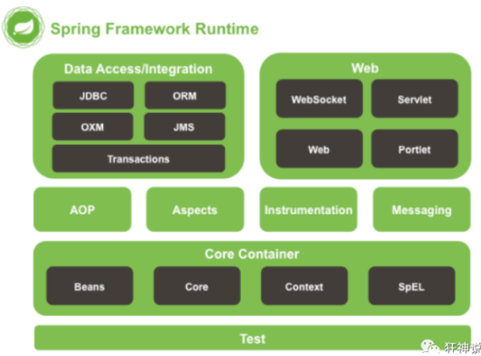
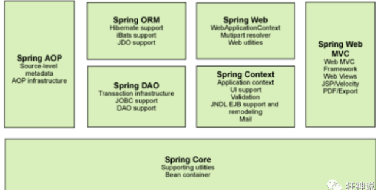
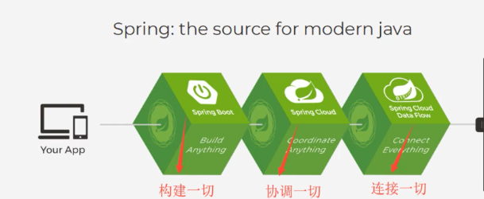
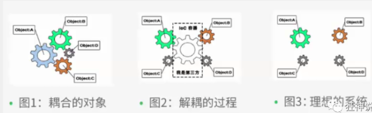
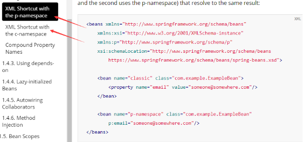
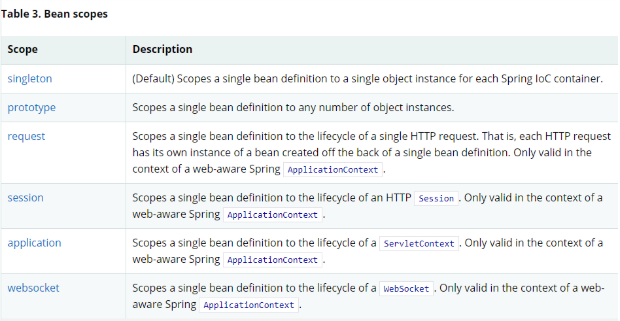

# 1、Spring

## 1.1 简介

* 春天 —>给软件行业带来了春天
* 2002年，Rod Jahnson首次推出了Spring框架雏形interface21框架。
* 2004年3月24日，Spring框架以interface21框架为基础，经过重新设计，发布了1.0正式版。
* Rod Johnson的学历 , 他是悉尼大学的博士，然而他的专业不是计算机，而是音乐学。
* Spring理念 : 使现有技术更加实用 . 本身就是一个大杂烩 , 整合现有的框架技术

官方下载地址 ： https://repo.spring.io/libs-release-local/org/springframework/spring/

```xml
<!-- https://mvnrepository.com/artifact/org.springframework/spring-webmvc -->
<dependency>
    <groupId>org.springframework</groupId>
    <artifactId>spring-webmvc</artifactId>
    <version>5.2.0.RELEASE</version>
</dependency>
<!-- https://mvnrepository.com/artifact/org.springframework/spring-jdbc -->
<dependency>
    <groupId>org.springframework</groupId>
    <artifactId>spring-jdbc</artifactId>
    <version>5.2.0.RELEASE</version>
</dependency>
```

## 1.2 优点

* Spring是一个开源免费的框架 (容器)！
* Spring是一个轻量级的框架 , 非侵入式的
* **控制反转 IoC , 面向切面 Aop**
* 对事务的支持 , 对框架整合的支持

**Spring是一个轻量级的控制反转(IoC)和面向切面(AOP)的容器（框架）。**

## 1.3 组成

Spring 框架是一个分层架构，由 7 个定义良好的模块组成。Spring 模块构建在核心容器之上，核心容器定义了创建、配置和管理 bean 的方式 .




* **核心容器**：核心容器提供 Spring 框架的基本功能。核心容器的主要组件是 BeanFactory，它是工厂模式的实现。BeanFactory 使用*控制反转*（IOC） 模式将应用程序的配置和依赖性规范与实际的应用程序代码分开。
* **Spring 上下文**：Spring 上下文是一个配置文件，向 Spring 框架提供上下文信息。Spring 上下文包括企业服务，例如 JNDI、EJB、电子邮件、国际化、校验和调度功能。
* **Spring AOP**：通过配置管理特性，Spring AOP 模块直接将面向切面的编程功能 , 集成到了 Spring 框架中。所以，可以很容易地使 Spring 框架管理任何支持 AOP的对象。Spring AOP 模块为基于 Spring 的应用程序中的对象提供了事务管理服务。通过使用 Spring AOP，不用依赖组件，就可以将声明性事务管理集成到应用程序中。
* **Spring DAO**：JDBC DAO 抽象层提供了有意义的异常层次结构，可用该结构来管理异常处理和不同数据库供应商抛出的错误消息。异常层次结构简化了错误处理，并且极大地降低了需要编写的异常代码数量（例如打开和关闭连接）。Spring DAO 的面向 JDBC 的异常遵从通用的 DAO 异常层次结构。
* **Spring ORM**：Spring 框架插入了若干个 ORM 框架，从而提供了 ORM 的对象关系工具，其中包括 JDO、Hibernate 和 iBatis SQL Map。所有这些都遵从 Spring 的通用事务和 DAO 异常层次结构。
* **Spring Web 模块**：Web 上下文模块建立在应用程序上下文模块之上，为基于 Web 的应用程序提供了上下文。所以，Spring 框架支持与 Jakarta Struts 的集成。Web 模块还简化了处理多部分请求以及将请求参数绑定到域对象的工作。
* **Spring MVC 框架**：MVC 框架是一个全功能的构建 Web 应用程序的 MVC 实现。通过策略接口，MVC 框架变成为高度可配置的，MVC 容纳了大量视图技术，其中包括 JSP、Velocity、Tiles、iText 和 POI。

## 1.4 拓展



* Spring Boot
  * 一个快速开发的脚手架
  * 基于SpringBoot可以快速的开发单个微服务
* Spring Cloud
  * Spring Cloud是基于SpringBoot实现的

# 2、IOC理论推导

1. UserDao 接口

   ```java
   public interface UserDao {
      public void getUser();
   }
   ```

2. UserDaoImpl 实现类

   ```java
   public class UserDaoImpl implements UserDao {
      @Override
      public void getUser() {
          System.out.println("获取用户数据");
     }
   }
   ```

3. UserService 业务接口

   ```java
   public interface UserService {
      public void getUser();
   }
   ```

4. UserServiceImpl 业务实现类

   ```java
   public class UserServiceImpl implements UserService {
      private UserDao userDao = new UserDaoImpl();
   
      @Override
      public void getUser() {
          userDao.getUser();
     }
   }
   
   ```

5. 测试一下

   ```java
   @Test
   public void test(){
      UserService service = new UserServiceImpl();
      service.getUser();
   }
   ```

把Userdao的实现类增加一个 .

```java
public class UserDaoMySqlImpl implements UserDao {
   @Override
   public void getUser() {
       System.out.println("MySql获取用户数据");
  }
}
```

紧接着我们要去使用MySql的话 , 我们就需要去service实现类里面修改对应的实现

```java
public class UserServiceImpl implements UserService {
   private UserDao userDao = new UserDaoMySqlImpl();

   @Override
   public void getUser() {
       userDao.getUser();
  }
}
```

**代码量十分大，修改一次的成本十分昂贵！**

我们使用一个Set接口实现，已经发生了革命性的变化！

```java
public class UserServiceImpl implements UserService {
   private UserDao userDao;
	// 利用set实现
   public void setUserDao(UserDao userDao) {
       this.userDao = userDao;
  }

   @Override
   public void getUser() {
       userDao.getUser();
  }
}
```

* 之前，程序是主动创建对象，控制权在程序员手上！
* 使用了set注入后，程序不再具有主动性，而是变成了被动的接受对象！

这种思想，从本质上解决了问题，我们程序员不用再去管对象的创建了。系统的耦合性大大降低，可以专注在业务的实现上！这是IOC的原型！

### IOC本质

**控制反转IoC(Inversion of Control)，是一种设计思想，DI(依赖注入)是实现IoC的一种方法**，也有人认为DI只是IoC的另一种说法。没有IoC的程序中 , 我们使用面向对象编程 , 对象的创建与对象间的依赖关系完全硬编码在程序中，对象的创建由程序自己控制，控制反转后将对象的创建转移给第三方，个人认为所谓控制反转就是：获得依赖对象的方式反转了。



采用XML方式配置Bean的时候，Bean的定义信息是和实现分离的，而采用注解的方式可以把两者合为一体，Bean的定义信息直接以注解的形式定义在实现类中，从而达到了零配置的目的。

**控制反转是一种通过描述（XML或注解）并通过第三方去生产或获取特定对象的方式。在Spring中实现控制反转的是IoC容器，其实现方法是依赖注入（Dependency Injection,DI）。**

# 3、HelloSpring

# 4、IOC创建对象的方式

1. 使用无参构造创建对象，默认！

2. 假设我们要使用有参构造创建对象。

   1. 下标赋值

      ```xml
      <bean id="exampleBean" class="examples.ExampleBean">
          <constructor-arg index="0" value="7500000"/>
          <constructor-arg index="1" value="42"/>
      </bean>
      ```

   2. 构造参数类型

      ```xml
      <bean id="exampleBean" class="examples.ExampleBean">
          <constructor-arg type="int" value="7500000"/>
          <constructor-arg type="java.lang.String" value="42"/>
      </bean>
      ```

   3. 构造参数名

      ```xml
      <bean id="exampleBean" class="examples.ExampleBean">
          <constructor-arg name="years" value="7500000"/>
          <constructor-arg name="ultimateAnswer" value="42"/>
      </bean>
      ```

总结：在配置文件加载的时候，容器中管理的对象就已经初始化了

# 5、Spring配置

## 5.1 别名

```xml
<!--设置别名：在获取Bean的时候可以使用别名获取-->
<alias name="userT" alias="userNew"/>

```

## 5.2 Bean的配置

```xml
<!--bean就是java对象,由Spring创建和管理-->

<!--
   id : bean的标识符,要唯一,如果没有配置id,name就是默认标识符
   如果配置id,又配置了name,那么name是别名
   name可以设置多个别名,可以用逗号,分号,空格隔开
   如果不配置id和name,可以根据applicationContext.getBean(.class)获取对象;

   class : bean的全限定名=包名+类名
-->
<bean id="hello" name="hello2 h2,h3;h4" class="com.kuang.pojo.Hello">
   <property name="name" value="Spring"/>
</bean>
```

## 5.2 import

这个import,一般用于团队开发使用，他可以将多个配置文件，导入合并为一个；

假设，现在项目中有多个人开发，这三个人复制不同的类开发，不同的类需要注册在不同的bean中，我们可以利用import将所有人的beans.xml合并为一个总的！

```xml
<import resource="{path}/beans.xml"/>
```

# 6、依赖注入

## 6.1 构造器注入

前面已经说过了

## 6.2 Set方式注入 【重点】

* 依赖注入：Set注入
  * 依赖：bean对象的创建依赖于容器
  * 注入：bean对象中的所有属性，由容器来注入

1. 模拟环境搭建

2. 两个实体类

   ```java
   @Data
   public class Student {
   
       private String name;
       private Address address;
       private String[] books;
       private List<String> hobbys;
       private Map<String,String> card;
       private Set<String> games;
       private String wife;
       private Properties info;
   }
   ```

   ```java
   @Data
   public class Address {
       private String address;
   }
   ```

3. 配置 applicationContext.xml

```xml
<?xml version="1.0" encoding="UTF-8"?>
<beans xmlns="http://www.springframework.org/schema/beans"
       xmlns:xsi="http://www.w3.org/2001/XMLSchema-instance"
       xsi:schemaLocation="http://www.springframework.org/schema/beans
        https://www.springframework.org/schema/beans/spring-beans.xsd">

    <bean id="address" class="com.kuang.pojo.Address">
        <property name="address" value="NJUPT9"/>
    </bean>
    <bean id="student" class="com.kuang.pojo.Student">
        <!--第一种，普通值注入，value-->
        <property name="name" value="狂神"/>

        <!--第二种,Bean注入-->
        <property name="address" ref="address"/>

        <!--数组-->
        <property name="books">
            <array>
                <value>红楼</value>
                <value>三国</value>
            </array>
        </property>

        <!--List-->
        <property name="hobbys">
            <list>
                <value>music</value>
                <value>swimming</value>
                <value>coding</value>
            </list>
        </property>

        <!--Map-->
        <property name="card">
            <map>
                <entry key="身份证" value="12312121212"/>
                <entry key="银行卡" value="678112121111000"/>
            </map>
        </property>

        <!--Set-->
        <property name="games">
            <set>
                <value>CF</value>
                <value>LOL</value>
                <value>GTA</value>
            </set>
        </property>

        <!--null-->
        <property name="wife">
            <null/>
        </property>

        <!--Properties-->
        <property name="info">
            <props>
                <prop key="学号">20190526</prop>
                <prop key="username">root</prop>
                <prop key="password">root</prop>
            </props>
        </property>
    </bean>
</beans>

```

4. 测试

```java
public class MyTest {
    public static void main(String[] args) {
        ApplicationContext context = new ClassPathXmlApplicationContext("beans.xml");
        Student student = (Student) context.getBean("student");
        System.out.println(student);
    }
}
```

## 6.3 拓展方式注入

我们可以使用p命名空间和c命名空间进行注入

官方解释：



```xml
<?xml version="1.0" encoding="UTF-8"?>
<beans xmlns="http://www.springframework.org/schema/beans"
       xmlns:xsi="http://www.w3.org/2001/XMLSchema-instance"
       xmlns:p="http://www.springframework.org/schema/p"
       xmlns:c="http://www.springframework.org/schema/c"
       xsi:schemaLocation="http://www.springframework.org/schema/beans
        https://www.springframework.org/schema/beans/spring-beans.xsd">

    <!--p命名空间注入，可以直接注入属性的值：property-->
    <bean id="user" class="com.kuang.pojo.User" p:name="狂神" p:age="18"/>

    <!--c命名空间注入，通过构造器注入：construt-args-->
    <bean id="user2" class="com.kuang.pojo.User" c:name="狂神2" c:age="11"/>

</beans>
```

**注意点：p命名和c命名空间不能直接使用，需要导入xml约束！**

```xml
xmlns:p="http://www.springframework.org/schema/p"
xmlns:c="http://www.springframework.org/schema/c"
```

## 6.4 Bean的作用域



1. 单例模式（Spring默认机制）

   ```xml
   <bean id="user2" class="com.kuang.pojo.User" c:name="狂神2" c:age="11" scope="singleton"/>
   ```

2. 原型模式：每次从容器中get的时候，都会产生一个新对象

   ```xml
   <bean id="user2" class="com.kuang.pojo.User" c:name="狂神2" c:age="11" scope="prototype"/>
   ```

3. 其余的request、session、application这些只能在web开发中使用到

# 7、Bean的自动装配

* 自动装配是Spring满足bean依赖的一种方式
* Spring会在上下文中自动寻找，并自动给bean装配属性

 在Spring中有三种装配的方式

1. 在xml中显示的配置
2. 在java中显示的配置
3. 隐式的自动装配bean 【重要】

## 7.1 测试

环境搭建：一个人有两个宠物

## 7.2 byName自定装配

```xml
<bean id="cat" class="com.kuang.pojo.Cat"/>
<bean id="dog" class="com.kuang.pojo.Dog"/>

	<!--
        byName : 会自动在容器上下文中查找，和自己对象set方法后面的值对应的bean_id
    -->
<bean id="people" class="com.kuang.pojo.People" autowire="byName">
    <property name="name" value="狂神"/>
</bean>
```

## 7.3 byTpye自动装配

```xml
	<!--
        byName : 会自动在容器上下文中查找，和自己对象set方法后面的值对应的bean_id
        byType : 会自动在容器上下文中查找，和自己对象属性类型相同的bean
    -->
<bean id="people" class="com.kuang.pojo.People" autowire="byType">
    <property name="name" value="狂神"/>
</bean>
```

> **小结：**
>
> * byName的时候，需要保证所有bean的id唯一，并且这个bean需要和自动注入的属性的set方法的值一致
> * byType的时候，需要保证所有bean的class唯一，并且这个bean需要和自动注入的属性的类型一致

## 7.4 使用注解实现自动装配

jdk1.5支持的注解，Spring2.5就支持注解了！

要使用注解须知：

1. 导入约束
2. 配置注解的支持 <context:annotation-config/>

```xml
<?xml version="1.0" encoding="UTF-8"?>
<beans xmlns="http://www.springframework.org/schema/beans"
    xmlns:xsi="http://www.w3.org/2001/XMLSchema-instance"
    xmlns:context="http://www.springframework.org/schema/context"
    xsi:schemaLocation="http://www.springframework.org/schema/beans
        https://www.springframework.org/schema/beans/spring-beans.xsd
        http://www.springframework.org/schema/context
        https://www.springframework.org/schema/context/spring-context.xsd">

    <context:annotation-config/>

</beans>
```

### @Autowired

直接在属性上使用即可，也可以在set方法上使用

使用Autowired我们可以不用编写set方法了，前提是你这个自动装配的属性在 IOC（Spring）容器中存在，且符合名字byName

科普：

```java
@Nullable	字段标记了这个注解，说明这个字段可以为null;
1
public @interface Autowired {
    boolean required() default true;
}
```

测试代码：

```java
public class People {
    //如果显示定义了Autowired的required属性为false，说明这个对象可以为Null,否则不允许为空
    @Autowired(required = false)
    private Cat cat;
    @Autowired
    private Dog dog;
    private String name;
}
```

如果@Autowired自动装配的环境比较复杂，自动装配无法通过一个注解【**@Autowired**】完成的时候，我们可以使用==**@Qualifier(value = “xxx”)**==去配合@Autowire的使用，指定一个唯一的bean对象注入！

```java
public class People {

    @Autowired
    @Qualifier(value = "cat2")
    private Cat cat;
    @Autowired
    private Dog dog;
    private String name;
}
```

### @Resource

```java
public class People {

    @Resource( name = "cat3")
    private Cat cat;
    @Resource
    private Dog dog;
    private String name;
}
```

> **小结：**
>
> @Resource和@Autowired的区别：
>
> * 都是用来自动转配的，都可以放在属性字段上
> * @Autowired 是通过byType的方式实现，而且必须要求这个对象存在！【常用】
> * @Resource 默认通过byName的方式实现，如果找不到名字，则通过byType实现！如果两个都找不到的情况下，就报错！【常用】
> * 执行顺序不同: @Autowired 通过byType的方式实现。@Resource默认通过byName的方式实现。


# 8. 使用注解开发

在spring4之后，必须要保证aop的包导入

使用注解需要导入contex的约束

```xml
<?xml version="1.0" encoding="UTF-8"?>
<beans xmlns="http://www.springframework.org/schema/beans"
    xmlns:xsi="http://www.w3.org/2001/XMLSchema-instance"
    xmlns:context="http://www.springframework.org/schema/context"
    xsi:schemaLocation="http://www.springframework.org/schema/beans
        https://www.springframework.org/schema/beans/spring-beans.xsd
        http://www.springframework.org/schema/context
        https://www.springframework.org/schema/context/spring-context.xsd">

    <context:annotation-config/>

</beans>
```

1. 属性如何注入

```java
@Component
public class User {
    
    @Value("dong")
    private String name;

    public String getName() {
        return name;
    }

    public void setName(String name) {
        this.name = name;
    }
}
```

1. 衍生的注解

@Component有几个衍生注解，会按照web开发中，mvc架构中分层。

* dao （@Repository）
* service（@Service）
* controller（@Controller）

这四个注解功能一样的，都是代表将某个类注册到容器中

1. 作用域

@Scope("singleton")

```java
@Component
@Scope("prototype")
public class User {

    @Value("dong")
    private String name;

    public String getName() {
        return name;
    }

    public void setName(String name) {
        this.name = name;
    }
}
```

小结：

xml与注解

* xml更加万能，维护简单
* 注解，不是自己的类，使用不了，维护复杂

最佳实践：

* xml用来管理bean
* 注解只用来完成属性的注入

```xml
<?xml version="1.0" encoding="UTF-8"?>
<beans xmlns="http://www.springframework.org/schema/beans"
       xmlns:xsi="http://www.w3.org/2001/XMLSchema-instance"
       xmlns:context="http://www.springframework.org/schema/context"
       xsi:schemaLocation="http://www.springframework.org/schema/beans
        https://www.springframework.org/schema/beans/spring-beans.xsd
        http://www.springframework.org/schema/context
        https://www.springframework.org/schema/context/spring-context.xsd">

    <context:annotation-config/>
    <!--指定要扫描的包-->
    <context:component-scan base-package="com.pojo"/>

</beans>
```

# 9. 使用java方式配置spring

JavaConfig

Spring的一个子项目，在spring4之后，，他成为了核心功能

```java
@Configuration //这个也会被spring容器托管，注册到容器中，因为他本来就是一个@Component
@ComponentScan("com.pojo")
@Import(Config2.class)
public class MyConfig {

    @Bean
    public User getUser(){
        return new User();
    }

}
@Component
public class User {

    @Value("dong")
    private String name;

    public String getName() {
        return name;
    }

    public void setName(String name) {
        this.name = name;
    }

    @Override
    public String toString() {
        return "User{" +
                "name='" + name + '\'' +
                '}';
    }
}
```

这种纯java配置方式

在springboot中，随处可见

# 10. 动态代理

动态代理和静态代理

角色一样

动态代理类是动态生成的，不是我们直接写好的！

动态代理：基于接口，基于类

* 基于接口：JDK的动态代理【使用】
* 基于类：cglib
* java字节码

InvocationHandler

Proxy

```java
import java.lang.reflect.InvocationHandler;
import java.lang.reflect.Method;
import java.lang.reflect.Proxy;

//会这个类，自动生成代理类
public class ProxyInvocation implements InvocationHandler {

    //被代理的接口
    private Rent rent;

    public void setRent(Rent rent) {
        this.rent = rent;
    }

    //生成代理类
    public Object getProxy(){
        return Proxy.newProxyInstance(this.getClass().getClassLoader(),rent.getClass().getInterfaces(),this);
    }

    //处理代理实例，并返回结果
    public Object invoke(Object proxy, Method method, Object[] args) throws Throwable {
        seeHouse();
        Object result = method.invoke(rent, args);
        fare();
        return result;
    }

    public void seeHouse(){
        System.out.println("see house");
    }

    public void fare(){
        System.out.println("fare");
    }
}
public interface Rent {
    void rent();
}
public class Host implements Rent {
    public void rent() {
        System.out.println("host rent");
    }
}
public class Client {

    public static void main(String[] args) {
        //真实角色
        Host host = new Host();

        //代理角色
        ProxyInvocation proxyInvocation = new ProxyInvocation();

        //通过调用程序处理角色来处理我们要调用的接口对象
        proxyInvocation.setRent(host);

        Rent proxy = (Rent) proxyInvocation.getProxy();  //这里的proxy是动态生成的

        proxy.rent();
    }
}
```

# 11.AOP

```xml
<dependencies>
    <dependency>
        <groupId>org.aspectj</groupId>
        <artifactId>aspectjweaver</artifactId>
        <version>1.9.4</version>
    </dependency>
</dependencies>
```

方法一：使用spring接口【springAPI接口实现】

```xml
<?xml version="1.0" encoding="UTF-8"?>
<beans xmlns="http://www.springframework.org/schema/beans"
       xmlns:xsi="http://www.w3.org/2001/XMLSchema-instance"
       xmlns:aop="http://www.springframework.org/schema/aop"
       xsi:schemaLocation="http://www.springframework.org/schema/beanss
        https://www.springframework.org/schema/beans/spring-beans.xsd
        http://www.springframework.org/schema/aop
        https://www.springframework.org/schema/aop/spring-aop.xsd">

    <!--注册bean-->
    <bean id="userservice" class="com.service.UserServiceImp"></bean>
    <bean id="log" class="com.log.Log"/>
    <bean id="afterlog" class="com.log.AfterLog"/>

    <!--配置aop-->
    <aop:config>
        <!--切入点：expression:表达式，execution（要执行的位置）-->
        <aop:pointcut id="point" expression="execution(* com.service.UserServiceImp.*(..))"/>
        <!--执行环绕-->
        <aop:advisor advice-ref="log" pointcut-ref="point"/>
        <aop:advisor advice-ref="afterlog" pointcut-ref="point"/>
    </aop:config>

</beans>
public class UserServiceImp implements UserService {


    public void add() {
        System.out.println("add");
    }

    public void delete() {
        System.out.println("delete");
    }

    public void query() {
        System.out.println("query");
    }

    public void update() {
        System.out.println("update");
    }
}
import org.springframework.aop.MethodBeforeAdvice;

import java.lang.reflect.Method;

public class Log implements MethodBeforeAdvice {
    //method：要执行的目标对象的方法
    //args：参数
    //target：目标对象
    public void before(Method method, Object[] args, Object target) throws Throwable {
        System.out.println(target.getClass().getName()+method.getName());
    }
}
public class AfterLog implements AfterReturningAdvice {

    //returnVaule: 返回值
    public void afterReturning(Object returnValue, Method method, Object[] args, Object target) throws Throwable {
        System.out.println(method.getName()+returnValue);
    }
}
public class Mytest {
    public static void main(String[] args) {
        ApplicationContext context = new ClassPathXmlApplicationContext("ApplcationContext.xml");
        //动态代理代理的是接口
        UserService userService = (UserService) context.getBean("userservice");
        userService.add();
    }
}
```

方法二：自定义来实现AOP【主要是切面定义】

```xml
<?xml version="1.0" encoding="UTF-8"?>
<beans xmlns="http://www.springframework.org/schema/beans"
       xmlns:xsi="http://www.w3.org/2001/XMLSchema-instance"
       xmlns:aop="http://www.springframework.org/schema/aop"
       xsi:schemaLocation="http://www.springframework.org/schema/beans
        https://www.springframework.org/schema/beans/spring-beans.xsd
        http://www.springframework.org/schema/aop
        https://www.springframework.org/schema/aop/spring-aop.xsd">

    <!--注册bean-->
    <bean id="userservice" class="com.service.UserServiceImp"></bean>
    <bean id="log" class="com.log.Log"/>
    <bean id="afterlog" class="com.log.AfterLog"/>

    <bean id="diy" class="com.diy.DiyPointcut">
    </bean>
    <aop:config>
        <!--自定义切面-->
        <aop:aspect ref="diy">
            <!--切入点-->
            <aop:pointcut id="point" expression="execution(* com.service.UserServiceImp.*(..))"/>
            <aop:before method="before" pointcut-ref="point"/>
            <aop:after method="after" pointcut-ref="point"/>
        </aop:aspect>
    </aop:config>

</beans>
public class DiyPointcut {

    public void before(){
        System.out.println("before");
    }

    public void after(){
        System.out.println("after");
    }
}
```

方法三：注解方式

```xml
<?xml version="1.0" encoding="UTF-8"?>
<beans xmlns="http://www.springframework.org/schema/beans"
       xmlns:xsi="http://www.w3.org/2001/XMLSchema-instance"
       xmlns:aop="http://www.springframework.org/schema/aop"
       xsi:schemaLocation="http://www.springframework.org/schema/beans
        https://www.springframework.org/schema/beans/spring-beans.xsd
        http://www.springframework.org/schema/aop
        https://www.springframework.org/schema/aop/spring-aop.xsd">
    
    <bean id="ann" class="com.diy.Annotation"></bean>
    <aop:aspectj-autoproxy/>
    <!--注册bean-->
    <bean id="userservice" class="com.service.UserServiceImp"></bean>
    
</beans>
import org.aspectj.lang.ProceedingJoinPoint;
import org.aspectj.lang.annotation.After;
import org.aspectj.lang.annotation.Around;
import org.aspectj.lang.annotation.Aspect;
import org.aspectj.lang.annotation.Before;

@Aspect  //标注这个类是一个切面
public class Annotation {

    @Before("execution(* com.service.UserServiceImp.*(..))")
    public void before(){
        System.out.println("before");
    }

    @After("execution(* com.service.UserServiceImp.*(..))")
    public void after(){
        System.out.println("after");
    }

    //在环绕增强中，我们可以给地暖管一个参数，代表我们要获取切入的点
    @Around("execution(* com.service.UserServiceImp.*(..))")
    public void around(ProceedingJoinPoint joinPoint) throws Throwable {
        System.out.println("around");

        Object proceed = joinPoint.proceed();

        System.out.println("after around");
    }
}
```

# 12. 整合mybatis

文档： <https://mybatis.org/spring/zh/>

```xml
<?xml version="1.0" encoding="UTF-8"?>
<project xmlns="http://maven.apache.org/POM/4.0.0"
         xmlns:xsi="http://www.w3.org/2001/XMLSchema-instance"
         xsi:schemaLocation="http://maven.apache.org/POM/4.0.0 http://maven.apache.org/xsd/maven-4.0.0.xsd">
    <parent>
        <artifactId>spring-study</artifactId>
        <groupId>com.hou</groupId>
        <version>1.0-SNAPSHOT</version>
    </parent>
    <modelVersion>4.0.0</modelVersion>

    <artifactId>spring-10-mybatis</artifactId>

    <dependencies>
        <dependency>
            <groupId>mysql</groupId>
            <artifactId>mysql-connector-java</artifactId>
            <version>5.1.47</version>
        </dependency>

        <dependency>
            <groupId>org.mybatis</groupId>
            <artifactId>mybatis-spring</artifactId>
            <version>2.0.4</version>
        </dependency>

        <dependency>
            <groupId>org.springframework</groupId>
            <artifactId>spring-jdbc</artifactId>
            <version>5.2.3.RELEASE</version>
        </dependency>


        <dependency>
            <groupId>org.mybatis</groupId>
            <artifactId>mybatis</artifactId>
            <version>3.5.2</version>
        </dependency>

        <dependency>
            <groupId>org.aspectj</groupId>
            <artifactId>aspectjweaver</artifactId>
            <version>1.9.4</version>
        </dependency>

        <dependency>
            <groupId>org.projectlombok</groupId>
            <artifactId>lombok</artifactId>
            <version>1.18.12</version>
        </dependency>
    </dependencies>

    <build>
        <resources>
            <resource>
                <directory>src/main/resources</directory>
                <includes>
                    <include>**/*.properties</include>
                    <include>**/*.xml</include>
                </includes>
            </resource>
            <resource>
                <directory>src/main/java</directory>
                <includes>
                    <include>**/*.properties</include>
                    <include>**/*.xml</include>
                </includes>
                <filtering>true</filtering>
            </resource>
        </resources>
    </build>

</project>
<?xml version="1.0" encoding="UTF-8" ?>
<!DOCTYPE configuration
        PUBLIC "-//mybatis.org//DTD Config 3.0//EN"
        "http://mybatis.org/dtd/mybatis-3-config.dtd">

<configuration>

    <typeAliases>
        <package name="com.pojo"/>
    </typeAliases>

    <environments default="development">
        <environment id="development">
            <transactionManager type="JDBC"/>
            <dataSource type="POOLED">
                <property name="driver" value="com.mysql.jdbc.Driver"/>
                <property name="url" value="jdbc:mysql://111.230.212.103:3306/mybatis?userSSL=true&amp;
                userUnicode=true&amp;characterEncoding=UTF-8"/>
                <property name="username" value="root"/>
                <property name="password" value="hdk123"/>
            </dataSource>
        </environment>
    </environments>

    <mappers>
        <mapper class="com.mapper.UserMapper"/>
    </mappers>
</configuration>
<?xml version="1.0" encoding="UTF-8" ?>
<!DOCTYPE mapper
        PUBLIC "-//mybatis.org//DTD Config 3.0//EN"
        "http://mybatis.org/dtd/mybatis-3-mapper.dtd">

<mapper namespace="com.mapper.UserMapper">

    <select id="selectUser" resultType="user">
        select * from mybatis.user;
    </select>

</mapper>
public interface UserMapper {
    List<User> selectUser();
}
```

整合

方法一：

UserMapperImpl

```java
package com.mapper;

import com.pojo.User;
import org.mybatis.spring.SqlSessionTemplate;

import java.util.List;

public class UserMapperImpl implements UserMapper {

    private SqlSessionTemplate sqlSessionTemplate;

    public void setSqlSessionTemplate(SqlSessionTemplate sqlSessionTemplate) {
        this.sqlSessionTemplate = sqlSessionTemplate;
    }

    public List<User> selectUser() {
        UserMapper mapper = sqlSessionTemplate.getMapper(UserMapper.class);
        return mapper.selectUser();
    }
}
```

mybatis.xml

```xml
<?xml version="1.0" encoding="UTF-8" ?>
<!DOCTYPE configuration
        PUBLIC "-//mybatis.org//DTD Config 3.0//EN"
        "http://mybatis.org/dtd/mybatis-3-config.dtd">

<configuration>

    <typeAliases>
        <package name="com.pojo"/>
    </typeAliases>

</configuration>
```

spring.xml

```xml
<?xml version="1.0" encoding="UTF-8"?>
<beans xmlns="http://www.springframework.org/schema/beans"
       xmlns:xsi="http://www.w3.org/2001/XMLSchema-instance"
       xmlns:aop="http://www.springframework.org/schema/aop"
       xsi:schemaLocation="http://www.springframework.org/schema/beans
        https://www.springframework.org/schema/beans/spring-beans.xsd
        http://www.springframework.org/schema/aop
        https://www.springframework.org/schema/aop/spring-aop.xsd">

    <!--data source-->
    <bean id="datasource" class="org.springframework.jdbc.datasource.DriverManagerDataSource">
        <property name="driverClassName" value="com.mysql.jdbc.Driver"/>
        <property name="url" value="jdbc:mysql://111.230.212.103:3306/mybatis?userSSL=true&amp;
                userUnicode=true&amp;characterEncoding=UTF-8"/>
        <property name="username" value="root"/>
        <property name="password" value="hdk123"/>
    </bean>

    <!--sqlsession-->
    <bean id="sqlSessionFactory" class="org.mybatis.spring.SqlSessionFactoryBean">
        <property name="dataSource" ref="datasource" />
        <!--bound mybatis-->
        <property name="configLocation" value="classpath:mybatis-config.xml"/>
        <property name="mapperLocations" value="classpath:com/mapper/UserMapper.xml"/>
    </bean>

    <bean id="sqlSession" class="org.mybatis.spring.SqlSessionTemplate">
        <constructor-arg index="0" ref="sqlSessionFactory"/>
    </bean>

    <bean id="userMapper" class="com.mapper.UserMapperImpl">
        <property name="sqlSessionTemplate" ref="sqlSession"></property>
    </bean>

</beans>
```

test

```java
import com.mapper.UserMapper;
import com.pojo.User;
import org.springframework.context.support.ClassPathXmlApplicationContext;

import java.io.IOException;


public class Mytest {


    public static void main(String[] args) throws IOException {

        ClassPathXmlApplicationContext context = new ClassPathXmlApplicationContext("spring-dao.xml");
        UserMapper userMapper = context.getBean("userMapper", UserMapper.class);

        for (User user : userMapper.selectUser()) {
            System.out.println(user);
        }
    }
}
```

方法二：

```xml
<?xml version="1.0" encoding="UTF-8"?>
<beans xmlns="http://www.springframework.org/schema/beans"
       xmlns:xsi="http://www.w3.org/2001/XMLSchema-instance"
       xsi:schemaLocation="http://www.springframework.org/schema/beans
        https://www.springframework.org/schema/beans/spring-beans.xsd">

    <!--data source-->
    <bean id="datasource" class="org.springframework.jdbc.datasource.DriverManagerDataSource">
        <property name="driverClassName" value="com.mysql.jdbc.Driver"/>
        <property name="url" value="jdbc:mysql://111.230.212.103:3306/mybatis?userSSL=true&amp;
                userUnicode=true&amp;characterEncoding=UTF-8"/>
        <property name="username" value="root"/>
        <property name="password" value="hdk123"/>
    </bean>

    <!--sqlsession-->
    <bean id="sqlSessionFactory" class="org.mybatis.spring.SqlSessionFactoryBean">
        <property name="dataSource" ref="datasource" />
        <!--bound mybatis-->
        <property name="configLocation" value="classpath:mybatis-config.xml"/>
        <property name="mapperLocations" value="classpath:com/mapper/UserMapper.xml"/>
    </bean>

    <!--<bean id="sqlSession" class="org.mybatis.spring.SqlSessionTemplate">-->
        <!--<constructor-arg index="0" ref="sqlSessionFactory"/>-->
    <!--</bean>-->

    <!--<bean id="userMapper" class="com.mapper.UserMapperImpl">-->
        <!--<property name="sqlSessionTemplate" ref="sqlSession"></property>-->
    <!--</bean>-->

    <bean id="userMapper2" class="com.mapper.UserMapperIml2">
        <property name="sqlSessionFactory" ref="sqlSessionFactory"></property>
    </bean>

</beans>
package com.mapper;

import com.pojo.User;
import org.apache.ibatis.session.SqlSession;
import org.mybatis.spring.support.SqlSessionDaoSupport;

import java.util.List;

public class UserMapperIml2 extends SqlSessionDaoSupport implements UserMapper {
    public List<User> selectUser() {
        SqlSession sqlSession = getSqlSession();
        UserMapper mapper = sqlSession.getMapper(UserMapper.class);
        return mapper.selectUser();
    }
}
```

# 13. 声明式事务

* 要么都成功，要么都失败
* 十分重要，涉及到数据一致性
* 确保完整性和一致性

事务的acid原则：

* 原子性
* 一致性
* 隔离性
  * 多个业务可能操作一个资源，防止数据损坏
* 持久性
  * 事务一旦提交，无论系统发生什么问题，结果都不会被影响。

Spring中的事务管理

* 声明式事务
* 编程式事务

声明式事务

```xml
<?xml version="1.0" encoding="UTF-8"?>
<beans xmlns="http://www.springframework.org/schema/beans"
       xmlns:xsi="http://www.w3.org/2001/XMLSchema-instance"
       xmlns:tx="http://www.springframework.org/schema/tx"
       xmlns:aop="http://www.springframework.org/schema/aop"
       xsi:schemaLocation="http://www.springframework.org/schema/beans
        https://www.springframework.org/schema/beans/spring-beans.xsd
        http://www.springframework.org/schema/tx
        https://www.springframework.org/schema/tx/spring-tx.xsd
        http://www.springframework.org/schema/aop
        https://www.springframework.org/schema/aop/spring-tx.aop">

    <!--data source-->
    <bean id="datasource" class="org.springframework.jdbc.datasource.DriverManagerDataSource">
        <property name="driverClassName" value="com.mysql.jdbc.Driver"/>
        <property name="url" value="jdbc:mysql://111.230.212.103:3306/mybatis?userSSL=true&amp;
                userUnicode=true&amp;characterEncoding=UTF-8"/>
        <property name="username" value="root"/>
        <property name="password" value="hdk123"/>
    </bean>

    <!--sqlsession-->
    <bean id="sqlSessionFactory" class="org.mybatis.spring.SqlSessionFactoryBean">
        <property name="dataSource" ref="datasource" />
        <!--bound mybatis-->
        <property name="configLocation" value="classpath:mybatis-config.xml"/>
        <property name="mapperLocations" value="classpath:com/mapper/*.xml"/>
    </bean>

    <!--声明式事务-->
    <bean id="transactionManager" class="org.springframework.jdbc.datasource.DataSourceTransactionManager">
        <constructor-arg ref="datasource" />
    </bean>

    <!--结合aop实现事务置入-->
    <!--配置事务的类-->
    <tx:advice id="tx1" transaction-manager="transactionManager">
        <!--给哪些方法配置事务-->
        <!--配置事务的传播特性-->
        <tx:attributes>
            <tx:method name="add" propagation="REQUIRED"/>
            <tx:method name="delete" propagation="REQUIRED"/>
            <tx:method name="update" propagation="REQUIRED"/>
            <tx:method name="*" propagation="REQUIRED"/>
            <tx:method name="query" read-only="true"/>
        </tx:attributes>
    </tx:advice>

    <!--配置事务切入-->
    <aop:config>
        <aop:pointcut id="txpointxut" expression="execution(* com.mapper.*.*(..))"/>
        <aop:advisor advice-ref="tx1" pointcut-ref="txpointxut"/>
    </aop:config>

</beans>
<?xml version="1.0" encoding="UTF-8"?>
<beans xmlns="http://www.springframework.org/schema/beans"
       xmlns:xsi="http://www.w3.org/2001/XMLSchema-instance"
       xsi:schemaLocation="http://www.springframework.org/schema/beans
        https://www.springframework.org/schema/beans/spring-beans.xsd">

    <import resource="spring-dao.xml"/>

    <bean id="userMapper2" class="com.mapper.UserMapperIml2">
        <property name="sqlSessionFactory" ref="sqlSessionFactory"></property>
    </bean>

</beans>
```

Mapper

```java
package com.mapper;

import com.pojo.User;

import java.util.List;

public interface UserMapper {
    List<User> selectUser();
    int addUser(User user);
    int delete(int id);
}
<?xml version="1.0" encoding="UTF-8" ?>
<!DOCTYPE mapper
        PUBLIC "-//mybatis.org//DTD Config 3.0//EN"
        "http://mybatis.org/dtd/mybatis-3-mapper.dtd">

<mapper namespace="com.mapper.UserMapper">
    <select id="selectUser" resultType="user">
        select * from mybatis.user;
    </select>

    <insert id="addUser" parameterType="user">
        insert into mybatis.user (id, name, pwd) values
        (#{id}, #{name}, #{pwd})
    </insert>

    <delete id="delete" parameterType="int">
        delete from mybatis.user where id=#{id}
    </delete>
</mapper>
package com.mapper;

import com.pojo.User;
import org.apache.ibatis.session.SqlSession;
import org.mybatis.spring.support.SqlSessionDaoSupport;

import java.util.List;

public class UserMapperIml2 extends SqlSessionDaoSupport implements UserMapper {

    public List<User> selectUser() {
        User user = new User(6, "long", "zhi");
        SqlSession sqlSession = getSqlSession();
        UserMapper mapper = sqlSession.getMapper(UserMapper.class);
        mapper.addUser(user);
        mapper.delete(6);
        return mapper.selectUser();
    }

    public int addUser(User user) {
        return getSqlSession().getMapper(UserMapper.class).addUser(user);
    }

    public int delete(int id) {
        return getSqlSession().getMapper(UserMapper.class).delete(id);
    }
}
```


# @注解

| 注解                            | 解释                                                         |
| ------------------------------- | ------------------------------------------------------------ |
| @Controller                     | 组合注解（组合了@Component注解），应用在MVC层（控制层）,DispatcherServlet会自动扫描注解了此注解的类，然后将web请求映射到注解了@RequestMapping的方法上。 |
| @Service                        | 组合注解（组合了@Component注解），应用在service层（业务逻辑层） |
| @Reponsitory                    | 组合注解（组合了@Component注解），应用在dao层（数据访问层）,配合MappderScan使用 |
| @Component                      | 表示一个带注释的类是一个“组件”，成为Spring管理的Bean。当使用基于注解的配置和类路径扫描时，这些类被视为自动检测的候选对象。同时@Component还是一个元注解。 |
| @Autowired                      | Spring提供的工具（由Spring的依赖注入工具（BeanPostProcessor、BeanFactoryPostProcessor）自动注入。） |
| @Resource                       | JSR-250提供的注解                                            |
| @Inject                         | JSR-330提供的注解                                            |
| @Configuration                  | 声明当前类是一个配置类（相当于一个Spring配置的xml文件）      |
| @ComponentScan                  | 自动扫描指定包下所有使用@Service,@Component,@Controller,@Repository的类并注册 |
| @Bean                           | 注解在方法上，声明当前方法的返回值为一个Bean。返回的Bean对应的类中可以定义init()方法和destroy()方法，然后在@Bean(initMethod=”init”,destroyMethod=”destroy”)定义，在构造之后执行init，在销毁之前执行destroy。 |
| @Aspect                         | 声明一个切面（就是说这是一个额外功能）                       |
| @After                          | 后置建言（advice），在原方法前执行。                         |
| @Before                         | 前置建言（advice），在原方法后执行。                         |
| @Around                         | 环绕建言（advice），在原方法执行前执行，在原方法执行后再执行（@Around可以实现其他两种advice） |
| @PointCut                       | 声明切点，即定义拦截规则，确定有哪些方法会被切入             |
| @Transactional                  | 声明事务（一般默认配置即可满足要求，当然也可以自定义）       |
| @Cacheable                      | 声明数据缓存                                                 |
| @EnableAspectJAutoProxy         | 开启Spring对AspectJ的支持                                    |
| @Value                          | 值得注入。经常与Sping EL表达式语言一起使用，注入普通字符，系统属性，表达式运算结果，其他Bean的属性，文件内容，网址请求内容，配置文件属性值等等 |
| @PropertySource                 | 指定文件地址。提供了一种方便的、声明性的机制，用于向Spring的环境添加PropertySource。与@configuration类一起使用。 |
| @PostConstruct                  | 标注在方法上，该方法在构造函数执行完成之后执行。             |
| @PreDestroy                     | 标注在方法上，该方法在对象销毁之前执行。                     |
| @Profile                        | 表示当一个或多个指定的文件是活动的时，一个组件是有资格注册的。使用@Profile注解类或者方法，达到在不同情况下选择实例化不同的Bean。@Profile(“dev”)表示为dev时实例化。 |
| @EnableAsync                    | 开启异步任务支持。注解在配置类上。                           |
| @Async                          | 注解在方法上标示这是一个异步方法，在类上标示这个类所有的方法都是异步方法。 |
| @EnableScheduling               | 注解在配置类上，开启对计划任务的支持。                       |
| @Scheduled                      | 注解在方法上，声明该方法是计划任务。支持多种类型的计划任务：cron,fixDelay,fixRate |
| @Conditional                    | 根据满足某一特定条件创建特定的Bean                           |
| @Enable*                        | 通过简单的@Enable*来开启一项功能的支持。所有@Enable*注解都有一个@Import注解，@Import是用来导入配置类的，这也就意味着这些自动开启的实现其实是导入了一些自动配置的Bean(1.直接导入配置类2.依据条件选择配置类3.动态注册配置类) |
| @RunWith                        | 这个是Junit的注解，springboot集成了junit。一般在测试类里使用:@RunWith(SpringJUnit4ClassRunner.class) — SpringJUnit4ClassRunner在JUnit环境下提供Sprng TestContext Framework的功能 |
| @ContextConfiguration           | 用来加载配置ApplicationContext，其中classes属性用来加载配置类:@ContextConfiguration(classes = {TestConfig.class(自定义的一个配置类)}) |
| @ActiveProfiles                 | 用来声明活动的profile–@ActiveProfiles(“prod”(这个prod定义在配置类中)) |
| @EnableWebMvc                   | 用在配置类上，开启SpringMvc的Mvc的一些默认配置：如ViewResolver，MessageConverter等。同时在自己定制SpringMvc的相关配置时需要做到两点：1.配置类继承WebMvcConfigurerAdapter类2.就是必须使用这个@EnableWebMvc注解。 |
| @RequestMapping                 | 用来映射web请求（访问路径和参数），处理类和方法的。可以注解在类和方法上，注解在方法上的@RequestMapping路径会继承注解在类上的路径。同时支持Serlvet的request和response作为参数，也支持对request和response的媒体类型进行配置。其中有value(路径)，produces(定义返回的媒体类型和字符集)，method(指定请求方式)等属性。 |
| @ResponseBody                   | 将返回值放在response体内。返回的是数据而不是页面             |
| @RequestBody                    | 允许request的参数在request体中，而不是在直接链接在地址的后面。此注解放置在参数前。 |
| @PathVariable                   | 放置在参数前，用来接受路径参数。                             |
| @RestController                 | 组合注解，组合了@Controller和@ResponseBody,当我们只开发一个和页面交互数据的控制层的时候可以使用此注解。 |
| @ControllerAdvice               | 用在类上，声明一个控制器建言，它也组合了@Component注解，会自动注册为Spring的Bean。 |
| @ExceptionHandler               | 用在方法上定义全局处理，通过他的value属性可以过滤拦截的条件：@ExceptionHandler(value=Exception.class)–表示拦截所有的Exception。 |
| @ModelAttribute                 | 将键值对添加到全局，所有注解了@RequestMapping的方法可获得次键值对（就是在请求到达之前，往model里addAttribute一对name-value而已）。 |
| @InitBinder                     | 通过@InitBinder注解定制WebDataBinder（用在方法上，方法有一个WebDataBinder作为参数，用WebDataBinder在方法内定制数据绑定，例如可以忽略request传过来的参数Id等）。 |
| @WebAppConfiguration            | 一般用在测试上，注解在类上，用来声明加载的ApplicationContext是一个WebApplicationContext。他的属性指定的是Web资源的位置，默认为src/main/webapp,我们可以修改为：@WebAppConfiguration(“src/main/resources”)。 |
| @EnableAutoConfiguration        | 此注释自动载入应用程序所需的所有Bean——这依赖于Spring Boot在类路径中的查找。该注解组合了@Import注解，@Import注解导入了EnableAutoCofigurationImportSelector类，它使用SpringFactoriesLoader.loaderFactoryNames方法来扫描具有META-INF/spring.factories文件的jar包。而spring.factories里声明了有哪些自动配置。 |
| @SpingBootApplication           | SpringBoot的核心注解，主要目的是开启自动配置。它也是一个组合注解，主要组合了@Configurer，@EnableAutoConfiguration（核心）和@ComponentScan。可以通过@SpringBootApplication(exclude={想要关闭的自动配置的类名.class})来关闭特定的自动配置。 |
| @ImportResource                 | 虽然Spring提倡零配置，但是还是提供了对xml文件的支持，这个注解就是用来加载xml配置的。例：@ImportResource({“classpath |
| @ConfigurationProperties        | 将properties属性与一个Bean及其属性相关联，从而实现类型安全的配置。例：@ConfigurationProperties(prefix=”authot”，locations={“classpath |
| @ConditionalOnBean              | 条件注解。当容器里有指定Bean的条件下。                       |
| @ConditionalOnClass             | 条件注解。当类路径下有指定的类的条件下。                     |
| @ConditionalOnExpression        | 条件注解。基于SpEL表达式作为判断条件。                       |
| @ConditionalOnJava              | 条件注解。基于JVM版本作为判断条件。                          |
| @ConditionalOnJndi              | 条件注解。在JNDI存在的条件下查找指定的位置。                 |
| @ConditionalOnMissingBean       | 条件注解。当容器里没有指定Bean的情况下。                     |
| @ConditionalOnMissingClass      | 条件注解。当类路径下没有指定的类的情况下。                   |
| @ConditionalOnNotWebApplication | 条件注解。当前项目不是web项目的条件下。                      |
| @ConditionalOnResource          | 条件注解。类路径是否有指定的值。                             |
| @ConditionalOnSingleCandidate   | 条件注解。当指定Bean在容器中只有一个，后者虽然有多个但是指定首选的Bean。 |
| @ConditionalOnWebApplication    | 条件注解。当前项目是web项目的情况下。                        |
| @EnableConfigurationProperties  | 注解在类上，声明开启属性注入，使用@Autowired注入。例：@EnableConfigurationProperties(HttpEncodingProperties.class)。 |
| @AutoConfigureAfter             | 在指定的自动配置类之后再配置。例：@AutoConfigureAfter(WebMvcAutoConfiguration.class) |